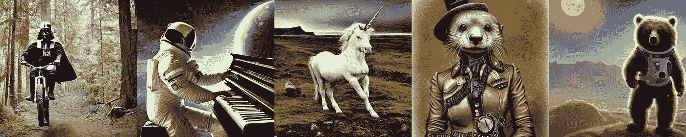
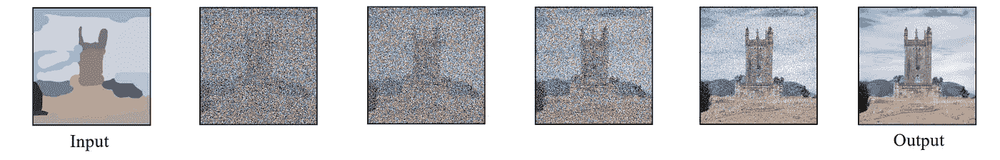
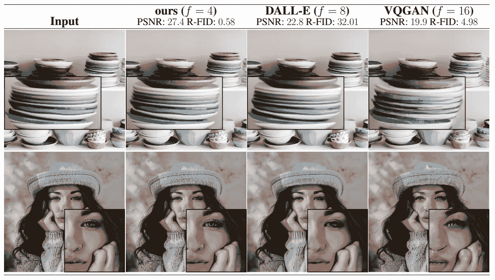
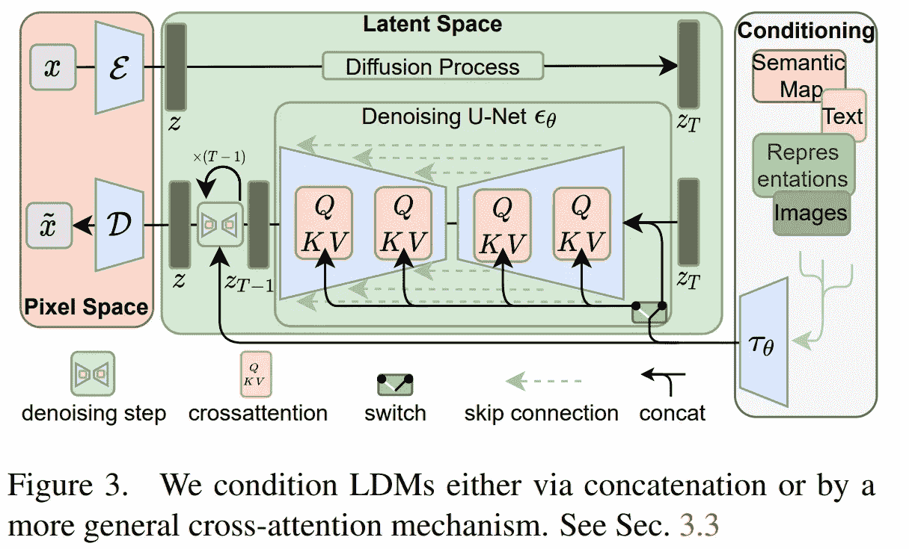
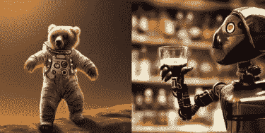

# 潜在扩散模型:稳定扩散背后的架构

> 原文：<https://pub.towardsai.net/latent-diffusion-models-the-architecture-behind-stable-diffusion-434ba7d91108?source=collection_archive---------0----------------------->

## 一种高分辨率图像合成架构:潜在扩散

> 最初发表于 [louisbouchard.ai](https://www.louisbouchard.ai/latent-diffusion-models/) ，前两天在[我的博客上读到的！](https://www.louisbouchard.ai/latent-diffusion-models/)

## 观看视频

像 [DALLE](https://www.louisbouchard.ai/openais-new-model-dall-e-2-is-amazing/) 、 [Imagen](https://www.louisbouchard.ai/google-brain-imagen/) 或 [Midjourney](https://www.midjourney.com/home/) 这些最近超级强大的形象模特有什么共同点？除了它们高昂的计算成本、巨大的训练时间和共享的炒作之外，它们都基于同一个机制:扩散。

扩散模型最近在大多数图像任务中取得了最先进的结果，包括使用 DALLE 的文本到图像，以及许多其他与图像生成相关的任务，如图像修补、样式转换或图像超分辨率。

有几个缺点:它们在整个图像上顺序工作，这意味着训练和推理时间都很长。这就是为什么你需要数百个 GPU 来训练这样一个模型，为什么你要等几分钟才能得到结果。

毫不奇怪，只有像谷歌或 OpenAI 这样的大公司才会发布这些模型。

但是它们是什么呢？我已经在几篇[文章](https://www.louisbouchard.ai/google-brain-imagen/)中介绍了扩散模型，为了更好地理解，我邀请您阅读这些文章。很快，它们是以随机噪声为输入的迭代模型，可以用一个文本或一个图像进行条件化，所以它不是完全随机的噪声。它通过学习模型应该将什么参数应用于该噪声来迭代地学习去除该噪声，以最终图像结束。因此，基本的扩散模型将根据图像的大小来选择随机噪声，并学习应用更多的噪声，直到我们回到真实的图像。

扩散过程与图像到图像风格转移应用程序(草图作为输入，真实图片作为输出)。

这是可能的，因为模型将在训练期间访问真实图像，并且将能够通过将这种噪声迭代地应用到图像直到它达到完全的噪声并且不可识别来学习正确的参数。然后，当我们对从所有图像中获得的噪声感到满意时，这意味着它们是相似的，并且从相似的分布中生成噪声，我们准备反向使用我们的模型，并以相反的顺序给它输入相似的噪声，以期望得到与训练期间使用的图像相似的图像。

因此，这里的主要问题是，你是在直接处理像素和图像等大型数据输入。

与 DALLE 2 的结果比较。图片来自[纸](https://arxiv.org/pdf/2112.10752.pdf)。

让我们看看如何在保持结果质量不变的情况下解决这个计算问题，就像这里显示的与 DALLE 的比较一样。

这些强大的扩散模型如何在计算上高效？通过将它们转换成**潜在扩散模型**。这意味着 Robin Rombach 和他的同事实现了我们刚刚在压缩图像表示中介绍的扩散方法，而不是图像本身，然后重建图像。所以他们不再使用像素空间或常规图像。

在这样的压缩空间中工作不仅允许更有效和更快速的生成，因为数据大小要小得多，而且还允许与不同的模态一起工作。因为它们正在对输入进行编码，所以您可以向它提供任何类型的输入，如图像或文本，模型将学习在扩散模型将用来生成图像的同一子空间中对这些输入进行编码。因此，是的，就像剪辑模型一样，一个模型将与文本或图像一起工作，以指导几代人。

潜在扩散体系结构概述。图片来自[论文](https://arxiv.org/pdf/2112.10752.pdf)。

整体模型将如下所示:这里是初始图像 X，将其编码到一个称为潜在空间 z 的信息密集空间中。这与 GAN 非常相似，其中您将使用编码器模型来获取图像，并在子空间中提取与其最相关的信息，这可以视为下采样任务。减小它的大小，同时尽可能多地保留信息。

你现在和你的浓缩输入在潜在空间中。然后你用你的条件输入做同样的事情，不管是文本、图像还是其他任何东西，用注意力将它们与你当前的图像表示合并，我在另一个视频中描述过。这个注意机制将学习在这个潜在空间中结合输入和条件输入的最佳方式。为扩散模型添加注意力，这是一个变压器特性。这些合并的输入现在是扩散过程的初始噪声。

然后，你有相同的扩散模型，我在我的 Imagen 视频中提到过，但仍然在这个子空间中。

最后，您使用解码器来重建图像，您可以将解码器视为初始编码器的逆步骤。在潜在空间中采用这种经过修改和去噪的输入来构建最终的高分辨率图像，基本上是对结果进行上采样。

用稳定扩散制作的图像

瞧！这就是如何通过调节过程将扩散模型用于各种各样的任务，如超分辨率、修复，甚至是文本到图像，同时更高效地在 GPU 上运行它们，而不是需要数百个。

你没听错。对于所有开发人员，甚至任何想玩游戏的人来说，想要在自己的 GPU 上运行自己的文本到图像和图像合成模型(或者只是应用程序)，所有的链接和代码都可以通过预先训练的模型获得！

如果你使用这个模型，请与我分享你的测试、想法、结果或任何反馈！我很想聊聊这个。

当然，这只是潜在扩散模型的概述，我邀请你阅读下面链接的他们的伟大论文，以了解关于模型和方法的更多信息。

## 参考

r . rom Bach，a . blatt Mann，d . Lorenz，p . Esser 和 b . Ommer，2022 年。用潜在扩散模型合成高分辨率图像。在*IEEE/CVF 计算机视觉和模式识别会议论文集*(第 10684-10695 页)【https://arxiv.org/pdf/2112.10752.pdf
潜在扩散码:[https://github.com/CompVis/latent-diffusion](https://github.com/CompVis/latent-diffusion)稳定扩散码(基于 LD 的文本到图像):[https://github.com/CompVis/stable-diffusion](https://github.com/CompVis/stable-diffusion)自己试试:[https://huggingface.co/spaces/stabilityai/stable-diffusion](https://huggingface.co/spaces/stabilityai/stable-diffusion)Web 应用:[https://stabilityai.us.auth0.com/u/login?state = hkfo 2 sa 4 mfjrl 4 cvhjcllvmlssv 9 vcxnyyy 11 q 25 rrkvzzafur 3 vuaxzlcnnhbc 1 sb 2 dpbq 0 awtzifrjv 2 p 5 dhk zngqzdkzudyueprrnhgefl 6 zvdvudrzo 2 npznkgs 3 zzwkplu 2 htvw 9 palhwy 2 xrbetzvxh 1y 0 fwzxnsse 4](https://stabilityai.us.auth0.com/u/login?state=hKFo2SA4MFJLR1M4cVhJcllLVmlsSV9vcXNYYy11Q25rRkVzZaFur3VuaXZlcnNhbC1sb2dpbqN0aWTZIFRjV2p5dHkzNGQzdkFKZUdyUEprRnhGeFl6ZVdVUDRZo2NpZNkgS3ZZWkpLU2htVW9PalhwY2xRbEtZVXh1Y0FWZXNsSE4)