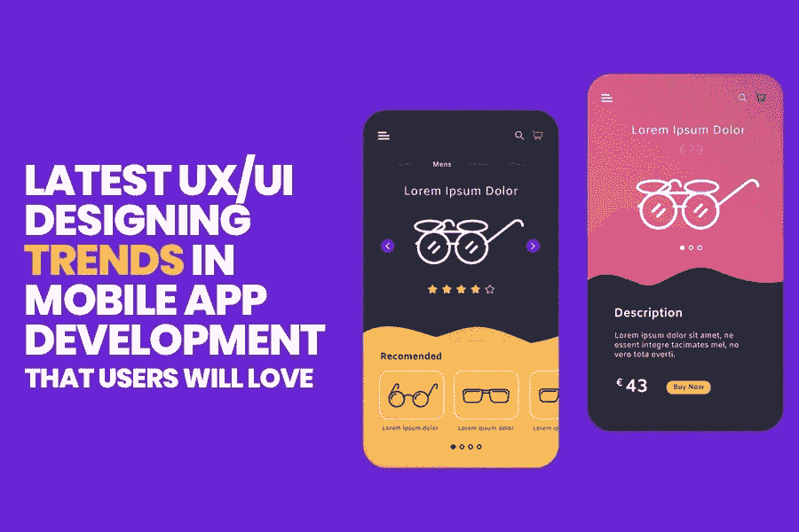
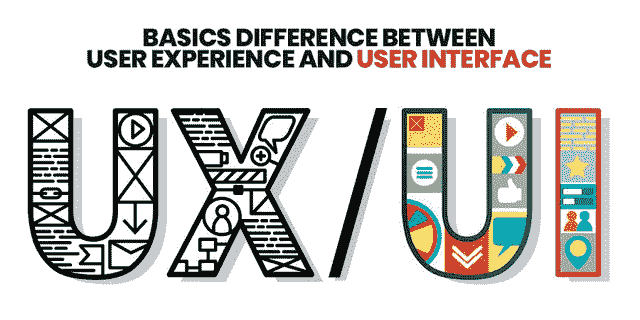
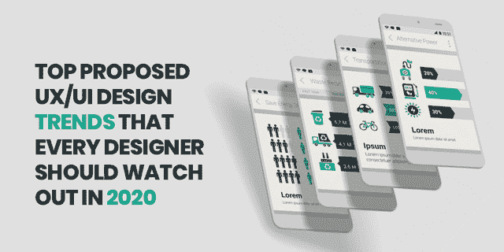

# 2021 年移动应用开发中用户喜爱的最新 UX/UI 设计趋势

> 原文：<https://pub.towardsai.net/latest-ux-ui-designing-trends-in-mobile-app-development-in-2020-that-users-will-love-c42a62431d4f?source=collection_archive---------0----------------------->

对于专家来说，设计和开发移动应用程序似乎是最简单的任务。然而，事实是，没有什么比制作一个具有优秀 UI/UX 设计的应用程序更难的了，它可以帮助提高用户参与度。

可以这么说，UX/用户界面是任何应用程序的支柱，它可以创造或破坏用户体验。

> 等等，你认为 UX 和 UI 是同一个概念吗？你现在正在犯一个可怕的错误！

这两个术语的意思不同。用户体验(UX)是指你在访问 [**移动应用**](https://www.xicom.biz/offerings/mobile-app-development/) 时获得的体验，而用户界面是你的应用的视觉外观，你一定听过大多数专业人士使用的日常俚语“产品的 UX 很好，但网站的用户界面很差”

我希望这些信息能驱散笼罩在一个让你一直困惑的概念上的迷雾。

**在开始讨论将统治 2021 年的 UX/UI 设计趋势之前，让我们了解一下 UX 和 UI 之间的本质区别……**

# 用户体验(UX)和用户界面(UI)之间的基本区别

说到移动应用程序开发，UX 和 UX 是在整个开发过程中同时使用的两个最常见的术语。一方面，UX 设计只不过是“用户体验设计”的缩写，另一方面，它代表“用户界面设计”这些术语可能听起来很相似，但从专业角度来说，它们的工作方式是不同的。

> 让我分别定义你的每一个术语，以避免在这里产生混淆！

## 什么是用户体验(UX)？

用户体验设计的目标是达到用户的最高满意度。它主要包括用户在与应用程序交互时的感受。

为了创建一个优秀的 UX 设计，移动应用程序开发者必须理解用户的观点，并从测试人员那里寻求反馈，以解决问题并为用户提供一个完美的解决方案。

> 根据著名的软件设计师和程序员艾兰·库伯的说法，“如果我们想让用户喜欢我们的软件，我们应该把它设计得像一个可爱的人:尊重、慷慨和乐于助人。”

## 什么是用户界面(UI)？

> 艾兰·库伯说“不管你的界面有多酷；如果少一点就好了”。

用户界面是应用程序的视觉外观，包括各种元素，如按钮、标签、文本、图像、视频、下拉列表、图形设计和用户的点击。

虽然用户界面是指确保事物如何工作的过程，因此，用户界面设计师需要设计一个移动应用程序来吸引用户的眼球，并提供无缝的产品体验。

无论是 UX 还是 UI 都是移动应用程序开发中最重要的部分，没有人愿意体验一个糟糕的设计。在 UX 星球的案例研究中观察到，“在开发中解决一个问题的成本是在设计中解决它的十倍，如果你试图解决一个已经发布的产品中的问题，成本是它的 100 倍”。

## 那么，在移动应用程序开发中，是什么造就了一个伟大的 UX/UI 设计呢？

在设计一个具有优秀 UX/用户界面设计的移动应用程序时，有多个因素需要关注。**但是在根本的事情上保持“没有 UX，就没有 UI 的用处。”**

虽然在移动应用程序开发中，理想的 UX 设计不需要记住这些参数，但可以通过了解用户在应用程序上花费的时间来确定。而 UI 设计是关于用户在应用程序中的参与度。

> **还没完呢！**

既然我们已经进入了 2021 年，那么为什么要评价 UX/UI 设计趋势，用以前的规则开发移动应用呢？那么，2021 年将主导行业的重大 UX/UI 设计趋势是什么呢？

# 2021 年每个设计师都应该关注的 6 个 UX/UI 设计趋势

## 1.为语音搜索革命准备应用程序

随着智能语音助手的推出，包括苹果的“Siri”，谷歌的“Alexa”，执行你的常规任务，已经变得更加舒适和简单。

从订购您喜欢的食物到购买日常必需品，从控制智能电器到查找任何信息，所有这些都变成了对您的 IA 设备的语音命令。

据统计，[五分之一的成年人每月至少使用一次手机语音搜索](https://www.wordstream.com/blog/ws/2018/04/10/voice-search-statistics-2018)，预计[将有 1 亿智能手机用户](https://www.emarketer.com/content/daily-forecast-in-2020-there-will-be-over-100m-smartphone-voice-assistant-users)使用语音搜索。企业不能再忽视这个事实了。相反，仅仅依靠传统方法来定制用户体验，企业迫切需要在移动应用程序中采用语音搜索来为用户提供最大的舒适和便利。将 VUI 集成到移动应用程序中也将有助于企业满足市场的未来需求。

但是，这不会像下载一个插件来为你的网站添加更多的功能那么简单。在语音搜索的道路上，设计师过去常常会遇到几个障碍。为了做到正确，最好雇佣一个 [**移动应用程序开发公司**](https://www.xicom.biz/offerings/mobile-app-development/) ，用新的设计理念取代旧的技术。

## 2.编码越少越好

> 正如史蒂夫·乔布斯所说，“设计不仅仅是它看起来和感觉起来的样子。设计就是它的工作方式”。

根据最新的 UX/UI 设计趋势，开发人员需要在 UI 设计中使用较少的编码来发挥足够的创造力。看起来，2021 年正在重塑 UI 趋势。所以在 app 开发的阶段， ***这里有一些你需要观察的东西，来提升 app 的 UX 设计。***

> 永远不要用推送通知和弹出窗口淹没用户。
> 
> 它注意实现一个跟踪用户浏览历史的特性。
> 
> 保持典型的导航模式，以避免混淆用户。

另一方面，减少编码的使用将加快应用程序的设计过程，另一方面，最小化的编码使你的应用程序兼容 5G 和 4G 网络。新的结构将改善移动连接，从而改善智能手机的体验。更少的编码将使你的应用工作得更快，用户将会注意到数据传输速度和延迟的显著改善。

## 3.对黑暗主题说“是”

你还在努力定制丰富多彩的应用程序主题，希望增加用户参与度，帮助他们更方便地浏览不同的部分吗？

> **醒醒！你在 2021 年；你需要更聪明的把用户和你的应用捆绑在一起！**

根据 2021 年 UX/UI 设计趋势，深色移动应用主题是最热门的销售趋势。你一定想知道它能如何帮助你。基本上，深色主题被认为是低亮度 UI 设计，有两个好处。首先，它们通过最大限度地减少光像素的使用来节省电池电量，其次，通过消除在不同颜色中改变屏幕亮度的风险，给你的眼睛带来相当大的缓解。

## 4.全屏平面导航

你有没有注意到在亚马逊电子商务商店和当地商店网上购物有什么不同？你不觉得亚马逊上的所有东西都分类得很好，很方便浏览吗？

> 如果是，那么这就叫无缝导航！

你设计应用导航的方式会极大地影响应用的用户体验。这就是亚马逊在线商店提升 UX 的手段。

用户访问小屏幕的日子一去不复返了。相反，屏幕更大的现代智能手机可以管理更多的内容，尽管是以一种分类的方式。从以缩略图样式对导航进行分类、在简单列表中定位关键对象到简单地采用向上滑动样式，有各种方式来定制目标受众的体验。

## 5.让我们与人工智能驱动的聊天机器人聊天

那是过去客户打电话给客户服务部或写邮件询问的日子。在这个数字化的时代，每个人都期待问题的即时解决方案，这就是聊天机器人发挥作用的地方，它可以为客户提供全天候帮助，让企业高枕无忧。

对于处理每个特定的查询，聊天机器人是在所有基本语言变体中轻松管理它的完美选择。基于人工智能，聊天机器人可以轻松理解不同的语言语义、情感、俚语、短语和文本结构，并做出相应的反应。

为了改善应用程序的 UX 设计，你需要外包软件开发公司，这些公司可以帮助集成完美的机器人，赋予你品牌个性的声音，打字指示器，按钮等等。

> 通过添加自动完成功能、现成的对话流来增强 UI 设计，让您的用户了解它是多么简单易用。

## 6.为残障用户提供更好的 UX/用户界面

在整个人群中，有情境性、永久性和暂时性残疾的人。为了增强所有这些人的应用程序体验，你需要站在用户的角度去理解他们的残疾问题。

例如，为盲人或视力低下的人开发一个应用程序设计，帮助他们大声朗读 UI 元素和文本，并提供振动反馈。

虽然开发这种高级应用程序需要广泛的技术技能。尽管如此，在 [**软件开发公司**](https://www.xicom.biz/) 的帮助下，你可以创建一个应用程序，帮助你为用户生产更多可用的产品。

# 结尾注释

如果你进入了移动应用程序开发行业，并期待着通过应用程序提升用户体验的方法，那么你需要关注将统治未来的最新 UX/用户界面趋势。

随着技术的日新月异，您不仅需要改进用户的交互、行为和偏好，还需要对应用程序的视觉外观做出一些改变。

随着时代的变化，技术在不断进步，带来了 [**手机 app 开发行业**](https://www.xicom.biz/offerings/mobile-app-development/) 的最新趋势。因此，这篇博客列出了一些在移动应用程序开发中增强 UX/UI 设计并帮助增强用户体验的主要趋势。

虽然用户体验涵盖了最终用户与公司、it 服务及其产品互动的所有方面，但企业必须密切关注 2021 年的流行趋势。