# 概率定律—数据科学家和机器学习工程师入门

> 原文：<https://pub.towardsai.net/laws-of-probability-a-primer-for-data-scientists-and-machine-learning-engineers-f47e1142d7ce?source=collection_archive---------2----------------------->

## [概率](https://towardsai.net/p/category/probability)

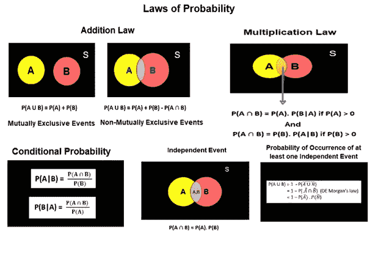

作者图片

现实生活是一本书，所有章节都有概率。

**什么是概率？**

概率是不确定性的度量。

现实世界需要在每一步都做出决策，但是很多时候决策必须基于不完整的信息，其中概率就像救世主一样出现。这也是概率在大多数机器学习应用中被广泛使用的核心原因之一。

使用概率，所有不确定性的元素都可以建模。机器学习算法是用概率设计的，它们也用概率做决策。

对概率有了这么多的介绍，我们现在可以直接进入正题了。

该报道将涵盖:

1.概率加法定律

2.概率乘法定律

3.条件概率

4.独立事件和更多

让我们开始吧。

**加法定律**

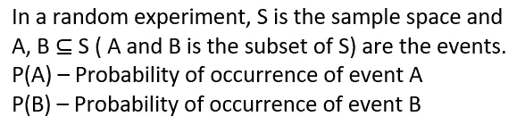

如果 A 和 B 是非互斥事件(如果两个事件有机会同时发生，则认为它们是非互斥的)

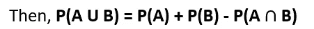

如果 A 和 B 是互斥事件(如果两个事件没有同时发生的机会，则认为它们是互斥的)

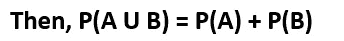

三个事件的同一定律可以表示为:

**非互斥事件**

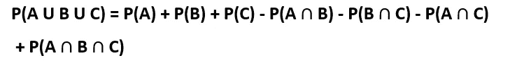

**互斥事件**

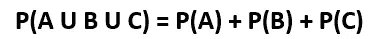

如果需要，上述定律还可以扩展到三个以上的事件。

**概率乘法定律**

对于任何两个事件 A 和 B，

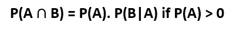

还有，

其中 P(B|A)是 B 的条件概率，给定 A 已经

P(A|B)是给定 B 的条件概率

已经发生了。

同样的法则可以扩展到如下 3 个或更多事件。

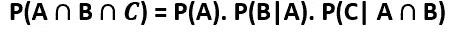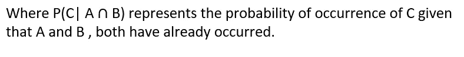

**条件概率**

来源——图片由 Aiden Howe 和 Jacob5200 在 Pixabay 上提供

经过上面的概率乘法定律，很清楚条件概率可以表示为:

P(A|B) —给定的 B 出现的条件概率

已经发生，也就是说，这里 A 的发生取决于 b 的条件。

和

P(B|A) —给定 A，B 出现的条件概率

已经发生，也就是说，这里 B 的发生取决于 a 的条件。

P(A|B)指样本空间 B 而不是 S，P(B|A)指样本空间 A 而不是 S。

注— P(A|B)仅在 P(B)不等于 0 时才有意义，即当事件 B 不是不可能发生的事件且

P(B|A)只有在 P(A)不等于 0 时才有意义，即当事件 A 不是不可能事件时。

我们通过一个例子来理解条件概率。

考虑从 52 张扑克牌中抽出一张牌。设 A 是抽一张黑色皇后牌的事件。那么当然

P(A) = 2/52，因为我们在一包 52 张牌中有 2 张黑皇后牌。

现在让 B 成为抽一张黑桃牌的事件。

P(B) = 13/52

由于在总共 52 张牌中有 13 张黑桃，并且我们知道 B 已经出现，因此有 13 个穷尽情况，而不是之前的 52 个。在这 13 张黑桃牌中，有一张黑色的王后牌，因此，假定这是一张黑桃牌，则拥有黑色王后牌的概率为 P(A|B) = 1/13，这是假定 B 已经出现的条件概率。

**独立事件**

如果任何一个事件的发生或不发生不受其他事件的发生或不发生的影响，则称事件是独立的。

在这种情况下，一个非常常见的例子是硬币，即，如果硬币被投掷一定次数，那么在任何试验中头部的出现不受任何其他试验的影响，即，所有的试验都是独立的。

这里要注意的更重要的一点是，当且仅当 P(B|A) = P(B)时，两个事件 A 和 B 被认为是独立的，也就是说，即使 A 已经发生，它也不会影响 B 的概率。要考虑的一个例子是:

假设 A 是在第四次投掷硬币时正面朝上，B 是在第五次投掷硬币时正面朝上。那么不管第四次投掷的结果是否已知，在第五次投掷中获得正面的概率是 1/2，即 P(B|A) = P(B)。

现在让我们来表示独立事件的乘法定律:

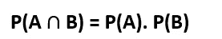

这是因为如果 A 和 B 是独立的，那么 P(B|A) = P(A)和 P(A|B) = P(B)。

同样，如果 A、B 和 C 是三个独立的事件，那么

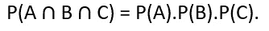

这个定律也可以扩展到三个以上的事件。

这里要注意的非常重要的一点是，互斥事件不可能是独立的，因为如果两个事件是互斥的，那么它们不会同时发生，因此它们不是独立的。

**概率论中一个更重要的定律是**

如果 A 和 B 是独立事件，则至少一个事件发生的概率由下式给出:

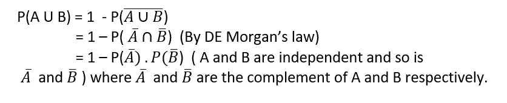

现在让我们总结一下所涉及的要点。

**总结**

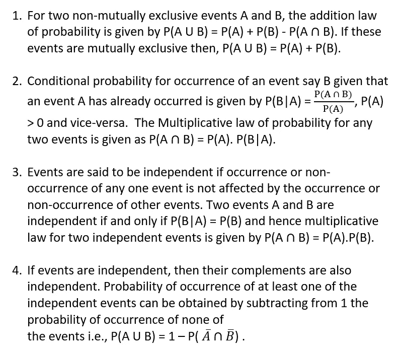

希望这有帮助。

感谢阅读！

你可以在媒体上跟踪我

LinkedIn: [Supriya Ghosh](https://www.linkedin.com/in/supriya-ghosh)

推特: [@isupriyaghosh](https://twitter.com/isupriyaghosh)