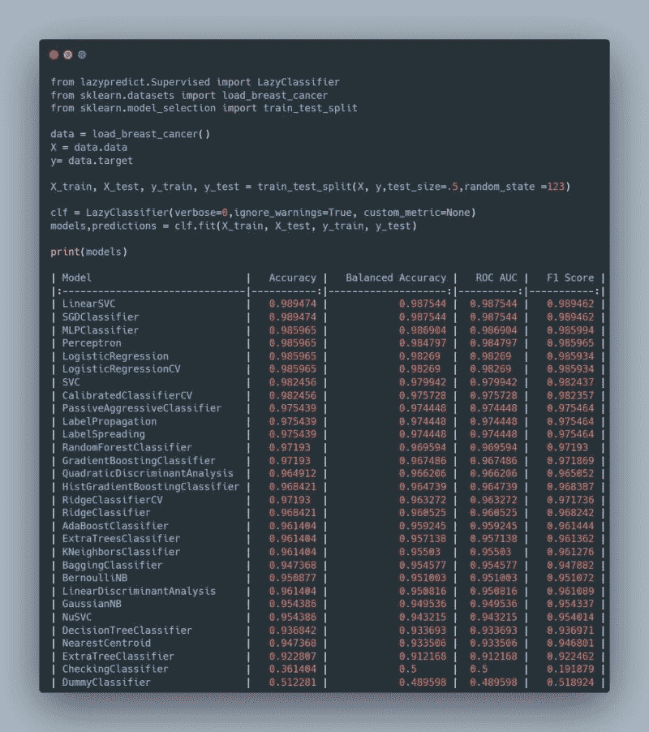

# Lazypredict:用一行代码运行所有 Sklearn 算法

> 原文：<https://pub.towardsai.net/lazypredict-run-all-sklearn-algorithms-with-a-line-of-code-29d73d82499c?source=collection_archive---------1----------------------->

## 如何(以及为什么不应该)使用它



lazypredict 的输出。

以下是数据科学家的两个痛点:

## 难点 1:数据科学生命周期的时间有限

数据科学家必须分清主次。这可能意味着花更多的时间来理解业务问题并确定最合适的方法，而不是仅仅专注于开发机器学习算法。

## 痛点 2:机器学习建模可能很耗时

微调机器学习算法包括找到这些超参数的最佳值，这可能是一个反复试验的过程。这需要很长时间。


自动化机器学习可以极大地帮助数据科学家。通过稳定扩散成像。

# AutoML 拯救世界

AutoML 可以解决这些问题。一个新生的图书馆是 lazypredict。在这篇文章中，我浏览了以下内容:

*   什么是 lazypredict
*   安装 lazypredict
*   如何使用它来自动拟合 scikit-learn 回归算法
*   如何将它用于自动拟合分类算法
*   为什么不应该使用它(以及还可以使用什么)

*注意:我不隶属于 lazypredict。*

# 什么是 Lazypredict

Lazypredict 是一个 Python 包，旨在自动化机器学习建模过程。它对回归和分类任务都有效。

它的关键特征是能够自动训练和评估机器学习模型。它提供了一个简单的界面来定义一系列超参数，然后使用这些超参数的各种不同组合来训练和评估模型。

# 安装 Lazypredict

在您的终端上，运行以下命令

```
pip install lazypredict
```

但是，您可能需要手动安装 lazypredict 的一些依赖项。如果遇到需要安装 scikit-learn、xgboost 或 lightgbm 的问题，可以运行 pip install 来安装必要的库。

就我个人而言，我通过下面的`requirements.txt`让它在`python 3.9.13`上工作

```
pandas==1.4.4
numpy==1.21.5
scikit-learn==1.0.2
lazypredict==0.2.12
```

我通过在终端上运行这个命令安装了以下库:`pip install -r requirements.txt`。

这种情况下使用虚拟环境就更好了。

# 使用 Lazypredict 进行回归

让我们浏览一下代码。(如果你只是想要完整的代码，在本文中搜索“完整代码”。)

我们将首先导入必要的库。

```
from lazypredict.Supervised import LazyRegressor
from sklearn import datasets
from sklearn.utils import shuffle
import numpy as np 
```

首先，我们将导入糖尿病数据集。

> 对每名 n = 442 的糖尿病患者获得 10 个基线变量，年龄、性别、体重指数、平均血压和 6 个血清测量值，以及感兴趣的反应，即基线后一年疾病进展的定量测量。

```
# Import the Diabetes Dataset
diabetes = datasets.load_diabetes()
```

接下来，我们打乱数据集，以便我们可以将它们分成训练测试集。

```
# Shuffle the dataset 
X, y = shuffle(diabetes.data, diabetes.target, random_state=13)

# Cast the numerical values into a numpy float.
X = X.astype(np.float32)

# Split the dataset into 90% and 10%.
offset = int(X.shape[0] * 0.9)

# Split into train and test
X_train, y_train = X[:offset], y[:offset]
X_test, y_test = X[offset:], y[offset:] 
```

接下来，我们初始化 LazyRegressor 对象。

```
# Running the Lazypredict library and fit multiple regression libraries
# for the same dataset
reg = LazyRegressor(verbose=0, 
                    ignore_warnings=False, 
                    custom_metric=None,
                    predictions=False,
                    random_state = 13)

# Parameters
# ----------
# verbose : int, optional (default=0)
#       For the liblinear and lbfgs solvers set verbose to any positive
#       number for verbosity.
# ignore_warnings : bool, optional (default=True)
#       When set to True, the warning related to algorigms that are not able
#       to run are ignored.
# custom_metric : function, optional (default=None)
#       When function is provided, models are evaluated based on the custom 
#       evaluation metric provided.
# prediction : bool, optional (default=False)
#       When set to True, the predictions of all the models models are 
#       returned as dataframe.
# regressors : list, optional (default="all")
#       When function is provided, trains the chosen regressor(s). 
```

现在，我们将使用 lazypredict 库`fit`多重回归算法。这一步总共花了 3 秒钟。

在幕后，`fit`方法执行以下操作:

1.  将所有特征分为三类:数字(数字特征)或分类(文本特征)
2.  进一步将分类特征分成两类:“高”分类特征(*，其唯一值比特征总数多)*和“低”分类特征(*，其唯一值比特征总数少)*
3.  然后，以这种方式预处理每个特征:

*   数字特征:用平均值估算缺失值，然后标准化特征*(去除平均值并除以方差)*
*   “高”分类特征:用值“缺失”估算缺失值，然后执行一键编码。
*   “低”分类特性:用值“missing”估算缺失值，然后执行顺序编码(*将每个唯一的字符串值转换为整数。*在性别列的示例中—“男性”编码为 0，“女性”编码为 1。)
*   使训练数据集适合每个算法。
*   在测试集上测试每个算法。默认情况下，这些指标是经过调整的 R 平方、R 平方、均方根误差和所用时间。

```
models, predictions = reg.fit(X_train, X_test, y_train, y_test)
model_dictionary = reg.provide_models(X_train, X_test, y_train, y_test)
models
```

这是结果。

```
| Model                         |   Adjusted R-Squared |   R-Squared |   RMSE |   Time Taken |
|:------------------------------|---------------------:|------------:|-------:|-------------:|
| ExtraTreesRegressor           |                 0.38 |        0.52 |  54.22 |         0.17 |
| OrthogonalMatchingPursuitCV   |                 0.37 |        0.52 |  54.39 |         0.01 |
| Lasso                         |                 0.37 |        0.52 |  54.46 |         0.01 |
| LassoLars                     |                 0.37 |        0.52 |  54.46 |         0.01 |
| LarsCV                        |                 0.37 |        0.51 |  54.54 |         0.02 |
| LassoCV                       |                 0.37 |        0.51 |  54.59 |         0.07 |
| PassiveAggressiveRegressor    |                 0.37 |        0.51 |  54.74 |         0.01 |
| LassoLarsIC                   |                 0.36 |        0.51 |  54.83 |         0.01 |
| SGDRegressor                  |                 0.36 |        0.51 |  54.85 |         0.01 |
| RidgeCV                       |                 0.36 |        0.51 |  54.91 |         0.01 |
| Ridge                         |                 0.36 |        0.51 |  54.91 |         0.01 |
| BayesianRidge                 |                 0.36 |        0.51 |  54.94 |         0.01 |
| LassoLarsCV                   |                 0.36 |        0.51 |  54.96 |         0.02 |
| LinearRegression              |                 0.36 |        0.51 |  54.96 |         0.01 |
| TransformedTargetRegressor    |                 0.36 |        0.51 |  54.96 |         0.01 |
| Lars                          |                 0.36 |        0.50 |  55.09 |         0.01 |
| ElasticNetCV                  |                 0.36 |        0.50 |  55.20 |         0.06 |
| HuberRegressor                |                 0.36 |        0.50 |  55.24 |         0.02 |
| RandomForestRegressor         |                 0.35 |        0.50 |  55.48 |         0.25 |
| AdaBoostRegressor             |                 0.34 |        0.49 |  55.88 |         0.08 |
| LGBMRegressor                 |                 0.34 |        0.49 |  55.93 |         0.05 |
| HistGradientBoostingRegressor |                 0.34 |        0.49 |  56.08 |         0.20 |
| PoissonRegressor              |                 0.32 |        0.48 |  56.61 |         0.01 |
| ElasticNet                    |                 0.30 |        0.46 |  57.49 |         0.01 |
| KNeighborsRegressor           |                 0.30 |        0.46 |  57.57 |         0.01 |
| OrthogonalMatchingPursuit     |                 0.29 |        0.45 |  57.87 |         0.01 |
| BaggingRegressor              |                 0.29 |        0.45 |  57.92 |         0.04 |
| XGBRegressor                  |                 0.28 |        0.45 |  58.18 |         0.11 |
| GradientBoostingRegressor     |                 0.25 |        0.42 |  59.70 |         0.12 |
| TweedieRegressor              |                 0.24 |        0.42 |  59.81 |         0.01 |
| GammaRegressor                |                 0.22 |        0.40 |  60.61 |         0.01 |
| RANSACRegressor               |                 0.20 |        0.38 |  61.40 |         0.12 |
| LinearSVR                     |                 0.12 |        0.32 |  64.66 |         0.01 |
| ExtraTreeRegressor            |                 0.00 |        0.23 |  68.73 |         0.01 |
| NuSVR                         |                -0.07 |        0.18 |  71.06 |         0.01 |
| SVR                           |                -0.10 |        0.15 |  72.04 |         0.02 |
| DummyRegressor                |                -0.30 |       -0.00 |  78.37 |         0.01 |
| QuantileRegressor             |                -0.35 |       -0.04 |  79.84 |         1.42 |
| DecisionTreeRegressor         |                -0.47 |       -0.14 |  83.42 |         0.01 |
| GaussianProcessRegressor      |                -0.77 |       -0.37 |  91.51 |         0.02 |
| MLPRegressor                  |                -1.87 |       -1.22 | 116.51 |         0.21 |
| KernelRidge                   |                -5.04 |       -3.67 | 169.06 |         0.01 |
```

这是糖尿病数据集回归的完整代码。

```
 from lazypredict.Supervised import LazyRegressor
from sklearn import datasets
from sklearn.utils import shuffle
import numpy as np

# Import the Diabetes Dataset
diabetes = datasets.load_diabetes()

# Shuffle the dataset 
X, y = shuffle(diabetes.data, diabetes.target, random_state=13)

# Cast the numerical values
X = X.astype(np.float32)
offset = int(X.shape[0] * 0.9)

# Split into train and test
X_train, y_train = X[:offset], y[:offset]
X_test, y_test = X[offset:], y[offset:]

# Running the Lazypredict library and fit multiple regression libraries
# for the same dataset
reg = LazyRegressor(verbose=0, ignore_warnings=False, custom_metric=None)
models, predictions = reg.fit(X_train, X_test, y_train, y_test)
model_dictionary = reg.provide_models(X_train, X_test, y_train, y_test)
models
```

# 使用 Lazypredict 进行分类

让我们用 Lazypredict 进行分类。(如果你只是想要完整的代码，在本文中搜索“完整代码”。

首先，导入必要的库。

```
 from lazypredict.Supervised import LazyClassifier
 from sklearn.datasets import load_iris
 from sklearn.model_selection import train_test_split
```

接下来，我们加载数据，Iris 数据集，并将其分成训练集和测试集。这是它包含的内容。

> 数据集由三种鸢尾*([*鸢尾*](https://en.wikipedia.org/wiki/Iris_setosa) 、 [*北美鸢尾*](https://en.wikipedia.org/wiki/Iris_virginica) 和 [*杂色鸢尾*](https://en.wikipedia.org/wiki/Iris_versicolor) )各 50 个样本组成。从每个样品中测量四个[特征](https://en.wikipedia.org/wiki/Features_(pattern_recognition)):萼片[和花瓣](https://en.wikipedia.org/wiki/Sepal)的长度和宽度，单位为厘米。*

```
 *data = load_iris()
 X = data.data
 y= data.target
 X_train, X_test, y_train, y_test = train_test_split(X, y,test_size=.5,random_state =123)*
```

*接下来，我们初始化 LazyClassifier 对象。*

```
*# Running the Lazypredict library and fit multiple regression libraries
# for the same dataset
clf = LazyClassifier(verbose=0,ignore_warnings=True, custom_metric=None)

"""
    Parameters
    ----------
    verbose : int, optional (default=0)
        For the liblinear and lbfgs solvers set verbose to any positive
        number for verbosity.
    ignore_warnings : bool, optional (default=True)
        When set to True, the warning related to algorigms that are not able to run are ignored.
    custom_metric : function, optional (default=None)
        When function is provided, models are evaluated based on the custom evaluation metric provided.
    prediction : bool, optional (default=False)
        When set to True, the predictions of all the models models are returned as dataframe.
    classifiers : list, optional (default="all")
        When function is provided, trains the chosen classifier(s).
"""* 
```

*然后，我们调用 lazy regressor 的`fit`方法，它将多重分类算法与 lazypredict 库相匹配。对于这个小数据集，这一步总共花了 1 秒钟。*

*(在引擎盖下搜索关键字“*，fit 方法*，跳转到我解释`fit`是做什么的部分。)*

```
 *models,predictions = clf.fit(X_train, X_test, y_train, y_test)* 
```

*最后，我们可以使用`provide_models`来看看每个模型的表现。这报告了测试集的准确性、平衡准确性、ROC AUC 和 F1 得分。*

```
*# Calculate performance of all models on test dataset
 model_dictionary = clf.provide_models(X_train,X_test,y_train,y_test)
 models*
```

*这是完整的结果。*

```
*| Model                         |   Accuracy |   Balanced Accuracy | ROC AUC   |   F1 Score |   Time Taken |
|:------------------------------|-----------:|--------------------:|:----------|-----------:|-------------:|
| LinearDiscriminantAnalysis    |       0.99 |                0.99 |           |       0.99 |         0.01 |
| AdaBoostClassifier            |       0.97 |                0.98 |           |       0.97 |         0.13 |
| PassiveAggressiveClassifier   |       0.97 |                0.98 |           |       0.97 |         0.01 |
| LogisticRegression            |       0.97 |                0.98 |           |       0.97 |         0.01 |
| GaussianNB                    |       0.97 |                0.98 |           |       0.97 |         0.01 |
| SGDClassifier                 |       0.96 |                0.96 |           |       0.96 |         0.01 |
| RandomForestClassifier        |       0.96 |                0.96 |           |       0.96 |         0.19 |
| QuadraticDiscriminantAnalysis |       0.96 |                0.96 |           |       0.96 |         0.01 |
| Perceptron                    |       0.96 |                0.96 |           |       0.96 |         0.01 |
| LGBMClassifier                |       0.96 |                0.96 |           |       0.96 |         0.30 |
| ExtraTreeClassifier           |       0.96 |                0.96 |           |       0.96 |         0.01 |
| BaggingClassifier             |       0.95 |                0.95 |           |       0.95 |         0.03 |
| ExtraTreesClassifier          |       0.95 |                0.95 |           |       0.95 |         0.13 |
| XGBClassifier                 |       0.95 |                0.95 |           |       0.95 |         0.19 |
| DecisionTreeClassifier        |       0.95 |                0.95 |           |       0.95 |         0.01 |
| LinearSVC                     |       0.95 |                0.95 |           |       0.95 |         0.01 |
| CalibratedClassifierCV        |       0.95 |                0.95 |           |       0.95 |         0.04 |
| KNeighborsClassifier          |       0.93 |                0.94 |           |       0.93 |         0.01 |
| NuSVC                         |       0.93 |                0.94 |           |       0.93 |         0.01 |
| SVC                           |       0.93 |                0.94 |           |       0.93 |         0.01 |
| RidgeClassifierCV             |       0.91 |                0.91 |           |       0.91 |         0.01 |
| NearestCentroid               |       0.89 |                0.90 |           |       0.89 |         0.01 |
| LabelPropagation              |       0.89 |                0.90 |           |       0.90 |         0.01 |
| LabelSpreading                |       0.89 |                0.90 |           |       0.90 |         0.01 |
| RidgeClassifier               |       0.88 |                0.89 |           |       0.88 |         0.01 |
| BernoulliNB                   |       0.79 |                0.75 |           |       0.77 |         0.01 |
| DummyClassifier               |       0.27 |                0.33 |           |       0.11 |         0.01 |*
```

*这里是分类的完整代码。*

```
 *from lazypredict.Supervised import LazyClassifier
from sklearn.datasets import load_breast_cancer
from sklearn.model_selection import train_test_split

# Load dataset
data = load_breast_cancer()
X = data.data
y= data.target

# Split data into train and test with a 90:10 ratio
X_train, X_test, y_train, y_test = train_test_split(X, y,test_size=.1,random_state =123)

# Initialize the Lazypredict library
clf = LazyClassifier(verbose=0,ignore_warnings=True, custom_metric=None)

# Fit all classification algorithms on training dataset
models,predictions = clf.fit(X_train, X_test, y_train, y_test)

# Calculate performance of all models on test dataset
model_dictionary = clf.provide_models(X_train,X_test,y_train,y_test)
models*
```

# *我推荐 lazypredict 吗？*

*如果你要安装它，lazypredict 使用起来非常简单。它的语法非常接近 scikit-learn，使得学习曲线非常平缓。*

*但是它有一些致命的弱点。*

1.  *安装困难:许多人报告了安装库的困难，因为开发人员没有添加记录他们所需依赖关系的`requirements.txt`。*
2.  *有限的文档:我不得不梳理[源代码](https://github.com/shankarpandala/lazypredict/blob/dev/lazypredict/Supervised.py)来找出预处理是如何运行的。这并不理想。我也不知道用于执行每个分类和回归任务的超参数。*
3.  *有限的可定制性:我仍然没有找到定制预处理步骤的方法。*
4.  *不清楚如何在 lazypredict 之后使用模型:一旦你完成了 lazypredict 库，你会理想地想要选择最好的算法。Lazypredict 没有让这变得容易，因为您没有导出最佳算法的简单方法。*

# *主要外卖*

*Lazypredict 的致命弱点限制了它的实用性。很好，但是还不发达。*

*我强烈建议您查看一下在文档和可定制性方面更优秀的*其他* *AutoML 库*。*

*以下是一些替代方案。*

1.  ***TPOT(此处查看如何使用**[**)TPOT**](https://medium.com/analytics-vidhya/automate-your-machine-learning-training-process-97e63c584716)**)***
2.  ***自动 Sklearn***
3.  ***自动 ViML***
4.  *H2O 汽车公司*
5.  ***自动角膜刀***
6.  ***MLBox***
7.  ***超视 Sklearn***
8.  ***自动增长***

**

*数据科学家+机器人=魔法。安迪·凯利在 [Unsplash](https://unsplash.com?utm_source=medium&utm_medium=referral) 上拍摄的照片*

*我是 Travis Tang，技术部的数据科学家。我分享你如何在媒体上使用开源库。我还每天在 LinkedIn 上分享数据分析和科学技巧。喜欢这个内容就关注我吧。*