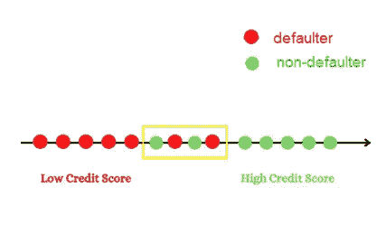
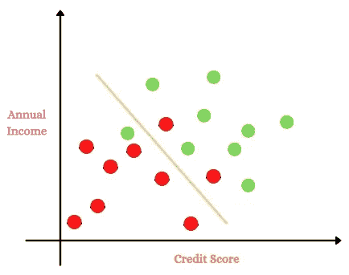
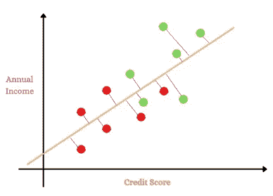
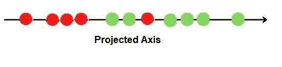
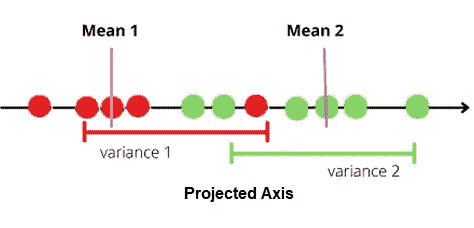
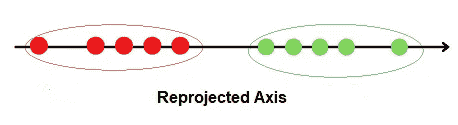
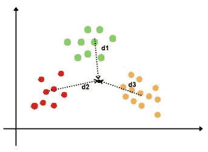
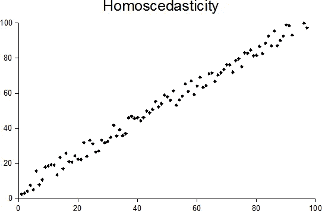
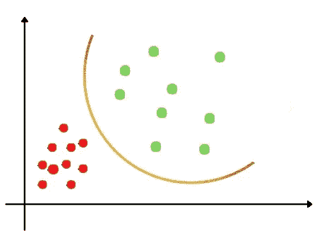

# LDA 与 PCA

> 原文：<https://pub.towardsai.net/lda-vs-pca-f3920a7310db?source=collection_archive---------0----------------------->

罗伯特·卡茨克在 T2 的照片

## [数据科学](https://towardsai.net/p/category/data-science)

关于线性判别分析降维技术与主成分分析有多相似或不相似的精确概述

*这是我之前文章的第二部分*[*PCA*](https://medium.com/wicds/the-power-of-eigenvectors-and-eigenvalues-in-dimension-reduction-techniques-such-as-pca-8540322124ea)*等降维技术中特征向量和特征值的幂。*

在本文中，我将首先简要解释 LDA 和 PCA 之间的区别。接下来，让我们深入探讨线性判别分析的工作原理，并揭开其中的奥秘，它是如何实现数据分类和降维的。

# **简介**

## **LDA 与 PCA**

线性判别分析非常类似于 PCA，两者都寻找能够最好地解释数据的特征的线性组合。

主要区别在于，线性判别分析是一种**监督的**降维技术，同时也实现了数据的分类。

> **LDA** 关注于寻找一个特征子空间，该特征子空间**最大化组之间的可分性**。

虽然主成分分析是一种**无监督的**降维技术，但它忽略了类别标签。

> **PCA** 主要是捕捉数据集中**最大变化**的方向。

LDA 和 PCA 都形成了一组新的成分。

PCA 形成的第一个主成分将解释数据中的最大变化。 **PC2** 在捕捉最大变化等方面做得第二好。

**LD1** 由线性判别分析创建的第一个新轴将考虑捕捉组或类别之间的大多数变化，然后是 LD2，以此类推。

**注**:在 LDA 中，目标因变量可以有二进制或多类标签。

## **线性判别分析的工作**

让我们借助一个例子来理解线性判别分析的工作原理。

假设您有一个信用卡贷款数据集，其目标标签包含两个类:违约者和非违约者。

**级‘1’**为**违约者**，**级‘0’**为**非违约者**。

***在进行 LDA 投影*** 之前，理解基本的一维和二维图形

当你只有**一个属性**比如说**信用评分**时，这个图将是一个一维图，它是一条数字线。

来源:作者图片

只有一个属性，虽然我们能够分离类别，但由于没有具体的分界点，某些点已经**重叠**。实际上，当数据集中有大量观察值时，可能会有许多这样的重叠数据点。

让我们看看当我们有两个属性时会发生什么，我们能够更好地分类吗？

考虑另一个属性年收入连同信用评分。

来源:作者图片

通过添加另一个特性，我们能够比之前使用单一属性的情况减少重叠。但是，当我们处理具有许多特征和观察值的大型数据集时，仍然会留下许多重叠的点。

有趣的是，我们注意到增加了一些功能，我们能够减少重叠点的数量，更好地区分。但是，当我们有高维数据集时，这变得非常难以可视化。

这就是 LDA 的实施发挥关键作用的地方。

## LDA 如何规划数据？

> **线性判别分析**将数据点投影到新轴上，使得这些新分量**最大化**类别间的可分性，同时将每个类别内的变化保持在最小**值**。

现在让我们详细了解一下 LDA 是如何预测数据点的。

来源:作者图片

1.LDA 使用来自两个属性的信息，并将数据投影到新的轴上。

2.它以这样一种方式投影数据点，即同时满足组间最大分离和组内最小变化的标准。

## **第一步:**

投影点和新轴

来源:作者图片

## **第二步**

适用于投影点的标准 LDA 如下。

1.它最大化了每个类别的平均值之间的距离。

2.它最小化了由 s 表示的每个类别内的变化或分散

来源:作者图片

来源:作者图片

假设类别 1 违约者的平均值是平均值 1，平均值 2 是类别非违约者的平均值。

同样的，

S1 是第一类的分散

S2 是第二类的散布者。

它现在计算公式。

(均值 1-均值 2) /(S1 +S2)

**注**:分子是平方的，以避免负值。

设 mean1-mean2 用 d 表示。

公式现在将是。

d /(S1 +S2)

**注:**理想情况下**，**越大，分子越大，组间分离。而分母越小，组内方差越小。

## 当有两个以上的类别时，LDA 如何工作？

来源:作者图片

当有两个以上的类别时，LDA 计算所有类别的中心点以及每个类别的中心点到该点的距离。

然后，它将数据投影到新的轴上，使各组之间的间隔最大，组内的变化最小。

公式现在将是。

(d1 +d2 +d3 )/(s1 +S2 +S3)

*现在是有趣的部分……*

## LDA 是如何进行预测的？

线性判别分析使用贝耶定理来估计概率。

它首先从给定的数据集中计算先验概率。在这些先验概率的帮助下，它使用 Baye 定理计算后验概率。

从贝叶斯定理我们知道。

P(A|B)=P(B|A)*P(A)/P(B)

其中 A，B 是事件，P(B)不等于零

假设我们在数据集中有三个类类 0，类 1，类 2。

**第一步**

LDA 计算数据集的每个类 P(y=0)，P(y=1)，P(y=2)的**先验**概率。

接下来，它计算观察值的条件概率。

**第二步**

让我们考虑一个观察 x。

P(x|y=0)，P(x|y=1)，P(x|y=2)代表**似然函数**。

**第三步**

LDA 现在计算**后验概率**以做出预测**。**

P(y=0|x)=P(x|y=0)*P(y=0)/P(x)

P(y=1|x)=P(x|y=1)*P(y=1)/P(x)

P(y=2|x)=P(x|y=2)*P(y=2)/P(x)

**通式**为一组【c】**类**

**设 y1，y2，..yc 是“c”类的集合，并且考虑 i=1，2，..，c。**

**P(x|yi)将代表**可能性**函数或**条件**概率。**

**P(yi)将是数据集中每个类的**先验**概率。它只不过是该特定类中的观察值数量与所有类中的观察值总数的比率。**

****后验概率**将是**可能性** * **先验** / **证据。****

**P(y=yi|x)=P(x|y=yi)*P(yi)/P(x)**

## **线性判别分析的假设**

**线性判别分析对数据集有一定的假设。**

****假设 1****

**LDA 假设每个类别的独立变量呈正态分布。**

****假设 2****

****

********

****用显示方差齐性的数据绘图，即对于每个 x 值，y 值具有相同的方差。来源:维基媒体的知识共享****

****LDA 假设独立变量在所有类别中具有相等的方差和协方差。这可以用[盒的 M](https://en.wikipedia.org/wiki/Box%27s_M_test) 统计量来测试。****

****简而言之，假设数据集中类别的所有变量的方差等于 y=0，y=1 时，变量之间的协方差也必须相等。****

****这个假设帮助**线性判别分析**创建类别之间的**线性** **判定边界**。****

******假设 3******

******多重共线性******

****预测的性能会随着自变量之间相关性的增加而降低。****

****注意:研究表明 LDA 对这些假设的轻微违反是稳健的。****

## ****当第二个假设失败时会发生什么？****

********

****来源:作者图片****

****当这一假设失败时，数据集中的类别之间存在巨大差异，并且使用判别分析的另一种变体，即**二次判别分析** ( **QDA)。******

****在[二次判别分析](https://en.wikipedia.org/wiki/Quadratic_classifier)中，分离类别的数学函数现在将是二次的而不是线性的，以实现分类。****

## ******LDA 的应用******

1.  ****LDA 在模式识别任务中应用最为广泛。比如基于属性分析客户行为模式。****
2.  ****图像识别，LDA 可以区分类别。例如，面和非面、对象和非对象。****
3.  ****在医学领域，根据特定疾病的症状将患者分为不同的组。****

## ****结论****

****本文阐述了两种常用的降维技术主成分分析和线性判别分析的区别。然后介绍了线性判别分析的工作原理，以及它如何实现分类和降维。****

****希望你喜欢阅读这篇文章！****

*****请随时查看我关于*[*pranaviduvva at medium*](https://pranaviduvva.medium.com/)*的其他文章。*****

*****感谢阅读！*****

******参考文献******

1.  ****[https://scikit-learn.org/stable/modules/lda_qda.html](https://scikit-learn.org/stable/modules/lda_qda.html)****
2.  ****[https://en.wikipedia.org/wiki/Bayes%27_theorem](https://en.wikipedia.org/wiki/Bayes%27_theorem)****
3.  ****[https://en.wikipedia.org/wiki/Linear_discriminant_analysis](https://en.wikipedia.org/wiki/Linear_discriminant_analysis)****
4.  ****[LDA](https://youtu.be/azXCzI57Yfc) 上的 Statquest 视频。****