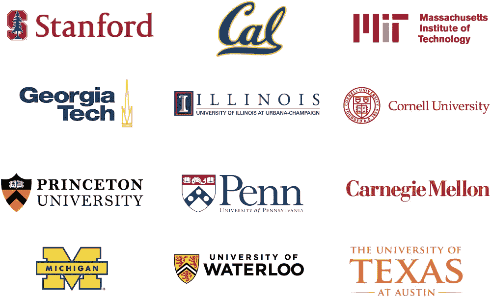
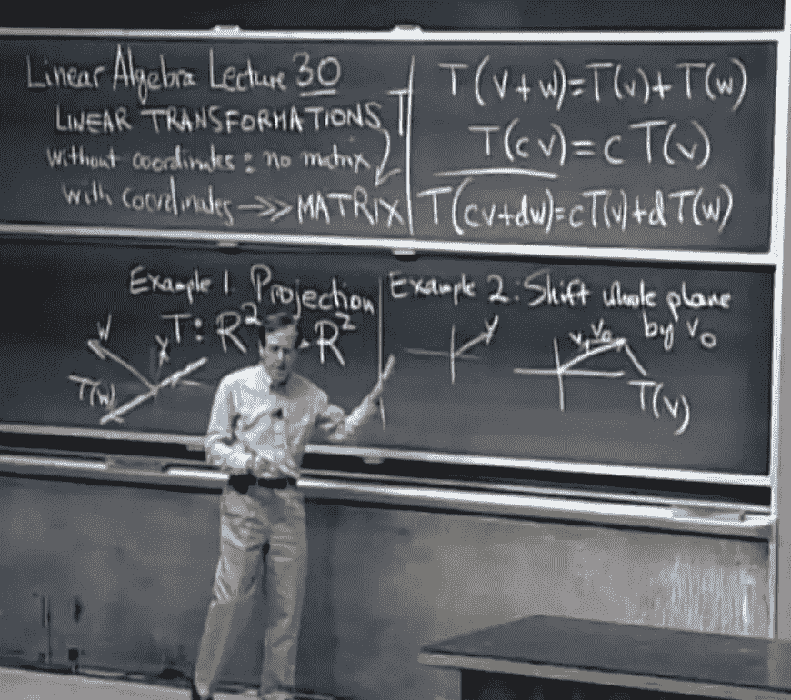
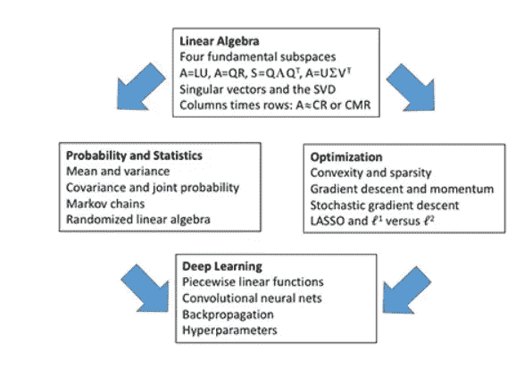
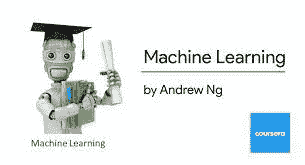
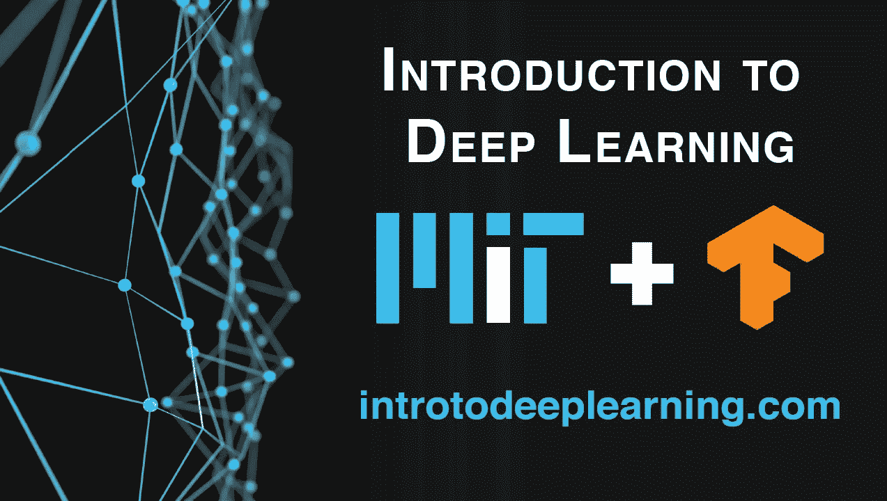
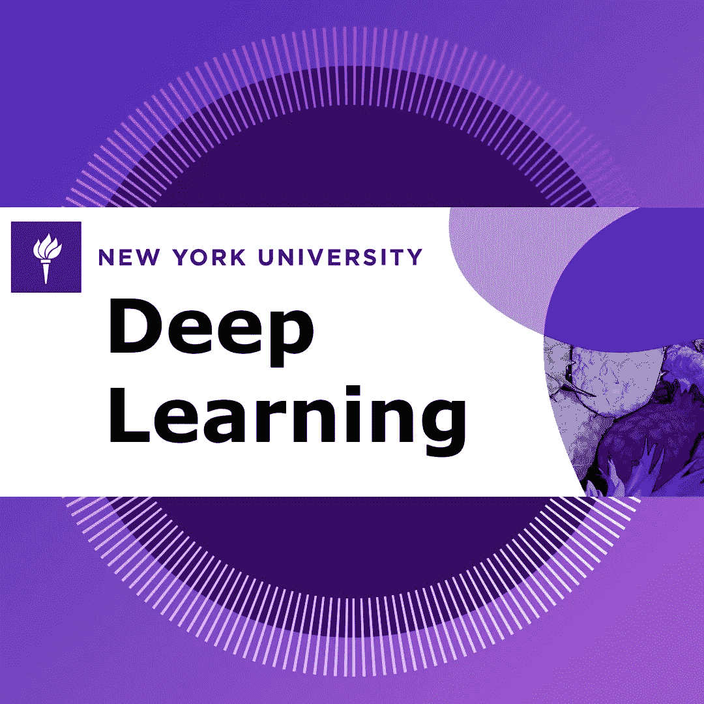
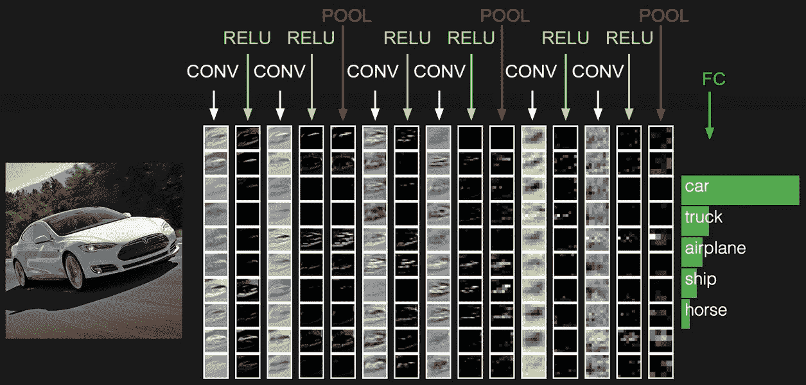
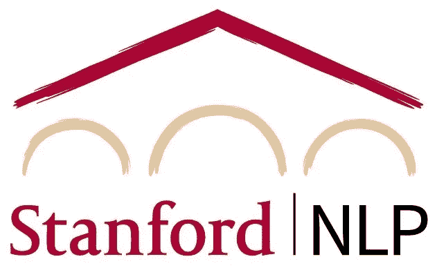

# 通过这 10 门课程向顶尖大学学习 AI

> 原文：<https://pub.towardsai.net/learn-ai-from-top-universities-through-these-10-courses-13e7a8d3957b?source=collection_archive---------0----------------------->

## 作为数据科学家，你应该花时间学习的十门大学课程

这里有许多为人工智能提供在线课程的在线平台。虽然他们中的大多数都提供了很好的实践内容。但他们对很多概念总是缺乏深入的理论解释。因此，如果你是初学者，在线课程将是一个很好的起点。但你必须增加对许多概念的理论理解，才能在人工智能领域的职业生涯中取得进展。因为它是一个不断发展的领域，每天都有新的研究成果。因此，重要的是要对理论基础有一个坚实的理解，以便能够应对这一领域的新成果。

世界顶尖大学。

在这篇文章中，我将推荐来自顶尖大学的十门课程，这些课程将帮助你更好地理解人工智能和机器学习的不同概念，并帮助你为更好地理解该领域的新研究成果奠定基础。

**如果你想免费学习数据科学和机器学习，看看这些资源:**

*   免费互动路线图，自学数据科学和机器学习。从这里开始:【https://aigents.co/learn/roadmaps/intro】T4
*   数据科学学习资源搜索引擎(免费)。将你最喜欢的资源加入书签，将文章标记为完整，并添加学习笔记。[https://aigents.co/learn](https://aigents.co/learn)
*   想要在导师和学习社区的支持下从头开始学习数据科学吗？免费加入这个学习圈:[https://community.aigents.co/spaces/9010170/](https://community.aigents.co/spaces/9010170/)

**如果你想在数据科学& AI 领域开始职业生涯，但你不知道如何开始。我提供数据科学指导课程和长期职业指导:**

*   长期指导:[https://lnkd.in/dtdUYBrM](https://lnkd.in/dtdUYBrM)
*   辅导课程:[https://lnkd.in/dXeg3KPW](https://lnkd.in/dXeg3KPW)

***加入*** [***中等会员***](https://youssefraafat57.medium.com/membership) ***计划，只需 5 美元，继续无限制学习。如果你使用下面的链接，我会收到一小部分会员费，不需要你额外付费。***

 [## 加入我的介绍链接媒体-优素福胡斯尼

### 阅读 Youssef Hosni(以及媒体上成千上万的其他作家)的每一个故事。您的会员费直接支持…

youssefraafat57.medium.com](https://youssefraafat57.medium.com/membership) 

## 1.[麻省理工学院线性代数](https://ocw.mit.edu/courses/mathematics/18-06-linear-algebra-spring-2010/index.htm)

第一门课是麻省理工的 Gilbert Strang 教授讲授的著名的线性代数课程。这是矩阵论和线性代数中的一门基础学科。因为线性代数概念是理解和创建机器学习算法的关键，尤其是在应用于深度学习和神经网络时。因此，学习它将有助于了解先进的机器和深度学习概念和算法。

吉尔伯特.斯特朗教授在一次讲座中。

## 2.[麻省理工学院数据分析、信号处理和机器学习中的矩阵方法](https://ocw.mit.edu/courses/mathematics/18-065-matrix-methods-in-data-analysis-signal-processing-and-machine-learning-spring-2018/index.htm)

第二个课程是麻省理工学院 Gilbert Strang 教授讲授的数据分析、信号处理和机器学习课程中的矩阵方法。本课程回顾了线性代数及其在概率、统计和优化方面的应用，尤其是对深度学习的全面解释。如果你想了解优化和深度学习的理论基础，这是一门非常重要的课程。

课程大纲涵盖的要点如下图所示:

课程大纲中涵盖的要点

## 3.[佐治亚理工学院](https://mediaspace.gatech.edu/playlist/dedicated/74258101/1_g5xwvbde/1_iw8fk73m)统计方法课程

第三个课程是佐治亚理工学院的大卫·戈德曼教授的统计方法课程。本课程介绍了基本的概率概念。本课程的重点是科学和工程中的应用，目标是提高对各种现实世界问题的建模和分析技能。

统计数据/照片由[克里斯·利维拉尼](https://unsplash.com/@chrisliverani?utm_source=medium&utm_medium=referral)在 [Unsplash](https://unsplash.com?utm_source=medium&utm_medium=referral) 上拍摄

**4。** [**哈佛大学数据科学概率**](https://pll.harvard.edu/course/data-science-probability?delta=2)

第四门课程是哈佛大学的数据科学概率课程。在这门课程中，你将学到概率论中有价值的概念。这门课程的动机是围绕 2007-2008 年金融危机的环境。导致这场金融危机的部分原因是金融机构出售的一些证券的风险被低估了。为了开始理解这个非常复杂的事件，我们需要理解概率的基础。

概率/照片由[纳赛尔·塔米米](https://unsplash.com/@tamiminaser?utm_source=medium&utm_medium=referral)在 [Unsplash](https://unsplash.com?utm_source=medium&utm_medium=referral) 上拍摄

本课程将介绍一些重要的概念，如随机变量、独立性、蒙特卡罗模拟、期望值、标准误差和中心极限定理。这些统计概念是对数据进行统计测试和理解您正在分析的数据是否可能由于实验方法或偶然事件而出现的基础。

概率论是统计推断的数学基础，统计推断对于分析受偶然性影响的数据是必不可少的，因此对于数据科学家来说是必不可少的。

## [**5。斯坦福的机器学习**](https://cs229.stanford.edu/syllabus-autumn2018.html)

第五门课是斯坦福大学吴恩达教授的著名的**机器学习**课。本课程提供了机器学习和统计模式识别的广泛介绍。

本课程涵盖的主题包括监督学习(生成/判别学习、参数/非参数学习、神经网络、支持向量机)；无监督学习(聚类、降维、核方法)；学习理论(偏差/方差权衡，实用建议)；强化学习和自适应控制。本课程还将讨论机器学习的最新应用，如机器人控制、数据挖掘、自主导航、生物信息学、语音识别以及文本和网络数据处理。

斯坦福大学的机器学习

如果你想加深你的机器学习理论知识，这个课程是你应该考虑的最重要的课程之一。课程视频可以在[**这里**](https://www.youtube.com/watch?v=jGwO_UgTS7I&list=PLoROMvodv4rMiGQp3WXShtMGgzqpfVfbU) 找到。

## **6。** [**麻省理工深度学习导论**](http://introtodeeplearning.com/)

第六门课程是麻省理工学院教授的著名的**深度学习入门**课程。本课程是一门介绍深度学习方法的课程，应用于计算机视觉、自然语言处理、生物学等领域。

麻省理工学院深度学习导论。

您将获得深度学习算法的基础知识，并获得在 TensorFlow 中构建神经网络的实践经验。课程结束时，将举行一场项目提案竞赛，并听取员工和行业赞助商小组的反馈意见。这门课在麻省理工学院的 IAP 学期由现任麻省理工学院博士研究员讲授。

这门课程目前正在进行中(在我写这篇文章的时候)，所以你可以一堂接一堂地学习。你可以在 [**课程页面**](http://introtodeeplearning.com/) 关注它，也可以从他们的 [**youtube 频道**](http://introtodeeplearning.com/) 关注它。

## [**7。深度学习作者 Yann LeCun**](https://cds.nyu.edu/deep-learning/)

第七门课程是纽约大学数据科学中心 Yann LeCun 教授的深度学习课程。本课程由深度学习领域的领先研究人员之一 Yann LeCun 教授。

本课程涉及深度学习和表示学习的最新技术，重点关注有监督和无监督的深度学习、嵌入方法、度量学习、卷积和递归网络，以及对计算机视觉、自然语言理解和语音识别的应用。

NYU 大学 Yann LeCun 的深度学习。

## **8。CS231n:斯坦福大学的视觉识别卷积神经网络**

第八门课程是费-李非教授在斯坦福大学讲授的**用于视觉识别的卷积神经网络**。计算机视觉在我们的社会中已经无处不在，应用程序包括搜索、图像理解、应用程序、地图绘制、医学、无人机和自动驾驶汽车。许多这些应用的核心是视觉识别任务，例如图像分类、定位和检测。神经网络(也称为“深度学习”)方法的最新发展极大地提高了这些最先进的视觉识别系统的性能。

本课程深入探讨深度学习架构的细节，重点是学习这些任务的端到端模型，尤其是图像分类。在为期 10 周的课程中，学习者将学习实现、训练和调试自己的神经网络，并详细了解计算机视觉的前沿研究。期末作业将涉及训练一个数百万参数的卷积神经网络，并将其应用于最大的图像分类数据集(ImageNet)。我们将重点教授如何建立图像识别问题、学习算法(例如反向传播)、用于训练和微调网络的实际工程技巧，并通过动手作业和期末课程项目指导学生。本课程的大部分背景和材料将来自于 [ImageNet 挑战赛](http://image-net.org/challenges/LSVRC/2014/index)。

## [9**。CS224n:斯坦福**T5 深度学习的自然语言处理](http://web.stanford.edu/class/cs224n/index.html)

第九门课程是 Christopher D Manning 教授讲授的**深度学习自然语言处理**课程。自然语言处理(NLP)或计算语言学是信息时代最重要的技术之一。NLP 的应用无处不在，因为人们几乎用语言交流一切:网络搜索、广告、电子邮件、客户服务、语言翻译、虚拟代理、医疗报告等。在过去十年中，深度学习(或神经网络)方法已经在许多不同的 NLP 任务中获得了非常高的性能，使用单个端到端神经模型，不需要传统的特定于任务的特征工程。在这门课程中，学生将全面了解 NLP 深度学习的前沿研究。通过讲座、作业和期末项目，你将学习使用 [Pytorch](https://pytorch.org/) 框架设计、实现和理解你自己的神经网络模型的必要技能。

## [**10。佐治亚理工学院的强化学习**](https://omscs.gatech.edu/cs-7642-reinforcement-learning)

列表中的最后一门课程是佐治亚理工学院教授的**强化学习**课程。本课程通过结合经典论文和最近的工作，从计算的角度探索自动化决策。它检查有效的算法，如果它们存在的话，用于学习单代理和多代理行为政策和从经验中学习接近最优决策的方法。

主题包括马尔可夫决策过程、随机和重复博弈、部分可观察的马尔可夫决策过程、强化学习、深度强化学习和多主体深度强化学习。特别感兴趣的将是概括、探索和表现的问题。我们将通过讲座视频、论文阅读和萨顿和巴尔托的《强化学习》这本书来涵盖这些主题。

学生将在该领域发表的论文中复制一个结果，并在更复杂的环境中工作，如 OpenAI 健身房图书馆中的环境。此外，学生将训练代理解决更复杂的多代理环境，即谷歌研究足球环境，并将有机会开发最先进的或新颖的技术。强烈建议在本地运行 Docker 或利用云计算服务。教学人员将不提供技术支持或云计算学分。

 [## 加入我的介绍链接媒体-优素福胡斯尼

### 阅读 Youssef Hosni(以及媒体上成千上万的其他作家)的每一个故事。您的会员费直接支持…

youssefraafat57.medium.com](https://youssefraafat57.medium.com/membership) 

*感谢阅读！如果你喜欢这篇文章，请务必在*[***LinkedIn***](https://www.linkedin.com/in/youssef-hosni-b2960b135/)*上联系我，并在* [***上关注我的新文章。***](https://youssefraafat57.medium.com/)