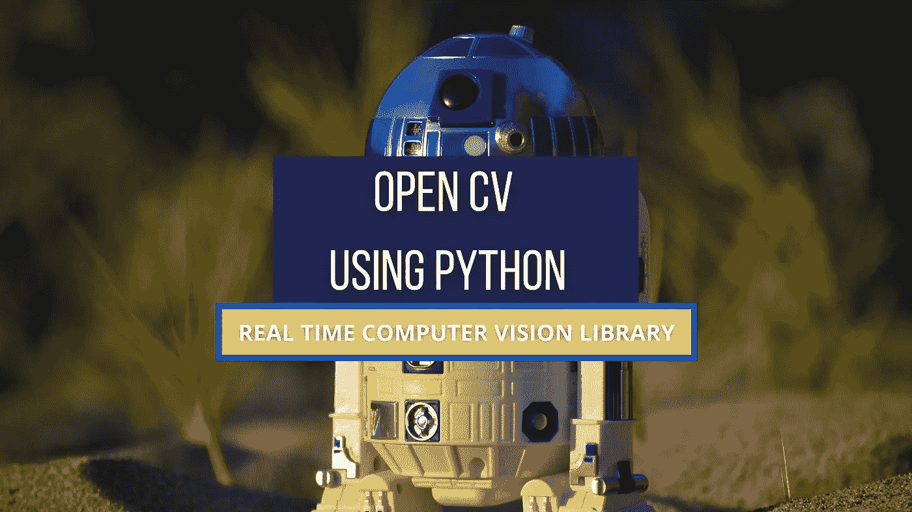
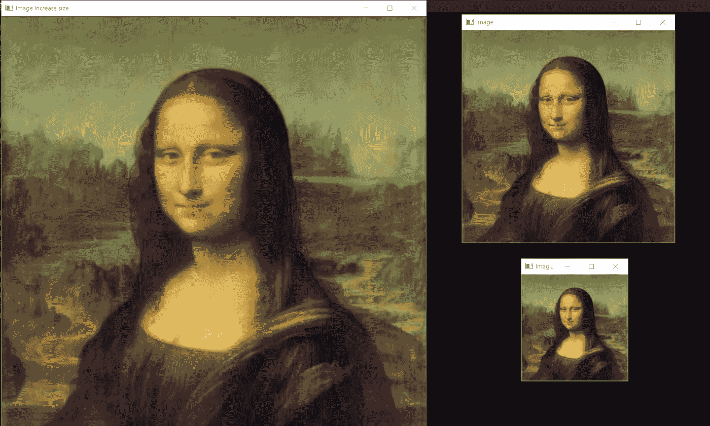
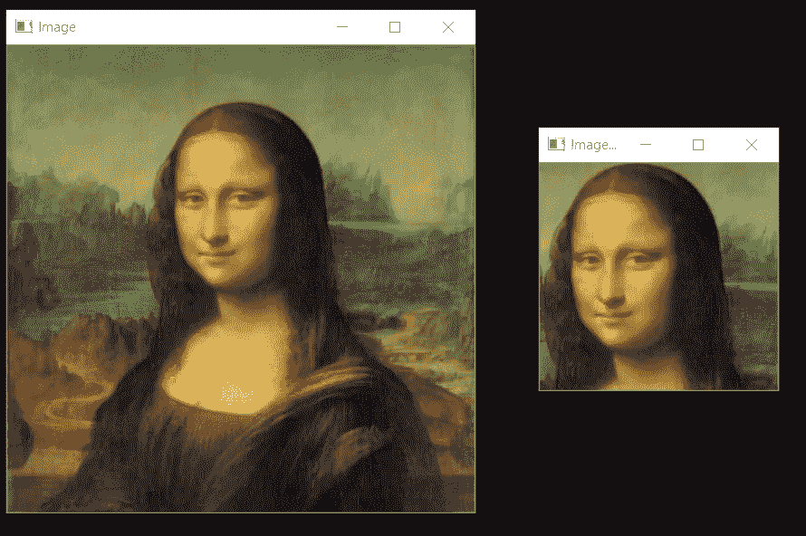
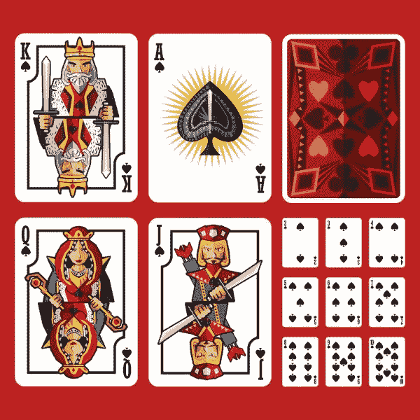
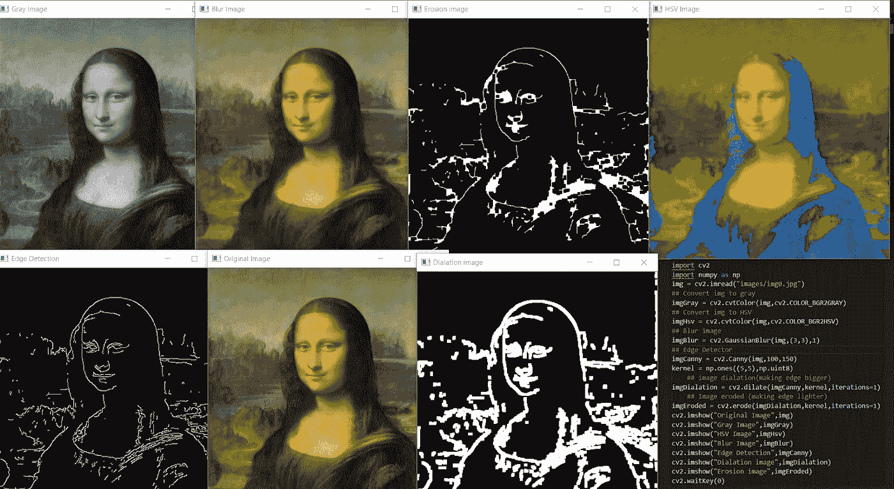
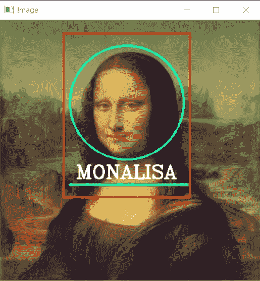
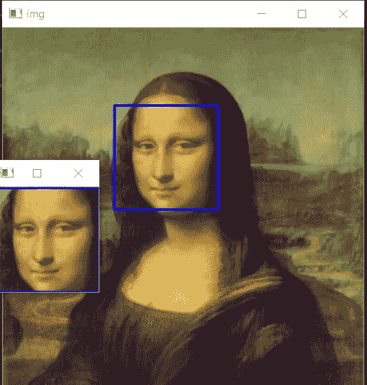

# 10 分钟内打开简历基础

> 原文：<https://pub.towardsai.net/learn-everything-about-open-cv-ed485a3007f1?source=collection_archive---------0----------------------->



“作者提供的图像”

**等等！！**停止搜索你很快就找到了学习公开简历的最佳文章。只要和我在一起，准备好你需要的设备。很高兴看到旅途中有你这样的人。

## 打开简历

Open cv 是计算机视觉中最流行的库。最初是用 C 和 C++写的。现在 python 中也有了。它最初是由英特尔开发的。该库是一个跨平台的开源库。它是免费使用的。Open cv 库是一个高度优化的库，主要关注实时应用。

开放的 cv 库是 2500 多种优化算法的组合。其可用于检测和识别不同的面部、识别图像中或实时的物体、使用视频和网络摄像头对不同的人类动作进行分类、跟踪相机运动、跟踪像汽车、人等移动物体。实时计数对象、将图像拼接在一起以产生高分辨率图像、从图像数据库中找到相似的图像、从使用闪光灯拍摄的图像中去除红眼并提高图像质量、跟随眼球运动、跟踪面部等

它有大约 47000 个活跃用户社区，估计下载量超过 1800 万次。许多大公司像谷歌、亚马逊、特斯拉、微软、本田等。用 Open cv 让他们的产品更好，更 AI 驱动。

# 先决条件

在开始写代码之前，我们需要在我们的设备上安装 open cv。如果你是专业编程人员，并且了解每一个 IDE，那么去 Pycharm，在设置中的包管理器中安装 OpenCV-python。

如果你是初级或中级程序员，或者只是想关注博客，那么我们将为博客使用 vs 代码。
只需去 [Visual Studio Code](https://code.visualstudio.com/download) 网站，根据你的 os 为你下载最新版本。
现在我们将创建一个虚拟环境，我们将在其中安装 open cv。使用 cd 打开您的终端和目标到桌面。使用`mkdir` 创建一个名为 opencvThen 的文件夹，然后运行下面的命令。

```
python -m venv env
```

现在使用`env\scripts\activate`激活环境，你会看到在`C:\Users\username\Desktop\opencv`之前有一个小括号`(env)`出现。现在只需使用 pip 安装 OpenCV。

```
pip install opencv-python
```

## 我们将在这个博客中讨论 7 个话题

1.  ***读取、写入和显示图像***
2.  ***阅读视频并与网络摄像头集成***
3.  ***缩放和裁剪图像***
4.  ***基本图像滤镜使用功能***
5.  ***绘制不同的形状***
6.  ***在图像上书写文字***
7.  ***检测和裁剪面***

# ***阅读、书写和显示图像***

为了使用 open cv 读取图像，我们有一个函数 imread()，为了显示图像，我们有一个函数 imshow()，为了写入，我们有一个函数 imwrite()。让我们看看每一个的语法。

***imread():***

```
**img = cv2.imread("PATH_TO_IMAGE.jpg/png")**Example
img = imread("images/dog0.jpg")
```

***imshow():***

```
**cv2.imshow("WINDOW NAME",IMG_VAR)**Example
imshow("Dog Image",img)
```

***imwrite():***

```
**cv2.imwrite(FILENAME, IMAGE)*****filename:*** *A string representing the file name. The filename must include image format like* ***.jpg, .png,*** *etc.* ***image:*** *It is the image that is to be saved.*Example
cv2.imwrite('images/img',img)
```

# ***读取视频并与网络摄像头集成***

读取视频文件与在 OpenCV 中读取图像文件非常相似。不同的是这里我们使用 cv2.videocapture.
**语法**

```
**video = cv2.VideoCapture("FILEPATH.mp4")**Example
video = cv2.VideoCapture("video/dog/dog.mp4")
```

视频是许多帧连接在一起的集合。每一帧都是一幅图像。要使用 OpenCV 观看视频，我们只需使用 while 循环显示视频的每一帧。

```
while True:
   success , img = cap.read()
   cv2.imshow("Video",img)
   if cv2.waitKey(1) & 0xff==ord('q'):**##key 'q' will break the loop**
       break
```

为了与网络摄像头集成，我们需要传递网络摄像头的端口值，而不是视频的路径。如果你使用的是笔记本电脑，并且没有连接任何外部网络摄像头，那么只需传递 0，如果你连接了任何外部网络摄像头，那么传递 1。

```
cap = cv2.VideoCapture(0)
cap.set(3,640)  ## Frame width
cap.set(4,480)  ## Frame Height
cap.set(10,100) ## Brightness
while True:
   success, img = cap.read()
   cv2.imshow("Video",img)
   if cv2.waitKey(1) & 0xff == ord('q'):
        break
```

# ***调整图像大小和裁剪***

调整大小是改变图像形状的过程。在 Opencv 中，我们可以使用`resize`函数来调整图像的形状。
**语法**

```
**cv2.resize(IMG,(WIDTH,HEIGHT))** IMG: image which we want to resize
WIDTH: new width of the resize image
HEIGHT: new height of the resize imageExample
cv2.resize(img,(224,224))
```

首先要调整图像的大小，我们需要知道图像的形状。我们可以使用`shape`找到任何图像的形状，然后根据图像形状，我们可以增加或减少图像的大小。我们举个例子来看。

```
import cv2
img = cv2.imread("images/img0.jpg") **##Choose any image**
print(img.shape)
imgResize = cv2.resize(img,(**224,224**)) **##Decrease size**
imgResize2 = cv2.resize(img,(**1024,1024**)) **##Increase size**
cv2.imshow("Image",img)
cv2.imshow("Image Resize",imgResize)
cv2.imshow("Image Increase size",imgResize2)
print(imgResize.shape)
cv2.waitKey(0)
```

如果不想对宽度和高度进行硬编码，也可以使用形状，然后使用索引增加宽度和高度。

```
import cv2
img = cv2.imread("images/img0.jpg") **##Choose any image**
print(img.shape)
shape = img.shape
imgResize = cv2.resize(img,(shape[0]//2**,**shape[1]//2))**##Decrease size**
imgResize2 = cv2.resize(img,(shape[0]*2**,**shape[1]*2)) **##Increase size**
cv2.imshow("Image",img)
cv2.imshow("Image Resize",imgResize)
cv2.imshow("Image Increase size",imgResize2)
print(imgResize.shape)
cv2.waitKey(0)
```



"图像调整大小— [图像被授权](https://medium.com/@parasharabhay13) r "

# 裁剪图像

裁剪是获取图像的一部分的过程。在 open cv 中，我们可以通过定义裁剪矩形坐标来执行裁剪。
**语法**

```
**imgCropped = img[y1:y2, x1:x2]*****(x1,y1): top-left vertex
(x2,y2): bottom-right vertex***Example
imgCropped = img[0:100,200:200]
```

使用裁剪方法，让我们试着从图像中提取蒙娜丽莎的脸。

```
import cv2
img = cv2.imread("images/img0.jpg")
imgCropped = img[50:250,120:330]
cv2.imshow("Image cropped",imgCropped)
cv2.imshow("Image",img)
cv2.waitKey(0)
```



"裁剪图像— [作者的图像](https://medium.com/@parasharabhay13)"

还可以使用 paint 找到(x1，y1)，(x2，y2)的正确坐标。



**右键点击图像并保存；尝试从图像中取出国王卡**。

**提示:** *使用画图找到正确的坐标，最后，使用 resize 来增加裁剪图像的大小。*

***“在寻求解决方案之前，先试着自己去做。”***

## **👉** [***解***](https://gist.github.com/Abhayparashar31/9b01473431de765c0a73e81271233d91)

# ***基本图像滤镜使用功能***

有许多基本的过滤器，我们可以用在我们的图像上，像把我们的图像转换成灰度，模糊图像，等等。重要的一个一个来看。

## **图像转灰色**

要将图像转换成灰度，我们可以使用函数`cvtColor`，这里我们将`cv2.COLOR_BGR2GRAY`作为参数传递。
**语法**

```
**imgGray = cv2.cvtColor(IMG,cv2.CODE)**
IMG: Original image
CODE: Conversion code for Gray(COLOR_BGR2GRAY)Example
imgGray = cv2.cvtColor(img,cv2.COLOR_BGR2GRAY)
```

## **Img 至 HSV**

要将图像转换成 HSV，我们可以使用函数`cvtColor`，这里我们将`cv2.COLOR_BGR2HSV`作为参数传递。它主要用于目标跟踪。
**语法**

```
**imgGray = cv2.cvtColor(IMG,cv2.CODE)**
IMG: Original image
CODE: Conversion code for Gray(COLOR_BGR2HSV)Example
imgHsv = cv2.cvtColor(img,cv2.COLOR_BGR2HSV)
```

## 模糊图像

模糊用于从图像中移除额外的噪声，也称为平滑。它是对图像应用低通滤波器的过程。为了在 Opencv 中使用模糊，我们有一个函数 GaussianBlur。
**语法**

```
**imgBlur = cv2.GaussianBlur(img,(sigmaX,sigmaY),kernalSize)****kernalsize** − A Size object representing the size of the kernel.
**sigmaX** − A variable representing the Gaussian kernel standard deviation in X direction.
**sigmaY** - same as sigmaXExmaple
imgBlur = cv2.GaussianBlur(img,(3,3),0)
```

## 边缘检测

在 Open cv 中，我们使用 canny 边缘检测器来检测图像中的边缘。也有不同的边缘检测器，但最著名的是 canny 边缘检测器。canny 边缘检测器是一种边缘检测算子，它使用多阶段算法来检测图像中的各种边缘。它是由约翰·f·卡尼在 1986 年发明的。
**语法**

```
**imgCanny = cv2.Canny(img,threshold1,threshold2)****threshold1,threshold2:**Different values of threshold different for every imagesExample
imgCanny = cv2.Canny(img,100,150)
```

## 扩张

膨胀用于增加图像中边缘的尺寸。首先，我们定义奇数(5，5)的核矩阵大小。然后使用内核，我们在图像上执行膨胀。我们对 Canny 边缘检测器的输出图像应用膨胀。
**语法**

```
kernel = np.ones((5,5),np.uint8) **## DEFINING KERNEL OF 5x5**
imgDialation = cv2.dilate(**imgCanny**,kernel,iterations=1) **##DIALATION**
```

## 侵蚀

侵蚀正好与膨胀相反。它用于减小图像中边缘的尺寸。首先，我们定义奇数(5，5)的核矩阵大小。然后使用内核，我们对图像进行腐蚀。我们对 Canny 边缘检测器的输出图像应用腐蚀。

```
kernel = np.ones((5,5),np.uint8) **## DEFINING KERNEL OF 5x5**
imgDialation = cv2.erode(**imgCanny**,kernel,iterations=1) **##EROSION**
```

现在，在同一个程序中对蒙娜丽莎图像应用所有的基本功能。



"同一张图片上的不同功能— [图片作者](https://medium.com/@parasharabhay13)"

# ***绘制不同的形状***

我们可以使用打开的 Cv 绘制不同的形状，如矩形、圆形、直线等。

## **长方形:**

为了在图像上画一个矩形，我们使用矩形函数。在函数中，我们将宽度、高度、X、Y、RGB 颜色、厚度作为参数传递。
**语法**

```
**cv2.rectangle(img,(w,h),(x,y),(R,G,B),THICKNESS)
w:** width
**h:** height
**x:** distance from x axis **y:** distance from y axis **R,G,B:** color in RGB form (255,255,0) **THICKNESS:** thickness of rectangel(integer)Example
cv2.rectangle(img,(100,300),(200,300),(255,0,255),2)
```

## 圆圈:

要画一个圆，我们使用 cv2.circle。我们传递 x，y，半径大小，RGB 形式的颜色，厚度作为参数。
语法

```
cv2.circle(img,(x,y),radius,(R,G,B),THICKNESS)
**x:** distance from x axis **y:** distance from y axis
**radius**: size of radius(integer)
**R,G,B:** color in RGB form (255,255,0) **THICKNESS:** thickness of rectangel(integer)Example
cv2.circle(img,(200,130),90,(255,255,0),2)
```

## 线路:

为了画一条线，我们使用 cv2.line，传递起点(x1，y1)，终点(x2，y2)，RGB 形式的颜色，厚度作为参数。
**语法**

```
**cv2.line(img,(x1,y1),(x2,y2),(R,G,B),THICKNESS)****x1,y1:** start point of line (integer)
**x2,y2:** end point of line (integer)
**R,G,B:** color in RGB form (255,255,0) **THICKNESS:** thickness of rectangel(integer)Example
cv2.line(img,(110,260),(300,260),(0,255,0),3)
```

# ***在图像上书写文字***

在 open cv 中，我们有一个函数 cv2.puttext，用于在图像的特定位置书写文本。它将图像、文本、x、y、颜色、字体、字体大小、粗细作为输入。
**语法**

```
cv2.putText(img,text,(x,y),FONT,FONT_SCALE,(R,G,B),THICKNESS)
**img:** image to put text on
**text:** text to put on image
**X:** text distance from X axis
**Y:** text distance from Y axis
**FONT:** Type of FONT ([ALL FONT TYPES](https://gist.github.com/Abhayparashar31/c8ada068052002defb0272416356c5e8))
**FONT_SCALE**: Scale of Font(Integer)
**R,G,B:** color in RGB form (255,255,0) **THICKNESS:** thickness of rectangel(integer)Example
cv2.putText(img,"HELLO",(120,250),cv2.FONT_HERSHEY_COMPLEX,1,(255,255,255),2)
```



"[作者图片](https://medium.com/@parasharabhay13)"

从 [**这里**](https://www.artnews.com/wp-content/uploads/2020/09/mona-lisa.jpg?w=611) 下载蒙娜丽莎的图像。

任务:使用形状和文字为左图中的蒙娜丽莎的脸创建一个框架。
**提示:**先画圆，再画矩形，然后根据圆和矩形放文字，最后根据文字放线。

***“先试着自己做，再去寻求解决方案。”***

## 👉[解决方案](https://gist.github.com/Abhayparashar31/af36bf25ce61345266db4b54aba33be1)

# ***检测并裁剪面***

在创建人脸识别系统时，人脸检测非常有用。在 open cv 中，我们有许多预先训练好的 haar 级联分类器，可用于不同的目的。在 OpenCV[**GitHub**](https://github.com/opencv/opencv/tree/master/data/haarcascades)上查看分类器的完整列表。

为了检测开放 cv 中的人脸，我们使用了`haarcascade_frontalface_default.xml`分类器。它将返回图像的四个坐标(w，h，x，y)。使用这些坐标，我们将在面部绘制一个矩形，然后使用相同的坐标，我们将裁剪面部。现在使用 imwrite，我们将在目录中保存裁剪后的图像。

```
import cv2
**# Load the cascade**
face_cascade = cv2.CascadeClassifier('haarcascade_frontalface_default.xml')**# Read the input image** img = cv2.imread('images/img0.jpg')**# Convert into grayscale** gray = cv2.cvtColor(img, cv2.COLOR_BGR2GRAY)**# Detect faces** faces = face_cascade.detectMultiScale(gray, 1.3, 4)**# Draw rectangle around the faces** for (x, y, w, h) in faces:
    cv2.rectangle(img, (x, y), (x+w, y+h), (255, 0, 0), 2)
 **# Cropping Face**    crop_face = img[y:y + h, x:x + w]
 **#Saving Cropped Face**    cv2.imwrite(str(w) + str(h) + '_faces.jpg', crop_face)
cv2.imshow('img', img)
cv2.imshow("imgcropped",crop_face)
cv2.waitKey()
```



"图片中被裁剪的脸——作者的[图片. "](https://medium.com/@parasharabhay13)

## 感谢阅读😀

## **参考文献**

【**1**】https://opencv.org/about/ [【2】](https://opencv.org/about/)[https://pypi.org/project/opencv-python/](https://pypi.org/project/opencv-python/)
【3】[https://www.murtazahassan.com/](https://www.murtazahassan.com/)