# 在组装屏幕上的圣诞树时学习编程

> 原文：<https://pub.towardsai.net/learn-programming-while-assembling-an-on-screen-christmas-tree-1f09ba05e82a?source=collection_archive---------3----------------------->

## [编程](https://towardsai.net/p/category/programming)

## 使用 Python 和 Julia 进行假日学习和娱乐的编程练习，并对这两种语言进行实际比较。

> 本文旨在向计算机编程爱好者和年轻学习者分享一些具有教育价值的节日快乐。

# 输出

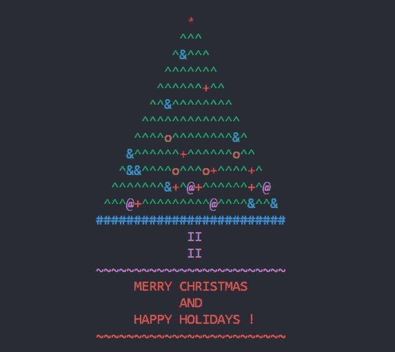

节日问候消息的预期输出。(图片由作者提供)

# 练习的目标

创建节日贺卡以在控制台/终端中显示

*   使用字符装饰圣诞树的插图。
*   树身上随机分布的饰品。
*   一颗星星在树的顶端作为树顶。
*   树体底部的边框带。
*   底座附在树上。
*   祝福语“圣诞快乐，节日快乐”
*   颜色:红星绿树，底部有蓝色边框，品红色底色，红色信息。

# 概念和逻辑

*   使用屏幕打印功能将字符输出到屏幕，系统地偏移打印行上的位置。
*   要得到树体的三角形，顶部的字符数应该是一(1)。为了保持一个字符在中间，后续的行应该有奇数个字符，例如 3，5，7…..
*   打印的字符应该居中对齐树宽。空白(空格:`‘ ‘)`字符应作为第一个打印字符前的**填充符**。应该计算每行需要添加多少填充字符。
*   将选择一个角色作为树叶(如`^`)。三种不同形状(人物)的**饰品**将被添加到树上(例如`o`、`@`、`+)`)。每个装饰的位置是根据 1 和该行打印字符大小之间的一个随机数决定的。如果字符的位置与和每个装饰相关的随机数相同，树叶字符应该被装饰字符替换。每次在行中添加新字符之前，都会重新生成这个随机数。
*   在组装下一行之前，应该打印每一行(字符串)的字符。
*   树体的最后一行(叶子部分的结尾)应该是输出中用`#`字符表示的丝带。
*   应使用一对字符 I ( `II`)来组合树基础的线条。
*   底座后应加一根长度为树宽的地线(线)。
*   包含问候信息“圣诞快乐，节日快乐！”的字符串应该打印成三行。
*   另一个类似地线的字符串，长度为 treewidth，会加在消息后面。

在应用颜色时，应为上面的每个打印声明分配指定的字符颜色。

# 你需要知道的/你将学到的

通过这个练习，你将学习或练习你的技能，

1.  如何用不同的选项打印屏幕输出？
2.  变量和值分配
3.  字符串和字符串连接
4.  生成并使用一系列数字。
5.  经营者
6.  循环(用于…)
7.  条件语句(if…else)
8.  使用内置功能(打印、随机数)
9.  向屏幕输出文本添加颜色
10.  如何使用外部库/包

在下一节中，我们将使用两种不同的编程语言 Python 和 Julia 逐步构建一个代码来生成所需的输出。作为一个编程爱好者/学习者，我们鼓励你更多地关注概念、逻辑和算法，而不是编程语言特有的语法或风格。

# 让我们开始建造圣诞树吧

让我们学习如何同时使用 Python 和 Julia 来构建树。请到文末查看完整代码。

## 任务 1:设置树维

创建变量来存储宽度、车身高度和底座的全高。这些变量将在以后用于决定角色的位置。

注意，在 Julia 中，我们在行尾使用了分号(`;`)来禁止输出。虽然，有`;`是可选的。

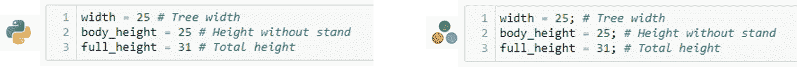

(图片由作者提供)

## 任务 2:打印基本树体

变量`center`和`padding` 用于居中对齐正在打印的字符串。

**循环和序列发生器**

Python `range(start, end, step)`用于播种 x 和 y 的值，以遍历循环。当没有提供`step`值时，python 假定它为 1。

同样地在 Julia `start:step:end`中使用了 for 循环。

这里，x 的值从 1 变化到树的宽度。步长/增量 2 仅用于获取奇数。

**字符串连接和乘法**

在 Python 中，可以使用`+`将两个字符串连接起来，并且可以使用`*`将同一个字符串的多个副本连接起来，使用一个整数值作为乘法因子(`"a" + "b"`产生`"ab"`)。而`"a"*3`产生`"aaa").`

在 Julia 中，两个字符串可以使用`*`连接，同一字符串的多个副本可以使用`^`连接，其中一个整数值作为乘法因子(`"a" * "b"`产生`"ab"`)。鉴于`"a"^3`产量`"aaa").`

**比较**

python 和 Julia 共享相同的比较运算符语法，其中如果 x 小于 25，则`x < 25`返回 true，如果 x 大于 25，则`x > 25`返回 true。类似地，只有当 x 的值为 25 时`x == 25`才成立。

在 Python 中布尔值是`True` 和`False`。在 Julia 中是`true` 和`false`注意 Julia 中的小写字母。

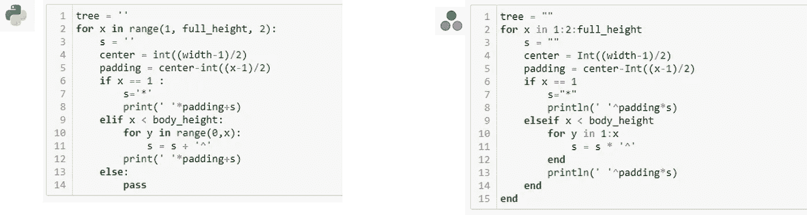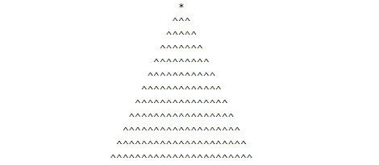

任务 2 的输出。(图片由作者提供)

## 任务 3:添加底部边界带、基础和地面

**逻辑运算符**

Python 有逻辑运算符`and`和`or`，而 Julia 使用`&&`和`||`作为逻辑运算符。python 中的表达式`a and b`相当于 Julia 中的`a && b`，只有当 a 和 b 都获得值 true 时，才会返回值 true。

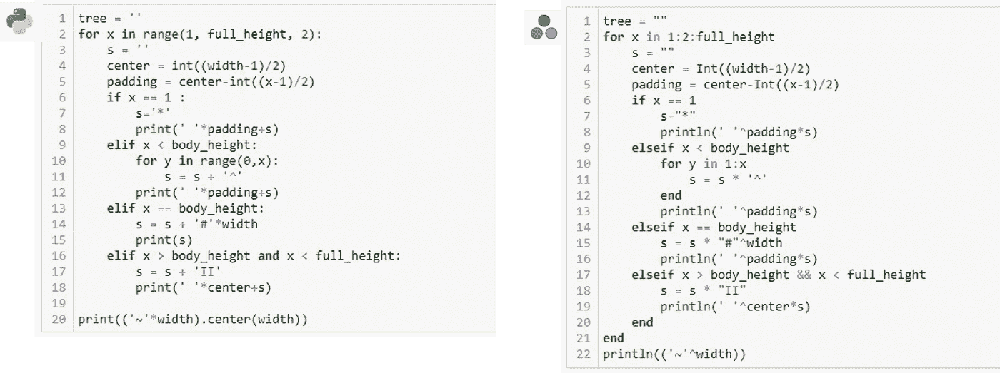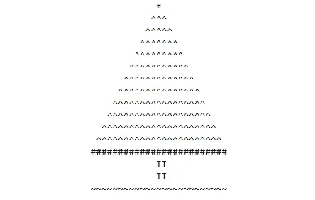

任务 3 的输出。(图片由作者提供)

## 任务 4:添加装饰品

要在给定的整数值之间生成一个随机数，必须将`random`导入到 Python 代码中。函数`randint(start,end)`将在给定的整数值`start` 和`end`之间产生一个随机整数。

Julia 的函数`rand(start,end)`的工作方式类似于 Python 中的`randint`函数。

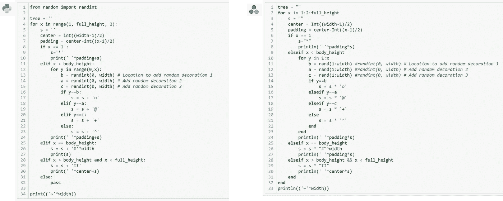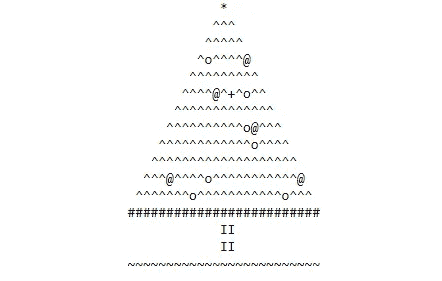

任务 4 的输出。(图片由作者提供)

## 任务 5:添加问候消息

添加三行打印行`"MERRY CHRISTMAS"`、`"AND"`和`"HAPPY HOLIDAYS !"`来完成问候语。

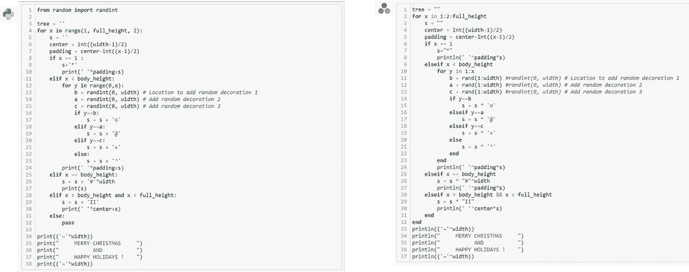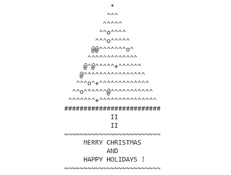

任务 5 的输出。(图片由作者提供)

## 任务 6:

给字符串添加颜色。在 python 中，`coloram`一个库可以用来设置打印在控制台上的字符串的颜色。Julia 有一个可以用来生成彩色和样式字符串的包。

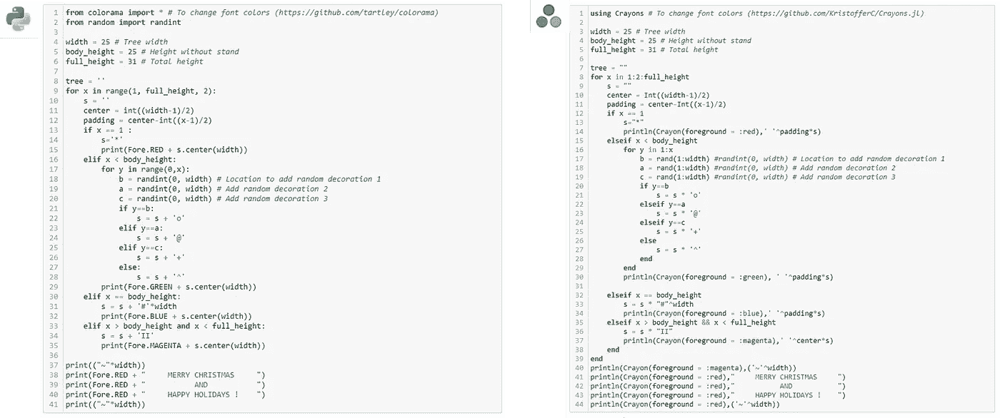

任务 6 的输出。(图片由作者提供)

# 下一步是什么？

如果你完成了以上 6 项任务，恭喜你！您已经使用 Python 和 Julia 构建了一个以编程方式生成的节日问候。

你也可以在输出中加入自己的创意，例如改变颜色和角色，添加更多的装饰品，为装饰品分配不同的颜色，改变树叶的颜色，添加一些动画等。

## **给每个角色添加颜色**

在 Python 中，可以在`print()`函数中使用`end`参数。`print(Fore.RED + ‘*’, end=’’)`。这将消除向每个被打印的字符串添加一个新行(`'\n'`)字符。

在 Julia 中，你可以用`print()`函数代替`println()`。Julia 函数`print()`不会给每个正在打印的字符串添加一个新行(`'\n'`)字符。

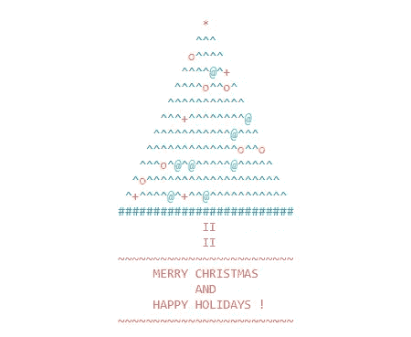

给装饰品添加颜色后的圣诞树。(图片由作者提供)

## 完整的代码

**Python**

朱莉娅

这些笔记本也可以通过下面的链接从 GitHub 下载。

*   [Python 笔记本](https://github.com/sptennak/ComputingIsFun/blob/master/HolidayGreetings/MerryChristmasandHappyHolidays_Python.ipynb)
*   [朱丽亚笔记本](https://github.com/sptennak/ComputingIsFun/blob/master/HolidayGreetings/MerryChristmasandHappyHolidays_Julia.ipynb)

**即使这个练习是使用 Python 和 Julia 完成的，您也可以使用您最喜欢的编程语言，利用相同的概念和逻辑来尝试。**

# 放弃

*本文所表达的观点和意见为作者个人观点和意见，不代表雇主或与作者相关的其他机构的观点和意见。本文是旨在解决社区数据素养问题的更广泛出版物的一部分。作者投入了大量的精力来研究所讨论的主题，简化技术术语以增加对内容的理解，查找相关参考资料以确保所呈现事实的有效性。欢迎讨论、批评、不同的想法和建议。*

# 参考

*   [Python 3 文档](https://docs.python.org/3/)。检索时间 2020 年 12 月 24 日。
*   [Python Colorama 库，用于生成彩色终端文本和光标定位](https://github.com/tartley/colorama)。检索时间 2020 年 12 月 24 日。
*   [Julia 1.5 文档](https://docs.julialang.org/en/v1/)。检索时间 2020 年 12 月 24 日。
*   [Julia Crayons.jl 用于终端的彩色和样式字符串。](https://github.com/KristofferC/Crayons.jl)检索到 2020 年 12 月 24 日。