# 在控制台输出上创建新年祝福的同时学习编程

> 原文：<https://pub.towardsai.net/learn-programming-while-creating-a-new-year-greeting-on-console-output-e29fd55a71a2?source=collection_archive---------3----------------------->

## [编程](https://towardsai.net/p/category/programming)

## 使用 Python 和 Julia 的编程练习，并对这两种语言进行实际比较。

# 输出

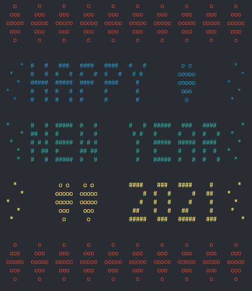

(图片由作者提供)

类似的练习可以在作者之前发表的文章“组装屏幕圣诞树时学习编程”中找到。

 [## 在组装屏幕上的圣诞树时学习编程

### 使用 Python 和 Julia 进行假日学习和娱乐的编程练习，并对两者进行实际比较…

medium.com](https://medium.com/towards-artificial-intelligence/learn-programming-while-assembling-an-on-screen-christmas-tree-1f09ba05e82a) 

这两篇文章对有经验的 Python 用户都很有帮助，他们希望通过例子快速掌握 Julia 的语法，并直接比较两种语言的用法。

对于那些处于探索任何编程语言的早期阶段的人来说，这些有趣的带有学习点的练习可以提供更好的学习体验，也可以激励你探索编程语言的特性和功能。

# 练习的目标

创建要在控制台/终端中显示的新年贺卡

*   显示消息“2021 年新年快乐”。
*   装饰边框顶部和底部是钻石，左边和右边是星星。
*   用心形来填充连续空间的空隙
*   颜色:顶部和底部边框为红色，消息行包括侧边框为蓝色、绿色和黄色。

# 概念和逻辑

*   使用屏幕打印功能输出由较大字符和装饰符号/插图组成的显示网格，这些符号/插图使用 ASCII 字符组装。
*   通过在网格上排列 ASCII 字符来构造显示字符。
*   构造显示字符，这些字符将形成能够组装包含问候消息的显示网格的行。

# 你需要知道的/你将学到的

通过这个练习，你将学习或练习你的技能，

1.  如何使用不同的选项和添加颜色打印屏幕输出。
2.  变量和数组。
3.  字符串操作和连接。
4.  处理数组。
5.  生成并使用一系列数字。
6.  经营者
7.  循环(用于…)
8.  条件语句(if…else)
9.  使用内置功能(打印、随机数)
10.  创建自定义函数来自动执行重复性任务。
11.  向屏幕输出文本添加颜色
12.  设计网格布局。

在下一节中，我们将使用两种不同的编程语言 Python 和 Julia 逐步构建一个代码来生成所需的输出。**作为一名编程爱好者/学习者，我们鼓励你更多地关注概念、逻辑和算法，而不是编程语言特有的语法或风格。**

# 让我们开始构建问候信息

让我们学习如何同时使用 Python 和 Julia 来构建问候消息。请到文末查看完整代码。

## 任务 1:设置显示字符

让我们首先看看我们必须设计多少独特的显示字符来创建预期的信息“2021 年新年快乐”。

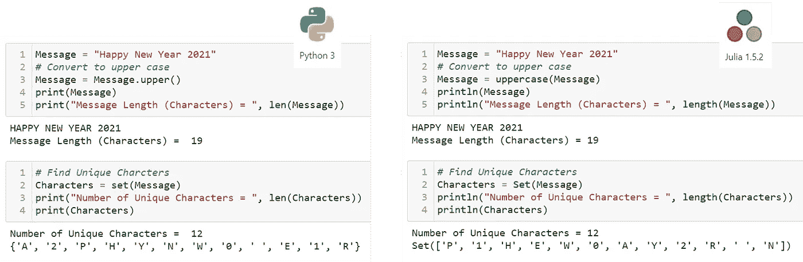

我们可以把每个角色设计成 5x5 的格子。您可以选择不同的大小，并根据自己的喜好更改字符绘制模式。哈希(`#`)字符用作下面代码中的填充字符。

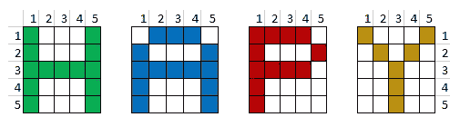

字符像素网格(图片由作者提供)

现在制作一些我们可以用于边框和填充物的装饰字符。戒指和钻石很容易制造。网格内随机排列的星形(`*`)也可用于创建装饰性的侧边框。

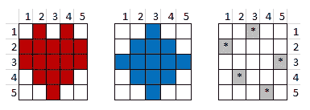

装饰像素网格(图片由作者提供)

> **字符串文字**
> 
> 在 **Python** 中，有三种定义字符串的方式:单引号(`'Hello'`)和双引号(`"Hello"`)可以用来定义单行字符串，而三引号(`'''Hello''' or """Hello"""`)可以用来定义多行字符串，我们将使用它们来定义这里的字符。
> 
> **Julia** 有一个单独的 char 数据类型，它使用单引号(`'A'`)。因此我们只能使用双引号来定义字符串(多行字符串使用`"Hello"`或`"""Hello"""`)。

定义字符像素网格。Python 和 Julia 共享相同的语法。(图片由作者提供)

该消息由多个字符组成(确切地说是 8x5 =40)。为了使代码有组织，并使将字符串转换为显示网格的重复任务自动化，我们可以创建一个函数。

为了增加字符的可读性，我们需要在每个字符之间增加一些空间。因此，5x5 像素网格放置在 7x7 网格内，从顶部、底部、左侧和右侧增加一个像素的空间。这个函数可以推广到占位符大小(画布)内的任何输入字符大小。

> **功能**
> 
> **Python** 函数的定义以`**def**` 关键字开头，具有`**def** function_name(parameters,):`的通用签名。注意末端的`:`。因为 Python 使用缩进来确定范围，所以函数没有显式的结束文字。
> 
> **Julia** 函数以`**function**` 关键字开始，具有`**function** function_name(parameters)`的通用签名。必须指定`**end**`关键字来关闭函数体。
> 
> **函数的返回值**
> 
> 如果函数应该在评估/执行后返回值，那么 **Python** 和 **Julia** 函数都使用`**return**` 关键字。考虑调用时返回`a+b`结果的函数`add(a,b)`。如果我们使用它`c = add(2,3)`，值`5`将被赋给变量`c`。
> 
> 返回值对于函数来说不是强制性的。例如，内置函数`print()`是一个没有返回值的函数。您也可以在自定义函数中跳过`return` 。但是在 Julia 中，如果最后没有提到`return`关键字，就会返回最后一个求值表达式的结果。因此，在 Julia 中，如果您的函数不打算返回值，那么最好让`return`不带任何变量或值。

帮助函数 whole_half 用于确定需要从垂直(上、下)和水平(左、右)方向的两侧添加多少填充行。

> **类型转换**
> 
> 在 **Python** 中，可以使用内置函数`int(value)`将浮点值转换为丢失(小数点)的整数，而在 **Julia 中，**我们可以使用函数`Int(value)`在 Julia 中做同样的事情。同样，你在 **Python** 中有`float(value)`，在 **Julia** 中有`Float64(value)`将整数转换成浮点。应该详细讨论类型转换，以便更好地理解概念和用法。

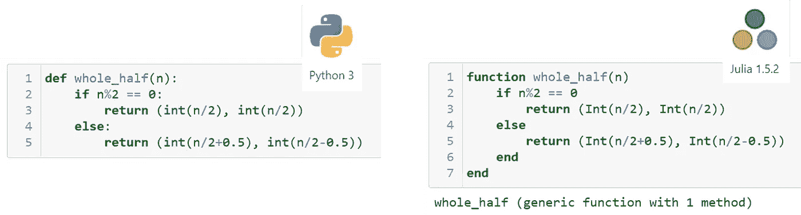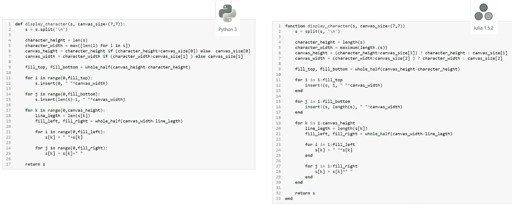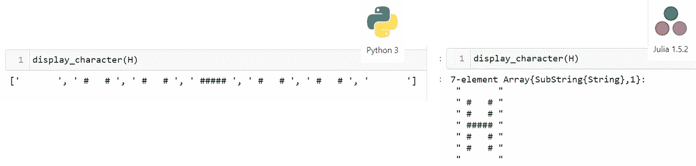

## 任务 2:组合问候语

> **阵列操作**
> 
> Numpy 是一个用于科学计算的 Python 包，它支持数组和矩阵，以及一组高级数学函数。在 Python 中,`[item1, item2,]` literal 创建了一个`list`,它需要转换成`np.array` ,以便使用比常规函数性能更好的数组函数。如果你想了解更多关于数组运算的知识，Python 也有向量运算。
> 
> Python 列表理解是一种创建列表的方式，消除了对循环的需要。如果你有兴趣学习更多关于 Python 的知识， **list comprehension** 将是增加你的知识库的一个强大技术。
> 
> **Julia** 通过在函数或运算符前添加点(`.`)来支持对其所有函数和运算符的向量运算。

Python 和 Julia 中返回给变量 characters 的结果将是一个数组的数组，其中元素数组存储单词的字符。

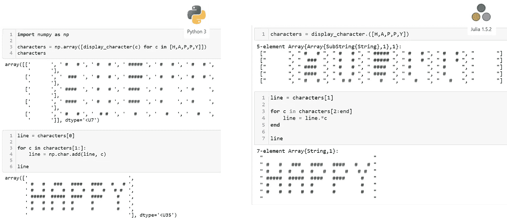

> **数组索引**
> 
> 请记住 **Python** 索引从`0`开始，而 **Julia** 索引从 1 开始。 **Python** 数组索引从`0`运行到`length-1`，而 **Julia** 数组索引从`1`运行到`length` 。在 **Python** 中，数组最后一个元素的索引可以被给定为`-1`，在 Julia 中你可以用`end` 来表示。茱莉亚也用`begin` 来表示第一个元素。
> 
> **使用** `**in**` **关键字**
> 
> Python 和 Julia 都支持`in`关键字在`for`循环中遍历数组。它还可以用于确定检查数组中是否存在给定的元素。例如，表达式`'A' in ['A', 'B', 'C']`应该返回 true。

同一显示行中的字符由像素行连接，使得每个显示行存储为 7 个元素的数组，每个元素包含一个像素行。 **Python** 函数`np.char.add(line, character)`用于这一行的连接，在 **Julia** 中，这是使用向量形式的字符串连接操作符(`.*`)来完成的

## 任务 3:打印消息行

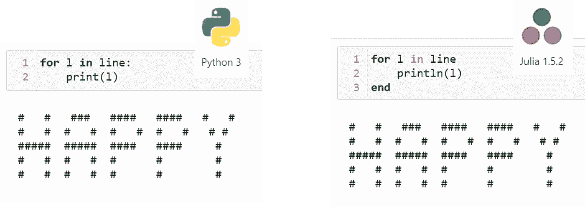

## 任务 4:给打印的消息行添加颜色

> **给控制台输出添加颜色**
> 
> **Python** `coloram`一个库可以用来设置打印在控制台上的字符串的颜色。在 **Julia** ，`Crayons`中，有一个包可以用来生成有颜色和样式的字符串。
> 
> **朱莉娅中的符号**
> 
> 字符的`:`用于创建代表颜色的`Symbol`(如`:blue, :green, :red`)。你可以从 Julia 文档中了解更多信息。

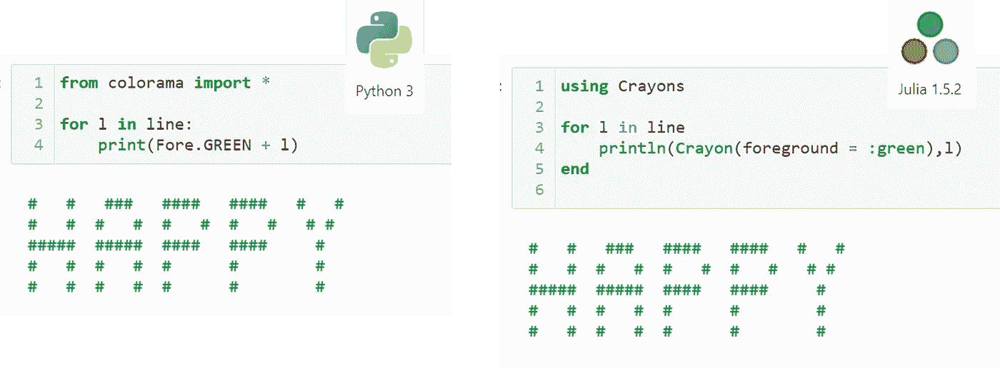

## 任务 5:创建一个打印给定字符行的函数(结合任务 2–4 中的代码)

创建自定义函数来自动化重复性任务在编程中有很多好处。它可以通过使代码简洁来增加代码的可读性，并增加代码内部和外部部分的可重用性。如果您正在为一个在代码中重复应用的任务编写代码行，那么为该任务创建一个函数是一个很好的做法。

我们之前创建了一个函数`display_character()`来将字符设计输入字符串转换为显示网格模式。我们可以创建另一个函数来组合多个字符的显示行。

## 任务 6:收集问候信息

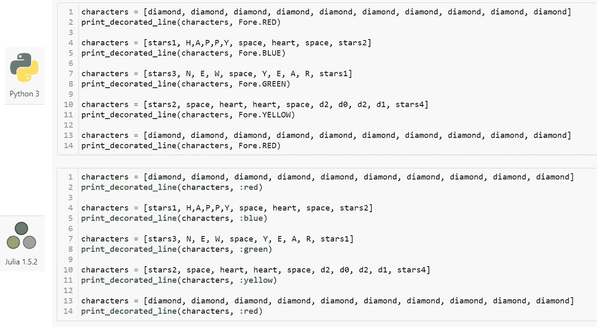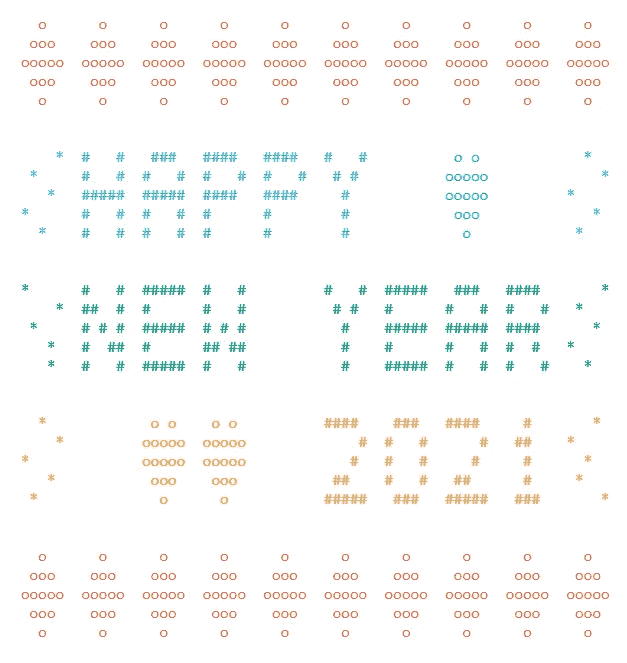

Jupyter 笔记本中的输出(图片由作者提供)

# 下一步是什么？

如果你完成了以上 6 项任务，恭喜你！您已经使用 Python 和 Julia 构建了一个以编程方式生成的新年祝福。

你也可以在输出中加入你自己的创意，例如改变颜色，边框装饰，开始和形状，为字符行中的文本行分配不同的颜色，添加一些动画，等等。

# 完整的代码

**Python**

**朱丽娅**

这些笔记本也可以通过下面的链接从 GitHub 下载。

*   [Python 笔记本](https://github.com/sptennak/ComputingIsFun/blob/master/HolidayGreetings/HappyNewYear2021_Python.ipynb)
*   [朱丽亚笔记本](https://github.com/sptennak/ComputingIsFun/blob/master/HolidayGreetings/HappyNewYear2021_Julia.ipynb)

即使这个练习是使用 Python 和 Julia 完成的，您也可以使用您最喜欢的编程语言，利用相同的概念和逻辑来尝试。

# 放弃

*本文所表达的观点和意见为作者个人观点和意见，不代表雇主或与作者相关的其他机构的观点和意见。本文是旨在解决社区数据素养问题的更广泛出版物的一部分。作者投入了大量的精力来研究所讨论的主题，简化技术术语以增加对内容的理解，查找相关参考资料以确保所呈现事实的有效性。欢迎讨论、批评、不同的想法和建议。*

# 参考

*   [Python 3 文档](https://docs.python.org/3/)。检索到 2021 年 1 月 1 日。
*   [Python Colorama 库，用于产生彩色终端文本和光标定位](https://github.com/tartley/colorama)。检索到 2021 年 1 月 1 日。
*   [Numpy](https://numpy.org) 。检索到 2021 年 1 月 1 日。
*   [Julia 1.5 文档](https://docs.julialang.org/en/v1/)。检索到 2021 年 1 月 1 日。
*   [Julia Crayons.jl 用于终端的彩色和样式字符串。](https://github.com/KristofferC/Crayons.jl)检索到 2021 年 1 月 1 日。