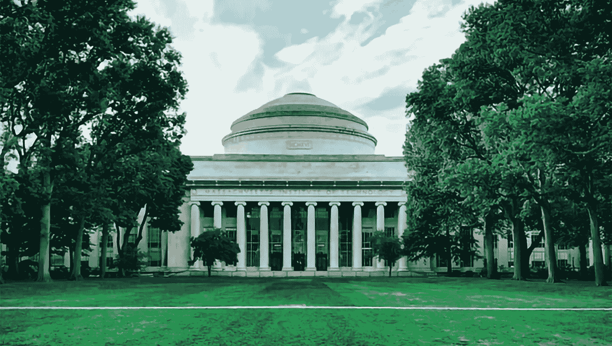
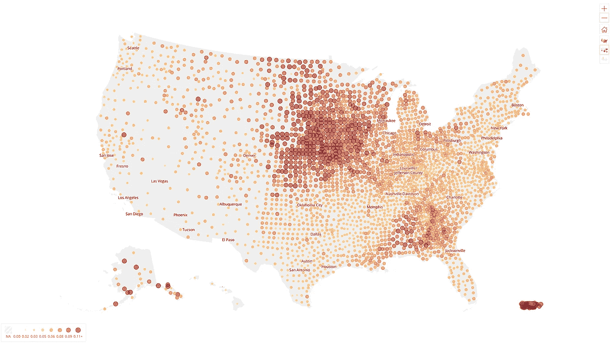
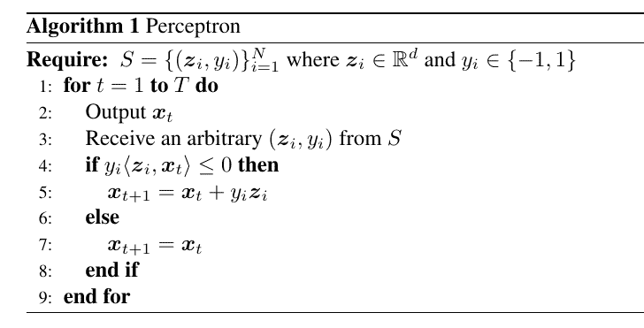
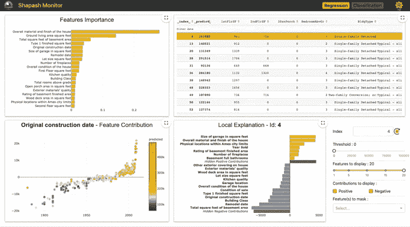
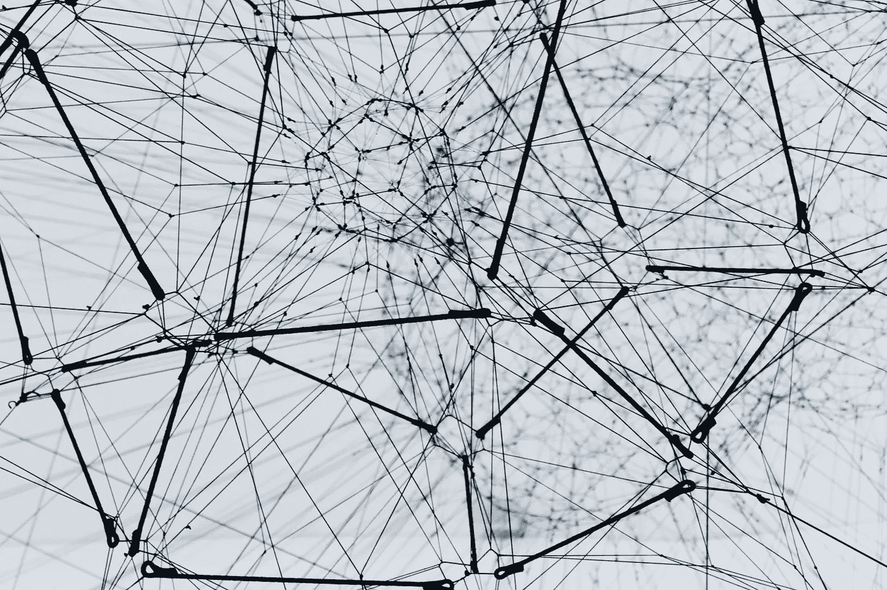
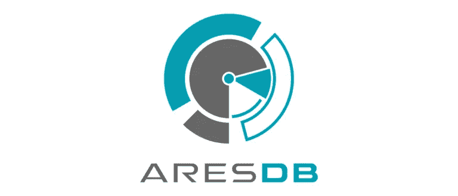
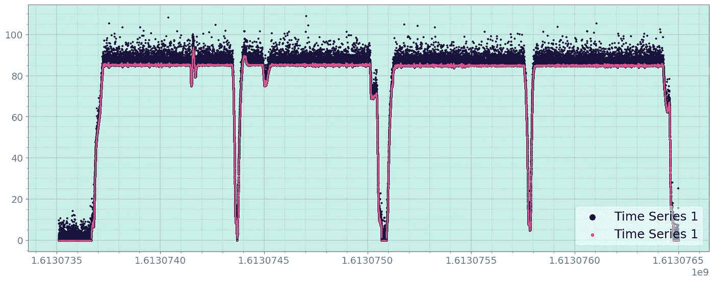
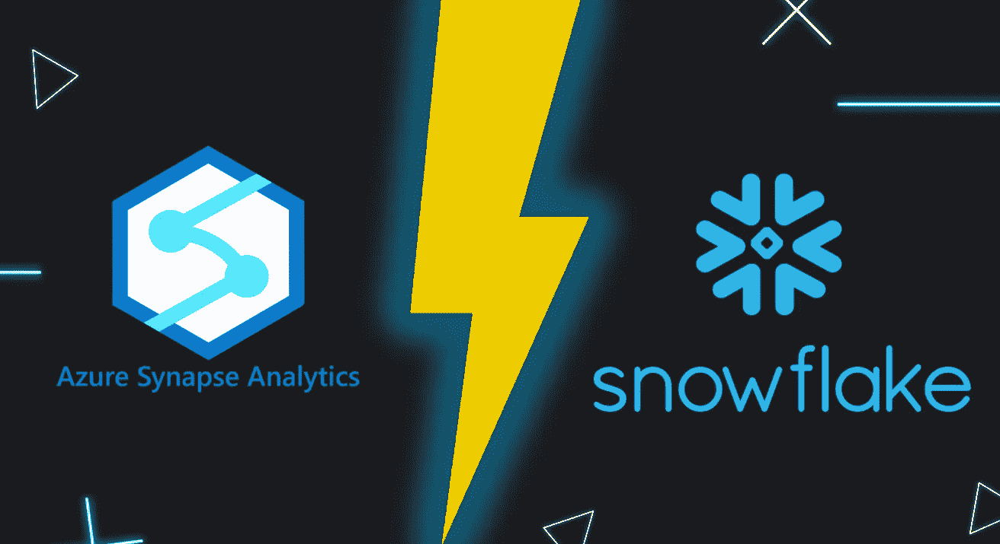
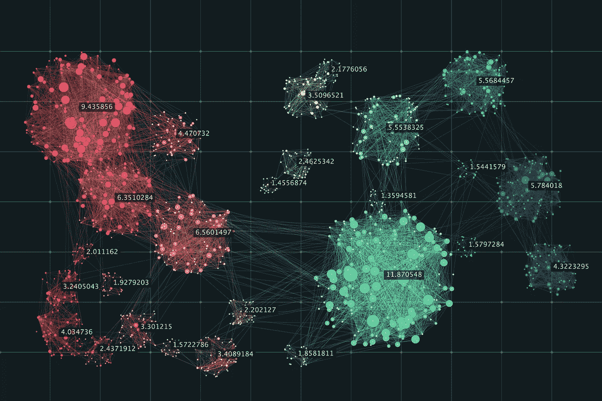
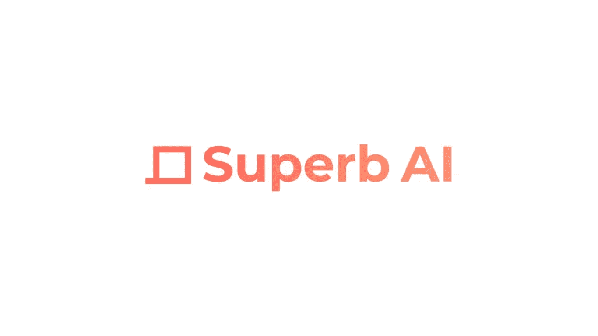

# 直接从麻省理工学院免费学习最先进的深度学习！

> 原文：<https://pub.towardsai.net/learn-state-of-the-art-deep-learning-directly-from-mit-for-free-and-more-11902f00ff25?source=collection_archive---------0----------------------->

## [**新闻**](https://towardsai.net/p/category/news) ， [**通迅**](https://towardsai.net/p/category/newsletter)

## 人工智能新闻，研究和更新，一个令人兴奋的免费访问的最先进的人工智能[数据管理平台](https://ws.towardsai.net/superbai)，以及我们的每月编辑精选！

***如果你阅读这封邮件有困难，请在*** [***网络浏览器***](https://ws.towardsai.net/m21) ***上查看。***

欢迎回来，向着艾家人！距离我们上次发送简讯已经有一段时间了。在本期节目中，我们将为您带来一些我们认为您会喜欢的令人兴奋的美食。先来看看这个由 [**Kunal Marwaha**](https://kunalmarwaha.com/) 打造的优秀的 [**NLP app**](https://marwahaha.github.io/arxiv-wordcloud/?author=Geoffrey%20Hinton) 从 arXiv abstracts 制作单词云(根据我们的测试，非常准确！).

收集、标注和交付高质量的数据集可能会花费您数周甚至数月的时间。借助 [**高超的人工智能**](https://ws.towardsai.net/superbai) ，用一个小的地面真实数据集在一个小时内训练我们的迁移学习自动标记模型，**在几分钟内批量标记大规模数据集，审核质量，并在几天内完成交付！你还在等什么？ [**免费报名**](https://ws.towardsai.net/superbai) **。****

我们最近用 Python 推出了我们的 [**书**](https://news.towardsai.net/descriptive-statistics) 上的 [**描述性统计**](https://gumroad.com/l/descriptive-statistics) 。如果你还没看完，这篇 [**文章**](https://news.towardsai.net/descriptive-statistics-book-sample) 或者这篇 [**PDF**](https://github.com/towardsai/tutorials/blob/master/descriptive-statistics/descriptive-statistics-pdf-book-sample.pdf) 提供了本书前 36 页的样本。请不要忘记，成为**会员，你就可以接触到这部作品、更多的书籍和其他好东西。**

**接下来，如果你目前对攻读机器学习 或相关领域的 [**博士学位感兴趣，我们建议查看卡耐基梅隆大学**](https://news.towardsai.net/mlphd)****机器学习**的这篇 [**文章**](https://mktg.best/7iwbb) ，它强调了你应该考虑向未来的博士导师询问哪些问题，以尽可能地满足你的研究兴趣。********

数据集的哪些属性推动了建模创新？斯坦福大学教授 Percy Liang 的这个演讲强调了用两种新颖的方法驯服深度模型并塑造它们的发展。

变压器网络已经彻底改变了 NLP 的面貌，这篇由[**sales force Research**](https://mktg.best/el28u)**撰写 [Cameron Wolfe](https://medium.com/u/28aa6026c553?source=post_page-----11902f00ff25--------------------------------) 撰写的精彩文章讨论了他们可以做些什么来改进图形神经建模。**

**现在进入月度精选！我们根据读者、粉丝和某篇文章的浏览量来挑选这些文章。我们希望你和我们一样喜欢阅读它们。此外，我们开始做一些新的东西！我们将选出我们表现最好的文章，我们的编辑将选择几篇表现不突出的文章，但由于它们的质量，它们进入了本月的名单。**

**如果可以，请将 [**简讯**](https://ws.towardsai.net/m21) 或我们的 [**订阅链接**](https://ws.towardsai.net/subscribe) 分享给你的朋友、同事、熟人。每月一封电子邮件；随时退订！**如果您对我们如何改进有任何反馈，请随时通过** [**告诉我们**](https://app.joinpalette.com/t/amas/n1PYGbcbPthObD71gGCq) **。****

# **📚编辑选择每月精选文章↓📚**

****

## **[数据科学家和机器学习工程师的机器学习面试终极指南](https://mktg.best/dr3sr)作者[艾玛·丁](https://medium.com/u/1b25d5393c4f?source=post_page-----11902f00ff25--------------------------------)和[林子恒](https://medium.com/u/8023b63e51e9?source=post_page-----11902f00ff25--------------------------------)**

**互联网上充斥着前 10 名、前 20 名甚至前 200 名的机器学习面试问题，涵盖了从偏差与方差到深度神经网络的许多概念。虽然掌握这些概念对于赢得机器学习面试很重要，但当你只准备解决这些问题时，你可能会感到准备不足，并经常在面试中措手不及。事实是，机器学习面试比仅仅是基本机器学习概念的问答更全面。机器学习面试评估候选人使用机器学习方法与团队合作解决复杂现实世界问题的能力。**

****[**阅读更多**](https://mktg.best/dr3sr)****

************

## ******[麻省理工学院新深度学习课程非常适合初学者的 3 个理由](https://mktg.best/7qwru)作者 [Ahmar Shah 博士(牛津)](https://medium.com/u/58425acb757a?source=post_page-----11902f00ff25--------------------------------)******

******就在我们说话的时候，这个课程正在发布。这是麻省理工的《深度学习导论》(MIT 6。S191)，现在已经是第五个年头了。这是一个为期两周的强化课程，介绍了主题，并深入到相当多的细节，包括基础和应用。麻省理工学院非常慷慨地将所有资料免费放在网上供任何人学习。2021 年版现在向更广泛的公众发布。 第一场讲座只在…******

********[**阅读更多**](https://mktg.best/7qwru)********

************

## ******[K-最近邻(KNN)算法教程——机器学习基础](https://news.towardsai.net/knn)作者[苏扬·希罗](https://medium.com/u/92b9872c24de?source=post_page-----11902f00ff25--------------------------------)、[胡斯纳](https://medium.com/u/15780a1fe600?source=post_page-----11902f00ff25--------------------------------)萨耶迪、罗伯托·伊里翁多******

******k 近邻算法，俗称 KNN 算法，是一种简单而有效的分类和回归监督 [**机器学习算法**](https://news.towardsai.net/mla) 。这篇文章将涵盖 KNN 算法，它的应用，优缺点，它背后的数学，以及它在 Python 中的实现。请务必在 [**Google Colab**](https://colab.research.google.com/drive/1MI6EBfMRZTneiymgezTVUvz6xfOGZozy?usp=sharing) 或[**Github**](https://github.com/towardsai/tutorials/tree/master/k-nearest-neighbors)**上查看本教程的全部实现，以帮助您阅读。********

********[**阅读更多**](https://news.towardsai.net/knn)********

************

## ******感知机不是 SGD:通过伪梯度的更好解释******

******有一种流行的解释，将感知器解释为随机(次)梯度下降过程。我甚至在网上找到了这个想法的幻灯片。想到这么多年轻人的思想被这些错误的主张扭曲，我实在无法忍受。所以，我觉得有必要写一篇博文来解释为什么这是错误的…此外，我还会给出一个不同的(我认为)更好的感知器算法的解释。******

********[**阅读更多**](https://towardsai.net/p/machine-learning/perceptron-is-not-sgd-a-better-interpretation-through-pseudogradients)********

************

## ******[在你的 iPhone 上部署一个 Python 机器学习模型](https://mktg.best/7v0ki)作者 [Patrick Long](https://medium.com/u/bd0bff93b38f?source=post_page-----11902f00ff25--------------------------------)******

******本文描述了从训练 python 机器学习模型到可以在 iPhone 上部署的概念验证 iOS 应用程序的最短路径。我们的目标是提供基本的搭建，同时为适合特定用例的进一步定制留出空间。本着简单的精神，我们将忽略一些任务，比如模型验证和构建一个完美的用户界面(UI)。本教程结束时，您将拥有一个在 iOS 上运行的经过训练的模型，您可以将其作为原型展示并加载到您的设备上…******

********[**阅读更多**](https://mktg.best/7v0ki)********

************

## ******沙帕什:让每个人都能理解 ML 模型作者[扬·戈伦](https://medium.com/u/d07c4f7496af?source=post_page-----11902f00ff25--------------------------------)******

******[**Shapash**](https://github.com/MAIF/shapash)by[**MAIF**](https://www.maif.fr/)是一个 Python 工具包，方便数据科学家理解机器学习模型。这使得与非数据专家(业务分析师、经理、最终用户)共享和讨论模型的可解释性变得更加容易。具体来说，Shapash 提供了易于阅读的可视化和一个 web 应用程序…******

******[**阅读更多**](https://mktg.best/eigha)******

************

## ******[如何建造用于传感器监控的普罗米修斯出口器](https://mktg.best/fimu2)作者[纪尧姆·文森特](https://medium.com/u/9c301642b4c4?source=post_page-----11902f00ff25--------------------------------)******

******在本文中，我们将在 Raspberry Pi 上设置 DHT22/AM2302 传感器。该传感器连接到 GPIO 引脚，并报告温度和湿度数据。我们将看到如何将其连接到 Raspberry Pi 并确认数据采集。将我们所有的指标集中在一个地方不是更好吗？好吧，我们用戈朗语给普罗米修斯出口商编码。Prometheus 是一个使用时间序列数据库进行监控和报警的开源项目…******

********[**阅读更多**](https://mktg.best/fimu2)********

************

## ******[机器学习工程师和数据科学家必备的 Chrome 扩展](https://mktg.best/1uyb7)作者 [Himanshu Ragtah](https://medium.com/u/e66e5ad0ea0d?source=post_page-----11902f00ff25--------------------------------)******

******浏览器扩展是大多数黑客和开发者保持更高生产力的秘密武器。由于很大一部分机器学习者使用 chrome ( [**鉴于 chrome 的巨大市场份额**](https://www.w3counter.com/globalstats.php) )，我为机器学习工程师和数据科学家编制了一份必备的 chrome 扩展列表。******

******[**阅读更多**](https://mktg.best/1uyb7)******

************

## ******[NLP 使用深度学习教程:理解激活函数](https://mktg.best/2133e)作者 [Abdelkader Rhouati](https://medium.com/u/ae277075d392?source=post_page-----11902f00ff25--------------------------------)******

******本文是我正在撰写的系列文章的第一篇，在这里我将尝试解决在 NLP 中使用深度学习的主题。首先，我正在写一篇关于使用感知器进行文本分类的例子的文章，但我认为最好先复习一些基础知识，如激活和损失函数…******

********[**阅读更多**](https://mktg.best/2133e)********

************

## ******[由](https://mktg.best/nrdj9) [Amit Chauhan](https://medium.com/u/502d63083812?source=post_page-----11902f00ff25--------------------------------) 用 Python 全面讲解 SVM 分类******

******在本文中，我们将讨论分类问题中最常用的机器学习算法。支持向量机(SVM)算法用于****分类、******异常值检测*** 。决策点或支持向量分隔超线或超平面。 ***支持向量*** 是在最近的不同类点之间提供最大间隔的样本点。这种分离…*******

*******[**阅读更多**](https://mktg.best/nrdj9)*******

**************

## *******[优步 AresDB 是由](https://mktg.best/zdyk8) [Jesus Rodriguez](https://medium.com/u/46674a2c9422?source=post_page-----11902f00ff25--------------------------------) 开发的用于大规模分析工作负载的开源、基于 GPU 的数据库*******

*******优步是开源数据科学基础设施和框架的最大贡献者之一。从像 [**Horovod**](https://github.com/uber/horovod) 或 [**Pyro**](http://pyro.ai/) 这样的机器学习框架到像[**【M3】**](https://github.com/m3db)这样的时序基础设施，优步工程团队在开源不同的堆栈方面一直非常活跃，这些堆栈是优步数据科学管道的关键构建模块。本周早些时候，优步推出了另一项超级酷的技术，以实现现代分析解决方案。 [**AresDB**](https://github.com/uber/aresdb) 是一个数据库和运行时，用于大规模可扩展的实时分析工作负载。*******

*******[**阅读更多**](https://mktg.best/zdyk8)*******

**************

## *******[遗传算法——停止过度拟合交易策略](https://mktg.best/0fucm)作者[路易·陈](https://medium.com/u/6d585e26760a?source=post_page-----11902f00ff25--------------------------------)*******

*******在以前的博客中，我们已经讨论过遗传算法如何优化交易策略的参数，因此在给定合适的适应度/成本函数的情况下，优化任何非线性函数的参数。可以说，我们还没有触及的最重要的部分是，我们如何确保 GA 是合适的，而不是过度合适的。*******

*********[**阅读更多**](https://mktg.best/0fucm)*********

**************

## *******[由](https://mktg.best/oyrj0) [Rahul Bhadani](https://medium.com/u/5d4d67138803?source=post_page-----11902f00ff25--------------------------------) 寻找两个时间序列之间的时移以获得最大相关性*******

*******一些工程和科学应用处理时间序列数据。例如，在自动驾驶中，几个增强的车载传感器收集关于速度、加速度、燃料使用等信息。，以时间序列数据的形式。通常，从多个传感器收集同类信息，涉及一些传感器融合，以围绕收集的数据集建立可信度…*******

*********[**阅读更多**](https://mktg.best/oyrj0)*********

**************

## *******[如何通过](https://mktg.best/cvxve) [Chetan Ambi](https://medium.com/u/e21a9c4ed934?source=post_page-----11902f00ff25--------------------------------) 使用 MongoDB 存储和检索 ML 模型*******

*******如果你正在寻找一个数据库来存储你的机器学习模型，这篇文章是给你的。你可以使用 **MongoDB** 来存储和检索你的机器学习模型。不多说了，让我们直奔主题吧。MongoDB 是一个病毒 NoSQL 数据库。在 MongoDB 中，数据以类似 JSON 的文档形式存储。更具体地说，文档存储在一个 BSON 对象中，这个对象只是用…表示的二进制数据*******

*******[**阅读更多**](https://mktg.best/cvxve)*******

**************

## *******[微软 Azure Synapse 分析工作区与雪花数据云](https://mktg.best/losg1)作者 [Karthikeyan Siva Baskaran](https://medium.com/u/dbfbd40186a6?source=post_page-----11902f00ff25--------------------------------)*******

*******作为数字化转型的一部分，组织开始转向数据驱动的业务决策。为了建立数据驱动的文化，数据移动对于检索可操作的见解至关重要。随着数据激增，有必要构建一个企业数据仓库或数据湖，以便在此基础上进行分析。为了创建企业数据的单一真实来源，企业往往更加关注在一个可以随着数据量增长而扩展的强大平台上存储和管理数据。*******

*********[**阅读更多**](https://mktg.best/losg1)*********

**************

## *******[由](https://mktg.best/1keg9) [Haris Angelidakis](https://medium.com/u/9f6b465f0ec0?source=post_page-----11902f00ff25--------------------------------) 提出的用于数据汇总的简单且可扩展的聚类算法*******

*******在大数据时代，设计以有意义的方式总结数百万个数据点的高效程序的需求比以往任何时候都更加迫切。最成功的方法之一是 [**无监督学习框架**](https://en.wikipedia.org/wiki/Unsupervised_learning) 中的 [**聚类**](https://en.wikipedia.org/wiki/Cluster_analysis) 。粗略地说，假设点与点之间有某种距离的概念来捕捉两点的相似性或不相似性，那么聚类算法的目标如下…*******

*******[**阅读更多**](https://mktg.best/1keg9)*******

******* [## 店铺↓ |走向 AI

### 发布最好的技术、科学和工程|社论→https://towardsai.net/p/editorial |订阅→…

ws.towardsai.net](https://ws.towardsai.net/shop)  [## 加入我们吧↓ |面向人工智能成员|数据驱动的社区

### 向着 AI 加入。通过成为会员，你不仅将支持人工智能，但你将有机会…

members.towardsai.net](https://members.towardsai.net/) 

**🙏感谢您成为** [**订阅者**](https://towardsai.net/subscribe) **与** [**同向艾**](https://towardsai.net/) **！🙏**

*关注我们↓*

*****】|***[***推特***](https://twitter.com/towards_ai?lang=en)***|***[***insta gram***](https://www.instagram.com/towards_ai/)***|*****

***********