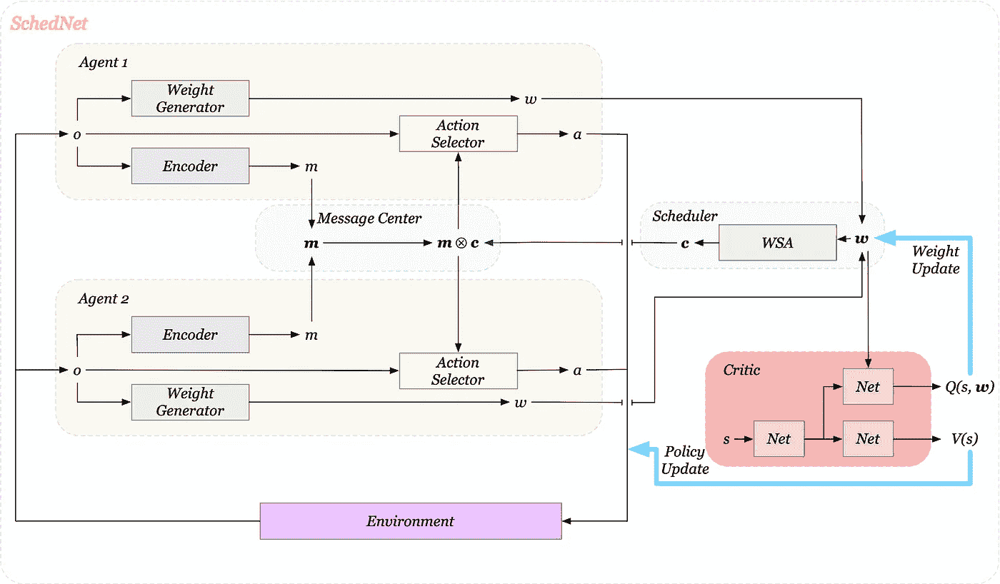
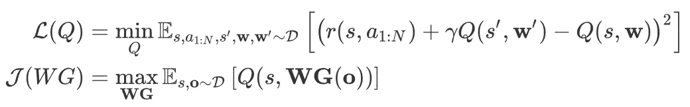
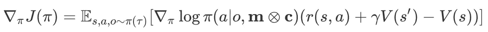
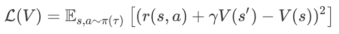

# 学习安排合作代理之间的通信

> 原文：<https://pub.towardsai.net/learn-to-schedule-communication-between-cooperative-agents-9141ebbb4ac7?source=collection_archive---------0----------------------->

## 一种新的多代理环境下的通信调度体系结构

帕万·特里库塔姆在 [Unsplash](https://unsplash.com/s/photos/communication?utm_source=unsplash&utm_medium=referral&utm_content=creditCopyText) 上的照片

# 介绍

在多智能体环境中，加速协调效果的一种方法是使多个智能体能够以分布式方式相互通信，并表现为一个群体。在本文中，我们讨论了一个多智能体强化学习框架，称为 SchedNet，由 Kim 等人在 2019 年 ICLR 会议上提出，智能体在其中学习如何安排通信，如何对消息进行编码，以及如何对收到的消息采取行动。

# 问题设置

我们考虑多智能体场景，其中手边的任务是合作性质的，智能体位于部分可观察的环境中。我们将这样的场景公式化为一个多代理人的顺序决策问题，这样所有代理人都有一个共同的目标，即最大化相同的折扣奖励。由于我们依靠一种方法来调度代理之间的通信，因此我们对媒体访问施加了两个限制:

1.  带宽限制:代理每次只能向介质传递 *L* 位消息。
2.  竞争约束:代理共享通信媒介，因此只有 *n* 个代理中的 *K* 个可以广播它们的消息。

我们现在使用 DEC-POMDP(分散的部分可观察马尔可夫决策过程)来形式化 MARL，DEC-POMDP 是 MDP 的一种推广，允许不能观察全局状态的多个代理进行分布式控制。我们通过元组 *< S，a，r，p，𝛺，o，𝛾 >* 来描述 DEC-POMDP，其中:

*   *s ∈ S* 是环境状态，对代理不可用
*   *aᵢ ∈ A* 和 *oᵢ ∈ 𝛺* 是代理人 *i ∈ N* 的动作和观察
*   ⨉a^n 是所有代理共享的奖励功能
*   *P:S* ⨉ *A^N → S* 是过渡函数
*   *O: S ⨉ N → 𝛺* 是发射/观测概率
*   𝛾表示贴现因子

# SchedNet

## 概观

图 1 具有两个代理的 ScheduleNet 架构。每个代理都有自己的观察和网络，不与他人共享。我们使用粗体字体来突出多个代理的集合符号

在深入细节之前，我们首先快速浏览一下架构(图 1 ),对这里发生的事情有个大概的了解。在每个时间步，每个代理接收其观察值，并将该观察值传递给权重生成器和编码器，以分别产生权重值 *w* 和消息 *m* 。所有的权重值然后被传送到一个*中央调度器*，该调度器确定哪些代理的消息被安排通过一个调度向量 ***c*** *=[cᵢ]ₙ，cᵢ* ∈{0，1}来广播。*消息中心*将所有消息连同调度向量 ***c*** 一起聚集，然后将选定的消息广播给所有代理。最后，每个代理根据这些消息和他们自己的观察采取行动。

正如我们接下来将看到的，SchedNet 通过 critic 训练它的所有组件，遵循分散训练和分布式执行框架。

# 重量发生器

让我们从重量发生器开始。权重生成器将观察结果作为输入，并输出权重值，然后调度器使用该权重值来调度消息。我们通过最大化动作值函数 *Q(s，****w****)*来训练权重生成器。为了更好地理解这里发生的事情，让我们把权重生成器看作一个确定性的策略网络，将除了批评家之外的所有其他部分吸收到环境中。那么权重生成器和评论家将形成一个 DDPG 结构。在这个设置中，权重生成器负责回答这个问题:“从现在开始，我生成什么权重可以最大化环境回报？”。因此，我们有以下目标

权重生成器的目标，我们使用粗体字体突出显示多个代理的集合符号，如图 1 所示。

区分 *s* 与 *o* 至关重要； *s* 是环境状态，而 *o* 是从各个智能体的角度进行的观察。

# 调度程序

当我们描述问题设置时，在交流过程中有两个限制。带宽限制 *L* 可以通过限制消息 *m* 的大小来轻松实现。我们现在把重点放在调度部分上。

调度器采用一种简单的基于权重的算法，称为 WSA(Weight-based Scheduling Algorithm ),来选择 *K* 代理。我们考虑了文件中的两个建议

1.  *Top(k):* 根据权重值选择 top *k* 药剂
2.  *Softmax(k)* :根据每个代理 *i* 的权重值计算 Softmax 值，然后根据这个 softmax 值随机选择 *k* 个代理

WSA 模块输出一个调度向量 ***c*** *=[cᵢ]ₙ，cᵢ* ∈{0，1}，其中每个 *cᵢ* 确定代理的消息是否被调度广播。

# 消息编码器、消息中心和动作选择器

消息编码器对观察结果进行编码，以产生消息 *m* 。消息中心汇总所有消息 ***m*** ，并根据 ***c*** 选择广播哪些消息。得到的消息***m****⊗****c***是所有选定消息的拼接。例如，如果**=【000，010，111】*和****c****=【101】*，最后要广播的消息是***m******c***=【000】然后，每个代理的动作选择器根据这个消息及其观察结果选择一个动作。****

**我们通过一个基于策略的算法训练消息编码器和动作选择器，在 critic 中使用状态值函数 *V(s)* 。其目标的梯度是**

****

**其中，𝜋表示编码器和选择器的集合网络，而 *V* 按照以下目标进行训练**

****

# **讨论**

## **两种不同的训练程序？**

**Kim 等人使用不同的方法但使用相同的数据源来训练权重生成器和动作选择器。具体来说，它们使用确定性策略梯度算法(非策略方法)训练权重生成器，同时使用随机策略梯度算法(策略方法)训练动作选择器。这在实践中可能是有问题的，因为随机策略梯度方法在用偏离策略的数据进行训练时可能会发散。官方的实现使用一个小的转换重放缓冲区来改善这个问题，但是，这可能会损害策略上的性能。**

**我们可以通过重新参数化 critic 来绕过这个问题，这样它将状态 *s* 和动作 *a₁、*、 *…* 作为输入，并输出相应的 *Q* 值。这样，我们让两人都接受了非政策方法的训练。另一个可以想到的方法是，如果坚持随机政策梯度方法，将训练过程与环境相互作用分开。注意，简单地分离策略训练是不够的，因为权重生成器的更新可能改变环境状态分布。**

# **参考**

**金大宇，文尚宇，霍斯塔莱罗·大卫，万菊康，李泰永，孙京万和李勇。2019."在多代理强化学习中学习安排通信." *ICLR* ，1–17。**