# 跟我学:数据科学的线性代数—第 3 部分:特征向量

> 原文：<https://pub.towardsai.net/learn-with-me-linear-algebra-for-data-science-part-3-eigenvectors-8d9277bae0d3?source=collection_archive---------3----------------------->

我知道你在想什么，特征向量到底是什么？这真的是一个词吗？

来源:照片由[本·怀特](https://unsplash.com/@benwhitephotography?utm_source=unsplash&utm_medium=referral&utm_content=creditCopyText)在 [Unsplash](https://unsplash.com/s/photos/confused?utm_source=unsplash&utm_medium=referral&utm_content=creditCopyText) 拍摄

是的，他们是真实的。它们对数据科学中的某些操作也非常有帮助。如果您阅读了本系列的第 2 部分，您将会知道我鼓励您开始将矩阵视为执行线性变换的一种手段。一种常见的思考方式是通过经典的 **Ax = b** 例子，其中矩阵 **A** 将输入向量 **x** 转换为输出向量 **b** 。

## 那么，什么是特征向量？

一个特征向量可能通过一个例子得到最好的解释。让我们从一个矩阵 A 和一个向量 x 开始:

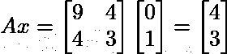

来源:图片由作者生成

对于那些读过本系列前面部分的人来说，上面的点积将是小菜一碟！矩阵 A 将向量 x 转换成具有值`[4, 3]`的新向量 b。我们来直观的看一下这种转变。

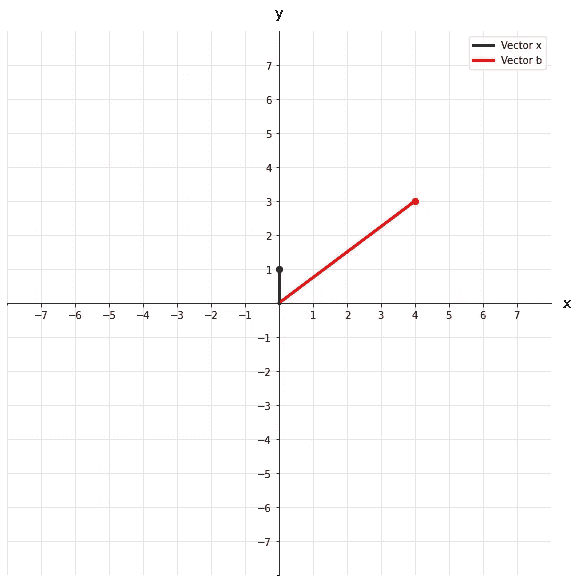

来源:图片由作者生成

我们可以将这种变换描述为原始向量 x 的旋转和拉伸。我们可以更进一步，用一个圆来表示一个向量场。想象这个圆上的每个点都是一个以原点为起点的矢量的顶点。现在我们可以看到所有不同的向量是如何作为矩阵 a 的结果进行变换的。

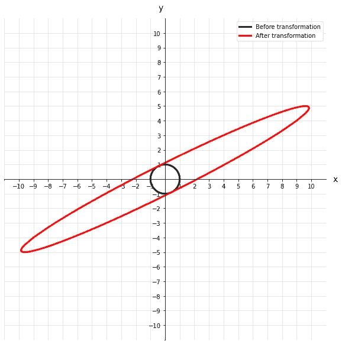

来源:图片由作者生成

如你所见，原来的圆被旋转并拉长了不少。如果我们把圆上的这些点想象成向量，那么对它们来说也是一样的。但是如果有一个向量在变换过程中没有旋转呢？我们怎么找到它？更好的是，我们为什么要关心它？

这就是特征向量，在线性变换中不旋转的向量，只缩放。在形式上，我们可以将其表示为:

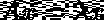

来源:图片由作者生成

其中λ(λ)被称为特征值。它只是一个标量，告诉我们，在线性变换后，特征向量缩短或延长了多少。一个矩阵可能有一些特征值，也可能没有(一个矩阵要有任何特征向量，首先，它必须是一个方阵)，但这些特征向量中的每一个都有一个相应的特征值，告诉我们有关缩放的信息。

继续我们上面的例子，让我们看看矩阵 A 的特征向量和特征值是什么样子的。

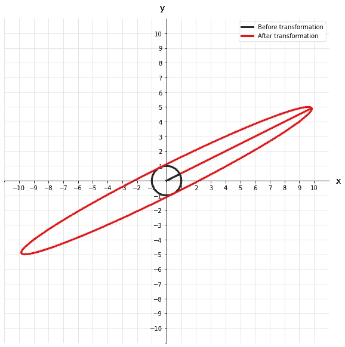

来源:图片由作者生成

我们可以看到，变换前后，本征向量并没有旋转离开它原来的轴。这个特征向量的特征值也是 11，这在直觉上是有意义的，因为变换后的向量看起来大约长了 11 倍。

## 计算特征向量

如果您只想知道执行什么 Python 代码来返回特征值和特征向量，那么您可以:

`eig_vals, eig_vecs = np.linalg.eig(A)`

对于你们中更好奇的人，我们将介绍如何手动获得特征值和向量。我将在数学之前说，出于实际原因，您可能永远不会这样做，但是理解 NumPy 函数下发生的事情真的很好。

让我们回到我们最初的特征向量和特征值的数学形式。

来源:图片由作者生成

我们要做的第一件事是添加一个单位矩阵。这些矩阵不会改变什么(它们相当于将一个数乘以 1)，但它们简化了计算。我们的新等式变成:

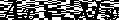

来源:图片由作者生成

让我们把所有的东西都放在一边，因为所有的东西都等于零会让人兴奋！我们还将排除一个 x，因为这将是一个共性。

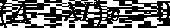

来源:图片由作者生成

现在，我们将理所当然地认为括号中的项导致了一个不可逆的矩阵。在这一点上，似乎没有太多其他选择。然而，结果矩阵不可逆的事实告诉我们一些非常重要的事情。括号内各项的行列式也必须等于 0。那就是:

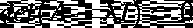

来源:图片由作者生成

接下来，我们将使用原始 A 矩阵计算括号内的矩阵:

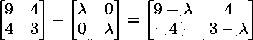

来源:图片由作者生成

一旦我们有了那个矩阵，我们就可以着手求解它的行列式。对于相对简单的 2x2 矩阵，我不建议对任何更大的矩阵进行手动尝试。在这种情况下，它只是(左上*右下)——(左下*右上)。这就产生了一个方程，我们可以对其进行因式分解，以找到我们的**特征值**:

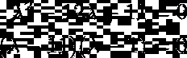

来源:图片由作者生成

到目前为止，一切看起来都很好，我们得到了与 Python 相同的特征值。但是工作还没有完成，我们需要用我们的特征值来计算我们的特征向量。使用我们到目前为止定义的内容，让我们填写特征向量的标准方程:

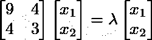

来源:图片由作者生成

我们现在实际上有了一个特征值，可以作为上述方程的输入。使用 11，我们将得到如下的方程组:

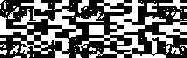

来源:图片由作者生成

这些都是非常简单的方程，它们都可以通过下式求解:

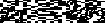

来源:图片由作者生成

所以任何满足上述标准的点集都会落在我们的特征向量上。现在你知道了，你已经计算了矩阵 a 的特征值和特征向量。但是，还有一个主要问题迫在眉睫…

谁在乎呢？

来源:[马太·亨利](https://unsplash.com/@matthewhenry?utm_source=unsplash&utm_medium=referral&utm_content=creditCopyText)在 [Unsplash](https://unsplash.com/s/photos/bored?utm_source=unsplash&utm_medium=referral&utm_content=creditCopyText) 上的照片

这一切的目的是什么？我听到你说。好吧，信不信由你，这在数据科学中确实有它的位置。我们将简要讨论特征值和特征向量的一个主要应用。

**主成分分析**

你可能听说过也可能没有听说过主成分分析。这可能是数据科学中最常用的降维技术。它用于减少表示一个系统所需的数据量，同时尽可能多地保留信息。PCA 有效地获取协方差矩阵的特征向量，并返回所谓的主分量。我们将在本系列的后面部分更深入地讨论 PCA，但是现在，只要知道它有多重要就行了！

## 结论

希望您喜欢线性代数系列的另一部分，如果您在阅读本文时有任何不确定之处，请务必查看[第 1 部分](https://matthew-macias.medium.com/learn-with-me-linear-algebra-for-data-science-part-1-802164c3eac9)和[第 2 部分](https://matthew-macias.medium.com/learn-with-me-linear-algebra-for-data-science-part-2-9a3b75b8b80d)。到目前为止，我们已经打下了非常好的基础，我们将开始进入线性代数的更多实际应用，如 PCA 和奇异值分解(SVD)。