# 跟我学:数据科学的线性代数—第 4 部分:奇异值分解

> 原文：<https://pub.towardsai.net/learn-with-me-linear-algebra-for-data-science-part-4-singular-value-decomposition-763c88143560?source=collection_archive---------1----------------------->

欢迎来到线性代数系列的下一部分！我们将讨论奇异值分解及其在数据科学中的巨大作用。这篇文章将比前一篇更具技术性，但这仅仅是因为我们在打好基础之后，将触及一些更高级的主题。别担心，你之前所学的一切都是为这一刻做准备的！

**SVD 简介**

我知道，这个名字听起来很吓人，让人不知所措。


每当有人提到奇异值分解。米歇尔·特雷瑟默在 [Unsplash](https://unsplash.com/s/photos/scared-dog?utm_source=unsplash&utm_medium=referral&utm_content=creditCopyText) 上的照片

但是我向您保证，在本文完成时，您将对 SVD 及其在数据科学中的应用有很好的理解。让我们从示例矩阵 A 开始:

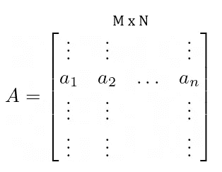

来源:图片由作者生成。

奇异值分解允许我们把矩阵 A 表示成其他三个矩阵的乘积。它由下式给出:

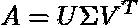

来源:图片由作者生成。

如果我们扩展上述内容的表示，它看起来会像这样:

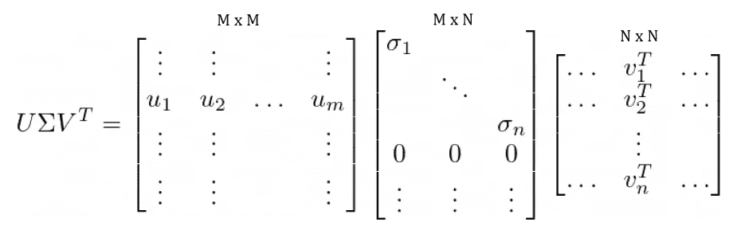

来源:图片由作者生成。

好吧，这有很多需要理解的。但是我们很快就会发现这一切意味着什么，并对它所代表的东西有一种直觉。在此之前，让我们讨论一些基础知识。

我们的输入矩阵 A 是一个`M x N`矩阵。我们可以看到，U 呈现出`M x M`的形状，σ(适马)呈现出`M x N`的形状，V 是`N x N`的形状。这乍一看可能有点奇怪，但在下一节，我们将发现这些矩阵的形状是如何形成的。现在，只要注意它们。也许要讨论的最重要的事情是 U，σ和 V 是什么类型的矩阵。

u 和 V 就是所谓的正交矩阵(对于那些读过本系列第 1 部分的读者来说，你会知道正交意味着什么)。标准正交矩阵就是其列相互正交的矩阵，每个列向量的长度为 1。由标准正交矩阵产生的最有趣的性质是它们的转置是它们的逆矩阵。也就是说:

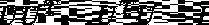

来源:图片由作者生成。

虽然这现在看起来并不重要，但这些矩阵以这种方式运行的事实使得 SVD 如此有用。最后，σ是一个对角矩阵，它包含沿对角轴的“奇异值”,所有其他项为零。作为对角线，σ不受转置操作的影响，这在以后也会派上用场。

最后一个介绍部分是理解所有这些矩阵都是按照重要性排序的。也就是说σ中的第一个奇异值比第二个重要，第二个比第三个等重要。等等。对于 U 和 V 也是如此，其中第一个向量最为重要，因为它们对应于最高的奇异值。

**那么，U，σ，V 实际上代表什么呢？**

如果我告诉你，我们的朋友，本征向量和本征值，要回到聚会上，会怎么样？


等待 eigenfriends 返回。照片由 Pexels 上的[戴安娜](https://www.pexels.com/@diana-42038108/)拍摄

这将开始有点抽象，但请相信我！让我们从可以在下面创建的列相关矩阵开始:

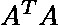

来源:图片由作者生成。

现在，我们之前已经概述过，我们可以将任何矩阵分解为三个矩阵 U、σ和 v 的乘积，因此，首先让我们用分解后的矩阵替换所有原始矩阵。这将为我们提供以下信息:

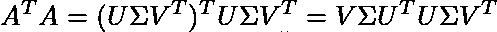

来源:图片由作者生成。

假设矩阵 u 是正交的，那么 U^T U 正好抵消了单位矩阵，因此我们剩下下面的:

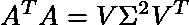

来源:图片由作者生成

以上实际上是特征分解的形式。其中 V 包含特征向量，σ包含特征值。那么我在这里得到的更大的观点是什么呢？

v 实际上捕获这个列相关矩阵的特征向量，σ捕获那个相关矩阵的特征值。这是有意义的，因为 V 在两个维度上都呈现出列数的形状。因此，如果输入矩阵 A 有 10 列，V 将是一个 10 乘 10 的矩阵。

*我们已经讲了 V 和σ，那么 U 呢？*

我们可以通过与上面完全相同的逻辑来揭示矩阵 U 包含什么。因为 V 是列相关矩阵的特征向量，U 是行相关矩阵的特征向量，表示为:

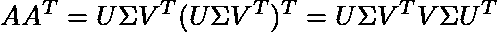

来源:图片由作者生成。

同样，V 是一个标准正交矩阵，所以它乘以它的转置矩阵取消了单位矩阵，我们只剩下:

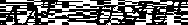

来源:图片由作者生成。

其中 U 包含本征向量，σ包含本征值(与我们之前发现的本征值相同，很酷，对吧？).所有这些都是为了让你对 SVD 中的 U、σ和 V 矩阵有一个直观的认识。总结成一句话，U 包含行相关矩阵的特征向量，σ包含特征值，V 包含列相关矩阵的特征向量。

一般来说，你永远不会通过对相关矩阵进行特征分解来计算 SVD。相关矩阵可能变得非常大，尤其是 U，因此需要大量的计算来导出它们。计算 SVD 的一种流行方法是 QR 分解，这是 NumPy 实现的基础。

**矩阵逼近**

我们可以开始考虑奇异值分解的另一种方式是，它将原始矩阵分解成秩为 1 的矩阵之和(我们花那么多时间来理解矩阵秩是有原因的，查看[第 2 部分](https://matthew-macias.medium.com/learn-with-me-linear-algebra-for-data-science-part-2-9a3b75b8b80d)了解更多信息)。让我们看看我们最初的例子:

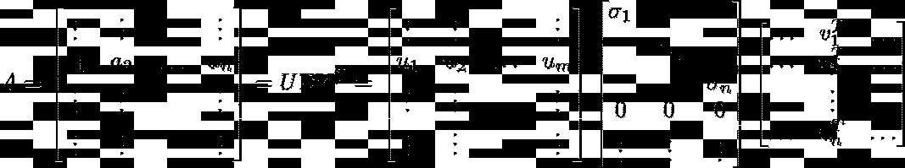

来源:图片由作者生成。

如果我们将右侧的 U、σ和 V 矩阵相乘，您会看到我们会得到以下结果:

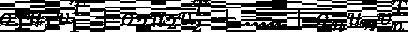

来源:图片由作者生成。

U 的第一列向量乘以σ中的第一个奇异值以及 v 中的第一行向量，您可以对 U、σ和 v 的所有组合继续执行此操作。

请记住，U、σ和 V 中的元素按重要性排序，因此第一个元素比第二个元素更重要，依此类推。等。这允许我们只保留每个矩阵的第一个 *r* 元素，以创建我们的原始矩阵的秩 *r* 最佳近似。这导致 U 变成 m x *r* ，σ变成 *r* x *r，*V 变成 *r* x *n* 。

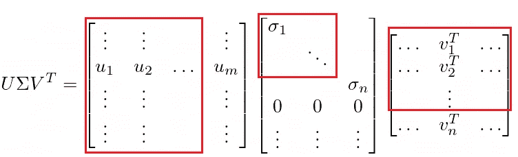

从 r+1 开始移除条目后的矩阵。来源:图片由作者生成。

通过这样做，我们最终得到一个更小的矩阵，它仍然可以相对精确地描述原始矩阵 A。您可以开始看到 SVD 在降维技术中是如何有用的了！

**伪反转**

也许奇异值分解在数据科学中最有用的应用是它对非方阵求逆的能力。在这一点上，我们熟悉线性方程组的以下表示:

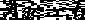

来源:图片由作者生成。

我们知道，为了能够求解这个系统，其中 A 是一个已知的数据矩阵，b 是一个已知的标签向量，我们必须对矩阵 A 求逆，到目前为止，我们只是假设使用传统方法是可行的。然而，如果矩阵是非正方形的(很可能总是这样)，那么这将不起作用。奇异值分解引入了一种方法，允许我们对这些非方阵求逆并求解线性系统。

你可能会注意到这里有一点趋势，但我们还是会用奇异值分解代替矩阵 A。

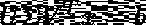

来源:图片由作者生成。

现在，我们需要做一些事情来解决 *x* 的问题。它们依赖于我们对 U、σ、**、T5 和 v 的组成的理解。我们可以通过执行以下操作来隔离 *x* :**

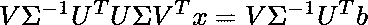

来源:图片由作者生成。

因为 U 和 V 是正交的，我们可以乘以它们的转置来消除它们。对于σ，我们仍然需要乘以它的传统倒数。你可以看到除了 x 之外的所有东西都会在左边取消。我们剩下的是:

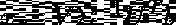

来源:图片由作者生成。

你会注意到我们已经颠倒了 SVD 的所有组件。这就是众所周知的伪逆，它为所有非方阵求逆提供动力！它更正式地表示为:

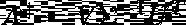

来源:图片由作者生成。

到目前为止，我们已经介绍了 SVD 在数据科学中的主要用例，但让我们最终进入精彩部分…

**我们如何在 Python 中计算 SVD？**

首先，让我们创建一个随机矩阵进行实验:

```
import numpy as npA = np.random.rand(80,40)
```

这就创建了一个 80 行 40 列的矩阵。要使用 SVD 分解这个矩阵，我们需要执行:

```
U, S, V = np.linalg.svd(A, full_matrices=True)
```

就是这样。任务完成。让我们进一步研究一下，以确保我们之前讨论的理论是正确的。我们确定 U 基于行相关矩阵，因此应该采用行数 x 行数的形式。当我们跑步时:

```
>>> U.shape
(80,80)
```

您将看到它返回的形状是`(80,80)`，这正是我们所期望的。让我们重复σ和 v。

```
>>> S.shape
(40,)>>> V.shape
(40,40)
```

所以 V 通过了，但是σ发生了什么？我骗你了吗？不，NumPy 返回的奇异值是一个向量。我们可以以更传统的形式重新创建σ，但它有点复杂。

```
>>> sigma = np.zeros(A.shape, S.dtype)
>>> sigma.shape
(80,40)>>> np.fill_diagonal(sigma, S)
```

实际上，我们创建了一个与输入矩阵形状相同的矩阵，并沿着对角线添加了奇异值。最后，让我们用 U，σ和 v 来重构原始 A 矩阵。

```
>>> A_new = np.dot(U[:, :40] * S, V)
```

您会注意到，我们必须减小 U 的大小来完成重建，但这可以通过在原始 SVD 函数中设置`full_matrices=False`来避免。

## **结论**

这是数据科学系列线性代数的另一部分。希望所有的部分都开始合二为一，您可以看到您对线性代数的新理解将在您的数据科学之旅中发挥多么强大的作用。接下来，我们将最终报道 PCA(我知道你们都兴奋得发抖)。和往常一样，如果您还没有对数据科学的线性代数有一个扎实的了解，我建议您查看本系列的其他部分([第 1 部分](https://matthew-macias.medium.com/learn-with-me-linear-algebra-for-data-science-part-1-802164c3eac9)、[第 2 部分](https://matthew-macias.medium.com/learn-with-me-linear-algebra-for-data-science-part-2-9a3b75b8b80d)、[第 3 部分](/learn-with-me-linear-algebra-for-data-science-part-3-eigenvectors-8d9277bae0d3))。

如果你有问题或者只是想保持联系，请随时通过 [Linkedin](https://www.linkedin.com/in/matthew-macias-8b2328121/) 联系我。