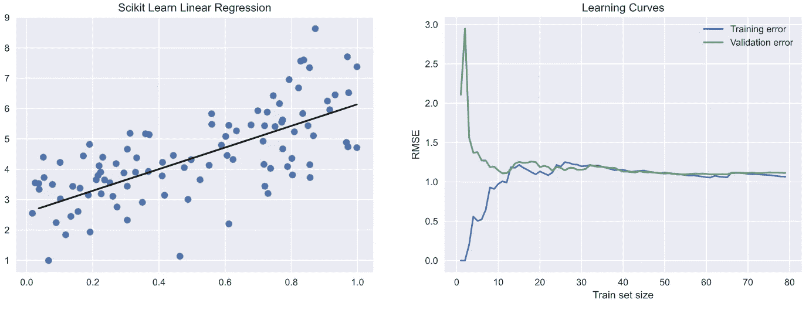
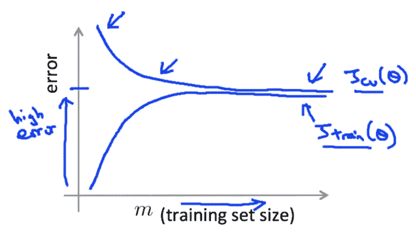
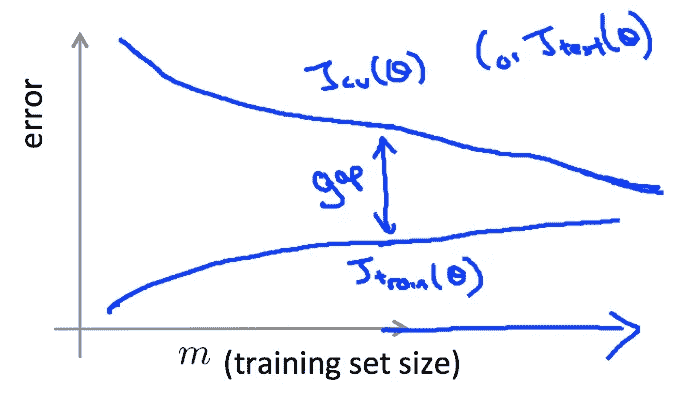

# 学习曲线有什么帮助？

> 原文：<https://pub.towardsai.net/learning-curves-d6cfb49908f0?source=collection_archive---------3----------------------->

## [机器学习](https://towardsai.net/p/category/machine-learning)

## 以正确的方式评估机器学习模型


由[艾萨克·史密斯](https://unsplash.com/@isaacmsmith?utm_source=medium&utm_medium=referral)在 [Unsplash](https://unsplash.com?utm_source=medium&utm_medium=referral) 上拍摄的照片

## **学习曲线有助于分析机器学习模型在训练数据集的各种样本大小上的性能。**

> 为了理解学习曲线，很好地理解偏差-方差权衡是很重要的。你可以看看我的文章。

[](https://nvsyashwanth.github.io/machinelearningmaster/bias-variance/) [## 偏差-方差

### "避免过拟合和欠拟合的错误."

nvsyashwanth.github.io](https://nvsyashwanth.github.io/machinelearningmaster/bias-variance/) 

# 评估模型

> “评估模型时始终绘制学习曲线”

好的，我们知道的基本情况是，如果一个模型在训练数据上表现很好，但泛化能力很差，那么这个模型就是**过度拟合**。如果它在这两方面都表现不佳，那么它就是**欠匹配。**

超参数的设置必须使偏差和方差尽可能低。

## 学习曲线有什么帮助？

> “学习曲线是模型在训练集和验证集上的性能图，是训练数据集的不同样本的函数。”

具体来说，学习曲线在 y 轴上显示训练和验证分数，在 x 轴上显示训练数据集的不同样本。

培训和验证分数可以是任何评估指标，如 MSE、RMSE 等。在你的训练和验证集上。

学习曲线可用于理解模型的偏差和方差误差。

## 了解学习曲线

让我们生成一些随机数据，为其拟合一个线性回归模型，并绘制用于评估模型的学习曲线。

```
from sklearn.linear_model import LinearRegression
from sklearn.model_selection import train_test_split
from sklearn.metrics import mean_squared_error as mse
import numpy as np
import seaborn as sns
import matplotlib.pyplot as plt
plt.style.use('seaborn')
X = 1 * np.random.rand(100, 1)
y = 3 +  3* X + np.random.randn(100, 1)
X_train,X_val,y_train,y_val=train_test_split(X,y,test_size=0.2)
regressor=LinearRegression()
regressor.fit(X_train,y_train)
predictions=regressor.predict(X_val)plt.figure(1,figsize=(15,5))
plt.subplot(121)
plt.scatter(X,y)
plt.plot(X_val,predictions,color='black')
plt.title('Scikit Learn Linear Regression')train_errors=[]
val_errors=[]
plt.subplot(122)
for i in range(1,len(X_train)):
    regressor.fit(X_train[:i],y_train[:i])
    train_preds=regressor.predict(X_train[:i])
    val_preds=regressor.predict(X_val)
    train_errors.append(mse(train_preds,y_train[:i]))
    val_errors.append(mse(val_preds,y_val))
plt.plot(range(1,len(X_train)),np.sqrt(train_errors),label='Training error')
plt.plot(range(1,len(X_train)),np.sqrt(val_errors),label='Validation error')
plt.title('Learning Curves')    
plt.xlabel('Train set size')
plt.ylabel('RMSE')
plt.legend()
plt.show()
```

看看上面代码的输出:



左:回归线；右图:学习曲线。图片由作者提供。

好吧，图像不错。但意义何在？一开始可能看起来太多了。看一看下面的步骤来理解代码和图像。

1.  我们生成了随机数据(X，y)。
2.  从相同的派生出训练和验证数据集。
3.  使用 Scikit Learn 的 LinearRegression 类为我们的数据拟合一条线，这就是左边的图像所要表达的内容。
4.  然后，我们以与上面相同的方式拟合模型，但是这一次，我们针对训练样本大小 1 ->整个训练数据集大小来拟合模型。
5.  对于我们训练集的每个样本大小，我们对我们选择的训练样本大小和整个验证数据集进行预测。
6.  我们计算 RMSE(均方根误差),并将其存储起来，以便以后绘图。搞定了。

我们可以看到训练和验证分数集中在一个特定的点。如右图所示，第一个收敛点 w.r.t x 轴大约是训练样本大小 10。这意味着，超过这一点，模型将不会从增加训练样本大小中受益。考虑 y 轴，会聚点大约是 RMSE 值 1。现在，这是没问题的，而且这个模型似乎可以很好地概括。

但是，举个例子，y 轴对应的收敛点的值很高(如下图所示)。这表明该模型存在高偏差。这意味着训练和验证误差很高，模型不会从增加训练样本大小中受益，从而导致拟合不足。



学习曲线。偏高。来源:[吴恩达的 ML 课程](https://www.coursera.org/learn/machine-learning?utm_source=gg&utm_medium=sem&utm_content=07-StanfordML-IN&campaignid=1950458127&adgroupid=69480953983&device=c&keyword=study%20machine%20learning%20online&matchtype=b&network=g&devicemodel=&adpostion=&creativeid=351281535285&hide_mobile_promo&gclid=Cj0KCQjw7sz6BRDYARIsAPHzrNLkyWNF7MP321zRu0AVtBO6DPIqjMDX53EZpmr3ITLSxO_tFxk9xLcaAmQ4EALw_wcB)。

另一方面，如果没有可见的收敛点(如下图所示)，这表明模型具有较高的方差和较少的数据。也就是说，验证误差可能非常高，模型会过度拟合。



学习曲线。高方差。来源:[吴恩达的 ML 课程](https://www.coursera.org/learn/machine-learning?utm_source=gg&utm_medium=sem&utm_content=07-StanfordML-IN&campaignid=1950458127&adgroupid=69480953983&device=c&keyword=study%20machine%20learning%20online&matchtype=b&network=g&devicemodel=&adpostion=&creativeid=351281535285&hide_mobile_promo&gclid=Cj0KCQjw7sz6BRDYARIsAPHzrNLkyWNF7MP321zRu0AVtBO6DPIqjMDX53EZpmr3ITLSxO_tFxk9xLcaAmQ4EALw_wcB)。

## 如何提高模型性能？

在高偏差的情况下，增加特征的数量，或者减小正则化参数，从而增加模型的复杂性。

在高方差的情况下，减少特征的数量，或者增加正则化参数，从而降低模型复杂度。要填补空白，只需增加你拥有的数据(而不是特性)。

# 结论

始终绘制学习曲线。对学习曲线有一个很好的理解有助于你评估你的模型和分析偏差-方差问题。希望你明白学习曲线的重要性。下一场见。

**原载于**[**machine learning master**](https://nvsyashwanth.github.io/machinelearningmaster/learning-curves/)**。**

> 嘿，如果你喜欢这篇文章，请点击拍手按钮，分享这篇文章，以示你的支持。关注我，获取更多关于机器学习、深度学习和数据科学的文章。下一场见！

# 在网络上找到我

[**博客**:机器学习大师](https://nvsyashwanth.github.io/machinelearningmaster/)

[**GitHub 简介:**这是我分叉的地方](https://github.com/NvsYashwanth)

[**LinkedIn 简介:**联系和分享职业动态](https://www.linkedin.com/in/nvsyashwanth/)

[**推特:**分享科技推特](https://twitter.com/YashwanthNvs)

# 谢谢你