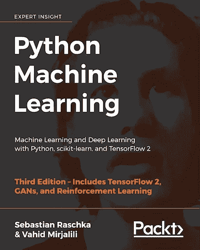

# 学习数据科学从未如此简单

> 原文：<https://pub.towardsai.net/learning-data-science-has-never-been-easier-918cf809c343?source=collection_archive---------0----------------------->

Benjamin O. Tayo 的图片

## [数据科学](https://towardsai.net/p/category/data-science)，[教育](https://towardsai.net/p/category/education)

## 在现代信息技术时代，有大量的免费资源用于数据科学自学

# 一.导言

在本文中，我将讨论几个可以帮助您掌握数据科学基础的资源。在现代信息技术时代，有大量的免费资源用于数据科学自学。事实上，您可以从无数可用资源中设计自己的数据科学课程。

# 二。数据科学自学资源

## 1.大规模开放在线课程(MOOCs)

对数据科学从业者不断增长的需求导致了大规模开放在线课程(MOOC)的激增。最受欢迎的 MOOC 提供商包括:

一)**EDX**:[https://www.edx.org/](https://www.edx.org/)

b)**Coursera**:[https://www.coursera.org/](https://www.coursera.org/)

c) **数据营**:[https://www.datacamp.com/](https://www.datacamp.com/)

d) **乌迪米**:[https://www.udemy.com/](https://www.udemy.com/)

e) **乌达城**:[https://www.udacity.com/](https://www.udacity.com/)

林达:[https://www.lynda.com/](https://www.lynda.com/)

如果你打算参加这些课程中的一门，请记住，有些 MOOCs 是 100%免费的，而有些则需要你支付订阅费(每门课程可能从 50 美元到 200 美元不等，甚至更多，因平台而异)。请记住，获得任何学科的专业知识都需要大量的时间和精力。所以不要着急。确保如果你决定注册一门课程，你应该准备好完成整个课程，包括所有的作业和家庭作业。一些测验和家庭作业将会很有挑战性。然而，请记住，如果你不挑战自己，你将无法增长你的知识和技能。

我自己已经完成了这么多数据科学 MOOCs，下面是我最喜欢的 3 个数据科学专业。

(一) [**数据科学专业证书**](https://www.edx.org/professional-certificate/harvardx-data-science) **(HarvardX，直通 edX)**

包括以下课程，全部使用 R 教授(您可以免费旁听课程或购买认证证书):

1.  数据科学:R 基础；
2.  数据科学:可视化；
3.  数据科学:概率；
4.  数据科学:推理和建模；
5.  数据科学:生产力工具；
6.  数据科学:扯皮；
7.  数据科学:线性回归；
8.  数据科学:机器学习；
9.  数据科学:顶点

(二) [**分析:基本工具和方法**](https://www.edx.org/micromasters/gtx-analytics-essential-tools-and-methods) **(Georgia TechX，through edX)**

包括以下课程，全部使用 R、Python 和 SQL 讲授(您可以免费审计或购买经过验证的证书):

1.  分析建模导论；
2.  数据分析计算导论:
3.  商业数据分析。

(三) [**应用数据科学与 Python 专业化**](https://www.coursera.org/specializations/data-science-python) **(密歇根大学，通过 Coursera)**

包括以下课程，全部使用 python 教授(您可以免费旁听大多数课程，有些课程需要购买认证证书):

1.  Python 中的数据科学导论；
2.  应用 Python 绘图、制图和数据表示；
3.  Python 中的应用机器学习；
4.  Python 中文本挖掘的应用:
5.  Python 中的应用社会网络分析。

## 2.从教科书中学习

从教科书中学习提供了比你从在线课程中获得的更精炼和更深入的知识。这本书对数据科学和机器学习提供了很好的介绍，代码包括:**“Python 机器学习”，作者 Sebastian Raschka** 。[https://github . com/rasbt/python-machine-learning-book-第三版](https://github.com/rasbt/python-machine-learning-book-3rd-edition)

作者以一种非常容易理解的方式解释了机器学习的基本概念。此外，代码也包括在内，因此您实际上可以使用提供的代码来练习和构建您自己的模型。我个人认为这本书在我作为数据科学家的旅程中非常有用。我会向任何数据科学爱好者推荐这本书。你所需要的是基本的线性代数和编程技能，以便能够理解这本书。

还有许多其他优秀的数据科学教科书，如韦斯·麦金尼的《 [Python for Data Analysis](https://sushilapalwe.files.wordpress.com/2018/04/python-for-data-analytics-book.pdf) 》、库恩·约翰逊的《[应用预测建模](https://vuquangnguyen2016.files.wordpress.com/2018/03/applied-predictive-modeling-max-kuhn-kjell-johnson_1518.pdf)》、伊恩·h·威滕的《[数据挖掘:实用机器学习工具和技术](https://www.wi.hs-wismar.de/~cleve/vorl/projects/dm/ss13/HierarClustern/Literatur/WittenFrank-DM-3rd.pdf)》、艾贝·弗兰克&马克·a·霍尔的《数据挖掘:实用机器学习工具和技术》等等。

## 3.中等

[Medium](https://medium.com/) 现在被认为是增长最快的数据科学学习平台之一。如果您有兴趣使用该平台进行数据科学自学，第一步将是创建一个中型帐户。您可以创建一个免费帐户或会员帐户。对于免费帐户，每月可以访问的会员文章数量是有限制的。会员账户需要 5 美元或 50 美元/年的月订阅费。从这里了解更多关于成为中等会员的信息:[**https://medium.com/membership**](https://medium.com/membership)。有了会员帐号，你将可以无限制地访问媒体文章和出版物。

媒体上排名前两位的数据科学出版物是面向数据科学的**和面向人工智能的**。每天都有新的文章发表在 medium 上，涵盖数据科学、机器学习、数据可视化、编程、人工智能等主题。使用 medium 网站上的搜索工具，您可以访问如此多的文章和教程，涵盖了从基本概念到高级概念的各种数据科学主题。****

## ****4.KDnuggets 网站****

****KDnuggets 是人工智能、分析、大数据、数据挖掘、数据科学和机器学习方面的领先网站。在该网站上，您可以找到数据科学方面的重要教育工具和资源以及职业发展工具:****

*   ****[博客/新闻](https://www.kdnuggets.com/news/index.html)****
*   ****[意见](https://www.kdnuggets.com/opinions/index.html)****
*   ****[教程](https://www.kdnuggets.com/tutorials/index.html)****
*   ****[头条新闻](https://www.kdnuggets.com/news/top-stories.html)****
*   ****[公司](https://www.kdnuggets.com/companies/index.html)****
*   ****[课程](https://www.kdnuggets.com/courses/index.html)****
*   ****[数据集](https://www.kdnuggets.com/datasets/index.html)****
*   ****[教育](https://www.kdnuggets.com/education/index.html)****
*   ****[事件(在线)](https://www.kdnuggets.com/meetings/index.html)****
*   ****[工作岗位](https://www.kdnuggets.com/jobs/index.html)****
*   ****[软件](https://www.kdnuggets.com/software/index.html)****
*   ****[网络研讨会](https://www.kdnuggets.com/webcasts/index.html)****

## ****5.开源代码库****

****GitHub 包含几个关于数据科学和机器学习的教程和项目。除了作为数据科学教育的优秀资源，GitHub 还是一个优秀的项目组合构建平台。有关在 GitHub 上创建数据科学作品集的更多信息，请参见以下文章:[数据科学作品集比简历更有价值。](https://towardsdatascience.com/a-data-science-portfolio-is-more-valuable-than-a-resume-2d031d6ce518)****

## ****6.商务化人际关系网****

****由于技术创新和新算法的发展，数据科学是一个不断发展的领域，因此保持现状的一种方法是加入数据科学专业人士网络。LinkedIn 是一个极好的社交平台。LinkedIn 上有几个数据科学小组和组织，你可以加入，例如，oriented AI、DataScienceHub、oriented data science、KDnuggets 等。你也可以在这个平台上关注该领域的顶级领导者。****

## ****7.油管（国外视频网站）****

****YouTube 包含几个教育视频和教程，可以教你数据科学所需的基本数学和编程技能，以及几个面向初学者的数据科学教程。一个简单的搜索就会产生几个视频教程和讲座。****

## ****8.可汗学院****

****Khan academy 也是一个学习数据科学所需的基本数学、统计学、微积分和线性代数技能的好网站。****

# ****三。数据科学入门自学课程示例****

****既然我们已经讨论了数据科学教育的多种资源，那么如果您正在考虑数据科学，自然会问以下问题:****

*******从哪里开始你的旅程？*******

*******选什么课程，按什么顺序？*******

****这些问题的答案因人而异。一般来说，具有定量背景(如物理、数学、工程、计算机科学或会计)的个人具有优势，因为他们拥有数据科学所需的必要数学技能。****

****如果您是数据科学新手，下面提供了自学的推荐课程。这些是您需要完成的基本主题，以便能够胜任数据科学方面的工作。****

## ****1.数学基础****

******(一)多变量微积分******

****大多数机器学习模型是用具有几个特征或预测器的数据集构建的。因此，熟悉多变量微积分对于建立机器学习模型极其重要。以下是您需要熟悉的主题:****

*   ****多元函数****
*   ****导数和梯度****
*   ****阶跃函数、Sigmoid 函数、Logit 函数、ReLU(校正线性单位)函数****
*   ****价值函数****
*   ****功能绘图****
*   ****函数的最小值和最大值****

******(二)线性代数******

****线性代数是机器学习中最重要的数学技能。数据集被表示为矩阵。线性代数用于数据预处理、数据转换和模型评估。以下是您需要熟悉的主题:****

*   ****向量****
*   ****矩阵****
*   ****矩阵的转置****
*   ****矩阵的逆矩阵****
*   ****矩阵的行列式****
*   ****点积****
*   ****本征值****
*   ****特征向量****

******(三)优化方法******

****大多数机器学习算法通过最小化目标函数来执行预测建模，从而学习为了获得预测标签而必须应用于测试数据的权重。以下是您需要熟悉的主题:****

*   ****成本函数/目标函数****
*   ****似然函数****
*   ****误差函数****
*   ****梯度下降算法及其变体(例如，随机梯度下降算法)****

## ****资源:YouTube 可汗学院****

## ****2.编程基础****

****Python 和 R 被认为是数据科学的顶级编程语言。你可能会决定只专注于一种语言。Python 被行业和学术培训项目广泛采用。作为初学者，建议你只专注于一门语言。****

****下面是一些需要掌握的 Python 和 R 基础知识主题:****

*   ****基本 R 语法****
*   ****基本的 R 编程概念，如数据类型、矢量算法、索引和数据框架****
*   ****如何在 R 中执行操作，包括排序、使用 dplyr 处理数据以及使用 ggplot2 进行数据可视化****
*   ****r 工作室****
*   ****Python 的面向对象编程方面****
*   ****Jupyter 笔记本****
*   ****能够使用 Python 库，如 NumPy、pylab、seaborn、matplotlib、pandas、scikit-learn、TensorFlow、PyTorch****

## ****资源:堆栈溢出、代码学院、Medium、YouTube****

## ****3.数据基础****

****学习如何操作各种格式的数据，例如 CSV 文件、pdf 文件、文本文件等。了解如何从互联网上清理数据、估算数据、缩放数据、导入和导出数据以及废弃数据。一些感兴趣的包有 pandas、NumPy、pdf tools、stringr 等。此外，R 和 Python 包含几个内置的数据集，可以用于实践。学习数据转换和降维技术，如协方差矩阵图、主成分分析(PCA)和线性判别分析(LDA)。****

## ******资源:**data camp；Coursera****

## ****4.概率和统计基础****

****统计和概率用于特征的可视化、数据预处理、特征转换、数据插补、降维、特征工程、模型评估等。以下是您需要熟悉的主题:****

*   ****平均****
*   ****中位数****
*   ****方式****
*   ****标准偏差/方差****
*   ****相关系数和协方差矩阵****
*   ****概率分布(二项式、泊松、正态)****
*   ****p 值****
*   ****Baye 定理(精确度、召回率、阳性预测值、阴性预测值、混淆矩阵、ROC 曲线)****
*   ****A/B 测试****
*   ****蒙特 卡罗模拟****

## ****资源:YouTube，可汗学院，edX，Coursera，DataCamp****

## ****5.数据可视化基础****

****了解良好的数据可视化的基本组件。一个好的数据可视化由几个组件组成，这些组件必须组合在一起才能产生最终产品:****

****a) **数据组件**:决定如何可视化数据的第一个重要步骤是了解数据的类型，例如，分类数据、离散数据、连续数据、时间序列数据等。****

****b) **几何组件:**您可以在这里决定哪种可视化适合您的数据，例如散点图、线形图、条形图、直方图、Q-Q 图、平滑密度、箱线图、配对图、热图等。****

****c) **映射组件:**这里，你需要决定用什么变量作为你的 x 变量，用什么变量作为你的 y 变量。这一点非常重要，尤其是当数据集是包含多个要素的多维数据集时。****

****d) **秤组件:**在这里，您决定使用哪种秤，例如线性秤、对数秤等。****

****e) **标签组件:**这包括轴标签、标题、图例、使用的字体大小等。****

****f) **道德成分**:在这里，你要确保你的可视化讲述真实的故事。在清理、汇总、操作和生成数据可视化时，您需要意识到您的行为，并确保您没有使用您的可视化来误导或操纵您的受众。****

****重要的数据可视化工具有 Python 的 matplotlib 和 seaborn 包，R 的 ggplot2 包。****

## ****资源:edX，Coursera，DataCamp，Medium****

## ****6.线性回归基础****

****学习简单和多元线性回归分析的基础。线性回归用于具有连续结果的监督学习。下面给出了一些执行线性回归的工具:****

****Python: NumPy，pylab，sci-kit-learn****

****r:插入符号包****

## ****资源:edX，Coursera，DataCamp，Medium****

## ****7.机器学习基础****

******a)监督学习(连续变量预测)******

*   ****基本回归****
*   ****多元回归分析****
*   ****正则回归****

******b)监督学习(离散变量预测)******

*   ****逻辑回归分类器****
*   ****支持向量机(SVM)分类器****
*   ****k 近邻(KNN)分类器****
*   ****决策树分类器****
*   ****随机森林分类器****
*   ****朴素贝叶斯****

******c)无监督学习******

*   ****Kmeans 聚类算法****

****用于机器学习的 Python 工具:Scikit-learn，Pytorch，TensorFlow。****

******资源:DataCamp，edX，Coursera，Medium******

## ****8.时间序列分析基础****

****在结果依赖于时间的情况下，用于预测模型，例如预测股票价格。有 3 种分析时间序列数据的基本方法:****

*   ****指数平滑法****
*   ****ARIMA(自回归综合移动平均)，它是指数平滑的推广****
*   ****GARCH(广义自回归条件异方差)，这是一个分析方差的类 ARIMA 模型。****

****这 3 种技术可以用 Python 和 r 实现。****

## ****资源:edX、Coursera、Medium****

## ****9.生产力工具基础****

****了解如何使用基本的生产力工具，如 R studio、Jupyter notebook 和 GitHub，是必不可少的。对于 Python 来说，Anaconda Python 是最好安装的生产力工具。AWS、Azure 等先进的生产力工具也是需要学习的重要工具。****

## ****10.数据科学项目规划基础****

****学习如何规划项目的基础知识。在建立任何机器学习模型之前，认真坐下来计划你希望你的模型完成什么是很重要的。在深入研究编写代码之前，了解要解决的问题、数据集的性质、要构建的模型的类型以及如何训练、测试和评估模型是非常重要的。在从事数据科学项目时，项目规划和项目组织对于提高工作效率至关重要。下面提供了一些用于项目规划和组织的资源。****

# ****四。总结和结论****

****总之，我们已经讨论了数据科学自学的几种资源。我们还提供了一个推荐的课程，可以作为决定在您的教育旅程中使用哪些资源的指南。在现代信息技术时代，有大量的免费资源用于数据科学自学。通过一点点努力和奉献，任何人都可以掌握数据科学的基础知识。****