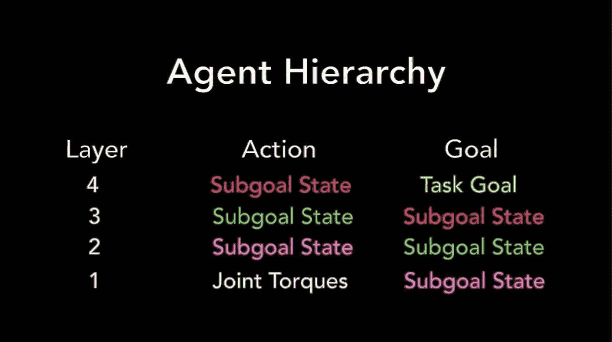
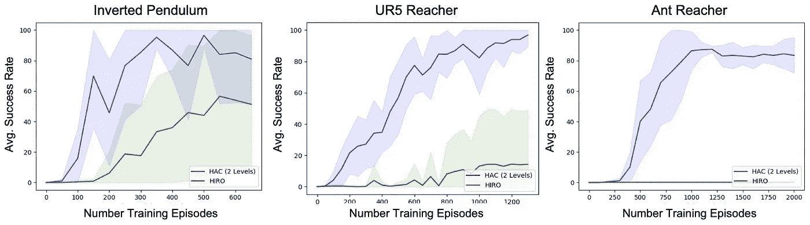
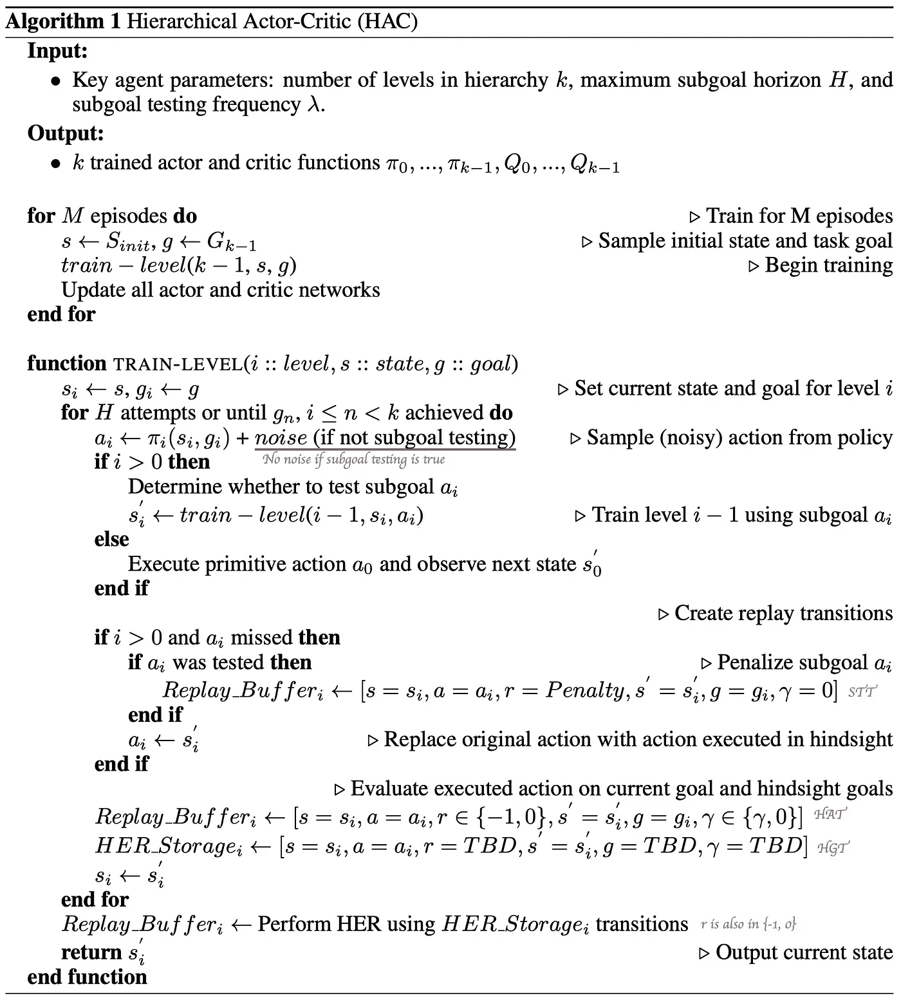

# HAC:事后学习多层次结构

> 原文：<https://pub.towardsai.net/learning-multi-level-hierarchies-with-hindsight-1f50d28cb81c?source=collection_archive---------0----------------------->

## 一种新颖的面向人工智能的分层强化学习方法

## 用于多级层级的后见之明体验重放

倒立摆上的四级 HAC 智能体

## 介绍

我们讨论了一个新颖的分层强化学习(HRL)框架，它可以有效地并行学习多个层次的策略。实验表明，由 Andrew Levy 等人在 2019 年 ICLR 会议上提出的这一框架可以显著加速稀疏回报问题的学习，特别是那些目标是达到某种目标状态的问题。值得注意的是，这是第一个成功地在具有连续状态和动作空间的任务中并行学习 3 级层次的框架。作者所做的一些实验甚至展示了它驾驭 4 层层次结构的能力。这个[视频](https://www.youtube.com/watch?v=DYcVTveeNK0)展示了它在 2 级和 3 级层级中的能力，[这个](https://www.youtube.com/watch?v=Q_NGMkQ29oU)用 4 级代理做了一个简单的演示。

## 概观

我们首先描述这个框架的整体架构和目的——从这里开始，我们关注它在连续域中的衍生算法，即分层行动者-批评家(HAC)；离散域中的算法，分层 Q-学习(HierQ)，应该是几乎相同的，除了它在每一层使用*Q*-学习。

*   HAC 是为目标导向的任务而设计的，在这种任务中，代理人试图达到某种目标状态——达到目标，我们的意思是代理人在一定范围内接近目标。正如我们将很快看到的，这为 HAC 提供了在不同情况下设计自己的奖励的灵活性。
*   HAC 在每一层使用一种非策略 RL 方法:它可以是*Q*-离散动作空间的学习变量或连续空间的 DDPG 变量。转换被定义为*【初始状态、动作、奖励、下一状态、目标、折扣率】*形式的元组。对于低级策略，HAC 对策略为达到子目标而采取的最大动作数量 *H* 进行了明确的约束。

为了更好地理解，我们也给出了 HAC 和 HIRO 之间的简单比较，后者是我们在[上一篇文章](https://towardsdatascience.com/data-efficient-hierarchical-reinforcement-learning-hiro-5d8538c27a80?source=friends_link&sk=9a800a0ccd8f074bbfec7dd09e9835a2)中讨论过的一种 HRL 算法。

后知后觉地学习多层次结构。HAC (2 级)和 HIRO 的性能比较。图表显示了平均成功率和 1 个标准差。

HIRO 和 HAC 的目标都是高效地并行学习多个层次的基于价值的政策，但它们在一些基本方面有所不同:1)在高层，HAC 以目标状态为子目标，而 HIRO 以当前状态和目标状态之间的差异为子目标 2) HAC 不依赖于任何外部奖励；它给没有达到目标的过渡以负奖励，否则为 0。另一方面，HIRO 采用欧几里德距离作为低级奖励，外部奖励作为高级奖励。3)与 HIRO 的转变不同，HAC 的转变有三个来源:后见之明行动转变、后见之明目标转变和子目标测试转变。

在本文的其余部分，我们将集中讨论 HAC 中的转换，看看它们如何帮助共同学习多级策略和处理稀疏奖励问题。

## 事后行动转变(HAT)

大多数基于值(非策略)的强化学习算法都是建立在贝尔曼方程的基础上的，它依靠一个稳定的转移函数来保证理论上的收敛性。在分层强化学习中，高级策略通常面临非平稳的转移函数，因为高级转移函数通常依赖于低级策略，而低级策略随时间不断演化。由于探测通常会引入随机性，使得高级转换函数更加不确定，因此低级探测可能会进一步加剧这种情况。HIRO 和诺尔-HRL 在以前的文章中讨论过，他们求助于目标重新标记来恢复转换元组。但这更像是一种特别的技术，可能很难推广到两级以上的层次结构。HAC 通过训练关于*后见之明行动转移*的高层策略来克服这些不稳定问题，这使用**最优低层策略层级**来模拟转移函数。

事后学习多层次结构的例子。轨迹上的 tic 标记显示了机器人在执行每个原始动作后的下一个状态。粉色圆圈显示了最初的子目标操作。灰色圆圈显示了低级策略最多执行 H 个操作后所达到的子目标状态。

以报纸上的例子为例。考虑一个两级代理，假设该代理从 *s₀* 出发，试图到达黄旗。高层策略计划底层策略要实现的子目标 *g₀* 。底层策略使用某种行为策略执行 *H* 原始动作，但无法实现 *g₀* ，而不是在 *s₁* 落地。现在我们可以谱写第一个后见之明的动作过渡，*【s₀，s₁，-1，s₁，黄旗，γ】*。请注意，如果目标(黄色标志)未实现，奖励始终为 *-1* ，否则为 *0* 。此外，我们不再使用子目标 *g₀* 作为动作，而是使用 *s₁* ，这正是元组中的下一个状态。为了更好地理解它，我们可以这样理解:g₀表示由高层政策选择的行动，而 s₁是一些考虑到探索的高层行为政策的结果。以这种方式，转换总是采取好像低级策略是最优的，因此成功地实现了子目标。

这些转换还有一个潜在的好处:因为由高层产生的子目标总是远离初始状态的 *H* 低层动作，通过这些转换，高层策略学习符合每个高层动作的 *H* 低层动作的时间尺度的子目标。

## 后见之明目标转换(HGT)

后见之明的行动转换遭受稀疏回报问题，这使得它很难学习。为了让每一个层次都能够更有效地学习，作者提出了*后见之明目标转换*，将后见之明体验回放(HER)的想法扩展到了层级设置。在执行每个 *H* 动作之后，对于每个转换，我们选择一个未来状态作为它的新目标。如果新目标没有实现，奖励为 *-1* ，否则奖励为 *0* 。我们对所有级别都这样做。

我们再次以上一节中的例子来说明。假设我们想把她申请到*【s₀，s₁，-1，s₁，黄旗，γ】*。如果我们恰好把 *s₁* 作为新目标，那么后见之明的目标跃迁就是*【s₀，s₁，0，s₁，s₁，γ】*；如果我们把 *s₄* 作为新的目标，那么我们就会有*【s₀，s₁，-1，s₁，s₄，γ】*。

## 子目标测试转换(STT)

后见之明行动和后见之明目标转换使多级策略能够并行有效地学习，但一些关键问题仍然存在。最严重的缺陷是，该策略只允许一个级别了解其较低级别的策略层次能够实现的一组有限的子目标状态。这可能会有问题，特别是对于我们上面使用的奖励函数。回想一下，如果目标没有实现，我们将奖励定义为 *-1* ，否则为 *0* 。*Q*-一般来说，较低级别的策略层级可实现的那些状态-动作对的值是负值，并且可能小于较低级别的策略层级无法实现的值。因此，高级策略将更喜欢子目标的路径，而它的低级策略层次结构还不能实现这些子目标。

为了解决这些问题，我们需要惩罚那些较低层次的政策层级无法实现的子目标。在表格 RL 中，人们可以通过用大的负值初始化 *Q* 值来容易地实现这一点，但是这不是函数近似的情况，在函数近似中，所有的 *Q* 值共享相同的参数集。那么，我们该怎么办呢？Levy 等人引入了*子目标测试转换*来惩罚那些当前策略无法实现的子目标。下面是它的工作原理(请注意*子目标测试*和*更低级子目标测试*的区别:前者指的是我们所说的层的子目标测试)。

1.  对于每个级别，我们定义一个布尔变量，*子目标测试*。因为每个层的子目标由其较高级别指定，所以该变量指示其较高级别是否将子目标测试转换添加到重放缓冲区。这些变量被初始化为假，只被更高层修改。
2.  在某一级的动作选择阶段，如果其子目标测试为真，则将其下级子目标测试设置为真；如果没有，我们给它一些机会( [*30%*](https://github.com/andrew-j-levy/Hierarchical-Actor-Critc-HAC-/blob/504288596f79ebd5494cfd0978d66e1f7cc7c7df/design_agent_and_env.py#L125) by [他们的实现](https://github.com/andrew-j-levy/Hierarchical-Actor-Critc-HAC-/blob/504288596f79ebd5494cfd0978d66e1f7cc7c7df/layer.py#L109))来设置它的较低级的子目标测试为真。
3.  在每一层，如果它的子目标测试被它的更高层设置为真，我们采取由策略产生的确定性动作，因为我们想知道当前策略是否能够实现子目标；如果没有，我们就像平常一样，在探索的过程中加入一些噪音。
4.  在每一层，如果较低级别的子目标测试为真，而较低级别的策略层次结构未能实现子目标，则我们将子目标测试转换添加到重放缓冲区。这种转变将子目标作为行动，并使用低奖励，即*惩罚*。在他们的实验中，他们设置了*惩罚=-H* ，子目标最大视界的负值。

在第 2 部分中，我们只给了 *30%* 个机会来将较低级别的子目标测试设置为真。对于那些无法通过当前政策实现，但仍可能通过 *H* 步骤中的一些优化政策实现的子目标，这有助于他们的*Q*-值向目标 *Q* 倾斜-值由事后诸葛亮的行动/目标转变规定。

# 过渡摘要

事后看来，行动转变时，子目标层可以专注于学习能够达到目标状态的子目标状态序列，而较低级别的策略则专注于学习实现这些子目标状态的行动序列。

事后诸葛亮的目标转变帮助每一级在稀疏的奖励任务中学习目标制约的策略。

子目标测试转换会惩罚较低级别的策略层次结构还无法实现的转换，以减少寻求风险的行为。

# 算法

为了完整起见，我们现在给出伪代码

事后诸葛亮学习多层次结构的伪代码

请注意，在底层 *i=0* 时，既不会产生事后分析动作转换，也不会产生子目标测试转换。

# 参考

Ofir Nachum 等.数据-有效的分层强化学习

Marcin Andrychowicz 等.事后诸葛亮经验重演

后见之明学习多层次层次