# 从零开始学习数字

> 原文：<https://pub.towardsai.net/learning-numpy-from-scratch-868a77728696?source=collection_archive---------3----------------------->

## [编程](https://towardsai.net/p/category/programming)

## 基本指南教程

图片由 [Coco Zinva](https://pixabay.com/users/cocozi-328623/?utm_source=link-attribution&utm_medium=referral&utm_campaign=image&utm_content=568059) 从 [Pixabay](https://pixabay.com/?utm_source=link-attribution&utm_medium=referral&utm_campaign=image&utm_content=568059) 拍摄

# 介绍

NumPy 代表数字 Python。NumPy 是 Python 分发平台 Anaconda 提供的一个包。NumPy 库是一个丰富的模块，可以帮助我们处理多维数组对象。它允许用户构建更高维的矩阵来执行复杂的数学计算。NumPy 内置了许多数学运算、线性代数和傅立叶变换相关的函数。

# NumPy 的目的

*   基本数学运算、统计计算和基本线性代数。
*   构造一个 n 维数组和矩阵
*   访问、更新数组中的元素。
*   重新排列或重组矩阵的索引。
*   分割矩阵。

# NumPy 的优势

*   内存消耗更少
*   快速计算能力

# 安装和导入 NumPy

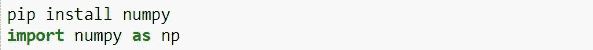

作者图片

# 定义数组

我们可以使用 **np.array()** 函数初始化一个数组。使用函数可以创建任意大小的数组。此外，创建数组的数据类型可以在数组创建期间使用 **dtype** 参数进行定义。

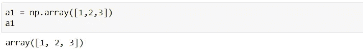

作者图片

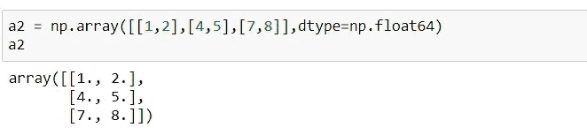

作者图片

我们还可以通过在参数中指定起始和结束索引，使用 arrange 函数创建一个数组。

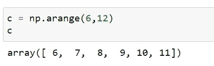

作者图片

# 摆弄大小和形状

## **ndim**

**ndim** 用于定义给定数组中的维数。关于 ndim 的困惑是它被认为是行和列。但实际上，它显示了数组的深度。

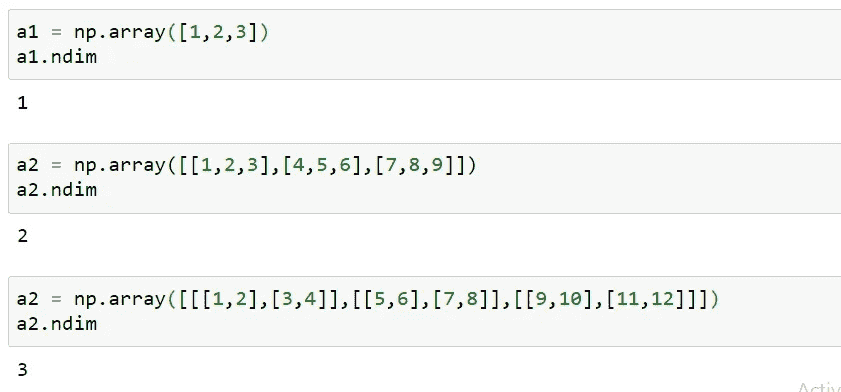

作者图片

## **项目大小**

它根据存储数据时消耗的字节数来定义每个元素的大小。由于下图中的元素是整数，因此对于单个元素，设备上消耗的字节数为 4 字节。

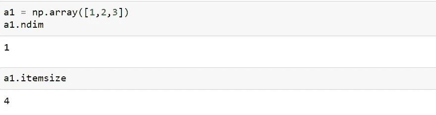

作者图片

## 大小

它定义了数组中元素的总数。在下图中，我们总共有 9 个元素，每个内部数组由 3 个元素组成。

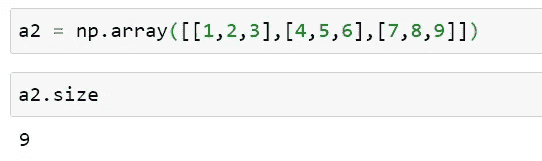

作者图片

## 形状

它定义了给定数组中的行和列的总数。

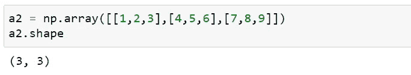

作者图片

下面的数组也由内部数组组成，因此它将形状定义为数组计数、行数和列数。

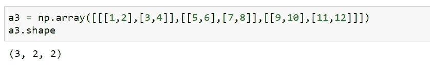

作者图片

# 访问行和列中的特定元素

## 获取特定元素:[r，c]

我们可以通过引用由元素表示的行和列来获得给定数组中的特定元素。在下图中，元素的位置由行号和列号给出。

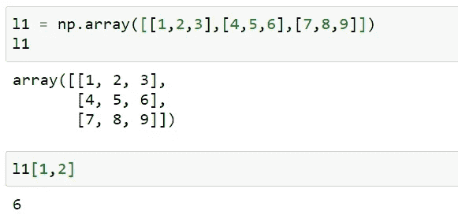

作者图片

## 获取特定行的元素:a[r，:]

我们可以通过输入行号并将 columns 参数设置为第二个参数中的:来获取特定行的元素。

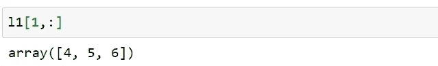

作者图片

## 获取特定列的元素:a[:，c]

我们可以通过输入列号并将第一个参数中的 row 参数设置为:来获取特定行的元素。

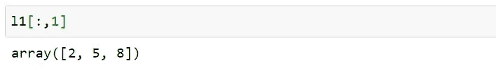

作者图片

## 从给定数组获取多个元素:a[start: end]

我们通过输入开始和结束索引来获得多行。结束索引元素不包括在生成的输出中。例如，在下图中，行号从 0 开始，到 1 结束。必须注意，结束索引(即我们示例中的第 2 行)被忽略了。

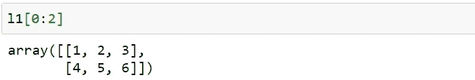

作者图片

## 仅获取数组的最后一行:a[-1]

我们可以通过将-1 作为输入传递给创建的数组来获得给定数组的最后一行。

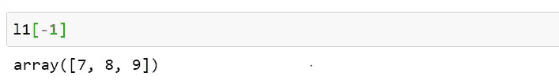

作者图片

## 获取多行的特定列的数据:a[0:2，1]

通过将行数指定为第一个参数，将期望的列指定为第二个参数，我们可以获得给定列的多行数据。

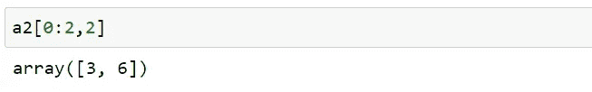

作者图片

## 获取多个列的特定行的数据:a[1，0:2]

通过将列指定为第一个参数，将特定的行指定为第二个参数，我们可以获得给定行的多列数据。

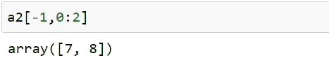

作者图片

# 创建新的维度数组

## 零()

我们可以使用方法 **zeros()创建一个所有元素都为零的 n*m 数组。**

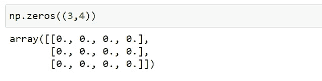

作者图片

## 个()

我们可以使用 **ones()方法创建一个所有元素为一的 n*m 数组。**

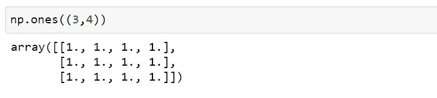

作者图片

## 完整()

我们可以使用 full()函数创建由一个特定整数组成的 n*m 维数组。

## linspace()

如果我们想使用任意随机值在一个范围内创建一个元素数组，那么我们使用 **linspace()** 方法。例如，在下图中，我们创建了一个由 5 个元素组成的数组，随机值在 1 到 5 之间。

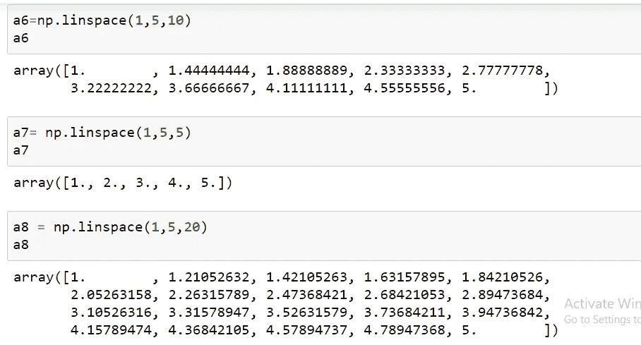

作者图片

## **随机。rand()和 random.randint()**

**随机。rand()** 对于生成随机值在 0 到 1 之间的 n*m 的矩阵很有用。还有，**随机。randint()** 用于生成一个 n*m 的矩阵，其中的整数值在给定的范围内。

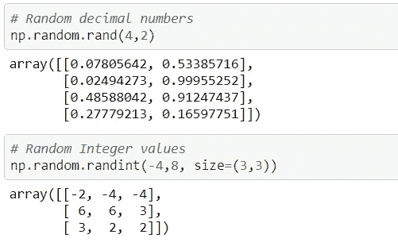

作者图片

## 单位矩阵

我们可以创建一个对角线上由元素 1 组成的 n*m 单位矩阵。

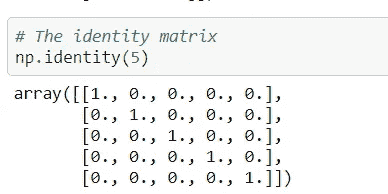

作者图片

# 重组元素

## 重塑()

我们可以使用 **reshape()** 函数对创建的数组的维度进行整形。例如，我们创建一个由 1 到 10 个元素组成的数组，根据用户需求，我们希望将该数组更改为由 2 行 5 列组成的新维度，如下图所示。

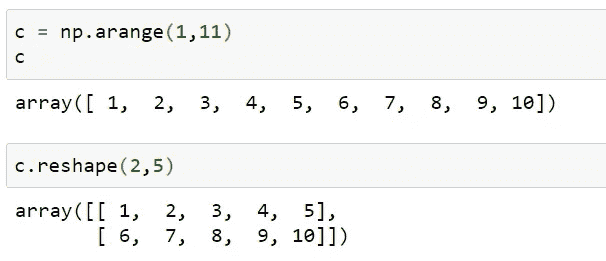

作者图片

## vstack()和 hstack()

当我们想要将新的数组集添加到现有的数组中时，我们可以使用 **vstack()** 和 **hstack()** 函数。我们可以在现有数组中垂直或水平添加新数组。

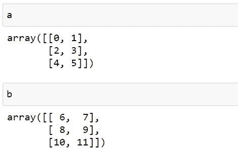

作者图片

如果我们想把数组 b 中的元素和数组中的元素放在一起，我们使用下面的函数来获得结果。

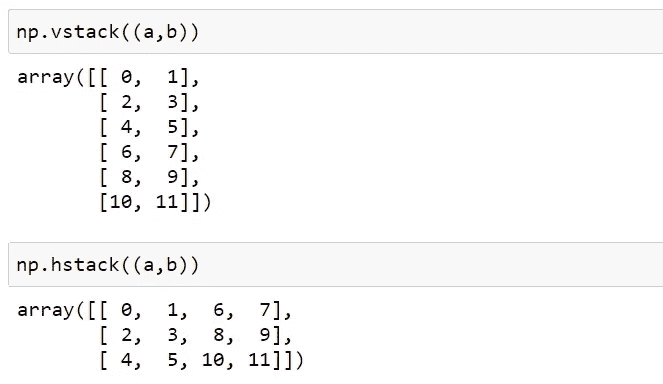

作者图片

# 数学游戏

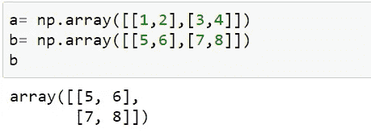

作者图片

我们可以对给定的数组应用各种算术运算。我们将使用上图所示的数组 a 和 b 来理解各种运算，如加、减、乘和除。此外，NumPy 库很容易支持三角函数。

## 加法、减法、乘法、除法

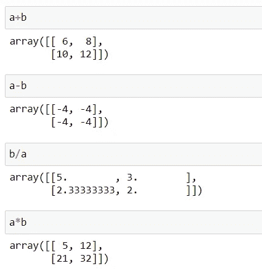

## 三角法的

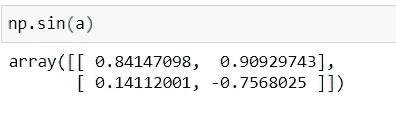

作者图片

# 线性代数

我们可以执行各种矩阵运算，如点积、内积、求行列式、矩阵乘法或矩阵求逆。

## 马特穆尔()

我们可以使用 **matmul()** 函数来执行矩阵乘法，其中我们使用 X*Y 对 A*B 矩阵执行运算。得到的矩阵将具有 A*Y 的维度。执行矩阵乘法的条件将是 B 必须等于 X。

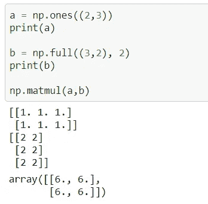

作者图片

## 矩阵的逆

可以使用方法 **np 计算矩阵的逆矩阵。linalg.inv()。**

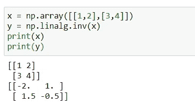

作者图片

## 决定因素

我们可以使用 **np 获得矩阵的行列式。利纳格。det()** 。

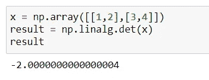

作者图片

## 点积

使用 **np 直接计算点积。点()**功能。对于一维数组的点积，它是元素的直接乘法。此外，2-D 阵列的点积类似于上面讨论的矩阵乘法。

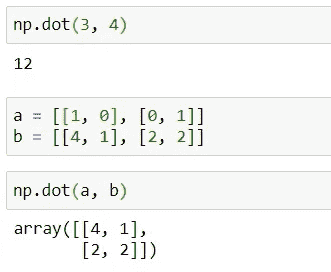

作者图片

# 数字的统计应用

我们可以执行各种统计，例如找到给定数组的平均值、中值、最大值和最小值。

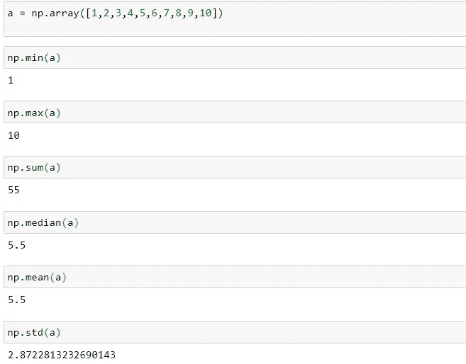

作者图片

感谢您抽出时间阅读这篇文章。

我希望这能帮助你更好地理解事情！！

 [## Charanraj Shetty -技术作家-走向人工智能| LinkedIn

### Pilani BITS 软件系统(数据科学)在职硕士综合学习计划。正在寻找…

www.linkedin.com](https://www.linkedin.com/in/charanraj-shetty-a74831b2/)