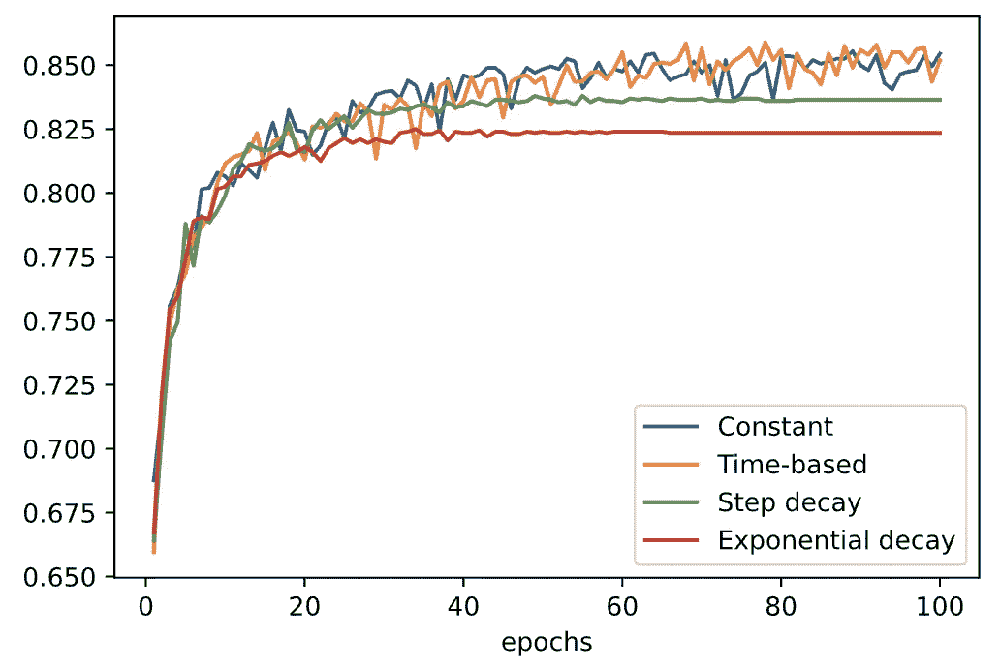

# 使用 Tensorflow 2 进行深度学习的学习率调度

> 原文：<https://pub.towardsai.net/learning-rate-scheduling-for-deep-learning-using-tensorflow-2-fb2f14cc955?source=collection_archive---------2----------------------->

## [深度学习](https://towardsai.net/p/category/machine-learning/deep-learning)

这是什么？为什么要用？以及如何在 Tensorflow 2 中创建您的自定义学习率计划程序

学习率计划就是在神经网络训练期间改变学习率的过程。

一些出版物显示，通过在训练期间改变学习率，可以更快地接近全局最小值。此外，你的训练过程将避免陷入局部最小值或鞍点。

一些研究人员强调了在训练过程中改变学习速度的必要性。这就是为什么我们发现关于自适应学习率(或学习率调度)的不同方法的出版物，如[1]和[2]。

这些学习率调度技术中的许多已经在 Tensorflow 2 中实现。例如，我们可以找到指数衰减、InverseTimeDecay 和 PiecewiseConstantDecay。

在训练过程中，这些学习率计划都遵循一定的行为。Tensorflow 2 中已经实现了这些类型的计划。要使用它们，您所要做的就是作为优化器的一部分调用它们。下面是 TF2 文档中的一个例子:

您可以对 InverseTimeDecay 和 PeicewiseConstantDecay 做同样的事情。

但是如果你想定义你自己的学习进度呢？你如何在 Tensorflow 2 中实现它？

事实上，有两种方法可以做到这一点(据我所知)。第一种方法是通过创建一个函数来定义你的学习率计划，然后将它作为回调的一部分传递给 ***fit*** 方法。

第二种方法是创建一个从`tf.keras.optimizers.schedules.LearningRateSchedule`继承的类，然后覆盖这个类的一些方法。然后，您可以使用您的类，就像我上面提到的预先实现的调度程序一样。

让我们看看如何使用这两种方法。

## 使用回调的学习率调度

如您所见，将您的学习率计划定义为回调非常简单。但是这种方法有一个缺点。您只能在纪元结束时更新学习率。此外，据我所知，您只能向调度函数传递 2 个参数。如果你想在某个时期结束前更新你的学习率，该怎么办？也许你想每半个纪元更新一次你的学习速度。你如何实现这一点？

这就是第二种方法的用武之地。将调度器定义为从`tf.keras.optimizers.schedules.LearningRateSchedule`继承的类

## 一种更通用的学习速率调度方法

下面是我在论文[1]中描述的实现循环学习率调度器的尝试。虽然看起来这里有很多细节，但事实上很简单。

类`tf.keras.optimizers.schedules.LearningRateSchedule`有一些你需要覆盖的方法。**总**。这些方法分别是 ***__call__*** 和 ***get_config*** 。 ***__call__*** 方法在每一步都被调用，这就是为什么它把步骤作为参数。所以在每一步之后，你可以更新你的学习速度，不像之前的方法使用回调。

对于 ***get_config*** 方法，它只是返回您选择的值的字典。但是这里值得一提的是，你的字典中的值需要是字符串。如果按原样返回值(***float***)，那么 Tensorflow 将引发异常，因为 ***float*** 值是非 JSON 可序列化的。将浮点值转换成字符串是我的变通方法，如果失败了，不要责怪 Tensorflow，而是责怪我:D

什么时候你用一种方法而不用另一种方法？

简单。

如果你正在为你的学习率计划做快速实验，并且你只需要在每个时期结束时更新你的学习率，那么使用回调方法。

另一方面，如果你正在实现一个学习率调度器，需要在纪元结束前更新，那么使用第二种方法。

对于我上面定义的循环学习率，您可以使用回调方法来实现它。但是我使用了`LearningRateSchedule`方法来实现它，所以我可以向您展示这种技术的演示。

*如果你觉得这篇文章有用，就关注我的* [*中*](https://nourislam.medium.com/) *！*

*如果你喜欢每日了解 ML，那就关注我*[*LinkedIn*](https://www.linkedin.com/in/nour-islam-mokhtari-07b521a5/)*。我几乎每天都在那里贴机器学习的比特！*

*如果你喜欢更结构化的学习材料，那么我邀请你加入“* [***计算机视觉完整深度学习训练营***](https://www.aifee.co/p/the-complete-deep-learning-for-computer-vision-bootcamp) *”在这里你将了解:图像识别、物体检测、图像分割，以及如何在本地和谷歌云人工智能平台上训练你的模型。您将* ***构建 3 个现实生活中的 AI 项目*** *！*

# 参考

[1][https://arxiv.org/abs/1506.01186](https://arxiv.org/abs/1506.01186)

[2][https://arxiv.org/pdf/1412.7419.pdf](https://arxiv.org/pdf/1412.7419.pdf)

作者制作的图像

我是一名机器学习工程师，致力于解决具有挑战性的计算机视觉问题。我想帮助你学习应用于计算机视觉问题的机器学习。以下是方法。

1.  通过帮助您了解该领域的最新动态。我几乎每天都在[**【LinkedIn】**](https://www.linkedin.com/in/nour-islam-mokhtari-07b521a5/)和[**Twitter**](https://twitter.com/NourIslamMo)**上分享小型博客帖子。所以跟我去吧！**
2.  **每周给你一份我的 [**时事通讯**](https://nourislam.ck.page/dc3e8b7e12) 上那些小帖子的摘要。所以订阅吧！**
3.  **通过在 Medium 上写关于机器学习不同主题的文章。所以跟我来吧！**
4.  **给你一份免费的机器学习工作清单，帮助你检查你需要学习的所有要点，如果你计划在 ML，特别是在计算机视觉方面的职业生涯。你可以在这里 获得核对表 [**。**](https://www.aifee.co/free-resources)**

**5.最后但同样重要的是，通过与你分享我的 [**免费入门张量流课程**](https://aifee.teachable.com/p/introduction-to-tensorflow-2-for-computer-vision) ，它有超过 ***4 小时*的视频内容**，你可以在那里问我任何问题。**

**此外，如果您有任何问题或者您只是想聊聊 ML，请随时在 LinkedIn 或 Twitter 上联系我！**