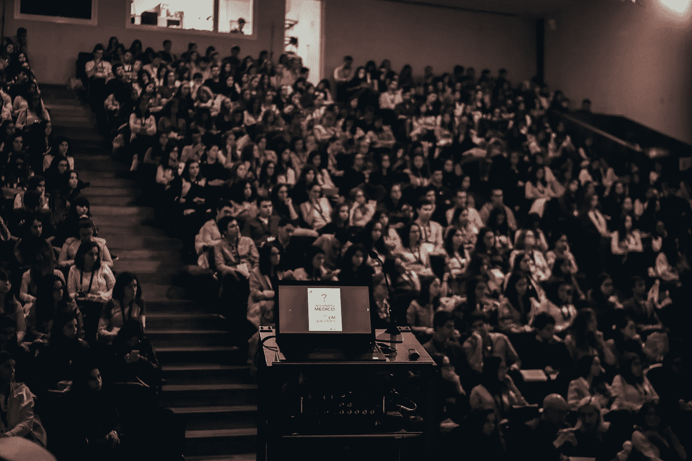
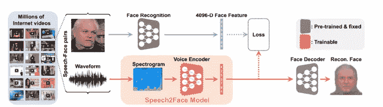
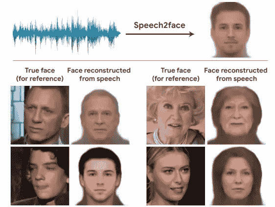
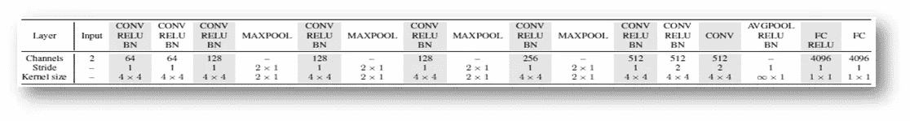
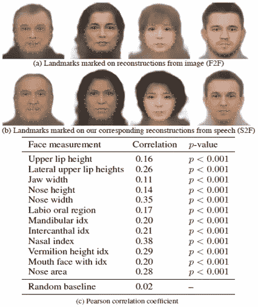
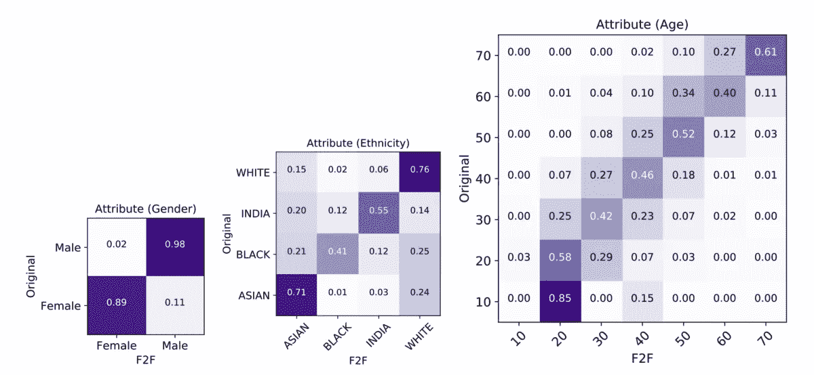
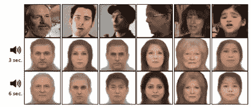
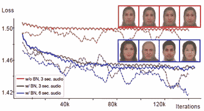
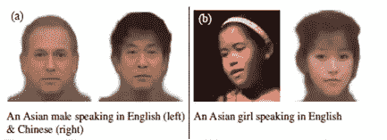
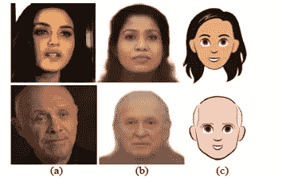

# 学习声音背后的面孔

> 原文：<https://pub.towardsai.net/learning-the-face-behind-a-voice-mits-new-paper-using-deep-neural-network-30e911e20911?source=collection_archive---------0----------------------->

资料来源:联合国人类住区规划署

## 深入研究 Speech2Face，MIT 的小说论文| [走向 AI](https://towardsai.net)

## 麻省理工学院的一篇关于使用深度神经网络从一个人说话的方式推断其面部的小说论文

T 深度学习领域的最新发展确实将人工智能领域提升到了一个全新的水平。现在几乎每周都有许多有趣的、新的、非常酷的科学论文问世。这使得像我们这样的爱好者和从业者非常着迷，这也是我们如此热爱在这个领域工作的原因之一。

最近一篇在机器学习界引起巨大反响的科学论文是麻省理工学院 研究人员的新 [**Speech2Face 论文，他们在论文中讨论了仅使用人类语音生成人脸的想法。**](https://arxiv.org/pdf/1905.09773.pdf)

> 似乎直接来自科幻小说或科幻电影，不是吗？

嗯，不再是了。在接下来的几节中，我们将看看它背后的想法，Speech2Face 的架构以及这项技术投入生产后可能的实时应用。

好吧，让我们直入主题。

当我们听一个人说话而看不到他/她的脸时，在电话里，或者在收音机里，我们经常为这个人的长相建立一个心理模型。言语和外貌之间有很强的联系。

研究人员的目标是通过一个人的声音推断出他/她能了解多少。因为一个人的外表与其对声音和语言的影响之间有着密切的联系。

由于一个人说话的方式可能取决于各种因素，如语言、年龄、发音，并且这在文化和民族之间会发生变化，因此很难生成人脸的精确标准特征。

> “我们的目标不是预测一张可识别的人脸图像，而是捕捉与输入语音相关的人的主要面部特征。”

到使这成为可能，他们设计了一个 ***神经网络复合声谱图*** ( ***声谱图是一种表示信号强度或“响度”随时间变化的视觉方式，信号在一个短语音片段的特定波形*** 中以各种频率出现，作为预测表示人脸的特征向量的输入。

为了训练模型，他们使用了 [AVspeech 数据集](https://looking-to-listen.github.io/avspeech/explore.html)，它由来自 YouTube 的数百万个视频片段组成，其中有超过 10 万个不同的人在说话。他们使用的方法是以自我监督的方式，即，它简单地使用语音和面部在视频中的自然共现，而不需要额外的信息，例如人类注释。

摘自麻省理工学院论文的演讲人脸模型

# Speech2Face 模型和培训渠道。

他们网络的输入是一个复杂的声谱图，是从一个人说话的短音频片段中计算出来的。

1.  输出是 4096-D 面部特征，然后使用预先训练的面部解码器网络将其解码成面部的规范图像。

2.被训练的模块由**橙色框**标记。他们训练网络回归到真实的面部特征，通过将人的图像(视频中的代表性帧)输入面部识别网络，并从倒数第二层提取特征来计算。

3.该模型在来自 AVSpeech 数据库的数百万语音-人脸嵌入对上进行训练。

现在，他们并不是第一个尝试从人类语言中产生信息的人，因为之前已经有人尝试过了。例如，从语音中预测年龄和性别已经被广泛探索。

但在这里，研究人员的主要目标是回答一个更开放的问题:**什么样的面部信息可以从人类的语音中提取出来**？他们直接从语音预测完整的视觉外观(例如，面部图像)的方法允许他们探索这个问题，而不局限于预先定义的面部特征。

> 该模型旨在揭示训练数据中面部特征和说话者声音之间存在的统计相关性。

因此，该模型(任何机器学习模型都是如此)会受到这种不均匀数据分布的影响。

用语音重建一张脸…..摘自麻省理工学院的论文

# **Speech2Face (S2F)型号**

从输入语音回归到图像像素的直接方法不起作用；因为这样的模型必须学会从数据中剔除许多不相关的变化，并隐式提取人脸的有意义的内部表示——这本身就是一项具有挑战性的任务。

为了应对这些挑战，他们训练模型回归到人脸的低维中间表示。更具体地，我们利用 VGG 人脸模型，一种在大规模人脸数据集上预训练的人脸识别模型，并从网络的倒数第二层提取 4096 维人脸特征。

# 我们的 Speech2Face 管道由两个主要部分组成:

1)语音编码器，其将复杂的语音频谱图作为输入，并预测对应于相关人脸的低维人脸特征；和

2)面部解码器，其将面部特征作为输入，并产生标准形式的面部图像(正面朝向并且具有中性表情)。

# 语音编码器网络…

语音编码器架构

> 对于一个 6 秒的音频段，输入谱图尺寸为 598x257(时间 **x** 频率),表中的两个输入通道对应于谱图的实部和虚部。

T 语音编码器网络由一个卷积神经网络组成，该网络将语音的声谱图转换为伪人脸特征，然后馈送给人脸解码器以重建人脸图像。

卷积层、ReLU 和批量归一化与最大合并层交替使用，最大合并层仅合并光谱图的时间维度，同时保留频率信息。

> 这是为了保留更多的声音特征，因为它们更好地包含在频率内容中，而语言信息通常跨越更长的持续时间。

汇集的特征然后被送入两个完全连接的层，以产生一个 **4096-D 面部特征**。

# 人脸解码器网络...

人脸解码器的目标是从低维人脸特征重建人脸图像。

我们使用从 VGG 人脸模型中提取的相同人脸特征作为人脸解码器的输入来训练该模型。该模型被单独训练，并在语音编码器训练期间保持固定。

# 培训是如何进行的…

使用输入语音和面部图像的自然共现，以自我监督的方式训练语音编码器网络。

从每个视频剪辑中提取包含说话者面部的单个帧，并将其馈送给 VGG 面部模型，以提取 **4096-D 特征向量**、 **vf** 。这用作语音编码器的监控信号——语音编码器的特征**对**被训练来预测 **vf** 。

被选为特征之间的 **L1** 距离的损失函数:

**||vf — vs||** 。然而，很快人们发现，仅仅因为这种损失，训练进展缓慢且不稳定。因此，引入了额外的损失项来解决这个问题。

具体来说，此外，他们惩罚了面部编码器最后一层的激活差异， **fVGG: R⁴⁰⁹⁶ →R ⁶，**即 VGG-Face，以及面部解码器第一层的激活差异， **fdec: R ⁶ →R ⁰⁰⁰** ，它们在训练语音编码器期间被预训练和固定。

# 实施…

从 AVSpeech 数据集中提取的长达 6 秒的音频用于训练该模型。如果视频剪辑短于 6 秒，则重复播放音频，使其长度至少为 6 秒。音频波形以 **16 kHz 重新采样，并且仅使用一个通道**。

一旦完成，他们从 [**Dlib**](https://pypi.org/project/dlib/) 运行基于 CNN 的面部检测器，从帧中裁剪面部区域，并将它们调整为 **224x224 像素。**

从调整大小的面部图像中计算 VGG 面部特征。我们的网络在 TensorFlow 中实现，并由 **ADAM** 优化，其中 **β1= 0.5，∑= 10minus⁴** ，**学习率为 0.001** ，每 10，000 次迭代的指数衰减率为 **0.95，3 个历元的批量为 8**。

# 结果…

该模型在 AVSpeech 数据集和 VoxCeleb 数据集上进行了广泛的测试。这些重建捕捉到了说话者丰富的身体信息，比如他们的年龄、性别和种族。预测的图像还捕捉了额外的属性，如面部或头部的形状。

面部特征的皮尔逊相关系数

他们测量了从以下提取的颅面特征之间的相关性:

(a)从原始图像(F2F)的面部解码器重构

(b)从相应的人脸重建中提取的特征(S2F)；根据检测到的面部标志计算特征。

现在，为了正确地测试模型的结果，他们构建了一个混淆矩阵，这个混淆矩阵是从属性和语音 2 脸重建中推断出来的，他们可以看到年龄和性别的分类结果是高度相关的。

混淆矩阵(按行标准化)比较 Speech2Face 模型上的分类结果

输入音频持续时间对重建图像的影响

**音频持续时间**对由 Speech2Face 模型重建的图像的影响可以在左侧看到。我们可以清楚地看到，随着音频持续时间从 3 秒增加到 6 秒，面部属性的捕捉有所改善。

## 颅面测量…

使用 [DEST 库计算面部特征的颅面属性。](https://github.com/cheind/dest)随机抽取 1000 个样本，测试 Speech2Face 模型如何捕捉数据集的面部特征。可以看出，对于几次测量，存在统计上显著的**(即 p < 0:001** )正相关。特别地，最高的相关性被测量为 ***鼻指数(0.38)和鼻宽(0.35)*** ，这些特征指示了可能影响说话者声音的鼻结构。

## 特征相似性…

该团队首先直接测量预测特征和从说话者原始面部图像中获得的真实特征之间的余弦距离。

研究人员的目标是评估从面部图像数据库中检索真实说话者的准确度。为了做到这一点，他们提取了这个人的语音，然后通过计算数据集中所有人脸到人脸特征的距离来对其进行评估。他们发现音频的持续时间越长，模型就能够更好地重建面部图像。

## 批量标准化的效果...

对持续时间为 **3 秒和持续时间为**6 秒的两个模型进行了训练，发现在训练期间，音频持续时间对收敛速度只有细微的影响，对整体损失和重建质量没有太大影响。然而，他们发现，在测试时输入较长的语音可以提高重建质量，也就是说，重建的人脸可以更好地捕捉个人属性。

音频语音的批量标准化

上图中有和没有**批次归一化(BN)** 的训练曲线。可以看出，在没有 **BN** 的情况下，重建的面部收敛到平均面部。使用 **BN** ，结果包含更丰富的面部信息。

## 语言和口音的影响…

为了测试语言和口音的影响，该模型在一个亚洲男性用英语和汉语说同一句话的模型上进行测试。嗯，在理想的情况下，模型应该能够重建一个男人的相似的脸，但在这种情况下，模型无法推断出脸。

摘自麻省理工学院的论文

然而，在其他例子中，例如**一个说英语的亚洲女孩**，该模型能够成功地分解出该语言，重建出一张具有亚洲特征的脸，即使该女孩说的是没有明显口音的英语。观察到混合行为，需要更彻底的检查来确定模型在多大程度上依赖于语言。

# 使用案例…

## 1.语音到卡通…

该模型生成的重建人脸可用于生成研究人员所做的主题的卡通式特征。

从人说话的音频重建的语音到卡通

以卡通形式从音频中重建的图像，在这种情况下，使用 GBoard 应用程序( *Gboard，Android 手机上可用的键盘应用程序，它也能够分析自拍图像，以产生卡通版本的面部*)。

## 2.潜在的使用案例…

1.  如果这个网络得到进一步的训练，它可能有利于安全部队抓住使用他们的语音的罪犯，然后能够在几乎完美的程度上找到声音背后的面孔。

2.这项技术在媒体或电影行业可能有巨大的潜力，可以帮助 VX 特效设计师提升他们构建令人兴奋的特效的游戏。

# 结论…

研究人员提出了一项直接从一个人说话的录音中重建面部的新研究。这是通过使用数百万人说话的自然视频，学习将语音的特征空间与预先训练的面部解码器的特征空间对齐来解决的。

他们已经证明，他们的方法可以预测与真实图像一致的面部属性的可信面部。因此，可以相信，与预测特定属性相反，生成人脸可以提供语音人脸相关性的更全面的视图，并可以开辟新的研究机会和应用。

# 参考资料:

 [## 语音 2 面孔:学习声音背后的面孔

### 我们能从一个人说话的方式中推断出多少关于他长相的信息？在本文中，我们研究的任务是…

arxiv.org](https://arxiv.org/abs/1905.09773) 

> ***为了进一步更好地理解这篇论文，我请求你浏览一下研究人员的原始论文。***

*所以，这就是全部了..！！直到下次..！！再见..！！*