# 从零开始学习熊猫图书馆

> 原文：<https://pub.towardsai.net/learning-the-pandas-library-from-scratch-e25d91261efc?source=collection_archive---------0----------------------->

## [数据科学](https://towardsai.net/p/category/data-science)

## 基本指南教程

由[卡桑德拉·诺曼](https://unsplash.com/@cvnorman?utm_source=unsplash&utm_medium=referral&utm_content=creditCopyText)在 [Unsplash](https://unsplash.com/s/photos/pandas?utm_source=unsplash&utm_medium=referral&utm_content=creditCopyText) 上拍摄的照片

# 熊猫游戏攻略

Pandas 是 Python 语言的库集或模块，广泛用于探索性数据分析。它由各种函数或方法组成，这些函数或方法有助于在对任何给定数据集执行分析时减少工作量和时间。当我们想研究给定的特征值时，熊猫非常有用。

# 哪里可以申请熊猫？

1.  正在获取数据集。
2.  清理、整形和获取关于数据集的信息。
3.  数据的索引和选择。
4.  数据的添加、删除和更新。
5.  数据的分类。
6.  时序数据分析。

# 数据帧

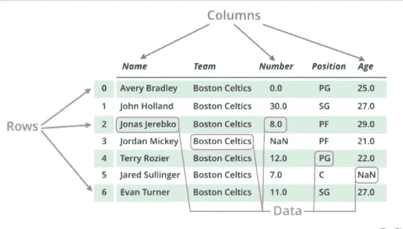

[来源](https://media.geeksforgeeks.org/wp-content/uploads/finallpandas.png)

Dataframe 是从 excel 文件中给定的数据集创建的表格。数据帧由行和列组成。行由可用于执行分析的数据总数组成，列表示基于其做出与给定任务相关的预测的可用要素总数。

# 系列

[来源](https://media.geeksforgeeks.org/wp-content/uploads/dataSER-1.png)

pandas 中的 Series 是一个一维数组，可以保存任何类型的数据(string、int、float、python 对象等。).Pandas 系列可以相当于一个 excel 表中的一个单独的列，代表一个特定的功能。在上图中，数据框的每一列代表一个系列。

这里我们使用的是来自客户的调查细节数据集，包括用户细节和反馈。

# 1.摆弄数据帧

## **读取 excel**

我们可以使用 pandas 的 read_csv 方法从 excel 表中提取数据集。我们可以应用下面的函数 ***read_csv*** 来提取数据并转换成 excel。这里我们以一个给定城市的天气数据为例。当我们创建一个数据帧时，它并不显示所有的特征。为了显示所有的行和列，我们需要使用 pandas 库中的 ***set_option*** 函数。

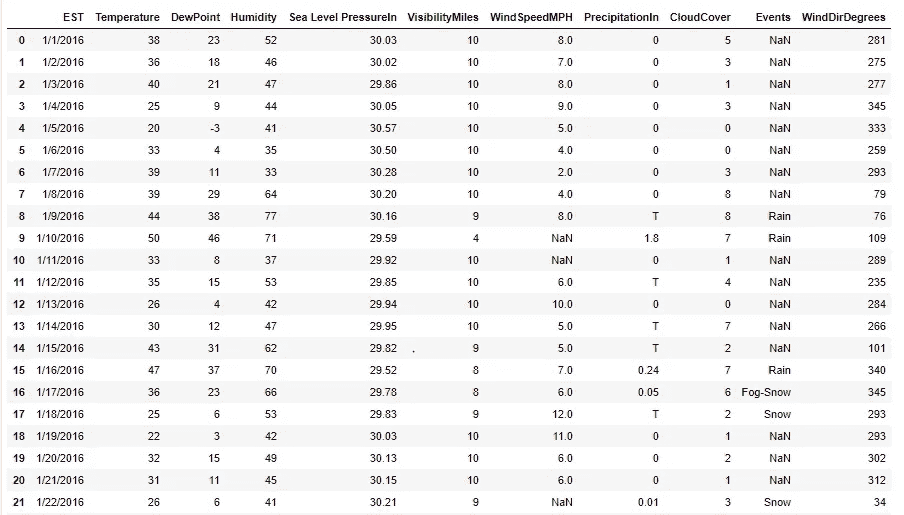

作者图片

当一个数据帧中有 1000 条记录时，我们可以过滤掉前 n 条记录或后 n 条记录。为此，e 可以使用 Dataframe 的 ***head()*** 和 ***tail()*** 方法。

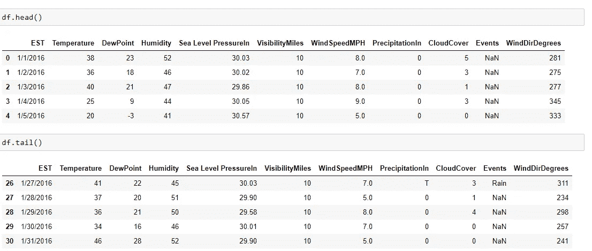

作者图片

## **获取数据信息【info()、shape()、describe()、pandas 内置数学函数】**

## 信息()

我们可以使用 ***info()*** 函数获得关于列名、列的数据类型、非空对象的信息。

## 形状()

我们可以使用 ***shape()*** 找到给定数据帧的全部行和列。

## 数学函数

我们可以找到表示为列的每个特征的最大值、最小值、平均值和标准偏差值。

## 描述()

同样，我们可以使用 **describe()** 来计算特性的 25%、50%、75%、max、min、std。

df.describe()

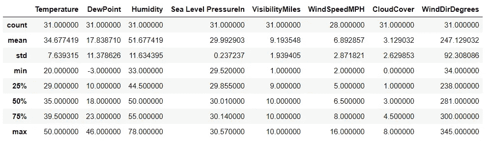

作者图片

# 2.创建数据帧的方法

我们可以从 excel、CSV 文件中提取数据，并创建一个数据框架。除此之外，我们可以使用字典或元组列表来创建数据帧。

## Excel 到数据框架

**read_excel()** 函数用于从 excel 表格中取出数据，并以 Dataframe 的形式表示出来。我们将工作簿和工作表名称指定为 **read_excel()** 函数的参数。

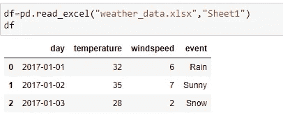

作者图片

## CSV 到数据帧

**read_csv()** 函数用于从 csv 文件中提取数据，并将其转换为数据帧。如果需要，我们在 **read_csv()** 函数中指定 CSV 文件名和索引作为参数。

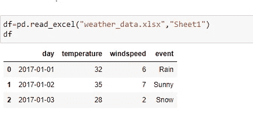

作者图片

## 字典到数据帧

我们可以创建一个键-值对字典，其中键作为列，值作为特定列的记录值。然后，字典作为参数传递给 **dataframe()** 函数。

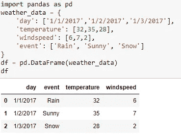

作者图片

## 数据帧的元组列表

我们可以传递元组中的值，并创建一个包含记录值的元组列表。该列表以及要表示的列作为参数传递给 **Dataframe()** 函数。

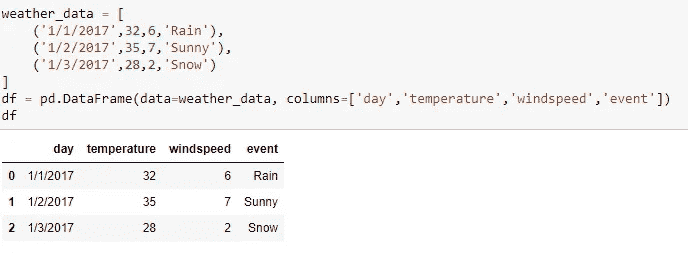

作者图片

# 3.基于需求定位记录

## loc()函数

它用于根据传递给函数的索引值获取记录。例如，在上面显示的[图](https://cdn-images-1.medium.com/max/800/1*QPppUeenpa_Uqc4LLPepkA.png)中，我们可以注意到索引是由从 0 开始的整数给出的。为了获取任何特定记录的值，我们利用索引 id 并将其传递给 loc()函数。

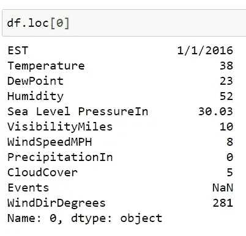

作者图片

我们还可以使用 loc()函数来获取给定记录的任何特定特性的值。此外，可以从数据帧中提取多条记录的数据。

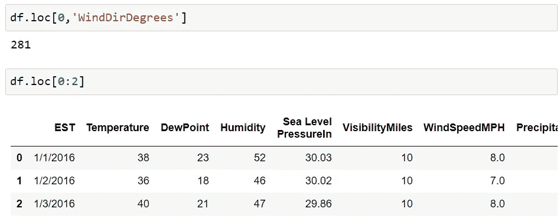

作者图片

此外，我们可以指定要在多条记录中显示的列。

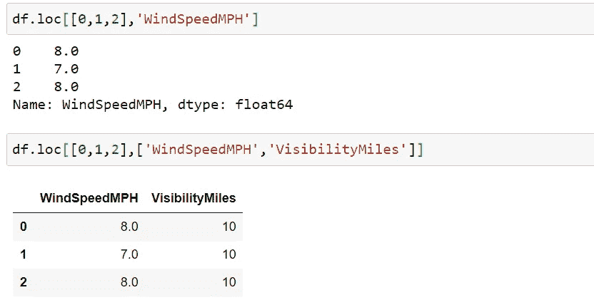

作者图片

## set_index()

除此之外，我们甚至可以根据自己的喜好重新设置索引。这有助于我们出于分析目的分离数据。例如，在下图中，我们用时间替换了索引(例如，在下面的例子中是美国东部时间)

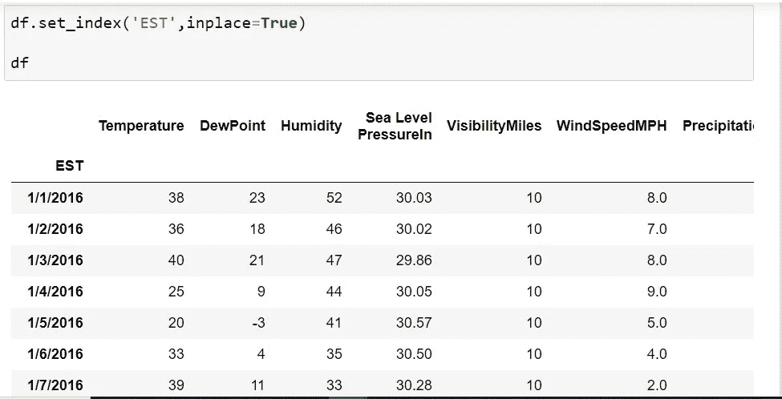

作者图片

因此，在尝试过滤记录时，我们将使用位置索引参数作为日期，而不是整数值。

作者图片

# 4.过滤数据

假设我们想记录下温度超过 45 的风速和海平面压力，那么我们在数据帧中应用过滤的概念，我们在[图 1](https://cdn-images-1.medium.com/max/800/1*QPppUeenpa_Uqc4LLPepkA.png) 中使用了这个概念。

为了解决同样的问题，我们将应用过滤概念。最初，我们将筛选出温度超过 45 的记录，并将其存储在一个充当数据序列的变量中，因为它只包含一列数据。

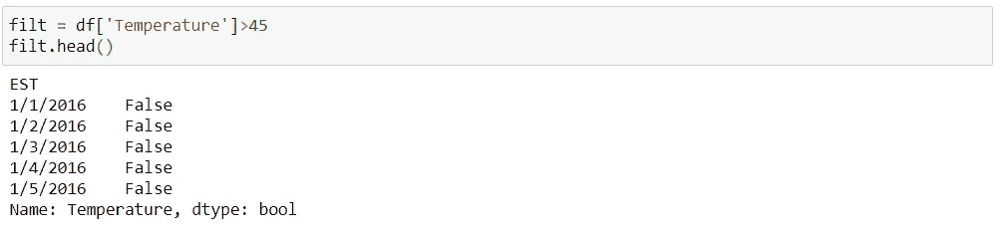

作者图片

现在，如果我们将变量传递给 loc()函数，那么指向那些 temp>45 的记录的索引 w.r.t 将作为参数 1 传递。我们要分析的温度超过 45 的列值可以作为第二个参数传递。

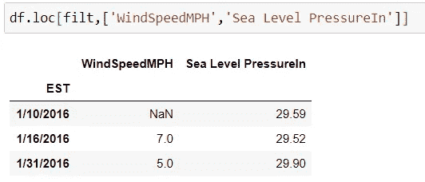

作者图片

# 5.数据更新

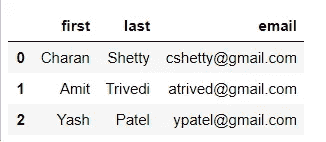

作者图片

## 更新列标题名称

我们可以根据对数据的更好理解来更新列名。在 Pandas 中，有多种方法可以更新列名。列名更改应用于[图](https://cdn-images-1.medium.com/max/800/1*2TxCF8FMEDoSc3Mhj1lDdw.png)中给出的数据集。下面的图片包含根据用户要求更新列名的 3 种方法。

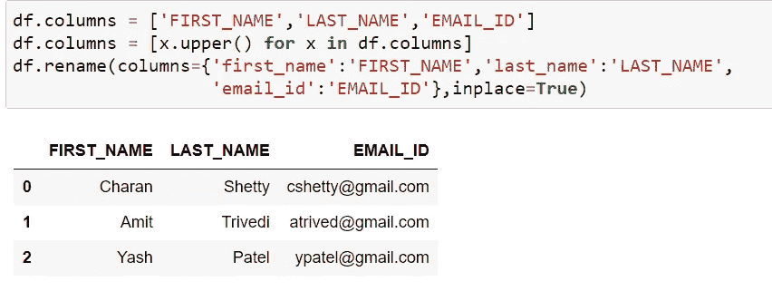

作者图片

## 记录数据的更新

我们可以根据给定数据帧中的列值更新记录数据。更新记录值有多种方法。我们可以应用 **loc()** 函数将更改应用到特定的索引。我们还可以使用过滤条件来更新基于所应用的条件的行，这可以看作是图像下面的第 4 行代码。

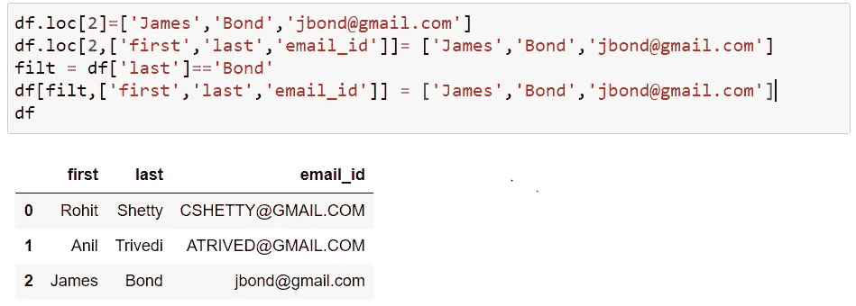

作者图片

## replace()更新列值

我们可以应用 **replace()** 函数来更改特定列的值。考虑列名为 first 的情况，我们希望更新记录 1 和记录 2 的名字。下面是一个使用 **replace()** 函数的例子。

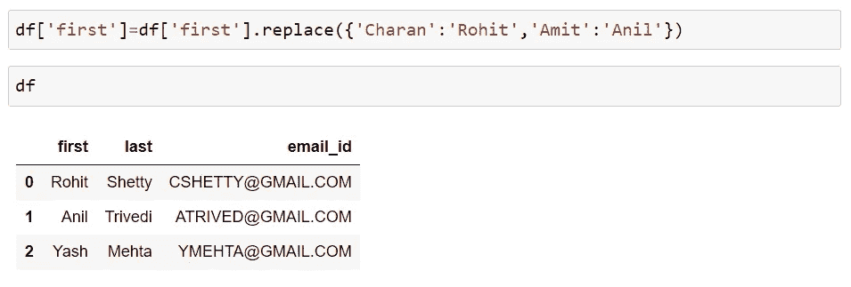

作者图片

# 6.添加或删除数据

## 添加新列

我们可以通过合并现有列的详细信息来更新现有数据框架中的新列。例如，根据[图](https://cdn-images-1.medium.com/max/800/1*2TxCF8FMEDoSc3Mhj1lDdw.png)，我们有名字和姓氏列，使用它，我们想要创建全名列。

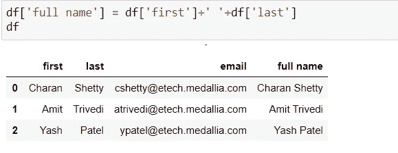

作者图片

## 追加()

我们可以使用 **append()** 函数在一个给定的数据帧中输入一条新记录，或者它可以用来合并两个或更多的数据帧。在下图中，我们首先使用 **append()** 将一条记录追加到现有的数据帧中。之后，我们创建一个新的数据帧，并将其附加到旧的数据帧上。

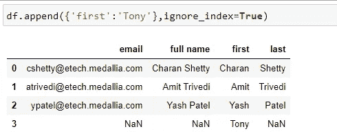

作者图片

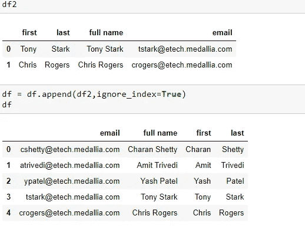

作者图片

## 丢弃()

我们可以使用 **drop()** 方法从数据帧中删除一列或者删除数据帧中的一个现有记录。在下图中，我们删除了姓氏和名字列，因为我们已经将它们合并到全名列中。在第二个图像中，我们使用索引和过滤删除了一个现有记录。

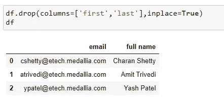

作者图片

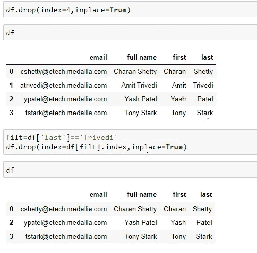

作者图片

# 7.整理数据

## 对单列排序

我们可以根据自己的方便对记录数据进行升序或降序排列。也可以根据需要对多列中的数据进行排序。例如，在下面给出的图像中，我们以升序对数据进行排序，然后以降序对数据进行设置。参数值 ascending 默认设置为 True always，如果我们想按降序排列数据，那么我们必须将其设置为 False。

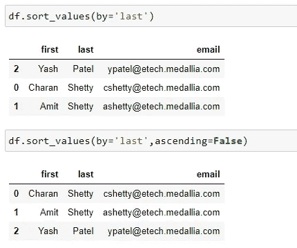

作者图片

## 对多列排序

我们也可以先按 A 列排序，然后按 b 列排序。例如，我们可以首先使用名字对数据帧进行排序，然后将姓氏列作为第二列进行排序。在下图中，我们按姓氏降序排序(通过将升序值设置为 False)，然后将升序值应用于“名字”列，即，如果“名字”的值具有相同的姓氏，则按升序排列。

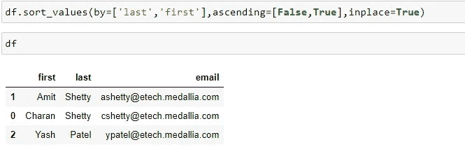

作者图片

# 8.处理丢失的数据

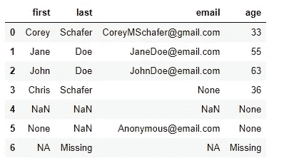

作者图片

## 德罗普纳()

虽然我们有数据集，但我们花了大部分时间清理和缩放它。清理数据的过程之一是在必要时删除空值或不完整的值。我们可以建议丢弃这些不完整的值，以降低分析中的复杂性或异常值。我们可以使用 **dropna()** 方法清除包含空值的记录。在上面的[图像](https://cdn-images-1.medium.com/max/800/1*y9PK07XN_RjIP48pzHJ32g.png)中，我们对数据集应用了 **dropna()** 函数，得到了下面的结果。

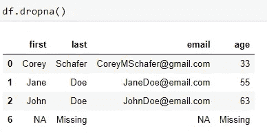

作者图片

如果记录的任何特定字段值缺失，我们也可以通过将' **any** 值输入到参数' **how** '中来删除任何特定记录。或者，如果给定记录中的所有字段都缺失，我们可以通过将' **all** '值输入到参数' **how** '中来删除一条记录。

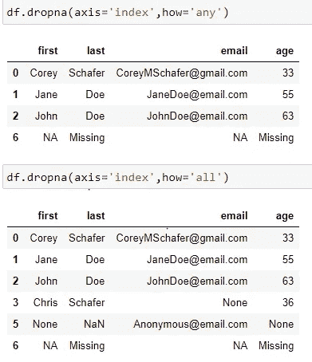

作者图片

## 菲尔娜

为了理解这个函数，我们采用另一个数据集，如下图所示。

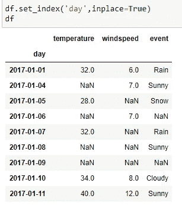

作者图片

我们可以用适当的整数或任何其他随机字符串更新 NaN 值，这可以帮助我们以更好的方式计算出给定数据集的分析部分。

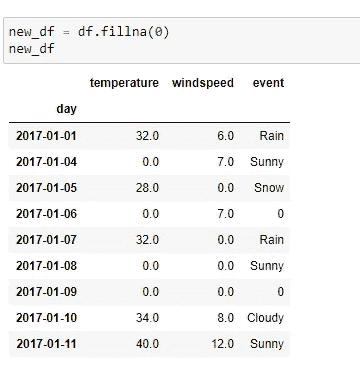

作者图片

我们还可以在缺少值的列中填充高于或低于的值。通过使用 **fillna** 函数的**方法**参数中的“ **ffill** 值，我们在**列中使用上述记录的值。**

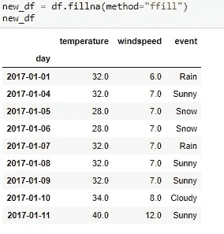

作者图片

此外，我们可以使用 **fillna** 函数的**方法**参数中的“ **bfill** 值，根据特定列中的以下记录值更新缺失值。

作者图片

# 9.使用 Pandas 对数据进行时间序列分析

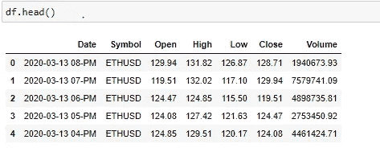

作者图片

熊猫对于观察一个实体在一段时间内的变化非常有帮助。我们有一个非常有用的模块 to_datetime，它可以帮助我们将给定的日期转换成时间戳，然后在这个时间戳上应用各种方法来推断给定的数据。这是苹果公司从 2017 年到 2020 年的股价。我们有各种列或功能，如 2017 年至 20 日所有给定日期的每个实例的收盘价、高值、低值。

## 截止日期时间()和日期名称()

考虑这样一种情况，我们希望从数据帧中计算出给定记录的日期。由于日期列中的值是字符串，我们需要将它们转换成日期。所以我们应用 to_datetime()模块来转换成 Date。完成后，我们利用 day_name()方法获取给定日期的日期。

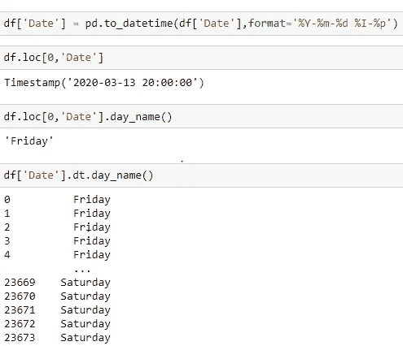

作者图片

我们甚至可以将“DayofWeek”列添加到表示一周中某一天的数据帧中。

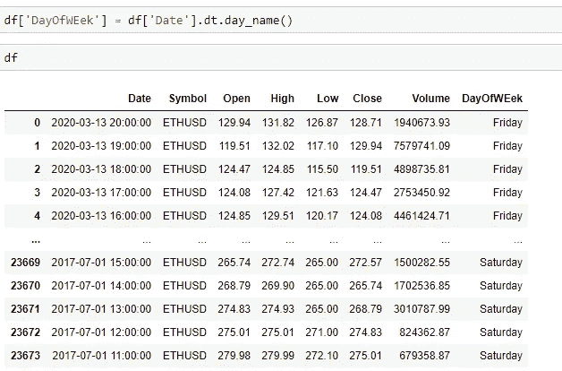

作者图片

## 最小()，最大()和总天数

我们可以使用 **min()** 来确定给定数据帧中的初始日期。 **max()** 方法可用于确定股价的最后提取日期。两个日期之间的差异将导致给定数据帧中包含的总天数。

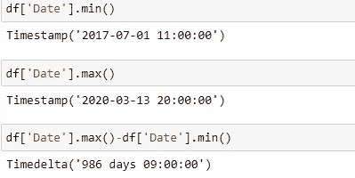

作者图片

## 对时间序列数据进行过滤

如果我们想要获得 2019 年到 2020 年的股票价格，我们甚至可以在列上应用过滤。

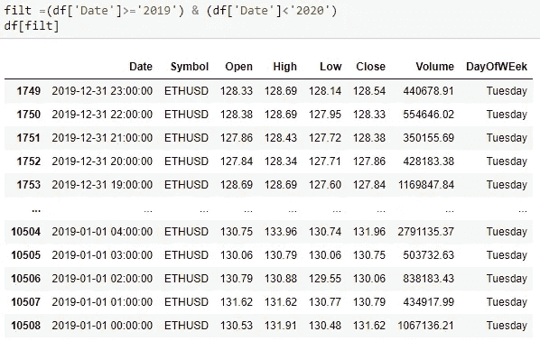

作者图片

## 重置数据帧的索引

我们甚至可以将数据帧的索引设置为 Date，然后直接使用索引应用过滤来提取记录。

作者图片

我们甚至可以对给定日期的特定列应用 describe 函数。

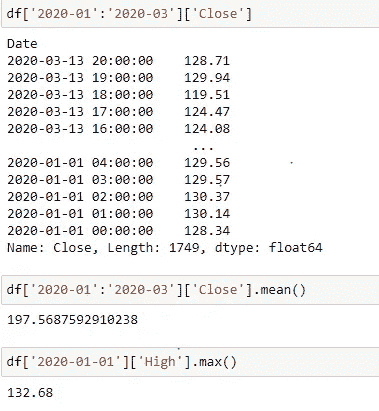

作者图片

## 数据重采样

我们有给定数据集中每一分钟的股价数据。如果任何好奇的用户想要确定该股票在一整周内的最高价格。我们有每一分钟、每一天的数据，他怎么会发现呢？假设我们想找出一只股票在整个星期的平均价格、最高价格、收盘价和总成交量。我们将如何获得这些数据？我们是否会每天手动计算，然后用一周的时间计算，然后再用综合的数学方法计算？为此，引入了采样(**重采样()**)。

作者图片

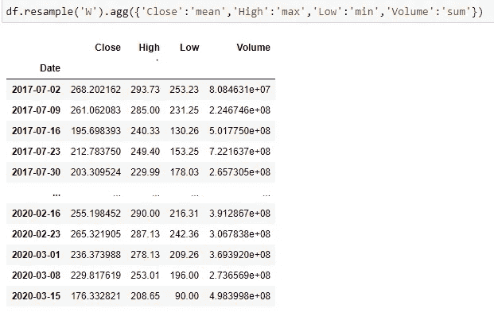

作者图片

这都是关于熊猫的基本知识。人们仍然可以在线浏览图书馆集，探索各种功能来减少他们的工作量。

感谢您阅读文章！！

请随时在 LinkedIn 和 Github 上联系我。

 [## charan Raj 2411/熊猫 _ 基础知识

### GitHub 是超过 5000 万开发人员的家园，他们一起工作来托管和审查代码、管理项目和构建…

github.com](https://github.com/charanraj2411/Pandas_Basics)  [## Charanraj Shetty -技术作家-走向数据科学| LinkedIn

### 电子工程学士，有 3.8 年的质量保证经验，精通需求分析…

www.linkedin.com](https://www.linkedin.com/in/charanraj-shetty-a74831b2/)