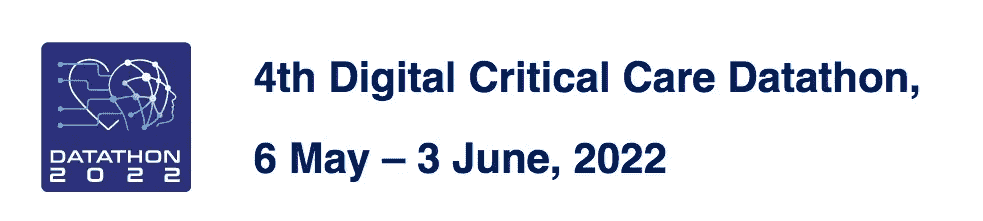
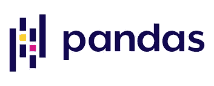
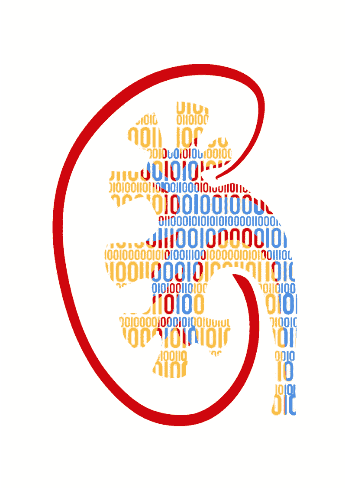

# 参加我的第一次健康数据马拉松的收获

> 原文：<https://pub.towardsai.net/learnings-from-participation-in-my-first-health-datathon-6337c0729188?source=collection_archive---------2----------------------->

## 2022 年第四届数据大会

2022 年 5 月，我第一次参加了由 ESICM(欧洲重症医学协会)组织的健康数据马拉松。这是我的第一次数据马拉松，也是一次与来自世界各地不同教育和专业背景的人学习和分享知识的绝佳经历。

> 我是怎么被邀请的？

当我在 LinkedIn 上收到一条消息，邀请我加入一个已经成立的团体时，我感到很惊讶，这个团体包括医生和数据科学家。邀请来自一位数据科学家，他发现了我的个人资料和一些指向我的媒体出版物的链接。我立刻喜欢上了这个想法。

> 注册过程

参加数据马拉松的座位是有限的，而且是按照“先到先得”的原则坐满的。我用我的电子邮件注册，并提供了一些关于背景(数据科学家/生物统计学家或医生)和数据科学工具(如 Python 和 SQL)经验水平的详细信息。

注册确认后，我加入了我的团队，加入了 WhatsApp 的一个小组，在那里我们开始了关于数据马拉松的一些方面的讨论(试图猜测),在那里我们更好地了解了彼此。

在这篇文章中，我将与优秀的团队成员分享我在这次奇妙的经历中学到的东西！

## **硬技能:**

> ***谷歌大查询***

Datathon 数据库存储在 Google cloud (Google BigQuery 服务)上。我从以前的工作中获得了一些数据仓库和 MySQL 的经验，但我以前没有尝试过 Google BigQuery。对于已经有一些 SQL(任何关系数据库)经验的人来说，适应 Google BigQuery 一点也不难。

在 Python 环境中使用 SQL 脚本通过 Google Colab 访问数据库。这个工作设置显示非常容易使用，即使对我来说没有很好的经验。事实上，我执行的大多数 SQL 查询都是"**SELECT * FROM…WHERE…AND…OR…"**所有其他包含某种分析或合并/连接表的工作都是用 Pandas 完成的(在性能方面比 SQL 有很大优势)。

在我需要访问数据库期间遇到的一些问题包括数据库崩溃或访问被拒绝(可能有太多的研究人员试图同时访问数据)，Google Colab(免费版)的内存(RAM)不足，以及查询性能(一些查询需要很长时间才能返回结果)。

> ***Python***

Python 是我最常用的数据科学和数据分析语言。它也是 Datathon 的官方编程语言(尽管 R 也是允许的)，所以对我来说这是一个显而易见的问题。从关系数据库访问数据需要从不同的表中检索选定的数据，并使用键(具有公共值的列)将这些数据连接到最终的表中进行分析。在我的实践中，对于医疗系统，我习惯于只使用一个表，所以执行连接和合并表需要一些学习曲线。这些操作可以在 SQL 中完成，但也可以用 Pandas(它需要较低的计算机资源)来完成。

在我开始 Python 工作的 100 次中，我有 99 次使用熊猫库。我不需要熊猫的那 1%可能是在我不需要数据的地方使用 Streamlit 的 TKinter 构建某种应用程序时。因此，我认为我已经知道了足够多的知识，能够在没有任何大问题的情况下进行所有必要的转换。但我错了。令我(好)惊讶的是，我花了将近两天时间才正确理解如何进行连接和合并表操作。这些表转换还需要列透视操作，试图找出组织数据的最佳方式对我来说是一个巨大的挑战。

> ***Google Colab***

Google Colab 是 Google 提供的一个很棒的资源，在一定的使用限制下可以免费使用。这些使用限制非常合理，我可以用免费版本做很多研究工作(包括深度学习和计算机视觉)。然而，当处理真正的大数据时(如 Datathon 的情况)，研究人员需要小心他们编写的代码，因为它不仅需要工作，还需要优化，否则会话将因 RAM 限制而崩溃。

这种情况在我身上发生了两三次。相信我，不得不重新开始一系列数据库查询，不得不等待数据库连接可用和查询运行(同时祈祷您的互联网连接保持稳定，这并不令人愉快！).

> ***SciKit-Learn***

还有其他库，然而，Scikit-Learn 是几个机器学习算法的首选，它使用简单，如果你需要一些帮助，它有一个很大的在线社区。大部分机器学习工程工作都是用 SciKit-Learn 完成的。我很难说我学到了什么新东西，但将新数据放入模型并等待分数打印出来总是很有趣和令人期待的。

> ***数据展示***

数据马拉松以超快的速度进行，这需要参与者在参与的几周里进行紧张的工作。每个星期，团队必须通过 Zoom 向其他参与者做一个关于他们进展的小型演示。因此，每周我们都需要一个包含结果的 PowerPoint 演示。这并不是我参与最多的角色之一，但我非常感谢我的团队成员，他们做了演讲，并证明了他们是优秀的沟通者，做了一些精彩的演讲，并乐意回答任何问题！

> ***缩放和松弛***

这些是数据马拉松期间的官方交流平台。Zoom 用于所有团队展示他们的工作和进展的会议，Slack 用作组内和组间按需沟通的信使平台，我们可以在这里讨论数据马拉松的各个方面。我们可以使用 slack 来寻求帮助(技术上的或非技术上的)，评论一些事情，讨论任何发现，如果我们愿意，甚至只是互相聊天。

> ***研究技法***

这是一项在数据马拉松期间得到很好发展的硬技能，因为我已经搜索并阅读了一些关于重症监护病房期间急性肾损伤的机器学习技术的论文。它要求我正确地了解研究相关的论文，如何准确地选择最重要的论文，并知道如何批判性地阅读和解释结果。

我的主要职责是找到哪些机器学习算法最适合预测，之前达到的结果，以及使用了什么样的数据。其他问题，如 AKI 定义、要在数据库中搜索的重要参数(如使用的药物和实验室结果)以及纳入/排除标准由我们团队的医生执行。

## **软技能:**

> ***团队工作***

数据马拉松由 8 到 12 个团队组成，每个团队都有来自医学和数据科学背景的成员。我们的团队有十一个成员，四个数据科学家(包括我)，七个医生。我们团队中一个可爱的发现: ***我们有 8 位女性(哇)，四位数据科学家都是女性(再次哇！)*** 。鉴于计算机科学和数学领域的大部分工作都由男性担任，这一点尤为重要。在医学领域，女性的情况稍微好一点，但令人惊讶的是，我们是女性人数最多的团队。

回到主题，团队合作是我在参与过程中发展起来的一项重要的软技能，因为我需要分享我的观点并认真听取他人的意见，我们需要一起找到共识。我真的很感谢我所有的团队成员，因为我们总是能够达成共识，一起工作，没有冲突。

> ***不同背景***

和不同背景的人一起工作是一个很好的学习机会。在我们的团队中，我们有来自不同专业(肺病学家、重症监护、急诊)的医生，甚至有来自不同背景(计算机科学、数学、技术)和不同工作环境(金融分析师、健康数据分析师、研究人员)的数据科学家。

> ***沟通***

所有成员之间的小组交流有时很困难。我们的成员来自不同的国家，在不同的时区，所以不是每个人都在同一时间。此外，我们都是全职工作，而数据马拉松是一个兼职项目，这意味着工作和数据马拉松的平衡也给我们已经排满了工作、家庭时间和学习时间的日程增加了额外的负担。有些日子，我早上醒来，花几分钟赶上最新的对话，并找出我一天的职责。

> ***时间管理***

正如我之前所说，时间管理是数据马拉松的一个艰难部分，因为我们必须通过 Zoom 在每周的公开会议上展示新的结果和进展。作为全职工作在要求已经很高的工作中的专业人士，我们中的一些人还在学习，这很难管理，需要很强的自制力才能在最后期限前妥协。

> ***向他人学习***

令人惊讶的是，如果允许自己并敞开心扉，你可以从别人那里学到很多东西。在我们的团队中，我们有出色的医生和数据科学家，他们是能够创造解决方案并找到解决问题的方法的聪明人。除了与团队一起学习，我还从其他人身上看到的灵感和承诺中感受到了激励和承诺。

兰迪·塔兰皮在 Unsplash 的照片

Datathon 决赛将在两天后举行(从我写这篇文章的日期算起)，我们的团队不是九个决赛团队之一。这意味着我们不再是竞争对手了。然而，我们还在继续这个项目！

## 带回家的信息:

*   更新并活跃在您的 LinkedIn 个人资料中；
*   发挥你的写作技巧，分享知识；
*   对新的学习经历保持好奇和开放的心态；
*   团队合作具有挑战性，但也是有益的。

不要害怕自己不懂的东西，有时候没有安全感是很正常的！

> 非常感谢所有了不起的研究人员，他们让我参与了这次奇妙的经历:

> **肾病:**
> 布鲁纳
> 罗莎
> 艾莲娜
> 杰西卡
> 达尼
> 梅里奥纳
> 乔万娜
> 戴安娜
> 米盖尔
> 尼尔森

感谢您的阅读。

如果:你喜欢这篇文章，别忘了关注我，这样你就能收到关于新出版物的所有更新。

**其他如果:**你想了解更多，你可以通过[我的推荐链接](https://cdanielaam.medium.com/membership)订阅媒体会员。它不会花你更多的钱，但会支付我一杯咖啡。

**其他:**谢谢！