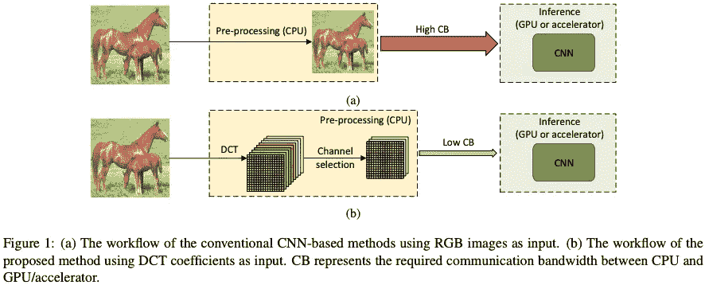
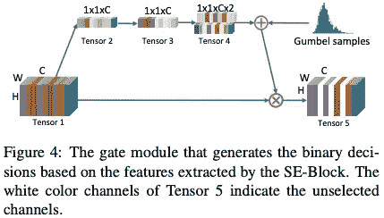
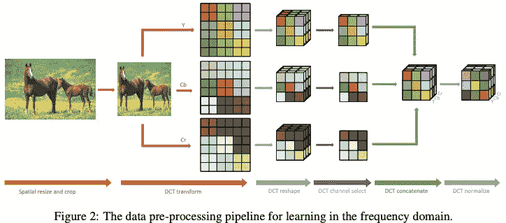
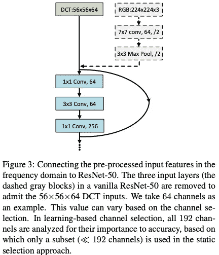
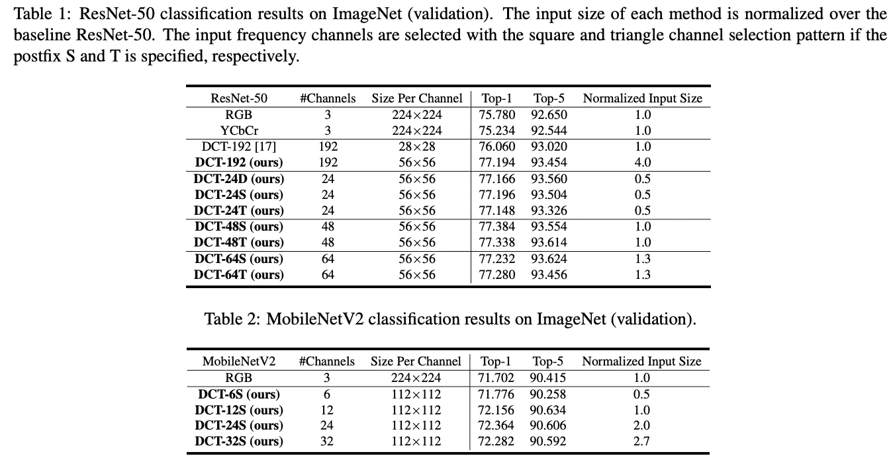
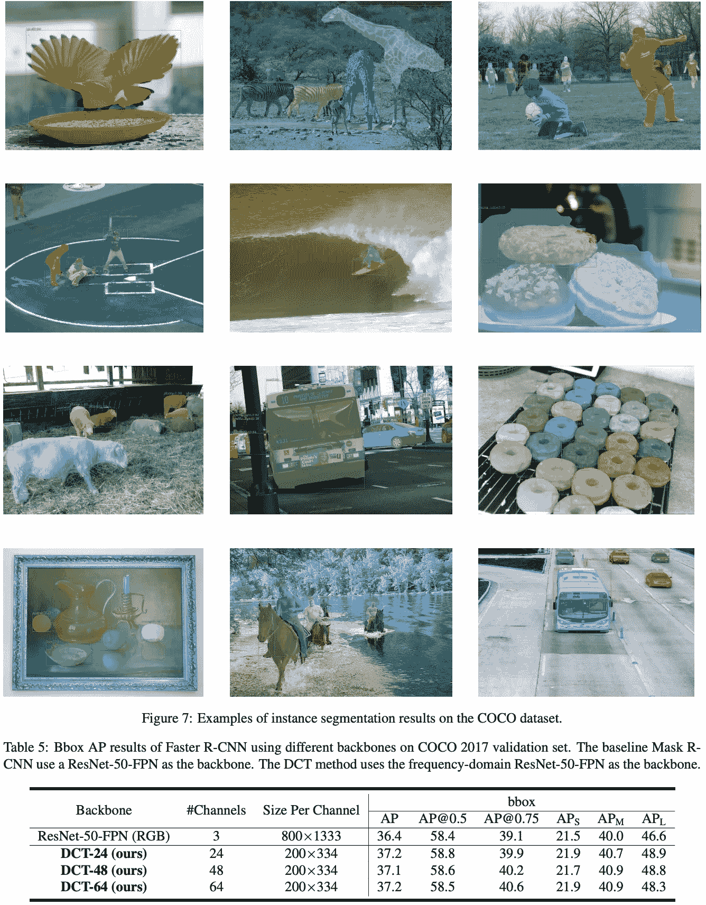

# 让我们像 JPEG 压缩一样压缩 CNN 训练

> 原文：<https://pub.towardsai.net/lets-compress-the-cnn-training-like-a-jpeg-compression-ca8237c56f3c?source=collection_archive---------3----------------------->

## [深度学习](https://towardsai.net/p/category/machine-learning/deep-learning)

IEEE CVPR 2020

由[弗兰基·查马基](https://unsplash.com/@franki?utm_source=medium&utm_medium=referral)在 [Unsplash](https://unsplash.com?utm_source=medium&utm_medium=referral) 上拍摄的照片

在这个故事中，介绍了阿里巴巴集团和亚利桑那州立大学在频域中的学习。这是作为 IEEE CVPR 2020 的技术论文发表的。本文提出了一种解决由于输入图像文件较大而导致图像大小转换为 224x224x3 时空间分辨率降低(信息量减少)问题的方法。使用离散余弦变换(DCT)系数作为输入方法比传统的空间下采样方法在预处理阶段更好地保留了图像信息，传统的空间下采样方法将图像大小调整为 224×224，这是大多数 CNN 模型的默认输入大小，并且在图像分类、对象检测和实例分割任务中实现了更好的准确性。结果表明，该方法提高了图像分类、目标检测和实例分割任务的准确性。它也是程序员友好的，因为它很容易实现，只需要对现有的 CNN 模型做很少的改变。

让我们看看他们是如何做到的。我只讲解 DCTNet 的精髓，所以如果你有兴趣阅读我的博客，请点击 [**DCTNet**](https://arxiv.org/abs/2002.12416) **和**[**Github**](https://github.com/calmevtime/DCTNet)[**。**](https://arxiv.org/pdf/1903.06391.pdf)

# 这篇论文说了什么？

通过将在 JPEG 压缩中使用的离散余弦变换(DCT)通道输入到 DNN 输入数据，图像大小可以通过将其变换到具有大分辨率的频域而直接输入到 DNN。与传统的图像输入方法相比，它还提高了 DNN 的准确性，同时保持输入数据量不变。

图 4 示出了 DCT 通道选择，其静态地选择如 JPEG 压缩中的低频通道，并且关注亮度分量而不是色度分量。与 JPEG 压缩一样，低频通道是静态选择的，重点放在亮度分量而不是色度分量上。这确保了具有最高激活概率的频道被馈送到 CNN 模型。

对于分类、检测和分割等各种任务，在预处理阶段，DCTNet 比下采样方法(调整图像大小)更好地保留了图像信息。结果，我们表明，它实现了准确性的提高。对于 ImageNet 分类任务，对于 ResNet-50 为+ 1.41%，对于 MobileNetV2 为+ 0.66%，对于对象检测和实例分割任务的 Mask R-CNN 为+ 0.8%。

# 方法学

基于频域模型，提出了一种基于学习的通道选择方法，以探索给定 CNN 模型的频谱偏差，即哪些频率分量更有利于后续的推理任务。为什么作者决定使用类似 JPEG 压缩的方法进行 DNN 预处理？作者通过实验得出这样的事实:人类视觉系统(HVS)对不同频率成分的敏感度是不相等的[Kim et al .，2017]，以及 CNN 模型对低频通道比对高频通道更敏感，这与 HSV 模型一致。

# DCTNet

高分辨率 RGB 图像首先转换到 YCbCr 色彩空间，然后转换到频域。相同频率的所有 2D DCT 系数分量被分组到一个通道中，以成为 3D DCT 立方体。这样就产生了多个频道。由于某些频率通道(如低频通道和亮度分量)对推断精度的影响比其他通道更大，因此只保留最重要的频率通道；在 YCbCr 颜色空间中选择的通道被组合以形成单个张量。最后，每个频率通道通过从训练数据集计算的均值和方差进行归一化，并将数据发送到 GPU 进行推理。

在图 2 中，调整了图像的大小，但是在 DCTNet 中，不需要调整图像的大小。

对于频域中的输入特征，在空间域中开发的所有现有 CNN 模型都可以以最小的修改来应用。具体地，如图 3 所示，只需要去除输入的 CNN 层，其余的残留块需要保留。第一残差层被用作输入层，并且输入通道的数量被修改以匹配 DCT 系数输入的维度。由于频域中的输入特征图在 *H* 和 *W* 维度上小于空间域中的输入特征图，而在 *C* 维度上大于空间域中的输入特征图，因此我们跳过传统 CNN 模型的输入层(步长-2 卷积)。如果在输入卷积之后有一个最大池操作符(例如 ResNet-50)，我们也跳过最大池操作符。然后，调整下一层的通道大小，以匹配频域中的通道数量。

# 结果

使用 Imagenet，表明与传统的图像输入方法相比，仅使用有益于 DNN 性能的 DCT 通道，同时保持输入数据量恒定，可以提高 DNN 精度。

类似地，通过仅使用适合 DNN 性能的 DCT 通道，可以在实例分割任务中实现高性能分割。

## 参考

[Kim et al .，2017] J. Kim 和 S. Lee，“图像质量评估框架中人类视觉敏感度的深度学习”，IEEE CVPR，2017。

[[DCTNet](https://arxiv.org/abs/2002.12416)][[Github](https://github.com/calmevtime/DCTNet)]徐国良、秦明敏、孙福峰、王永源、陈永源、任福峰，“频域中的学习”，IEEE 2020。

# 过去论文摘要列表

## 深度学习方法

**2020 年:【**[**DCTNet**](https://medium.com/towards-artificial-intelligence/lets-compress-the-cnn-training-like-a-jpeg-compression-ca8237c56f3c)**】**

## 不确定性学习

**2020:****[**DUL**](https://mako95.medium.com/cvpr2020-paper-summary-data-uncertainty-in-face-recognition-1f17547473a2)**

## ****异常检测****

******2020:【**[**FND**](https://medium.com/towards-artificial-intelligence/for-safety-reasons-self-driving-cars-must-not-miss-detecting-the-signs-bb26e65e721)****

## ******一级分类******

********2019:【**[**DOC**](https://medium.com/swlh/paper-summary-deep-one-class-classification-doc-adc4368af75c)******

********2020 年:【**[**DROC**](https://medium.com/the-shadow/exploring-important-feature-repressions-in-deep-one-class-classification-droc-d04a59558f9e)******

## ******图象分割法******

********2018:**[**【UOLO】**](https://medium.com/swlh/paper-summary-biomedical-image-segmentation-and-object-detection-uolo-c1175ba5c8c4)******

******2020 年:【**[**ssCPCseg**](https://medium.com/towards-artificial-intelligence/efficient-biomedical-segmentation-when-only-a-few-label-images-are-available-2e0b2513703d)**】******

## ****图像聚类****

******2020:**[**【DTC】**](https://medium.com/swlh/paper-deep-transfer-clustering-dtc-learning-to-discover-novel-visual-categories-ec5a26aea075)****