# 让我们掷硬币，或者随机性如何帮助证明定理

> 原文：<https://pub.towardsai.net/lets-flip-some-coins-or-how-randomness-can-help-with-proving-theorems-bbc789ab7d6a?source=collection_archive---------1----------------------->

## [数学](https://towardsai.net/p/category/mathematics)，[概率](https://towardsai.net/p/category/probability)

> 本文介绍了在无向切割中切割的概率方法。虽然我们会深入证明的细节，但需要最少的数学背景。

# 介绍

假设我们有一个无向图 *G = (V，E)* ，其中顶点集 *V* 的大小为 *N* ，边集 *E* 的大小为 *M* 。这种图的一个[割](https://en.wikipedia.org/wiki/Cut_(graph_theory))是将 *V* 分割成两组 *A* 和 *B* ，割的大小是被割的边数，即一个端点在 *A* 和一个端点在 *B* 的边数。为了理解这个定义，这里有一个简单的图的例子，它有 5 个顶点和 6 条边，以及一个相应的尺寸为 5 的切割。

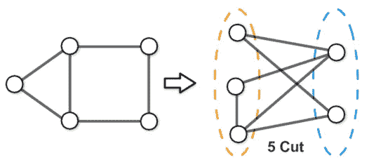

一个切割在图中的样子的例子。【来源:Stephan Eidenbenz 的图片，在此找到:[https://www . research gate . net/figure/An-illustration-of-the-max cut-problem _ fig 19 _ 324472130】](https://www.researchgate.net/figure/An-illustration-of-the-MaxCut-problem_fig19_324472130)

我们现在提出以下要求。

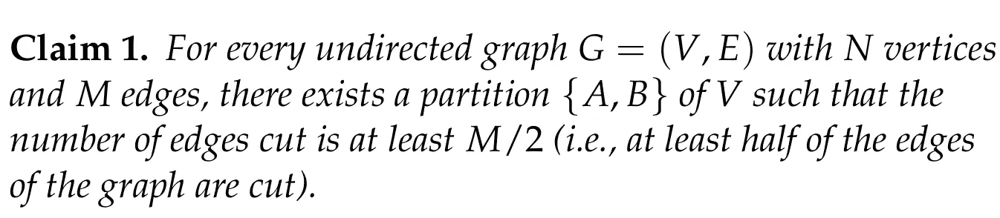

有许多方法来证明这种说法，特别是，有一个贪婪的程序，总是计算这样的划分；这为上述主张提供了一个建设性的证据。今天，我们将讨论一个利用随机性的证明。基本的想法很简单，但是很聪明。我们首先观察所讨论的对象集(即顶点集 *V* 的所有可能的二分)是有限的；特别是，我们有

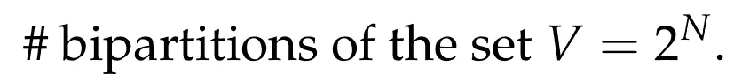

既然没有明显的理由来争论所有这些削减，随机性就来了。如果我们简单地选择一个图的随机切割，并计算在这样一个随机切割中期望切割的边的数量，会怎么样？

让我们先来看看为什么这实际上会有帮助。假设，不知何故，我们可以计算从所有切片中随机均匀采样的切片****的 [**预期**](https://en.wikipedia.org/wiki/Expected_value) 尺寸 *T* ，此外，让我们假设 *T* 至少是 *M/2* 。那是什么意思？这意味着，如果我们查看所有可能的切割，将它们的尺寸相加(即每次切割中切割的边数)，然后用其项数对该总和进行平均，则得到的数目至少为 *M/2* 。让我们试着扩展一下。如上所述，不同的二分的数量是 *2^N* 。嗯，如果我们假设 *V* 的二分图是有序对 *(A，B)* ，那就是真的。但是，很容易看出，在分区 *(A，B)* 中切割的边的数量与在分区 *(B，A)* 中切割的边的数量相同。因此，我们可以假设分区 *A，B* 是无序的，因此我们得出结论，不同的可能切割的数量是****

****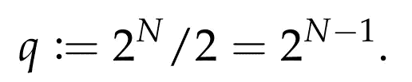****

****现在让 *t(1)，…，t(q)* 表示在所有这些不同分区中切割的边的数量。从前面的讨论中，我们了解到****

****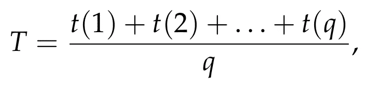****

****并且这个数字被假定(目前)至少是 *M/2* 。我们现在声称，这已经表明，一定存在一个至少为 *M/2* 的项 *t(i)* 。为了看到这一点，假设相反，即假设对于每一个 *j = 1，…，q* ，t(j) < M/2 。这意味着****

****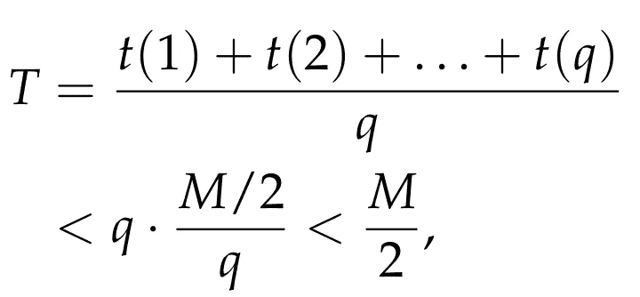****

****所以我们得到了一个矛盾！我们刚刚展示的只是一般的观察，如果一个[随机变量](https://en.wikipedia.org/wiki/Random_variable)的平均值/期望值等于某个值 *Z* ，那么一定存在一个事件对应于至少是 *Z* 的随机变量。****

****到目前为止，整个讨论表明，如果我们计算随机均匀采样的切割的预期尺寸，并且该预期尺寸结果是至少 *M/2* ，那么这确定性地表明，即总是存在尺寸至少为 *M/2* 的切割。换句话说，我们只是用随机性和期望来证明一个断言是**总是**真！这是现在被称为 [**概率方法**](https://en.wikipedia.org/wiki/Probabilistic_method) **背后令人惊讶的简单想法，由伟大的** [**保罗·鄂尔多斯**](https://en.wikipedia.org/wiki/Paul_Erd%C5%91s) 推广。****

# ****更多的细节****

****然而，还有一个潜在的大问题。我们如何计算随机切割的预期尺寸？事实证明，有一种非常简单的方法可以做到这一点！我们将使用 [**独立随机掷硬币**](https://en.wikipedia.org/wiki/Bernoulli_trial) **！******

********

****更准确地说，我们将看到如何使用独立的随机硬币来“生成”所有可能的二分分布 *{A，B}* 。如上所述，这种二分的总数是 *q = 2^(N-1)* 。下面是一个简单的方法:****

*   ****对于 *V* 的每个顶点 *u* ，我们抛一个独立的无偏硬币，如果是正面，我们将顶点 *u* 添加到集合 *A* 中，否则，如果得到反面，我们将顶点 *u* 添加到集合 *B* 中。****

****我们现在做一个健全性检查。来固定一个二分 *{A，B}* 。如果对于 *A* 中的每个顶点 *u* ，相应的硬币投掷结果是正面，并且对于 *B* 中的每个顶点 *v* ，相应的硬币投掷结果是反面，则上述随机过程产生这种精确的二分。因为所有的硬币投掷都是无偏和独立的，所以产生给定的二分图 *{A，B}* 的概率正好是****

****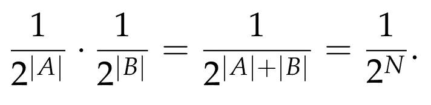****

****等等，这不是我们想要的。嗯，和前面类似(计算 *q)* 时)，以上是我们得到二分图 *{A，B}* 为有序二分图 *(A，B)* 的概率。如前所述，顺序并不重要，因此我们也可以得到相同的二分图 *{A，B}* ，如果对顶点 *A* 的所有掷硬币结果都是反面，对顶点 *B* 的所有掷硬币结果都是正面。因此，得到{ *A，B}* 的结果概率是上面计算的概率的 *2* 倍，因此它正好等于 *1/q* 。我们的结论是，上述随机过程在图的所有切割中生成了一个统一的样本！****

****然而，目前还不清楚上述抛硬币的方法会有什么帮助。我们声称现在很容易计算随机切割的预期尺寸。为此，我们使用了指示器随机变量这一极其有用的概念。设 *X* 表示从上述掷硬币过程中随机抽取的切割尺寸。注意 *X* 是随机变量， *E[X] = T* ，其中 *E[X]* 表示随机变量 X 的期望值，我们现在对图的边任意排序。设 *e(1)，…，e(M)* 是这样一个排序。对于图的每条边 *e(i)* ，我们进一步定义了随机变量 *X(i)* ，如果边被切割，则等于 *1* ，否则等于 *0* 。现在很容易看出这一点****

****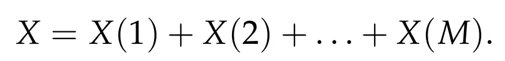****

****快到了！我们现在将使用期望值的极其有用的属性，它被称为 [**期望值的线性度**](https://en.wikipedia.org/wiki/Expected_value#Basic_properties) 。这只是说两个随机变量(不一定独立)之和的期望值总是等于这两个随机变量的期望值之和(假设对应的期望值存在，我们的例子就是这种情况，我们很快就会看到)。把它应用到我们的案例中，我们得到了****

****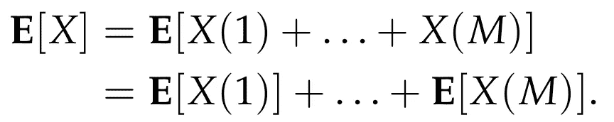****

****所以，我们现在不得不担心在上面的总和中计算每个期望值。我们声称所有这些项都是相同的，并且等于 *1/2* 。为了看到这一点，让我们固定图的一条边 *e=(u，v)* 。边缘被切割的概率有多大？嗯，为了切边， *u* 必须在 *A* 中， *v* 在 *B* 中，或者 *u* 必须在 *B* 中， *v* 在 *A* 中。 *u* 在 *A* 而 *v* 在 *B* 的概率有多大？很容易看出是 *(1/2)(1/2) = 1/4，*因为抛硬币是独立的。同理， *u* 在 *B* 中， *v* 在 *A* 中的概率为 *1/4* 。因此，边缘 *e* 被切割的概率为 *1/2* 。这意味着如果 *X(e)* 是对应于边缘 *e* 的随机 0/1 变量，那么****

****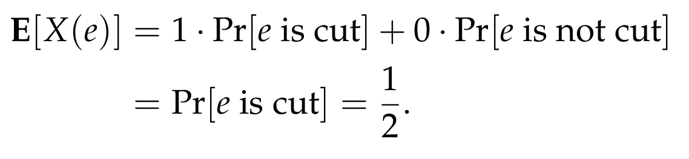****

****因为我们没有假设任何关于边 *e* 的细节，所以上面的论证适用于图的每一条边。我们的结论是****

****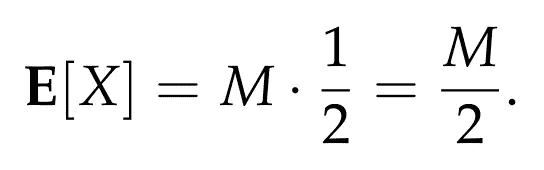****

****把所有的东西放在一起，我们证明了如果我们随机均匀地抽样一个随机切口，切口的期望尺寸是 *M/2* ，因此，一定存在一个尺寸至少为 *M/2* 的切口。索赔终于被证明了！****

*****注意:使用均匀分布对于该方法的应用不是必需的。但在许多情况下，它确实使分析变得更简单，就像这里的情况一样。*****

# ****结论****

****以上是简单而巧妙的概率方法的一个例子。这种方法有许多应用，在证明离散数学中许多有趣的结果时，它被证明是极其有用的。如果你有兴趣了解更多关于这种方法的知识，标准的参考资料是诺加·阿隆和乔尔·h·斯潘塞的美丽的书，名为“概率方法”！****

****在未来的文章中，我们会给出一些稍微复杂一点的例子。****

****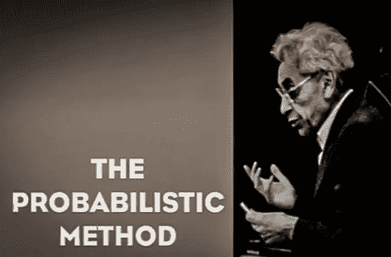****

****《概率方法》书的部分封面，上面有保罗·鄂尔多斯的照片。****

******参考文献******

*   ****[https://en.wikipedia.org/wiki/Probabilistic_method](https://en.wikipedia.org/wiki/Probabilistic_method)****
*   ****[https://en.wikipedia.org/wiki/Maximum_cut](https://en.wikipedia.org/wiki/Maximum_cut)****
*   ****乔尔·h·斯潘塞:概率方法，第三版。威利 2008，国际标准书号 978–0–470–17020–5****