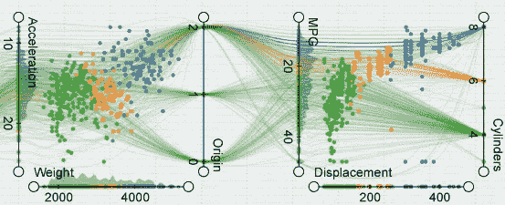
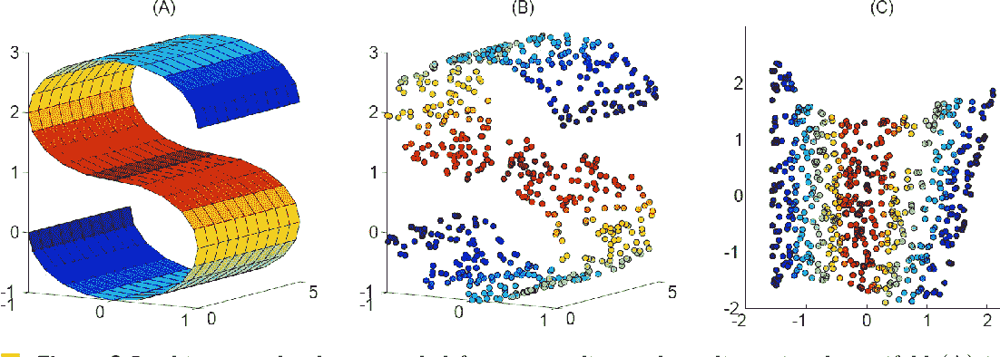

# 让我们来学习降维

> 原文：<https://pub.towardsai.net/lets-learn-about-dimensionality-reduction-df4622f30c84?source=collection_archive---------1----------------------->

## [机器学习](https://towardsai.net/p/category/machine-learning)

由[亨特·哈里特](https://unsplash.com/@hharritt?utm_source=unsplash&utm_medium=referral&utm_content=creditCopyText)在 [Unsplash](https://unsplash.com/s/photos/data?utm_source=unsplash&utm_medium=referral&utm_content=creditCopyText) 上拍摄的照片

> **什么是维度？**

统计学中的维数指的是“一个数据集有多少属性。”

例如:-我们有电子表格格式的数据，并且我们有大量的变量(年龄、姓名、性别、Id 等等..).

简而言之，“数据集的输入变量或特征的数量被称为其维度。”

> **为什么要降维？**

**降维**或**降维**，是将数据从高维空间转换到低维空间，使低维表示保留原始数据的一些有意义的属性，在高维空间工作可能出于多种原因不可取；由于维数灾难，原始数据通常是稀疏的，并且分析数据通常在计算上是困难的。降维在处理大量观察值和/或大量变量的领域中很常见，例如信号  处理、语音  识别、神经信息学和生物信息学。

在现实世界中，我们会遇到一些问题，真实数据中我们经常会有高达数百万的高维数据，在这种高维结构中，数据代表了数据本身，但有时我们需要降低其维数

> **功能多有什么不好？**

**高维数据**

[http://vis.pku.edu.cn/hdvis/images/gallery/Jigsaw_13.png](http://vis.pku.edu.cn/hdvis/images/gallery/Jigsaw_13.png)

高维意味着维数很高——高到计算变得极其困难。在高维数据中，特征的数量可以超过观察的数量。

“在完美的世界中，列数就是数据集的维数。然而，一些列是相似的，一些是相关的，一些在某些方面是重复的，一些是无用的。所以使用所有这些列对于我们的机器学习算法或深度学习算法来建立模型和预测输出没有任何意义。

更多的输入特征通常使预测建模任务更具建模挑战性，它被称为“维数灾难”。

> **维度的诅咒:**

**维度诅咒**指的是在高维空间中分析和组织数据时出现的各种现象，这些现象不会在低维设置中出现，例如日常经验的三维物理空间。这个表达是由 Richard E. Bellman 在考虑动态编程中的问题时创造的。[维基]

听起来很复杂，对吧？**我们来分解一下**

基本上，维数灾难指的是“误差随着特征数量的增加而增加”,意味着更多的特征趋向于更多的误差，这意味着算法在高维空间中更难设计，并且通常在多维空间中具有指数运行时间

> **应用降维的好处**

[https://d3i 71 xaburhd 42 . cloudfront . net/8d C7 a 7 af 1685d 6667d 24 f 013 ECC 5 fceeb 2 bcc 689/250 px/7-figure 2-1 . png](https://d3i71xaburhd42.cloudfront.net/8dc7a7af1685d6667d24f013ecc5fceeb2bcc689/250px/7-Figure2-1.png)

*   通过减少要素的维度，存储数据集所需的空间也会减少。
*   特征维数的减少需要较少的计算训练时间。
*   数据集要素的降维有助于快速可视化数据集。
*   它移除了多余的特征，并在多重共线性中帮助我们。

> **降维的缺点**

马库斯·温克勒在 [Unsplash](https://unsplash.com/s/photos/data?utm_source=unsplash&utm_medium=referral&utm_content=creditCopyText) 上拍摄的照片

虽然我们在使用降维方面有很多进步，但也有一些缺点

*   一些数据可能会丢失，我们不知道要保留多少主成分。
*   在降维技术中的一些方法，如 PCA，有时需要考虑的主成分是未知的。
*   此外，PCA 在许多情况下会失败，例如，如果均值和协方差不足以定义数据集。

> **用于降维的技术:**

在本文中，我们将学习降维技术的各种方法，因此在接下来的文章中，我们将学习如何使用 Python 实现它们。

> **特征选择方法**

*   缺失值比率
*   低方差滤波器
*   高相关滤波器
*   随机森林
*   反向特征消除
*   正向特征选择

> **降维方法**

*   要素分析
*   主成分分析*
*   线性判别分析(LDA) *
*   t 分布随机邻居嵌入(t-SNE) *

如果这些方法/特性现在对你没有任何意义，不要担心。我将通过实际的实现来解释每一种特征选择和降维的方法

暂时就这样了👏👏。下一篇文章再见。

> 参考:-

[https://www . kdnugges . com/2015/05/7-methods-data-dimensionally-reduction . html](https://www.kdnuggets.com/2015/05/7-methods-data-dimensionality-reduction.html)

[https://analyticsindiamag . com/cur-of-dimensionality-and-what-success-it/](https://analyticsindiamag.com/curse-of-dimensionality-and-what-beginners-should-do-to-overcome-it/)

**在我的 YouTube 上查看更多有趣的机器学习、深度学习、数据科学项目👉:-**[**YouTube**](https://www.youtube.com/c/himanshutripathi)**(👍)**

> ****看看我以前的文章:****

** [## 机器学习自动化…

### "仅仅因为你能使某件事自动化，并不意味着它就应该自动化."

medium.com](https://medium.com/nerd-for-tech/machine-learning-automation-1c112e099005)  [## 基于网页视觉相似性的产品推荐:机器学习项目…

### 众所周知，谷歌、亚马逊、网飞等大型科技公司都在使用推荐系统…

medium.com](https://medium.com/@iamhimanshutripathi0/product-recommendation-based-on-visual-similarity-on-the-web-machine-learning-project-end-to-end-6d38d68d414f)  [## Web 上印度语言(印地语)的自然语言处理(NLP)

### "语言是一个秘密，每个人都可以处理，对我来说，这是美丽的."

medium.com](https://medium.com/datadriveninvestor/natural-langauge-processing-nlp-for-indian-language-hindi-on-web-64d83f16544a)  [## 什么是平衡和不平衡数据集？

### 不平衡数据集到平衡数据集的转换技术及其比较

medium.com](https://medium.com/analytics-vidhya/what-is-balance-and-imbalance-dataset-89e8d7f46bc5)  [## 基于迁移学习的脑肿瘤分类

### 迁移学习的详细解释以及如何使用它进行分类

medium.com](https://medium.com/analytics-vidhya/brain-tumor-classification-transfer-learning-e04f84f96443)  [## 用于分类变量编码的不同类型的特征工程编码技术

### “让我们从现有功能中创建新功能。”

medium.com](https://medium.com/analytics-vidhya/different-type-of-feature-engineering-encoding-techniques-for-categorical-variable-encoding-214363a016fb) 

如果你觉得这篇文章有趣，有帮助，如果你从这篇文章中学到了什么，请鼓掌👏👏)**并留下反馈。**

**我们连线上**[**Linkedin**](https://www.linkedin.com/in/iamhimanshu0/)**[**Twitter**](https://twitter.com/iam_himanshu0)**[**insta gram**](https://instagram.com/iamhimanshu0/)**[**Github**](https://github.com/iamhimanshu0)**[**脸书**](https://www.facebook.com/iamhimanshu0) **。**********

******感谢阅读！********