# 让我们与气流协调—一步一步的气流实施

> 原文：<https://pub.towardsai.net/lets-orchestrate-with-airflow-step-by-step-airflow-implementations-8100d8fe58b0?source=collection_archive---------0----------------------->


Sachin C Nair 的照片:[https://www . pexels . com/photo/falls-during-sunset-954929/](https://www.pexels.com/photo/waterfalls-during-sunset-954929/)

您将在本地环境中用气流编排 ***ETL 工作流*** ，而无需下载**任何东西**。

您将使用 ***Bash 运算符*** ， ***Python 运算符*** ， ***任务装饰器*** ，以及其他 ***气流*** 函数。

您将获得数据，将其加载到 ***PostgreSQL*** 数据库，并在几分钟内通过 **pgAdmin** 查看。

你将使用 ***Docker*** 容器做任何事情。

简单易懂、循序渐进的解释。你会喜欢的。

# 内容

[**简介**](#8029)

[**Airflow-Lite 本地环境版本**](#59c9)

[**有向无环图**](#531b)

[**数据— TLC 跳闸记录数据**](#4da4)

[**获取数据**](#1142)

[**提取&加载数据**](#a118)

[与**同**与](#96a8)

[**万一…？**](#f697)

[**DAG 每月运行**](#05a6)

[**结论**](#84bd)


[https://airflow.apache.org/](https://airflow.apache.org/)

# 介绍

" Airflow 是一个由社区创建的平台，用于以编程方式创作、调度和监控工作流."([https://airflow.apache.org/](https://airflow.apache.org/))

气流是最著名的工作编排工具之一。

在本教程中，我们将讨论本地环境中的气流实现。

我们将使用 [**气流 Docker Lite 安装**](https://medium.com/towards-artificial-intelligence/you-can-install-airflow-with-docker-in-minutes-66a3de44374f) 。

我们将从源中获取数据，将其转换并加载到 ***PostgreSQL*** 数据库中，并用 ***pgAdmin*** 查看。

我们开始吧。


图片来源:[https://giphy.com/](https://giphy.com/)

# 本地环境中的气流精简版

[**在上一篇文章**](https://medium.com/towards-artificial-intelligence/you-can-install-airflow-with-docker-in-minutes-66a3de44374f) 中，我们讨论了用 Docker 进行气流安装的两种不同的简易安装选项。

我们看到我们用 Docker 在几分钟内安装了 Airflow。

对于 Airflow Lite 安装，我们只安装了三个主要组件。

✅ **气流调度器**:调度器监控任务和 Dag

✅ **气流-网络服务器**:网络服务器服务于本地主机:8080

✅ **Postgres** :数据库

在本教程中，我们将使用 Airflow Lite 安装。

对于分步气流，建兴安装教程: [**点击这里**](https://medium.com/towards-artificial-intelligence/you-can-install-airflow-with-docker-in-minutes-66a3de44374f) 。

让我们用 Docker 安装 Airflow Lite 版本。

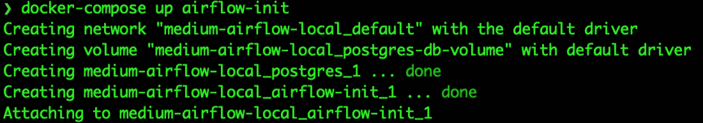

作者捕获的图像

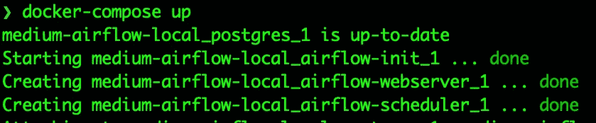

作者捕获的图像

让我们检查一下集装箱。

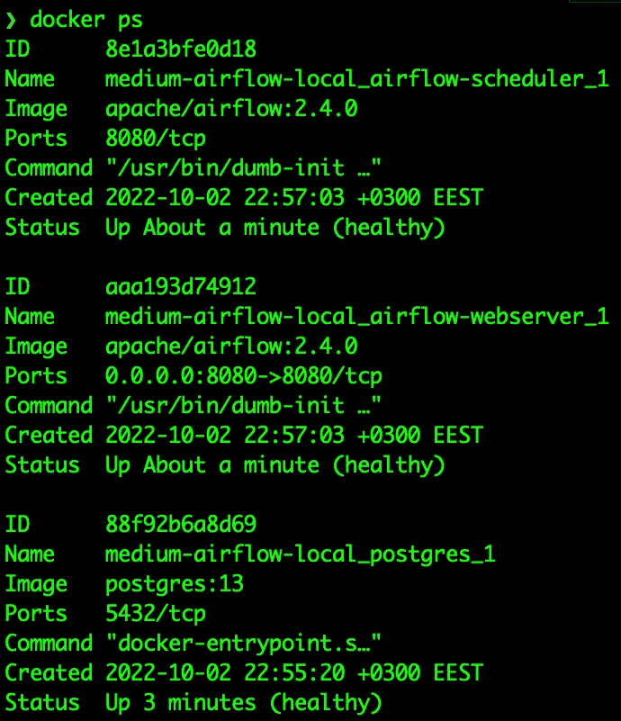

作者捕获的图像

最后，让我们看看 web 服务器。

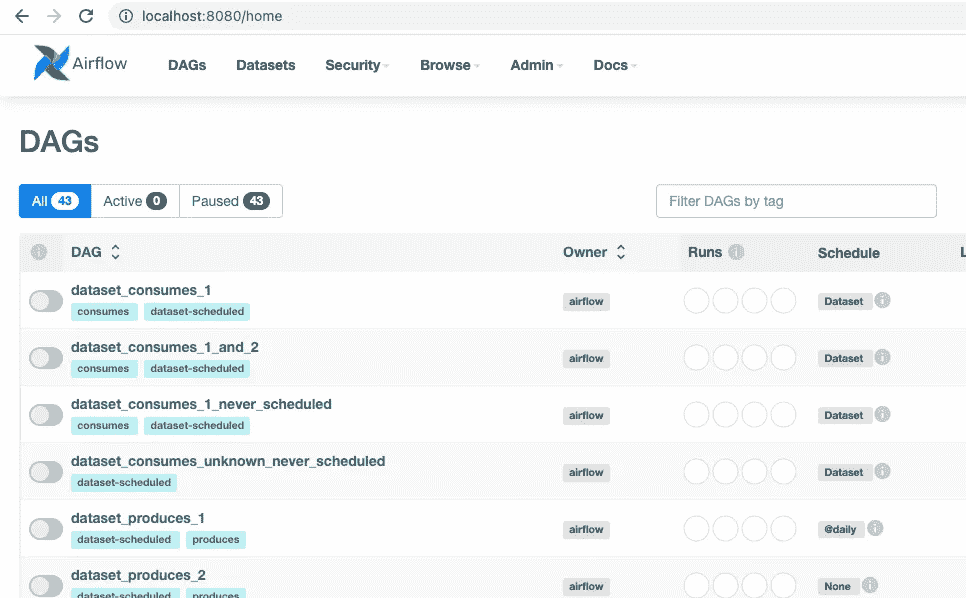

作者捕获的图像

一切似乎都没问题。我们有样品。

让我们简单地提一下 Dag，然后开始我们的工作流程。

# 有向无环图

“在 Airflow 中，DAG——或有向非循环图——是您想要运行的所有任务的集合，以反映它们的关系和依赖性的方式组织。

DAG 是在 Python 脚本中定义的，它将 DAG 结构(任务及其依赖项)表示为代码。"([参考链接](https://airflow.apache.org/docs/apache-airflow/1.10.10/concepts.html#:~:text=In%20Airflow,%20a%20DAG%20%E2%80%93%20or,and%20their%20dependencies)%20as%20code.))

DAG 是小任务的组合，用于执行更大的任务。

DAG 是定义该 DAG 中的任务的脚本。

DAG 包含气流的信息，以确定 DAG 结构的执行。

DAG 的非循环部分是值得一提的重要一点。任务以有指导的方式一个接一个地进行。
任务执行中没有循环(见下图)。

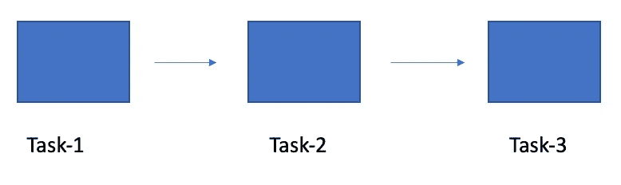

作者代表作:)

# 数据— TLC 行程记录数据

在本教程中，我们将使用 ***TLC 记录黄色出租车的行程*** 。

黄色和绿色出租车行程记录包括捕捉上下车日期/时间、上下车位置、行程距离、分项费用、费率类型、付款类型和驾驶员报告的乘客数量的字段([参考链接](https://www1.nyc.gov/site/tlc/about/tlc-trip-record-data.page))

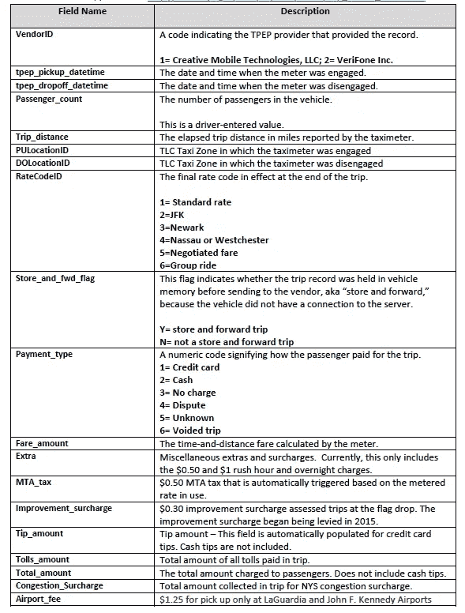

数据字典—黄色出租车出行记录—[https://www1 . NYC . gov/assets/TLC/downloads/pdf/data _ Dictionary _ Trip _ Records _ Yellow . pdf](https://www1.nyc.gov/assets/tlc/downloads/pdf/data_dictionary_trip_records_yellow.pdf)

我们的数据将覆盖 2022 次黄色出租车出行记录(1-6 月)。

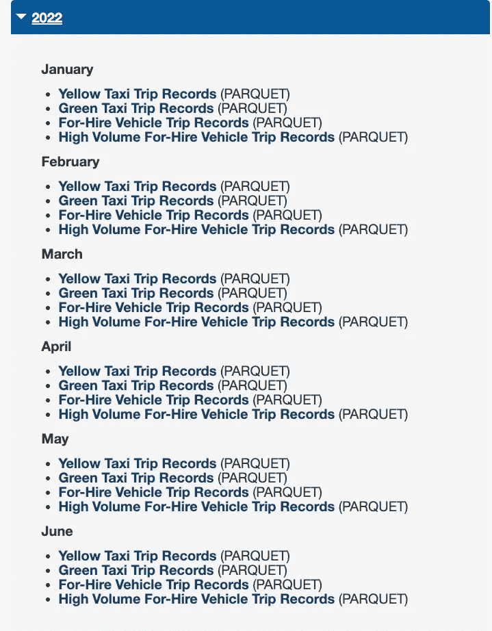

[https://www1 . NYC . gov/site/TLC/about/TLC-trip-record-data . page](https://www1.nyc.gov/site/tlc/about/tlc-trip-record-data.page)

好的。我们了解我们的数据，并对 Dag 有一个基本的了解。

是时候用 Dag 构建我们的工作流了。

# 获取数据

在我们的第一个 DAG 的帮助下，我们将获得 2022 年 1 月黄色出租车出行记录。

我们来详细看看。

我们称我们的工作流为' ***data_extract*** '

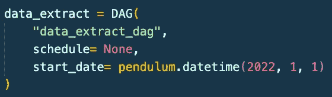

作者拍摄的图像。

它从 DAG 定义开始。

在括号中，我们将 dag 标记为(“数据提取 DAG”)

这是一次性的工作流程。

我们将从数据源下载一次数据。

我们不打算以后安排任何其他工作流程。

为此，我们将' ***None*** '放入 ***schedule*** 部分。

我们的工作流程开始时间是 2022 年 1 月 1 日。

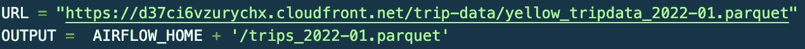

作者捕获的图像

我们定义了 URL 地址和输出文件的位置。

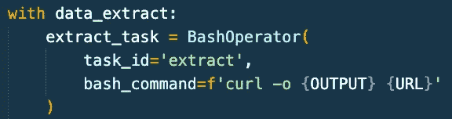

作者捕获的图像

最后，我们把我们的 ***任务*** 放在 data_extract DAG 下。

提取任务将从数据源下载数据，并将其放入定义的输出文件夹中。

我们将使用 ***BashOperator*** 。

**操作人员**在气流中有一项工作要做。比如 ***python 操作符*** 运行 python 函数。

DAG 协调这些运算符。

在这种情况下，带有 curl 命令的 Bash 操作符将下载该文件。

我们把它命名为'***data _ extract _ Dag . py***'并把它放在。/dags 文件夹。

每当我们将“data_extract_dag.py”文件放在 dags 文件夹下时，我们的“data _ extract”DAG 就会自动出现在 Airflow GUI 上。

🛑如果它没有自动出现，没什么好担心的，给它几秒钟时间让它出现。

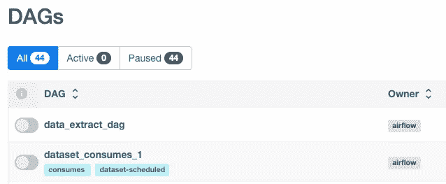

作者捕获的图像

dag 的标签('***data _ extract _ DAG***')与气流示例 DAG 一起出现。

让我们点击'***data _ extract _ Dag***'看看里面有什么。

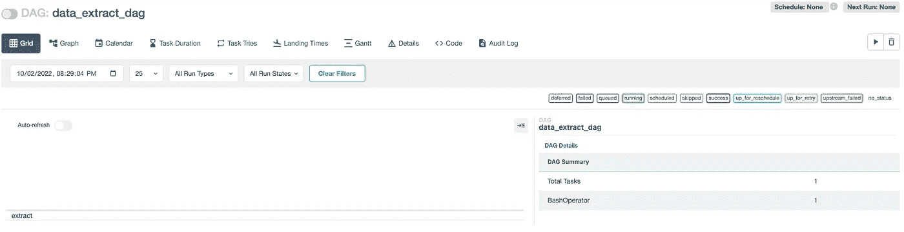

作者捕获的图像

DAG 只有一个任务，就是' ***提取'***

***痛击符*** 会处理它。

让我们触发 DAG 并启动它。

当 DAG 完成时，它将向我们报告状态(成功或失败)。


作者捕获的图像

我们已经成功了。

让我们看看这条狗的日志。

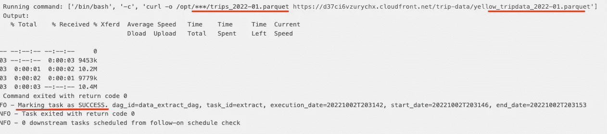

作者捕获的图像

***Bash 操作符*** 从 URL 中提取数据并保存到定义的输出文件夹中。

任务标记为' ***成功*** '

让我们在容器的输出文件夹中查看下载的文件。


作者捕获的图像

我们进入了 Airflow Docker 容器，并列出其中的文件。

我们看到了下载的'***trips _ 2022–01 . parquet***'文件。

让我们从命令行检查这些信息的有效性。

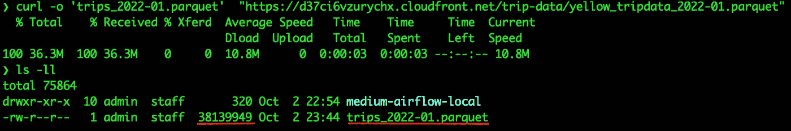

作者捕获的图像

信息匹配。我们已经成功完成了第一个工作流程。

# 额外小费

为了简单起见，我禁用了 ***气流预载示例*** 。

如果您想要禁用气流预载示例，请遵循下面的快照。

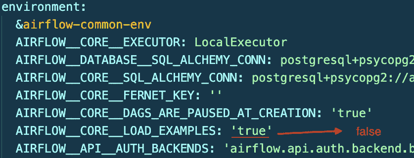

作者捕获的图像

在 docker-compose YAML 文件中，使 load _ examples→'***false***'。

使用 **docker-compose down** 命令停止集装箱。

并使用 **docker-compose up** 命令用更新的 YAML 文件启动容器。

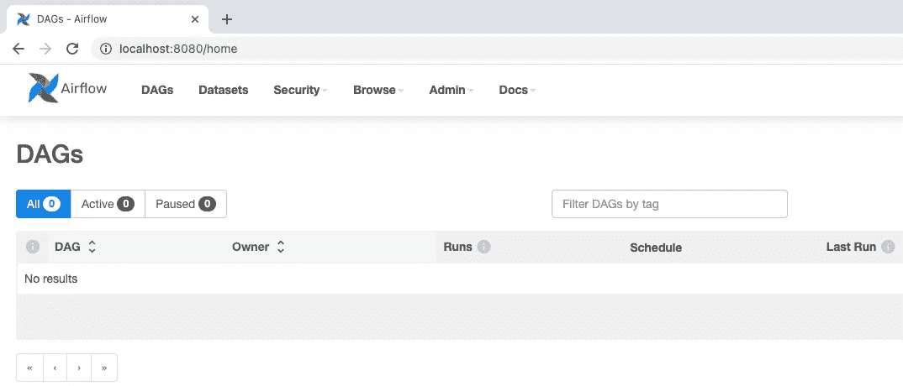

作者捕获的图像

Airflow GUI 将在没有任何预加载示例的情况下启动。


图片来源:[https://giphy.com/](https://giphy.com/)

# 提取和加载数据

我们已经从数据源中提取了数据，并将其保存到定义的输出文件夹中。

第二个 DAG 会将数据加载到 PostgreSQL 数据库。

我们将把带有 Postgres 映像的新服务添加到 Airflow Lite 安装 YAML 文件中。

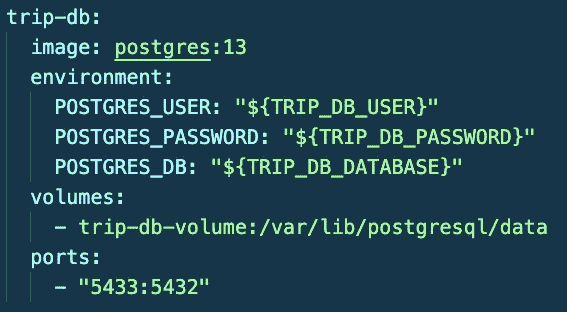

作者捕获的图像

我们有一个名为' ***trip-db*** 的新服务

第二个 DAG 会将数据加载到 ***trip-db*** 服务上的数据库。

我们制作了几个环境变量，并把它们放入 ***。env* 文件**文件。

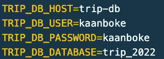

作者捕获的图像

第二个 DAG 将管理以下工作流:

1.  提取数据(使用第一个 DAG 完成)
2.  给熊猫读拼花文件
3.  将 SQL Alchemy 引擎连接到 PostgreSQL 数据库服务器
4.  将旅行记录放入 PostgreSQL 数据库。

在 Python 的帮助下，我们将这些句子放入一个 Python 函数中([引用链接](https://airflow.apache.org/docs/apache-airflow/stable/best-practices.html))。

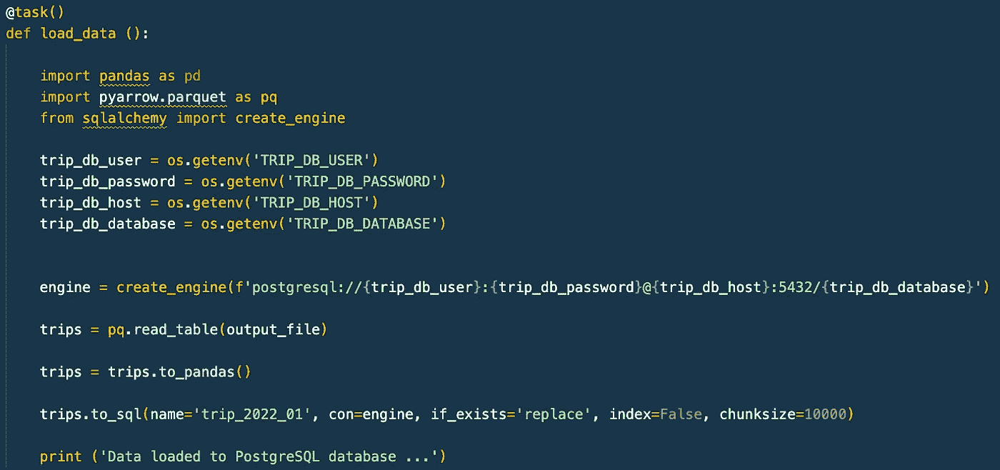

作者捕获的图像

按照 Airflow 官方文档的建议，我们将库放入到 ***修饰的 Python 函数中。*** ( [参考链接](https://airflow.apache.org/docs/apache-airflow/2.4.1/best-practices.html#top-level-python-code))。

该函数将调用环境变量。

该函数将通过***SQL Alchemy******create _ engine***连接到 ***PostgreSQL*** 数据库。

我们按照官网的 PostgreSQL 连接形式。([参考链接](https://www.postgresql.org/docs/current/libpq-connect.html#LIBPQ-CONNSTRING))

并读取输出文件，将其放入 ***熊猫*** 中。

最后，用 ***pandas to_sql*** 函数，将行程记录加载到 ***PostgreSQL*** 数据库中。

***pandas to_sql*** 函数将使用 ***chunksize*** 参数，小块大小为 ***10.000*** 。

🛑根据你的本地计算机能力，随意增加块的大小。

该功能的最后是一个控制打印功能。

对于这个任务，我们将使用 ***任务装饰器*** 。

***Python 修饰的运算符*** 将执行 ***load_data*** 函数。

我们之前提到过，一个操作员主要有一项工作。

Python 修饰的操作符将执行'***load _ data***' Python 函数。

让我们把 ***提取 _ 数据 _ 任务*** 和 ***加载 _ 数据 _ 任务*** 都放在 ***数据 _etl*** DAG 下。

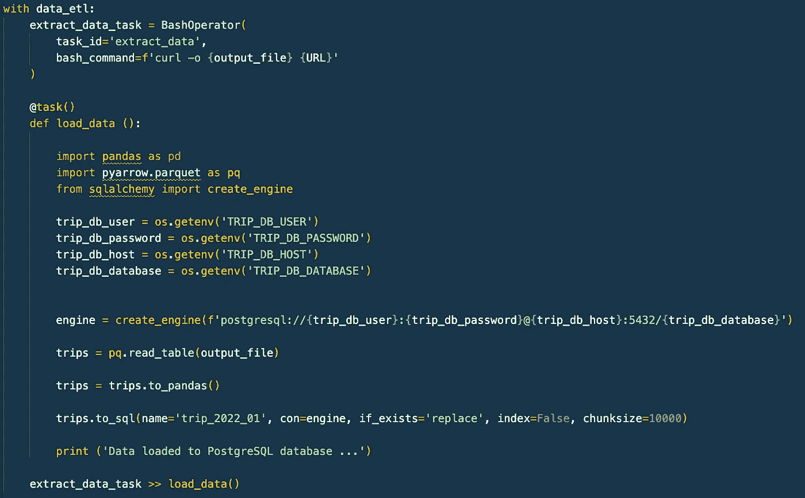

作者捕获的图像

我们将新的 DAG 命名为 data_etl。

***data_etl DAG*** 有两个任务。

***Bash 操作符*** 将处理提取数据的任务。

***Python 修饰的操作符*** 将处理加载数据任务。

最后，我们有了任务的顺序。

***提取 _ 数据 _ 任务> >加载 _ 数据()***

首先，将完成 extract_data_task，然后将执行 load_data 函数。

姑且命名为'***load _ data _ Dag . py***'放在 ***下吧。/dags* 文件夹。**

并使用更新版本的***docker-compose YAML***文件启动容器。

让我们转到气流图形用户界面，看看我们的第二个 DAG 的行动。

每当我们将新编写的 DAG 文件放在。/dags 文件夹，Airflow DAGs 会捕捉它( ***取决于互联网连接，可能需要几秒钟*** )。

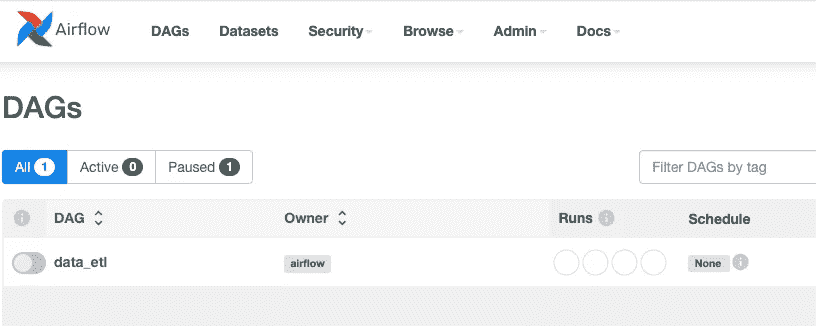

作者捕获的图像

“数据-ETL”Dag 出现在 Airflow GUI 上。

让我们点击它来查看它的任务。

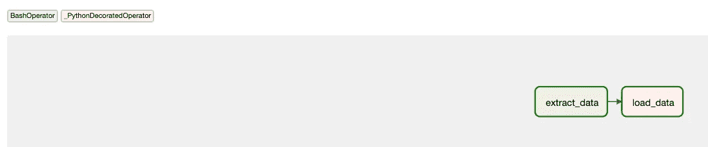

作者捕获的图像

“数据 etl”有两个任务。e **提取数据**和 l **加载数据**。

让我们激活 DAG 并启动工作流。

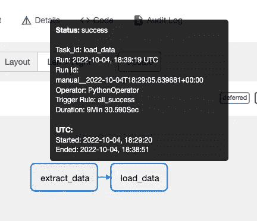

作者捕获的图像

工作流成功完成。

让我们看看日志。

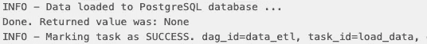

作者捕获的图像

它打印出我们的控制打印功能

(' ***数据加载到 PostgreSQL 数据库…*** ')

此外，我们观察到加载任务被标记为**成功**。

让我们去集装箱，看看那里的一切。

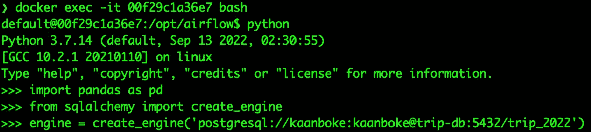

作者捕获的图像

统计 2022 年 1 月 1 日的出行记录。

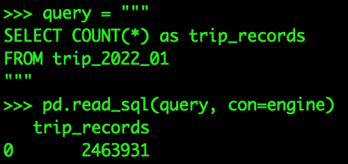

作者捕获的图像

数据有 2.463.931 条记录。

让我们看看表中的 10 条记录

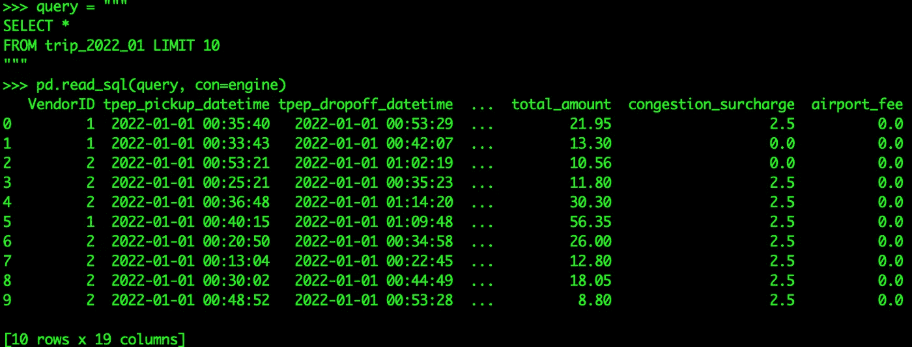

作者捕获的图像

我们已经成功地从源中提取了数据，并将其加载到 PostgreSQL 数据库中。

我们在 PostgreSQL 数据库上进行 SQL 查询。

很高兴在终端上看到查询，但我们可以做得更好。

是时候使用 PostgreSQL 最著名的管理工具之一来查看旅行记录并进行 SQL 查询了。

# 使用 pgAdmin


图片来源:[https://pgadmin.ilog.ch/](https://pgadmin.ilog.ch/)

***pgAdmin*** 是一款针对 Postgres 的管理工具。

我们将使用***pg admin Docker image***在我们的浏览器上使用 ***pgAdmin*** 。

我们不需要进行大量的安装过程。

我们将只在 docker-compose 中添加几行 pgAdmin Docker 映像的定义。YAML 档案。

然后我们就可以在 ***pg_admin*** 上看到我们的行程记录了。

我们开始吧。

首先，我们需要创建两个环境变量。

我们将把它们放入 ***。env*** 文件。


作者捕获的图像

我们将把它们与 pgAdmin Docker 图像([参考链接](https://www.pgadmin.org/docs/pgadmin4/latest/container_deployment.html))一起使用

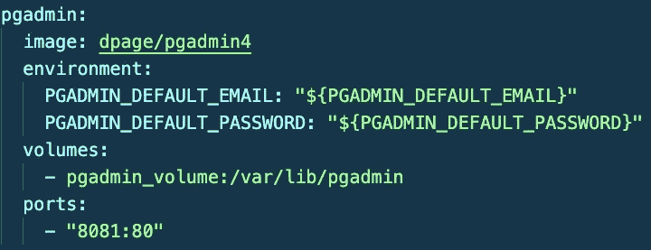

作者捕获的图像

***docker-compose。YAML 的*** 文件将得到***pg admin***docker 图像。

它将使用电子邮件和密码通过定义的端口号连接到网络浏览器上的 ***pgAdmin*** 服务器。

我们将这些行放入 docker-compose。YAML 档案。

但是在运行 YAML 文件之前，我们需要停止正在运行的容器，并使用新添加的 ***pgAdmin*** 映像再次启动它。

让我们停止容器，用更新的 docker-compose 运行它们。YAML 档案。

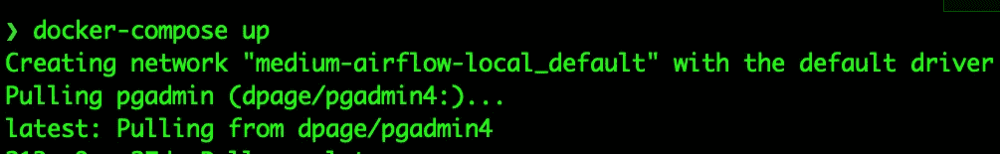

作者捕获的图像

让我们使用 YAML 文件中定义的电子邮件和密码连接到 pgAdmin。

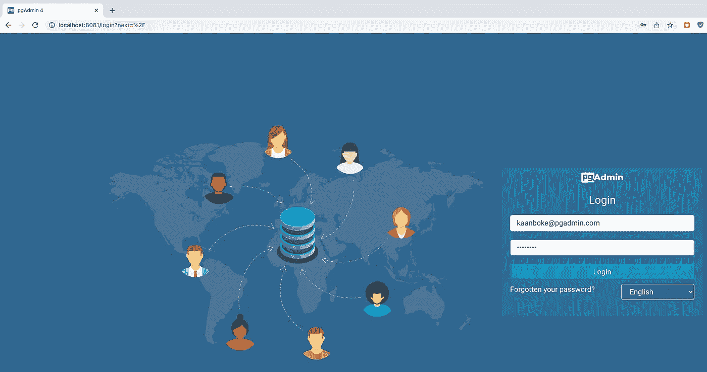

作者捕获的图像

并且我们需要 ***添加服务器*** 来连接 Postgres 数据库，该数据库运行在容器上。

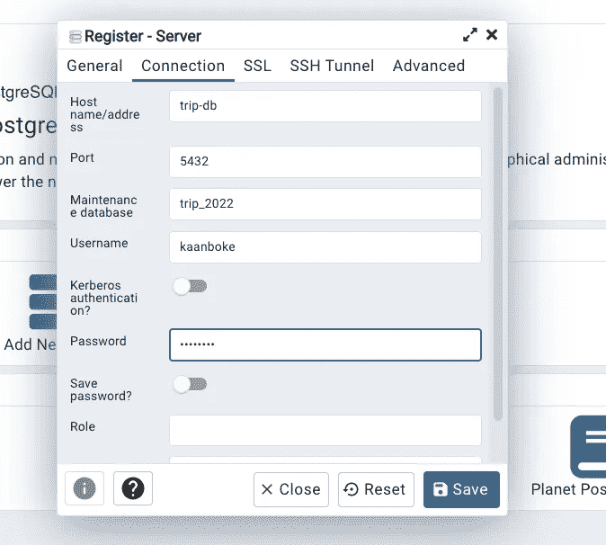

作者捕获的图像

在提供了所需的信息(如上所示)之后，我们成功地连接到了 PostgreSQL 数据库。

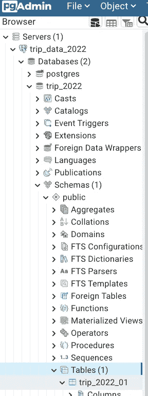

作者捕获的图像

让我们进行一个基本的 SQL 查询来查看旅行记录的前 100 行。

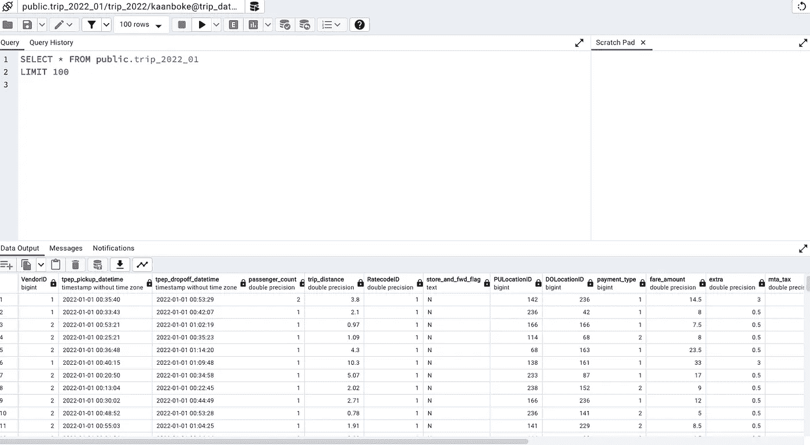

作者捕获的图像

让我们看看这张表上的旅行记录数量。

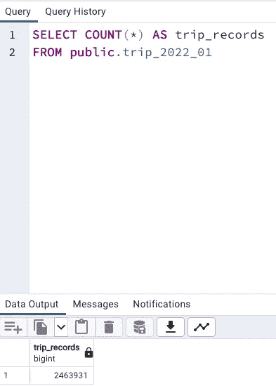

作者捕获的图像

表中有 2.463.931 条记录。我们得到同样的结果。

一切都很顺利。

# 如果……会怎样？


图片来源:[https://giphy.com/](https://giphy.com/)

是啊。分析型人的经典问题。

如果我们想下载 2022 个月的所有数据呢？

我们能安排一下吗？

我们是否可以将 2022 年的每个月的旅行记录提取并加载到 PostgreSQL 数据库中，并使用 pgAdmin 查看它们？

***有何不可？***

让我们试一试。

# DAG 每月运行一次

我们将从数据源中提取 2022 年黄色出租车出行数据，并将其加载到 Postgres 数据库中。

2022 年的数据涵盖了 1 月至 6 月之间的月份。

首先，放下桌子。


作者捕获的图像

为了简单起见，我们将获得 ***一月、二月和三月*** 的旅行数据。

我们将安排工作流，并在规定的时间触发它。

让我们修改我们的最后一个 DAG。

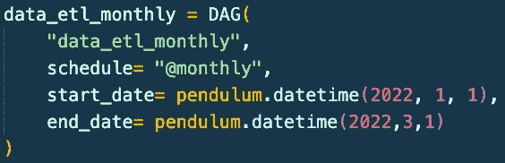

作者捕获的图像

另外，修改我们之前使用的 load_data 函数。

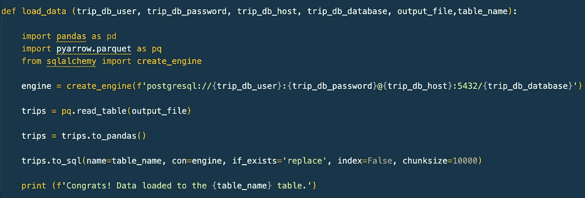

作者捕获的图像

最后，修改输出文件和表名

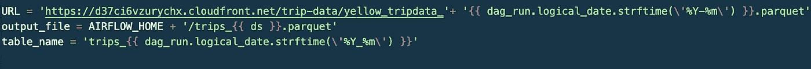

作者捕获的图像

“气流利用了 ***Jinja 模板、*** 的力量，这可以成为与宏结合使用的强大工具”([参考链接](https://airflow.apache.org/docs/apache-airflow/2.0.0/concepts.html#jinja-templating))。

**{ { DAG _ run . logical _ date } }**:DAG 运行的逻辑日期

**{ { ds } }**:DAG 运行的逻辑日期为 YYYY-MM-DD

对于每次执行，DAG 将更新输出文件名和表名。

让我们激活 DAG 并查看它。

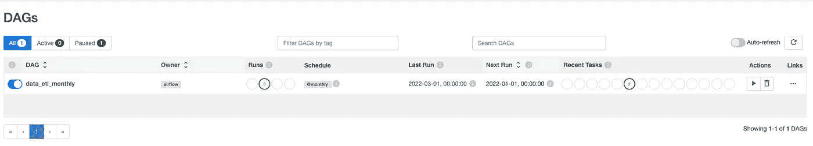

作者捕获的图像

DAG 成功完成了 3 项工作。

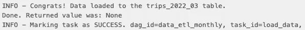

作者捕获的图像

我们看到了我们的打印输出(“数据加载到 trips_2022_03 表”)

是时候看看 pgAdmin 了。

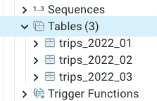

作者捕获的图像

那里有三张桌子。

最后，我们来查一下 2022 年 3 月的表。

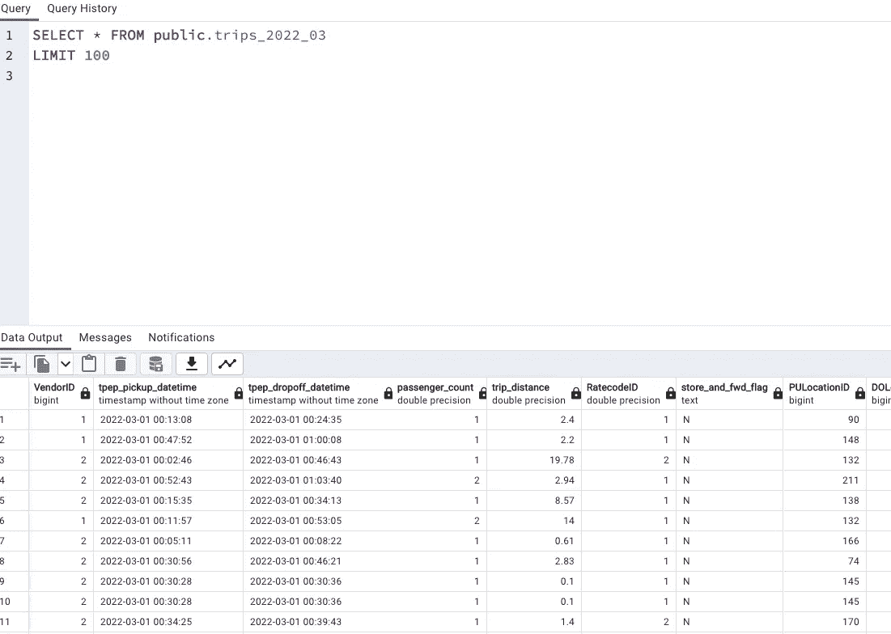

作者捕获的图像

干得好。


图片来源:[https://giphy.com/](https://giphy.com/)

🛑在使用每月计划 DAG 运行 DAG 期间，您可能会在 DAG 日志中看到以下错误消息。

```
Task exited with return code Negsignal.SIGKILL
```

这意味着操作系统终止了该进程。

对此有几种解决方案。

我将提到一个气流解决方案-Docker。

对于内存密集型的工作，我们需要增加 Docker 桌面的内存。

🛑气流主要用于编排，而不是加载大量数据。在下面的文章中，我们将讨论如何使用云服务找到解决方案。

# 结论

气流是最著名的工作编排工具之一。

在本教程中，我们看到了 ***Airflow*** 在本地环境中的实现以及***air flow Docker***Lite 安装。

我们从数据源中提取数据并将数据加载到 ***PostgreSQL*** 数据库中。

最后，用 ***pgAdmin*** 管理 ***PostgreSQL*** 数据库，做了一个基本的 SQL 查询。

[**在下面的文章**](/airflow-is-on-the-cloud-elt-pipeline-orchestration-with-airflow-aws-4d4268e5321a) 中，我们将用 [***气流***&***AWS***](/airflow-is-on-the-cloud-elt-pipeline-orchestration-with-airflow-aws-4d4268e5321a)来讨论 ELT 管道编排。

本文是 [**工作流工具列表**](https://medium.com/@kaanboke/list/workflow-tools-e3da3a530ea5) 的一部分。你可以在 这里找到 [**系列的其他文章。**](https://medium.com/@kaanboke/list/workflow-tools-e3da3a530ea5)

我希望它有所帮助。

对了，喜欢题目的时候，**可以通过支持** **来表现👏**

欢迎发表评论。感谢您抽出时间。

# 万事如意🤘

**代码**可以从 [**这里**](https://github.com/kb1907/airflow-local) 下载。

如果你喜欢看我的内容， [*请考虑关注我*](https://medium.com/@kaanboke/membership) 。还有，你可以通过 [**订阅 Medium**](https://medium.com/@kaanboke/membership) 来支持其他作家和我。使用我的推荐链接不会额外花费你。