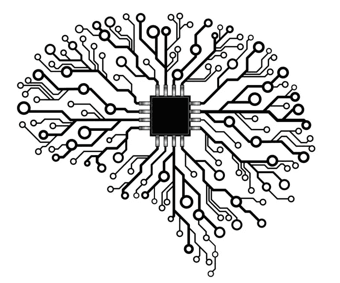

# 让我们量化意识——从数学上重新思考它

> 原文：<https://pub.towardsai.net/lets-quantify-consciousness-rethinking-it-mathematically-a626fe93761?source=collection_archive---------3----------------------->

## [未来](https://towardsai.net/p/category/future)

## “集成信息论(IIT)”及其对人工智能的意义


照片由[沃利·维南西奥](https://www.pexels.com/@warley-venancio-1371219?utm_content=attributionCopyText&utm_medium=referral&utm_source=pexels)从[派克斯](https://www.pexels.com/photo/white-string-lights-2661536/?utm_content=attributionCopyText&utm_medium=referral&utm_source=pexels)拍摄

阅读和聆听——为了更好的体验

意识是一个高度抽象的概念，没有明确或固定的定义。许多科学家和哲学家试图解开它的秘密，但是，他们中没有一个人能让我们完全满意。随着新的机器学习技术和深度神经网络的兴起，这样做变得日益困难。

意识的想法与人工智能紧密相连，因为这是我们的最终目标，不是吗？最终实现[人工通用智能(AGI)](https://medium.com/towards-artificial-intelligence/10-game-changing-ai-breakthroughs-worth-knowing-about-b2076afc4930#5ddd)。

我们的流行文化已经在电影和科幻小说中探索了这个想法(相当广泛)，看来全意识机器在即将到来的未来是不可避免的。但是，如果我们自己还没有理解意识的概念，那么，我们有可能创造它吗？

> 有没有可能，如果我们创造一个拥有数万亿连接的巨大人工神经网络，那么它会以某种方式自己变得有意识？

如果是这样的话，那么我们可能真的会陷入一些严重的麻烦。但是今天，让我们跳过“打破自然法则”的哲学层面，深入研究意识的数学。

所以让我们开始吧！

# 集成信息论——基本概述

有许多理论来定义意识，例如“[意识是一种物质状态](https://arxiv.org/pdf/1401.1219.pdf)”，但是没有一个理论在计算意识方面走得这么远。IIT 是目前最受欢迎的意识理论，人们仍在试图进一步发展它。

但是在开始之前，让我们先弄清楚一些定义和概念…

以你的大脑为例——我们都同意它现在是有意识的，功能齐全的。把它想象成一个 ***系统*** ，从它的感官和周围接收“信号”；由于你大脑中错综复杂的联系，所有这些输入被组合(或整合)起来，可以被称为形成一个“统一的意识体验”；这些联系进一步创造了让你“自我意识”或有意识的“循环”。

不要把意识想成一个二元概念(无论某样东西是否有意识)，而是把它 ***想成一个光谱*** (一个连续体)。

> 一个系统的互联程度越高，信息的整合程度就越高，因此其中的意识也就越多。

IIT 为我们提供了一种用数字来衡量意识的方法，就像一个“意识量表”。

比如说—

```
Consciousness(Computer) < Consciouness(Worm) < Consciousness(Human)
```

对于一个有意识的系统来说，就像我们的大脑(更大的信息整合)，它必须同时处理和分发信息。如果系统是分散的，孤立地计算信息，那么它就不是有意识的**，**就像一台数字机器，信息的整合程度更低。

总而言之，系统的各个部分必须共同工作**才能让系统有意识。**

粗略地说，在这里，

> 信息整合=意识

# 那么我们如何计算呢？

首先，不要抓狂。

在 IIT， ***综合信息量*** 用一个希腊字母**φ**(phi)表示，计算如下:

```
**Φ[X;x] =: φ[X;x, MIP(x)]**Where,
*** φ** = effective information
*** X** = system and **x** = state
*** MIP** = Minimum Information Partition
```

这里， *MIP* 也被定义为在所有可能的分区中具有最小有效信息的分区。

```
**MIP(x) =: arg min{φ(X;x, P)}**Where,
*** P** = Partition = {*M*1,..., *Mr*}
```

*看似容易？*

嗯，不完全是…

从计算上来说，识别 MIP 将需要我们扫描大量的分区(*即* ***所有可能的分区*** )并计算它们的*有效信息*以便进一步比较，这是相当昂贵的；以目前的技术几乎不可能。

*为什么？*

因为在数学上，一个集合的所有可能划分的数目，称为 [***贝尔数***](https://en.wikipedia.org/wiki/Bell_number)*随着元素数目的增加呈指数增加。像这样—*

```
*1, 1, 2, 5, 15, 52, 203, 877, 4140, 21147, 115975, ...*
```

*因此，为了精确计算**φ**的值，**t45】甚至对于一个线虫的大脑，一个有 302 个神经元的微小蠕虫，贝尔数都是超天文数字，约为~ **10⁴⁶⁷.*****

*你可以想象为什么我们不能准确计算人脑综合信息的价值。因为它太大了。*

*那么下一步是什么？*

# *神经形态建筑可能会成功*

**

*来源:[走向数据科学](https://towardsdatascience.com/neuromorphic-hardware-trying-to-put-brain-into-chips-222132f7e4de)*

*根据 IIT 的说法，对于像人类一样有意识的机器来说，它的电路必须是大量互联的，这与我们的标准计算机不同。今天的计算机是建立在 75 年前的冯诺依曼架构上的，内存和处理器是分开的。*

**而这正是* [***神经形态架构***](https://medium.com/towards-artificial-intelligence/10-game-changing-ai-breakthroughs-worth-knowing-about-b2076afc4930#5420) *发挥作用的地方。**

*这是真正受到我们生物大脑启发的建筑。*

> *在一篇论文中，“托诺尼和科赫还声称，根据 IIT 的说法，一个与大脑具有相似连接性和动力学的神经形态电子设备将是有意识的，而在冯·诺依曼数字计算机上运行的人类大脑模拟将不会是有意识的”*

> *“试图弄清楚人工智能最有趣的是它迫使你提出的关于意识本质的问题。”—奥斯卡·伊萨克*

# *结束语—*

*显然，综合信息理论现在有它的缺陷，但这是我们得到的最好的。这个理论的一个突出问题是，尽管它为我们提供了计算意识的公式，但它并不适用于现实生活。*

*IIT 为我们提供了估算**φ、**值的数学“启发法、捷径和近似法”，但是对于一个庞大的系统，比如我们的大脑，可以肯定的是**φ**的值会大得离谱。*

*尽管一个好的方面是，人们现在在医疗行业使用这个想法来扫描大脑，使用脑电图和经颅磁刺激，来测量昏迷病人的意识。在高度意识状态下，信号在整个大脑中传播，而在意识较弱的状态下，信号被隔离在特定的区域内。*

*在我看来，这是一种进步，我们应该对此表示赞赏。*

*如果我们认为这个提出的意识定义是正确的，我们现在就可以洞察我们需要建造什么样的机器——神经形态的。到底需要多少连接才能让我们的 ML 模型有意识。😆*

*随着我们逐步揭开人类意识的神秘面纱，这将是人工智能世界的一次巨大飞跃。*

*如果你喜欢阅读这些故事，那么我相信你会喜欢成为一名中等付费会员。每月只需 5 美元，你就可以无限制地接触成千上万的故事和作家。你可以通过 [***注册使用此链接***](https://nishu-jain.medium.com/membership) ，*来支持我，我将赚取一点佣金，这将帮助我成长并出版更多像这样的故事。**

*感谢您的阅读，祝您愉快！*

***其他一些你可能喜欢的文章—***

*[](https://towardsdatascience.com/how-i-won-a-national-level-ml-competition-with-my-unique-informal-approach-e86fd95532fd) [## 我是如何用我独特的“非正式方法”赢得国家级 ML 比赛的

### 像数据科学黑客一样思考——你不需要遵守规则就能获胜

towardsdatascience.com](https://towardsdatascience.com/how-i-won-a-national-level-ml-competition-with-my-unique-informal-approach-e86fd95532fd) [](https://medium.com/towards-artificial-intelligence/how-i-accidentally-hacked-a-government-app-by-recognizing-a-silly-pattern-4bb5cd293022) [## 我是如何通过识别一个愚蠢的模式意外地入侵了一个政府应用程序

### 有些东西就是要被黑的…

medium.com](https://medium.com/towards-artificial-intelligence/how-i-accidentally-hacked-a-government-app-by-recognizing-a-silly-pattern-4bb5cd293022) [](https://medium.com/datadriveninvestor/machine-learning-is-becoming-a-joke-automl-downsides-c7634ce0572c) [## 为什么机器学习正在成为一个笑话？

### 这个被过度宣传的职业令人不安的真相

medium.com](https://medium.com/datadriveninvestor/machine-learning-is-becoming-a-joke-automl-downsides-c7634ce0572c)*