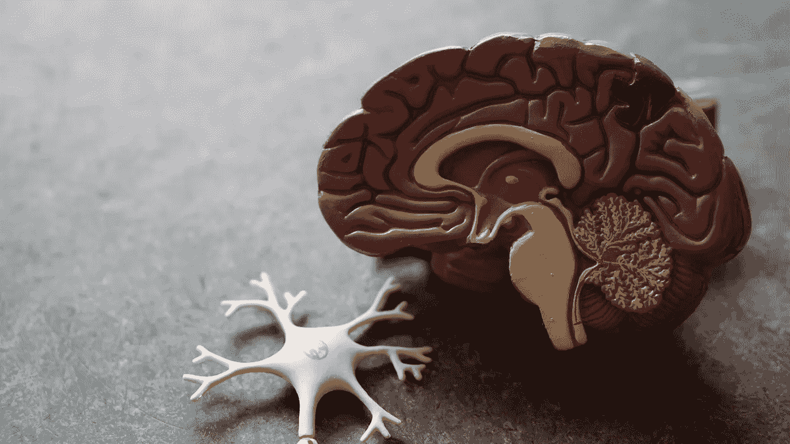
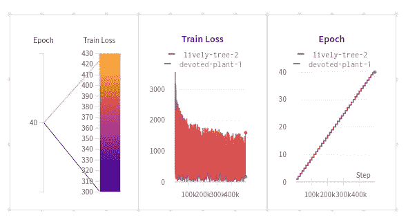
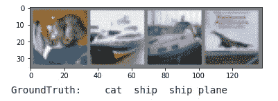

# 让我们来看看电脑是如何看的…

> 原文：<https://pub.towardsai.net/lets-see-how-a-computer-sees-34da517d28b3?source=collection_archive---------2----------------------->

## [深度学习](https://towardsai.net/p/category/machine-learning/deep-learning)，[编程](https://towardsai.net/p/category/programming)



照片由 [Robina Weermeijer](https://unsplash.com/@averey?utm_source=unsplash&utm_medium=referral&utm_content=creditCopyText) 在 [Unsplash](https://unsplash.com/s/photos/brain?utm_source=unsplash&utm_medium=referral&utm_content=creditCopyText) 拍摄

在人类中，理解视觉信息有多个阶段，计算机也遵循这个过程。

现在让我们试着放大一点人类大脑是如何工作的。想象一下，你走出去，环顾四周，你会发现很多你很快就能认出来的东西，比如:

*   嘿，那是新开的披萨店。
*   嘿，看那只狗。
*   这辆新车看起来棒极了。

精彩的清单还在继续……

嗯，我现在有一个问题要问你。你有没有想过你是如何对事物进行分类的？

那是你的**虚拟皮层系统**为你服务，这个系统负责处理视觉信息。

如果你还记得，我们讨论过阶段。嗯，图像到达的第一阶段被称为 **V1。**

这个 V1 区域由两个简单和复杂的单元组成。这两个细胞从物体上捕捉特征，然后特征被识别，图像被分类。这是人类大脑工作方式的简要介绍。

现在，让我们看看计算机是如何对图像进行分类的。这个概念就是**卷积神经网络** (CNN)，我们将在本文中探讨这个概念。

就像我们的人脑一样，CNN 对一个图像的分类也有一些阶段。现在让我们试着理解这些阶段。CNN 就像一个视觉皮层系统。

在这里，图像是我们的输入，图像可以是，

*   **灰度**图像
*   **彩色**图像(这些图像是 3 个通道(**红、绿、蓝**)的组合)

现在，你一定想知道 CNN 中的卷积是什么？

CNN 中的卷积是图像和权重经过点积的运算。

图像被表示为像素值的矩阵，这些图像被输入到我们的 CNN。第一步是将点积应用于输入和权重。

**权重**

这些重量也被称为过滤器。这些也表示为矩阵。

让我们以一个场景来理解过滤器。我们都对运动感兴趣，对吗？所以，在每项运动中，都有不同的位置。例如，在板球运动中，有击球手和投球手。这两位在各自的领域都很专业。过滤器也是如此，而且还有许多不同的过滤器，它们在各自的领域中是专门的。

例如，一些从图像中捕捉边缘，一些模糊图像，一些锐化图像，等等。

在 CNN 中，滤波器的值被初始化，并且在训练过程中，滤波器的值被改变或调整。

就像在烹饪节目中，参与者首先根据他们的理解烹饪菜肴，然后根据要求进行更改或纠正。

对于本博客，我们将使用 CIFAR10 数据集。它有以下几类:“飞机”、“汽车”、“鸟”、“猫”、“鹿”、“狗”、“青蛙”、“马”、“船”、“卡车”。CIFAR-10 中的图像大小为 3×32×32，即 32×32 像素大小的 3 通道彩色图像。

我们还将使用权重和偏差，这将有助于我们跟踪模型的性能和损失。

**让我们开始**

首先，您需要在这里创建一个 WandB 帐户[，我们将在这里跟踪我们模型的性能。](https://www.wandb.com/)

创建帐户后，您现在需要安装它，我使用 google colab 笔记本来安装这个数据集。

```
# Installing the package
!pip install wandb -q# importing the library
import wandb# login
wandb.login()
```

该数据集可在 PyTorch 的 **torchvision.datasets** 中获得。

让我们导入库

```
import torch
import torchvision
from torchvision.transforms as transforms
```

torchvision 包由流行的数据集和计算机视觉的普通图像转换组成。

```
transform = transforms.Compose([transforms.ToTensor(),transforms.Normalize((0.5, 0.5, 0.5), (0.5, 0.5, 0.5))])trainset = torchvision.datasets.CIFAR10(root = './data', train = True, download = True, transform=transform)testset = torchvision.datasets.CIFAR10(root = './data', train = False, transform=transform)trainloader = torch.utils.data.DataLoader(trainset, batch_size=4, shuffle = True, num_workers=2)testloader = torch.utils.data.DataLoader(testset, batch_size=4, shuffle=False, num_workers=2)classes = ('plane', 'car', 'bird', 'cat','deer', 'dog', 'frog', 'horse', 'ship', 'truck')
```

让我们来理解代码，

1] **变换。撰写**

变换用于图像变换，我们可以使用许多不同的变换。compose 就像 **sklearn.compose** (我们可以使用 Compose 链接不同的转换)

您可以简单地使用 Compose 并一起使用它们，而不是为每个转换创建一个变量。

我们使用了**转换。作为我们的第一个转换器，它将我们的图像转换成张量。张量图像是一个具有`(C, H, W)`形状的张量，其中`C`是通道数，`H`和`W`是图像的高度和宽度。**

我们使用的第二个转换器是**转换。Normalize()** ，我们将值 0.5 和 0.5 传递给归一化转换，以将像素转换为 0 到 1 之间的值，这意味着平均值为 0.5 且标准偏差为 0.5 的分布。

2] **数据集**

现在我们从**火炬视觉下载了我们的数据集。数据集**我们把它们分成两组——训练集和测试集。

现在我们使用了**torch . utils . data . data loader**，这个数据加载器从我们创建的集合中获取数据，并批量提供数据。

**网络**

现在，让我们定义我们的网络，

```
import torch.nn as nn
import torch.nn.functional as Fclass Net(nn.Module):
    def __init__(self):
        super(Net, self).__init__()
        self.conv1 = nn.Conv2d(3, 6, 5)
        self.pool = nn.MaxPool2d(2, 2) 
        self.conv2 = nn.Conv2d(6, 16, 5)
        self.fc1 = nn.Linear(16 * 5 * 5, 120)
        self.fc2 = nn.Linear(120, 84)
        self.fc3 = nn.Linear(84, 10)

    def forward(self, x):
        x = self.pool(F.relu(self.conv1(x)))
        x = self.pool(F.relu(self.conv2(x)))
        x = x.view(-1, 16 * 5 * 5)
        x = F.relu(self.fc1(x))
        x = F.relu(self.fc2(x))
        x = self.fc3(x)
        return x
net = Net()
```

在这里，我使用两个卷积层和三个线性层。

第一个卷积层接受 3 个参数，1]输入通道 2]输出通道 3]内核大小

1] **in_channels=** 输入图像中的通道数如果图像是灰度的，那么 in_channels = 1，当输入是彩色的，那么它等于 3，因为彩色图像有三个通道，即(红、绿、蓝)

2] **out_channels=** 卷积运算产生的通道数

3] **kernel_size=** 这是将被卷积的矩阵的大小。

第二卷积层具有相同的参数。

我们将最大池应用于我们的卷积图像。MaxPool2d 的作用是从矩阵中取最大值。

现在，我们使用三个线性层后，应用第二个卷积层。

**nn。Linear=** 这将对我们的输入和输出样本应用线性变换。
是全连接层，有输入有输出。现在，它的输入会有一个权重。它的输出将是*【XW+b】，因为它完全是线性的，没有激活函数。*

*它定义了我们的模型的结构，就像你已经收集了你的菜的配料，现在正向函数告诉你如何使用这些配料。*

*关于我在这里使用的超级函数的非常棒的文章[https://realpython.com/python-super/](https://realpython.com/python-super/)。*

*现在，我们定义损失函数和优化器，*

```
*import torch.optim as optim
criterion = nn.CrossEntropyLoss()
optimizer = optim.Adam(net.parameters())*
```

*我已经在我之前的[文章](https://medium.com/towards-artificial-intelligence/logistic-regression-with-pytorch-198a4ec80649)中解释了损失函数和优化器。*

***训练网络***

*训练前一定要运行 **wandb.init()** 。这将初始化正在运行的进程。*

*它接受许多参数，但我们将在这里使用最重要的一个，那就是**‘实体’**=您的用户名，**‘项目’**=您的项目名称。*

```
*wandb.init(entity = 'pratik_raut', project = 'Image Classification with Pytorch 2')epochs = 40
# **reference** - [https://pytorch.org/tutorials/beginner/blitz/cifar10_tutorial.html](https://pytorch.org/tutorials/beginner/blitz/cifar10_tutorial.html)for epoch in range(1, epochs+1):  **# loop over the dataset multiple times**
    running_loss = 0.0
    for i, data in enumerate(trainloader, 0): **# get the inputs; data is a list of [inputs, labels]** inputs, labels = data **# zero the parameter gradients**
        optimizer.zero_grad() **# forward + backward + optimize** outputs = net(inputs)
        loss = criterion(outputs, labels)
        loss.backward()
        optimizer.step() **# print statistics**
        running_loss += loss.item()
        if i % 2000 == 1999:    **# print every 2000 mini-batches**
            print('[%d, %5d] loss: %.3f' % 
                 (epoch + 1, i + 1, running_loss /2000))
        running_loss = 0.0 **# Log the loss and accuracy values at the end of each epoch**
    wandb.log({"Epoch": epoch, "Train Loss":running_loss})print('Finished Training')*
```

**

*这是在 wandb 帐户上生成的图表，这是对 wandb 跟踪您的模型性能的有用性的简单观察。*

*让我们试着预测一些图像，*

```
*dataiter = iter(testloader)
images, labels = dataiter.next()**# print images**
imshow(torchvision.utils.make_grid(images))print('GroundTruth: ', ' '.join('%5s' % classes[labels[j]] for j in range(4)))*
```

**

*代码在 [**Google Colab**](https://colab.research.google.com/drive/1Ba4BC5fdAxHEVE2ObNUBygcIhk-5BQvW#scrollTo=OvreFf_TtNXf) 上有。这就是我希望你喜欢和学习。这只是一个简单的网络，希望大家多加补充，谢谢。*

***免责声明**-标题中无链接的图片为作者所有；否则，会提供一个链接。*