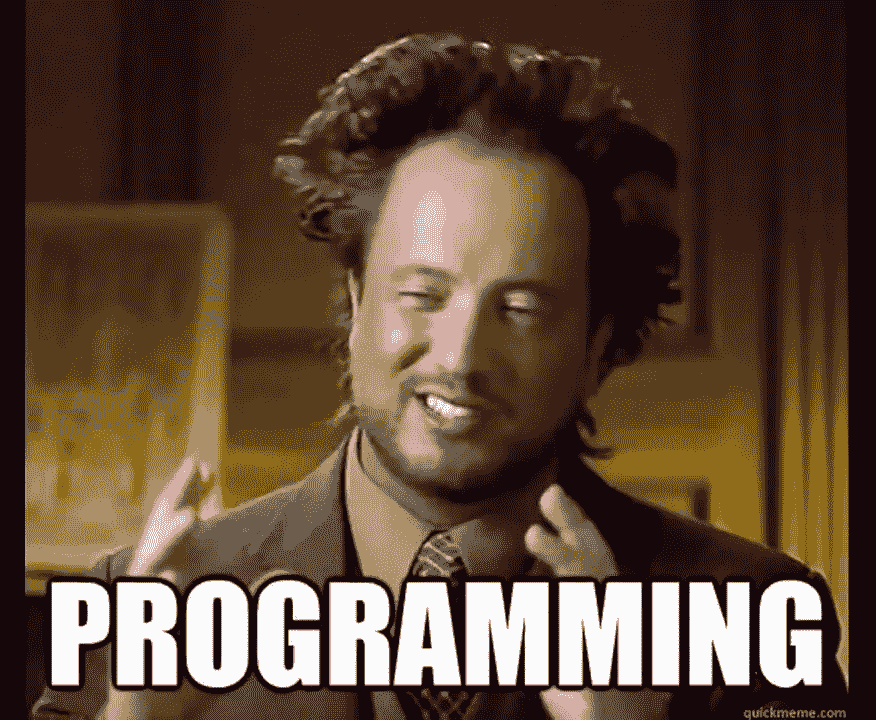

# 让我们看看大型超市的销售情况

> 原文：<https://pub.towardsai.net/lets-see-the-sales-in-a-big-mart-store-250fb7e1f704?source=collection_archive---------2----------------------->


图片由 Unsplash 网站上的 Anastasia Dulgier 提供

> 预测特定商店中每种产品的销售额

我们作为数据分析师和数据科学从业者，经常面临预测影响刺激因素的挑战。这些因素包括预测商店销售、预测明天的天气、预测第二天的股票价格等等。

我们知道 [***分析 Vidhya***](https://www.analyticsvidhya.com/blog/) 是一个非常知名的平台，可以了解几乎所有与分析相关的内容。全球许多经验丰富的数据科学家、分析师和开发人员通过浏览他们信息丰富的文章，不断更新数据科学和机器学习领域的最新动态，这些文章包含了几乎所有我们需要知道的与该领域相关的信息，包括我在内。

> 他们经常在自己的网站上举办各种黑客马拉松，帮助我们踏上数据科学之旅。事实上，了解更多数据科学的最佳方式之一是坚持编码，参加黑客马拉松，并亲自检查他们的结果。他们平台中的一个这样的黑客马拉松处理销售商店中特定商品的预测。

> 本次竞赛使用的评估指标是**均方根值**。

> **均方根误差** ( **RMSE** )是残差(预测误差)的标准差。残差是数据点离回归线有多远的度量； **RMSE** 是衡量这些残差分布程度的指标。换句话说，它告诉我们，数据在最佳拟合线附近有多集中。

对于这场比赛，我们有一堆的功能，我们被给予，我们需要预测每个产品在商店的销售。

**要查看这一款的完整代码，请随意查看我的 Github 代码** [**这里**](https://github.com/SaiBiswas/Big-Mart-Sales-Hackathon) **。**



没有这个就无法预测，我们能不能…..

我们将这篇文章分成三个部分。

1.  **EDA(探索性数据分析)**:我们会看到一些关于这一个的训练数据的分析。
2.  **特征工程**:这是我们可以看到的有助于预测的特征。
3.  建模:这是魔法发生的地方，我们将利用机器学习的力量看到它在我们眼前展现。

所以，事不宜迟，让我们看看代码。

```
*# importing all the important libraries for analysis*

**import** **pandas** **as** **pd**
**import** **numpy** **as** **np**
**from** **sklearn.model_selection** **import** train_test_split
pd.set_option('display.max_columns', **None**)
**import** **pandas_profiling** **as** **pp**

**import** **matplotlib.pyplot** **as** **plt**
**import** **seaborn** **as** **sns**
**import** **warnings**
%matplotlib inline
plt.style.use('fivethirtyeight')
warnings.filterwarnings('ignore')
```

```
*# loading the train and the test data*train = pd.read_csv('train_bigmart.csv')
test = pd.read_csv('test_bigmart.csv')
```

***Item_Weight*** 和 ***Outlet_Size*** 变量中有空值。因此，我们将通过将 ***Item_Weight*** 替换为其 **mean** 并将 ***Outlet_Size*** 替换为其 **mode** 来解决这个问题。

```
*# filling the missing values in the Item_Weight column with mean and Outlet_Size with mode as there are missing values*data['Item_Weight'].fillna(data['Item_Weight'].mean(), inplace = **True**)

data['Outlet_Size'].fillna(data['Outlet_Size'].mode()[0], inplace = **True**)

data['Item_Outlet_Sales'] = data['Item_Outlet_Sales'].replace(0, np.NaN)
data['Item_Outlet_Sales'].fillna(data['Item_Outlet_Sales'].mode()[0], inplace = **True**)
```

我们每个人在 Jupyter 笔记本上必须拥有的另一个重要的 EDA 库是[***pandas profiling***](https://github.com/pandas-profiling/pandas-profiling)库，它可以帮助我们浏览数据，我们可以检查从变量系数到变量分布的几乎任何内容。这个库的安装相当简单，一个简单的 pip 安装就可以完成这项工作，然后我们就可以让这个库发挥它的魔力了。

现在，我们将看到一些重要的功能，我们将需要在这一个完整的建模。

我们将创建一些特征，用于这一个的建模。

```
*# Getting the first two characters of ID to separate them into different categories*

data['Item_Identifier'] = data['Item_Identifier'].apply(**lambda** x: x[0:2])

data['Item_Identifier'] = data['Item_Identifier'].map({'FD':'Food', 'NC':'Non_Consumable', 'DR':'Drinks'})

data['Item_Identifier'].value_counts()
```

为我们的建模目的创建一个新特征 ***插座设施*** 。

```
*# determining the time establishment started*

data['Outlet_Years'] = 2013 - data['Outlet_Establishment_Year']
data['Outlet_Years'].value_counts()
```

```
*# Getting the first two characters of ID to separate them into different categories*

data['Item_Identifier'] = data['Item_Identifier'].apply(**lambda** x: x[0:2])

data['Item_Identifier'] = data['Item_Identifier'].map({'FD':'Food', 'NC':'Non_Consumable', 'DR':'Drinks'})

data['Item_Identifier'].value_counts()
```

下一步是标签编码数据为 ***标签编码*** 是指将**标签**转换成数字形式，从而转换成机器可读的形式。然后，机器学习算法可以以更好的方式决定如何操作这些**标签**。在监督学习中，结构化数据集是非常重要的。

一旦我们完成了标签编码，我们继续进行 ***一个热编码*** 数据，或者简单地说，我们将数据转换成它的虚拟形式，我们这样做是为了让我们的机器理解分类变量。

```
*# one hot encoding the data to get dummy variables*

data = pd.get_dummies(data)

print(data.shape)
```

下一步是为训练和测试拆分数据。

```
*# splitting into train and test for modelling*

train = data.iloc[:8523,:] # all rows till 8523 and all cols
test = data.iloc[8523:,:]  # last row and last col*# making x_train, x_test, y_train, y_test*

**from** **sklearn.model_selection** **import** train_test_split

x_train, x_test, y_train, y_test = train_test_split(x, y, test_size = 0.3)

print(x_train.shape)
print(y_train.shape)
print(x_test.shape)
print(y_test.shape)
```

3.**造型**。

A.线性回归

```
*# Linear Regression*

**from** **sklearn.linear_model** **import** LinearRegression
**from** **sklearn.metrics** **import** mean_squared_error
**from** **sklearn.metrics** **import** r2_score

model = LinearRegression()
model.fit(x_train, y_train)

*# predicting the  test set results*
y_pred = model.predict(x_test)
print(y_pred)

*# finding the mean squared error and variance*
mse = mean_squared_error(y_test, y_pred)
print('RMSE :', np.sqrt(mse))
print('Variance score: **%.2f**' % r2_score(y_test, y_pred))**OUTPUT**RMSE : 9.186108167282568e-13
Variance score: 1.00
```

B.随机森林回归量

```
*# Random Forest Regressor*

**from** **sklearn.ensemble** **import** RandomForestRegressor

model = RandomForestRegressor(n_estimators = 100 , n_jobs = -1)
model.fit(x_train, y_train)

*# predicting the  test set results*
y_pred = model.predict(x_test)
print(y_pred)

*# finding the mean squared error and variance*
mse = mean_squared_error(y_test, y_pred)
print("RMSE :",np.sqrt(mse))
print('Variance score: **%.2f**' % r2_score(y_test, y_pred))

print("Result :",model.score(x_train, y_train))**OUTPUT**RMSE : 39.62801138375659
Variance score: 1.00
Result : 0.9999916265613055
```

C.支持向量机

```
*# Support Vector Machine*

**from** **sklearn.svm** **import** SVR

model = SVR()
model.fit(x_train, y_train)

*# predicting the x test results*
y_pred = model.predict(x_test)

*# Calculating the RMSE Score*
mse = mean_squared_error(y_test, y_pred)
print("RMSE :", np.sqrt(mse))
print('Variance score: **%.2f**' % r2_score(y_test, y_pred))

print("Result :",model.score(x_train, y_train))**OUTPUT**Variance score: 0.74
Result : 0.7490125535919516
```

D.梯度推进算法

```
*# Gradient Boosting Algorithm*
**from** **sklearn.ensemble** **import** GradientBoostingRegressor

model = GradientBoostingRegressor()
model.fit(x_train, y_train)

*# predicting the test set results*
y_pred = model.predict(x_test)
print(y_pred)

*# Calculating the root mean squared error*
print("RMSE :", np.sqrt(((y_test - y_pred)**2).sum()/len(y_test)))
print('Variance score: **%.2f**' % r2_score(y_test, y_pred))

print("Result :",model.score(x_train, y_train))**OUTPUT**RMSE : 30.42838358308164
Variance score: 1.00
Result : 0.9999400663817338
```

E.决策树回归器

```
*# Decision Tree Regressor* 

**from** **sklearn.tree** **import** DecisionTreeRegressor

model = DecisionTreeRegressor()
model.fit(x_train, y_train)

*# predicting the test set results*
y_pred = model.predict(x_test)
print(y_pred)

print(" RMSE : " , np.sqrt(((y_test - y_pred)**2).sum()/len(y_test)))
print('Variance score: **%.2f**' % r2_score(y_test, y_pred))

print("Result :",model.score(x_train, y_train))**OUTPUT**RMSE :  30.028006703468485
Variance score: 1.00
Result : 1.0
```

6.Adaboost 回归器

```
*# Adaboost*
**from** **sklearn.ensemble** **import** AdaBoostRegressor

model =  AdaBoostRegressor(random_state=0, n_estimators=100)
model.fit(x_train, y_train)

*# predicting the test set results*
y_pred = model.predict(x_test)
print(y_pred)

print(" RMSE : " , np.sqrt(((y_test - y_pred)**2).sum()/len(y_test)))
print('Variance score: **%.2f**' % r2_score(y_test, y_pred))

print("Result :",model.score(x_train, y_train))**OUTPUT**RMSE :  121.48048104773004
Variance score: 0.99
Result : 0.9939541181004856
```

答在对**训练**数据使用 ***6 算法*** 并对未见过的测试数据进行同样的测试后，我们可以看到，线性回归产生了最低的 **RMSE** 得分 9.18，因为 **RMSE** 值越低越好，因为它能够以更好的方式解释数据点中的方差。

> RMSE 由预测值与观察数据点的接近程度来定义。RMSE 值越低表示拟合度越好。因此，将选择线性回归结果。


图片来源谷歌

这是真的，不是吗？我们越是拷问数据，试图从中获得洞见，当我们将数据用于预测时，它就会承认并导致更好的结果，就像我们在这个案例中看到的那样，我们通过 6 种算法并选择 RMSE 最小的算法。

> 可以查看更多我写的机器学习相关文章:

[](https://medium.com/towards-artificial-intelligence/gradient-descent-in-layman-language-d4028b486103) [## 梯度下降:用外行人的话来说

### 在 5 分钟内介绍最流行和最常用的机器学习优化技术。

medium.com](https://medium.com/towards-artificial-intelligence/gradient-descent-in-layman-language-d4028b486103) [](https://medium.com/towards-artificial-intelligence/importance-of-k-fold-cross-validation-in-machine-learning-a0d76f49493e) [## K-Fold 交叉验证在机器学习中的重要性

### 在将数据输入我们的机器学习模型之前，最重要的步骤之一

medium.com](https://medium.com/towards-artificial-intelligence/importance-of-k-fold-cross-validation-in-machine-learning-a0d76f49493e) 

*你可以在 Linkedin* [***这里***](https://www.linkedin.com/in/saikat-biswas-713610159/) 进一步和我联系

*或在我的推特账号上与我联系* [***此处***](https://twitter.com/saitkaka)

> 这本书里就有这些。下次见，再见..！！！