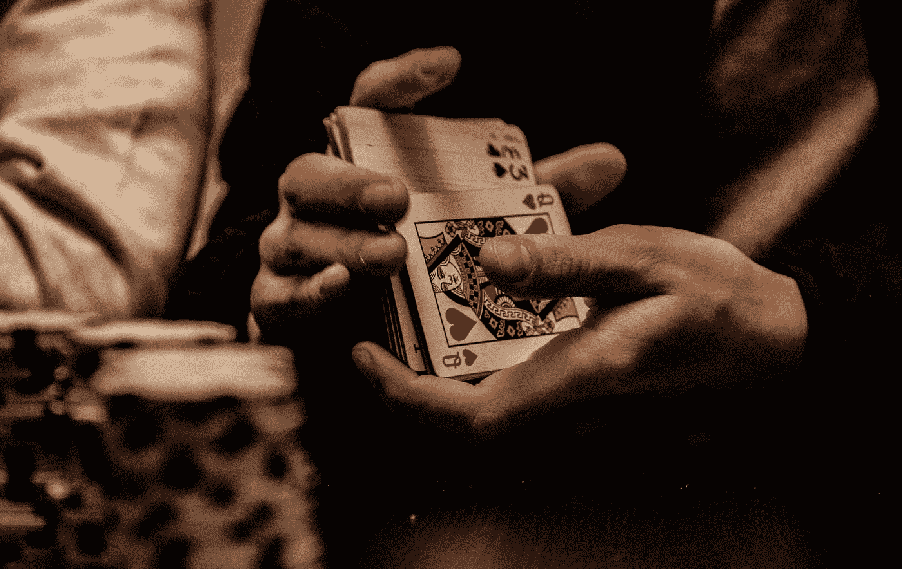
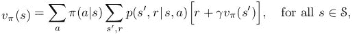
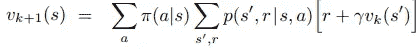
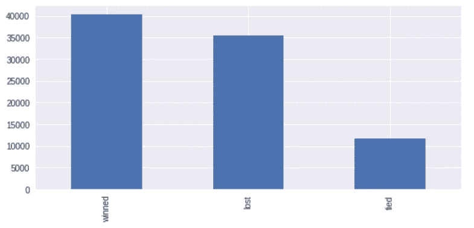

# 让我们和 RL 一起赢在 7 点！

> 原文：<https://pub.towardsai.net/lets-win-at-7%C2%BD-with-rl-2e86f7053f3?source=collection_archive---------2----------------------->

## [机器学习](https://towardsai.net/p/category/machine-learning)

## 强化学习如何应用于在 7 点找到最优策略(一个真正类似于 21 点的游戏！)

由[马林·图拉德](https://unsplash.com/@mtulard?utm_source=medium&utm_medium=referral)在 [Unsplash](https://unsplash.com?utm_source=medium&utm_medium=referral) 上拍摄的照片

# 介绍

“赢家，赢家，鸡肉大餐！”。在电影 [21](https://en.wikipedia.org/wiki/21_(2008_film)) 中，本·坎贝尔和他的团队在[21 点](https://en.wikipedia.org/wiki/Blackjack)中算牌获胜，这是最有趣和最受研究的赌场游戏之一，证明了数学和统计学确实可以用来促进这些游戏中使用的常见策略。从那时起，科学界在构思方法和改进现有技术方面取得了巨大进步，在一些情况下达到了最高水平。使用强化学习和博弈论技术，最近的几项成就已经成为可能，它们明显优于以前的方法。

在本教程中，您将看到强化学习如何应用于确定玩 7 的最佳策略，7 是一种非常类似于 21 点的意大利游戏。在整个教程中，我将假设您熟悉强化学习。如果不是这样，看一看我之前的[帖子](https://towardsdatascience.com/reinforcement-learning-uncovered-135509cbbc4c)，它从头开始温和地介绍了基于 RL 的概念。此外，该教程将基于您可以在我的 GitHub [资源库](https://github.com/colibri17/sette_mezzo)中找到的代码。

声明:本文表达的内容来自我个人的研究和经验，并不一定要作为金融，投资或赌博的建议。内容仅供参考，旨在作为教育材料。

所以！通过强化学习，我们能一直赢在 7 点吗？请继续阅读，找出答案！

# 规则

该游戏使用一副 40 张牌，一副去掉了 8、9 和 10 的标准牌。a 到 7 的牌值是它们的点值(1 到 7)，正面牌每张值 0.5 点。一张特殊的牌(方块 7)叫做“mad”。其值的范围可以从 0.5 到 7，并且对应于使玩家牌的总和最接近 7 的最高可能值。例如，如果玩家拿着 1，2，mad 值是 4，而如果他拿着一个 fig 值是 7。

这个游戏有不同的变化。在存储库中支持以下双人版本:

*   游戏开始时，*玩家 0* 和*玩家 1* 收到一张面朝上的牌。
*   然后，*玩家 0* 决定要么从这副牌中抽出一张牌，要么坚持当前的牌:如果他坚持，他的回合结束，如果他击中，他从这副牌中得到一张面朝下的牌，重复这个步骤。玩家可以坚持或击打，只要他没有*击垮*(超过 7)在这种情况下，他立即输掉游戏。
*   当*玩家 0* 粘住*时，玩家 1* 开始他的回合，并通过重复击打新牌或粘住他当前的一组牌来执行相同的过程。同样，如果他的牌总数超过 7，他会立即输掉游戏。
*   最后，如果两个玩家都卡住而没有被半身像，他们的卡值的总和被比较，并且具有最高分数的玩家赢得游戏。

# 战略

首先，我们需要定义什么是最优策略:它意味着**确定一个持续引导玩家**(假设*玩家 0)* **赢得游戏**的移动序列。注意，如果我们想应用强化学习找出这个策略，我们首先需要固定对手的策略。回想一下，RL 假设唯一的代理与环境交互。因此，在我们的例子中，*玩家 0* 将是代理，而所有其他人(包括*玩家 1* )将是环境。在我们的例子中，我们为对手设定了以下策略:*一旦他得分达到或超过 4，他就坚持。否则，他打。*

下一步是从玩家的角度出发，确定游戏的状态、玩家的行为以及环境提供给玩家的回报。

我们可以将单一状态定义为玩家当前拥有的一组牌。游戏开始时，玩家会处于无牌形成的状态。然后，例如，如果玩家抽到了 6，他的当前状态就由这张牌形成。如果玩家拥有[3，4，面]，状态将正好由这些牌组成。还有一种特殊的状态，就是终态。当玩家选择继续使用当前的牌或者破产时，他就达到了这种状态。

代理可以采取的行动很容易识别:在每个状态下(除了终端状态)，*玩家 0* 可以选择*点击*，抽一张新牌，或者*坚持*当前的牌组。

最困难的部分与奖励建模有关。我们需要详细说明玩家在每个状态下的每一个动作所获得的奖励。此外，我们需要记住，给予奖励的目的不是指示代理人*应该如何*实现其目标(这确实是强化学习的任务！)，而是我们希望它实现什么目标。考虑到这一点，我们做了以下工作:

*   如果玩家*击中*，我们总是提供 0 的奖励，除非玩家破产。在这种情况下，奖励是-1
*   如果玩家*坚持*，我们会生成对手可以拿到而不会输掉游戏的纸牌组合。所以，如果对手抽 2 作为第一张牌，这些组合中的一些将是[2，1，脸，脸]，[2，1，4]，[2，1，脸，2]，[2，2]等等。请注意，组合[1，4，1]不会被考虑，因为与初始对手的牌不一致。同样，也不会产生[2，1，2，3]，因为这会导致对手输掉比赛。最后，组合[2，2，1]都不会生成，因为对手的策略规定一旦达到 4 分就停止。现在，我们将生成的组合分为三类:导致玩家赢得比赛的组合、导致玩家平局的组合和导致对手赢得比赛的组合。此时，对于这些组合中的每一个，我们也计算相应的发生概率。例如，组合[2，2]出现的概率由在游戏的特定点抽中 2 然后抽中另一个 2 的概率之间的乘积给出。相反，组合[2，1，正面，正面]的发生概率由抽取 4 张牌的 4 个单一概率的乘积给出。最后，通过考虑将导致玩家赢得或平手游戏的那些组合的发生概率相加来计算奖励，在范围[-1，1]内缩放。很复杂吧？好吧，别担心，我花了很长时间才装好！:)

至此，我们已经准备好描述用于求解游戏的强化学习算法了！

# 动态规划

在引擎盖下，我们应用了一种叫做策略迭代的强化学习技术。这是强化学习的最简单的技术之一，在几种实际情况下用于寻找最佳策略。

策略迭代由两个重要阶段组成:

*   *策略评估*根据当前策略确定每个状态的值。
*   *策略改进*根据状态值更新当前策略。

因此，在策略评估中，我们保持当前策略不变，并尝试改进对博弈状态值的估计。在策略改进中，我们保持固定的状态值，并尝试改进当前策略。这两个步骤循环适用于收敛:一旦我们确定了最佳状态值，我们就转向政策改进以确定最佳政策。一旦我们确定了最佳策略，我们就进入策略评估，以确定最佳状态值。

在策略评估步骤中，我应用了**动态编程**。最核心的是，动态规划是贝尔曼方程的自然延伸，它引入了一个用于评估状态值的递归关系。根据贝尔曼方程，这是基于下一环境动态和紧接的下一状态的值来计算的。通过查看下面的公式，您可以很好地理解这个概念:

贝尔曼方程:玩策略 pi 时状态 s 的值取决于即时的环境动态(即我们在 s 中采取的行动，获得下一个状态的概率和获得的回报)和下一个状态值

动态编程应用贝尔曼方程来寻找连续的近似状态值，这些近似状态值迭代地收敛到真实状态值(可以在保证贝尔曼方程收敛的完全相同的假设下证明收敛)。

动态规划方程

在最开始的时候(k=0)，我们给每个状态赋一个常数值(一般为 0)。然后，在 k=1 时，我们对状态进行一次完整的扫描，以找到下一个状态值。如果我们指定 0 作为初始状态值，只有与奖励相关的状态会改变。实际上，根据公式，此时只有非空的值 *r* 才会导致值发生变化。接下来，在 k=2 时，我们重复这个过程，再做一次完整的扫描。现在，只有位于有奖励的州*之前的州加上有奖励的州*才会被这个公式显著地涉及。在 k=3 时，推理将再次适用，以此类推。

正如你可能已经注意到的，**动态编程的工作原理是传播奖励的效果**从立即关闭的状态到最远的状态。然而，重要的一点是，随着这个公式被重复应用足够高的次数，状态值的变化将开始变得越来越小，直到收敛。

对于策略改进步骤，典型的选择是应用贪婪更新来改进当前策略。在策略评估步骤中，每个状态都有一组更新的状态值。在我们可以应用的选择中，贪婪更新规定选择导致最高下一状态值的动作。我们能确定这个程序真的会带给我们一个更好的政策吗？嗯，答案是肯定的。可以看出，根据[政策改进定理](http://incompleteideas.net/book/first/ebook/node42.html#:~:text=In%20particular%2C%20the%20policy%20improvement,case%2C%20under%20the%20natural%20definition%3A&text=Instead%2C%20each%20maximizing%20action%20can,in%20the%20new%20greedy%20policy)这种方法确实会改进当前政策。

# **结果**

为了了解训练有素的球员有多强，我们会始终如一地将他与按照我们上面定义的策略(即*)比赛的对手进行比较，一旦他得分达到或超过 4 分，他就会坚持下去。否则，他点击*。请注意，玩家是针对这一策略进行训练的，只有在这一策略下，他的博弈才是最优的。

因此，我模拟了 100000 个随机游戏，并记录了玩家获胜、平局或失败的情况。在下面的图中你可以看到结果:

如您所见，获胜匹配的数量(40314)超过了平局匹配的数量(11673)和失败匹配的数量(35435)。换句话说，**我们训练有素的特工平均能持续击败对手**。这太棒了！

此外，我们可以更详细地量化从初始投资开始我们将获得的金额。例如，假设我们玩 100 场游戏，在每场游戏中，我们下注 1 个单位。平均来说，我们会赢 40.3 场，平 11.6 场，输 35.4 场。这意味着最终，我们将获得 40，3–35，4 = 4，9 单位的资金，相当于我们初始投资的 4.9%的回报率。还不错！

# 结论

在本教程中，我们使用强化学习来寻找玩 7 时的最优策略。训练结束后，我们的代理人始终如一地击败对手，对手使用固定的策略。如果我们必须投入一些资金，我们可以肯定预期收益将在 4.9%左右！

希望你喜欢这篇文章。如有任何问题，欢迎随时评论！

回头见，保持黄金！:)