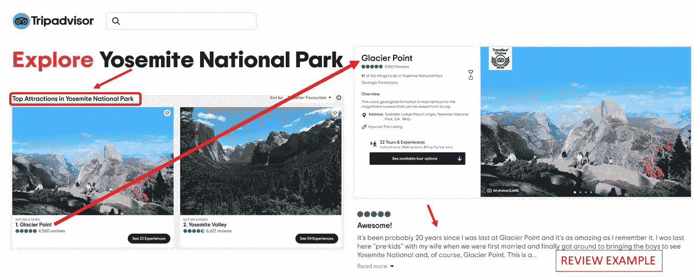

# 通过 NLP 提升你的旅行社技能(第一部分)

> 原文：<https://pub.towardsai.net/leveling-up-your-travel-agent-skills-through-nlp-part-i-45957845973d?source=collection_archive---------6----------------------->

## [自然语言处理](https://towardsai.net/p/category/nlp)

*自然语言处理预处理初学者指南&主题建模与用例*

你看过电影[降临](https://www.rottentomatoes.com/m/arrival_2016)吗？它由语言学家艾米·亚当斯主演，外星人“来到”地球，她被美国政府选中。)来帮助解码外星人的语言。在这部电影带我们经历的许多其他强有力的主题中，我绝对喜欢它如何将语言描述为塑造文明的基础之一。

为什么我要提起这部电影？因为当我第一次尝试通过自然语言处理来处理无监督的机器学习时，我对缺乏方向感感到非常沮丧。在此期间，我碰巧重新观看了这部电影(我一直最喜欢的电影之一)，这部电影在我的脑海中与我当前的数据科学项目产生了高度积极的关联。

# 问:嗯……你在说什么？

让我们回溯一下——2020 年秋天，我参加了一个面向项目的[数据科学训练营](https://www.thisismetis.com/)。到目前为止，我们一直在处理监督学习，它有特定的目标和方向来帮助你看到你是否正在前往某个明智的地方，因为你知道，它是“监督的”。我们现在已经进入了无监督学习的领域，重点是自然语言处理。

约塞米蒂国家公园。照片由 [Drahomír 通过-Mach](https://unsplash.com/@postebymach?utm_source=medium&utm_medium=referral) 发布在 [Unsplash](https://unsplash.com?utm_source=medium&utm_medium=referral)

作为学习本模块项目的一部分，我决定使用 NLP 主题建模创建一个基于旅行偏好的**推荐系统。具体来说，我专注于一个目的地——约塞米蒂国家公园**，并使用了用户在 Trip Advisor 上对该公园的评论。****

# **问:为什么这个项目很重要？**

**如果你像我一样是一个旅行爱好者，你会完全理解这里的情况— **想清楚在旅行目的地应该如何度过时间**是一件费力的事情！对于你计划去的任何地方，都很容易得到一份“必看之物”的清单。但是，要了解哪些必看景点符合你的个人喜好，还需要更多时间的研究。**

**你想能够拍摄“**全景照片**？”或者说**“班车**”无障碍对你来说重要吗？也许你会想把这些和一个简单的徒步旅行结合起来？**

> ****我这个项目的目标是为旅行者提供一种能力，根据上面提到的软偏好，获得“必看景点”的排序列表。****

**概括地说，该项目由 4 部分组成— **获取数据、NLP 预处理、主题建模和制作推荐系统**。本文主要关注中间的两个，但也提到了所有四个。**

# ****问:好的，你在这个*数据科学*项目中使用了什么*数据*？****

****

**可视化描述数据收集源。Trip Advisor 截图。由作者编译的图像。**

**上面的截图一言以蔽之。我通过废弃[旅行顾问](https://www.tripadvisor.in/)关于[约塞米蒂国家公园](https://www.tripadvisor.in/Attractions-g61000-Activities-Yosemite_National_Park_California.html)的页面获得了 10，000+条评论。在“要做的事情”下面，他们有一个“最吸引人的地方”的列表。每个景点都有针对它的评论，这是我从他们的网站上删除的。网页抓取是一个费力的过程。但是，这不是一篇关于学习如何刮擦的文章，所以我将从这里继续。如果你好奇的话，我的 [jupyter 笔记本](https://github.com/navish92/Trip_Advisor_National_Parks/blob/main/Notebooks_Python_Files/1-Data_Acquisition.ipynb)和[功能模块](https://github.com/navish92/Trip_Advisor_National_Parks/blob/main/Notebooks_Python_Files/scraping.py)展示了我是如何做的。**

# **问:我们真的需要预处理吗？**

***是的！但是，请记住，NLP 预处理就像凝视深渊。***

**好吧，老实说，这是一个迭代的过程，并不复杂。但是当我开始的时候，我肯定没有这种感觉。**

**所以，你知道语言是如何包含**文本数据**的吧？**电脑不喜欢那个**。**他们想要数字**。为了帮助计算机理解和理解文本，需要将文本**转换成数字表示**。**

**最简单的方法是**将文本数据中的每个单词**单独取出，然后**在一个巨大的表格中为其创建一个列**。如果每一列只使用了**一个单词，则称之为**单字标记**。但是你也可以把每一对同时出现的单词列在一起。这些将被称为双元标记。我们可以用多种方式标记——3+个一起出现的单词，句子，等等。然后，每个 trip advisor 评论(在 NLP 中称为'**文档**)组成这里的行。这个结果表被称为一个单词包。****

**对于表中的**值**，我们可以**填入每一行(文档)中每个令牌**(列)出现的频率。如果该令牌未出现在该审核中，则填写零。**

**这是现存的最简单的文本到数字的转换过程，被称为**计数向量。****

**您可能会在这里看到一些问题。如果每个惟一的令牌都有一列——我们可以很快得到一批列**。另外，一个单词的不同时态和标点符号会使这种情况更加严重。比如:**“跑”vs“跑”vs“跑”**。计算机会将这些视为三个不同的单词。事实上，它甚至会对待**“跑。”不同于“跑！”**因为结尾的标点符号。某些单词对理解整个文本本身没有任何意义，如“和”、“我们”、“the”等。****

****因此，我们对文本进行预处理，以减少可能的列数(即维度)。****

# ****问:那么，预处理步骤是什么？****

**这就是棘手的地方——什么样的预处理步骤有意义，什么没有意义？确实有很多种类可供选择！**

**就我而言，我大致做了三件事:**

****噪声消除**使用正则表达式和字符串函数将所有字符转换为小写，删除电子邮件/网站链接，分离用标点符号连接的单词(例如:困难/费力到困难费力)，并删除除字母外的所有字符&空格(例如:数字、标点符号、表情符号)。**

**文本去噪**

****单词词条化**是将单词转换成它们的基本形式。例如:“跑步”和“跑步”到“跑步”这是使用 Spacy 完成的。空间词汇化还会在词汇化时将所有代词更改为“-PRON-”，随后被过滤掉。**

**使用空间的词汇化**

****停用字词去除**涉及去除没有增加太多意义但对于文本中的语法结构是必要的常用字词。我使用了 NLTK 的停用词列表，但也策划了一个自定义的附加词列表。**

**停用词移除 python 代码**

> **预处理必须基于你的语料库(所有文档统称为 NLP 中的语料库)。**

**这里的语料库由用户写的评论组成。因此，如果有更多的时间，我可以采取额外的预处理步骤，例如:**

**[**拼写更正**](https://towardsdatascience.com/essential-text-correction-process-for-nlp-tasks-f731a025fcc3) —这些评论是日常用户写的，可能比较匆忙。因此，谨慎的做法是检查拼写错误并改正它们。**

**[**单词规范化**](https://towardsdatascience.com/text-normalization-7ecc8e084e31) —同样，由于这是日常用户在互联网论坛上写的文本，一些单词可能以简短的行话形式表示，如 2mrw vs tomorrow。**

**[**名称的复合术语提取**](https://towardsdatascience.com/chunking-in-nlp-decoded-b4a71b2b4e24#:~:text=Chunking%20is%20a%20proc,role%20in%20the%20main%20sentence) —单字分词器将句子拆分成由空格分隔的单词。因此，“约塞米蒂国家公园”将被视为“约塞米蒂”、“国家”和“公园”。最好把所有的名字用下面的方式连接起来“约塞米蒂国家公园”,这样它们就不会分开。**

**[**(词性)过滤**](https://medium.com/greyatom/learning-pos-tagging-chunking-in-nlp-85f7f811a8cb#:~:text=The%20part%20of%20speech%20explains,%2C%20prepositions%2C%20conjunctions%20and%20interjections)**——**另一种常见的&有效的预处理形式是基于特定词性(词性)过滤单词。意思是，我要不要去掉所有的专有名词，动词，形容词等等。？**位置过滤更多地取决于总体目标。我的目标是应用主题建模(第二部分将详细介绍)来获取推荐或不推荐某个景点的原因，然后使用这些主题来构建一个推荐系统。****

**让我们从一篇真实的评论中摘录两句话。冰川点的景色美极了。人们可以在这里体会到大自然的雄伟。”**

****

**POS 细分示例(图片由作者提供)**

**根据上面的图片，保留描述性文本对我来说很重要，因为这是我想要为我的主题和建议捕捉的内容。因此，我**没有过滤动词、形容词和普通名词。**但是，我做了一个**自定义停用词列表**，从我的语料库中删除了特定的描述性词语，也删除了地名。**

**从语料库中移除的附加单词**

**我通过预处理和主题建模的**迭代循环得出了上述决定。在我看来，第一次尝试就正确地完成所有的预处理是非常困难的。你需要主题建模，查看结果，回到预处理，循环重复。****

> **当您开始使用 NLP 时，所有这一切都可能令人不知所措，并且每个用例都可能非常不同，没有明确的迹象表明您正朝着正确的方向前进。这需要时间、努力和直觉。**

**你和我一起走了这么远？厉害！**

**先来看看我说的这个迭代过程是什么意思，再来说说话题建模本身，以及我在本文**第二部分**是如何做推荐系统的。敬请期待！**

**与此同时，你可以随时查看我为这个项目准备的 Github repo。如有任何问题，您可以通过 Linkedin[联系我。](https://www.linkedin.com/in/navishofficial/)**