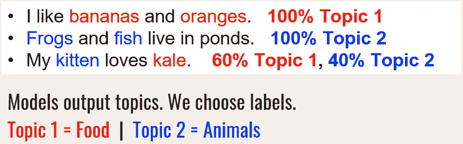
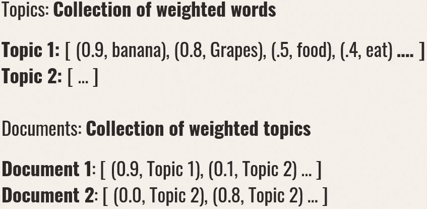
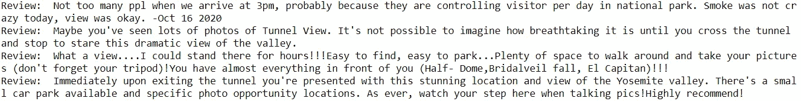
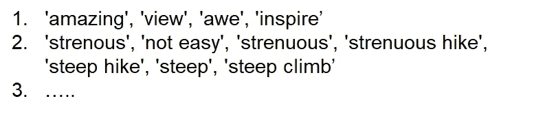
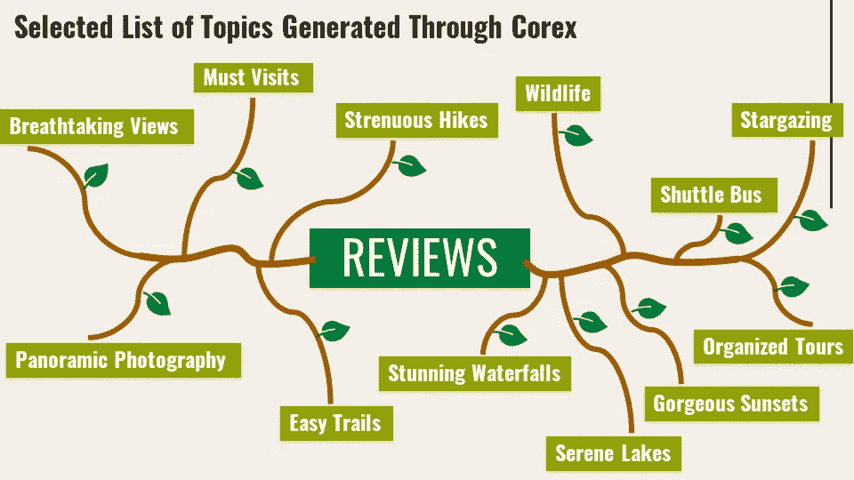
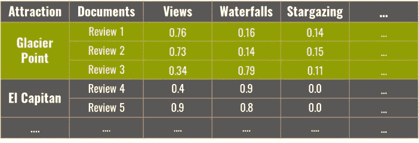
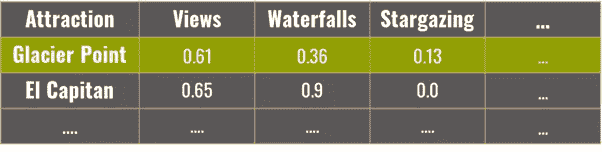
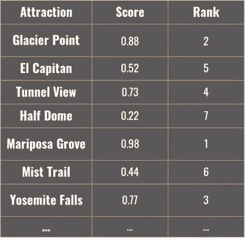

# 通过 NLP 提升你的旅行社技能(第二部分)

> 原文：<https://pub.towardsai.net/leveling-up-your-travel-agent-skills-through-nlp-part-ii-9c66194ebdde?source=collection_archive---------2----------------------->

## [自然语言处理](https://towardsai.net/p/category/nlp)

你是在看完《T2》第一部后找到这篇文章的吗？你想继续读书是多么令人兴奋啊！

如果您不是来自本文的第一部分，您可以在这里阅读，它首先讨论了为什么 NLP 预处理是必要的，预处理文本数据的一些最常见的方法，以及基于您的自然语言处理(NLP)用例应用什么预处理技术的直观感觉。它还介绍了我的具体使用案例——一个基于旅游偏好的推荐系统，使用 Tripadvisor 上人们写的评论构建。为了缩小范围，我把注意力集中在约塞米蒂国家公园。

约塞米蒂国家公园。照片由[德拉霍姆在](https://unsplash.com/@postebymach?utm_source=medium&utm_medium=referral) [Unsplash](https://unsplash.com/?utm_source=medium&utm_medium=referral) 上发布

# **继续了解主题建模！**

NLP 的基本思想是想出不同的方法将文本数据转换成数字数据(同时保留文本数据本身的基本含义)，然后计算机可以根据这些数据进行各种下游处理。最简单的方法是使用词频或 TF-IDF 向量制作一个单词包。这两种情况下的列都是由语料库中的每一个 n 元单词(又名 token)组成的。如果您有 1000 个文档，一个 unigram 向量(每个唯一的单词是一列)可以轻松包含 5000 列(每列一个单词)，一个 bigram 向量(每个唯一的单词对一列)可以包含 100，000 列！！在大多数情况下，这太多了，没有任何实际用途。

**主题建模**将大量的列减少到几列(也称为维度)，通常是 5 到 30 列。它通过使用降维技术来实现这一点，该技术在文档集合中捕获“共现术语的重复模式”。目标是能够使用几个小主题来表示文档和标记列，同时信息损失最小。

主题示例

假设我们有 30 个话题。主题建模过程给出了 30 个主题中的每一个与每个文档相关程度的分数(在我的例子中是评论)。每个主题本身将由原始单词(记号)的集合来表示，伴随着这些单词中的每一个与主题相关的程度的分数。在技术术语中，它们分别被称为文档-主题矩阵和单词-主题矩阵。

主题的单词分数和文档的主题分数

主题建模是一个高度复杂的话题(一语双关)，如果你想更深入地了解它的技术方面，我建议你先从这篇文章开始更深入地了解[降维，然后再看](https://www.analyticsvidhya.com/blog/2018/08/dimensionality-reduction-techniques-python/)[这篇关于主题建模的文章](https://www.analyticsvidhya.com/blog/2016/08/beginners-guide-to-topic-modeling-in-python/)。

# **问:那么，有什么特定的算法可以用于主题建模吗？**

NMF 和 LDA 是两种比较著名的无监督主题建模算法。有了这两个，结果主题的数量是您可以控制的最有影响力的参数。但除此之外，他们对自己的结果相当“无人监督”。它们产生的话题是对是错没有答案——只有在它们对你的目标有意义的情况下。

典型地，NMF 已经显示出当数据更少时(小文档大小，更少的文档)产生更好的结果，而 LDA 在有更多数据时开始产生更合理的主题。

> 我们可以使用每个主题中得分最高的文档和单词来确定这些主题是否有意义。

如果给定主题下所有得分前 5 名(也可以检查前 10 名——没有硬性数字)的文档都有一个一致的主题，并且都围绕着您关心的内容，那么这些主题就有意义。同样的逻辑也适用于检查得分最高的单词。

基于领域直觉，在我的例子中，我期望在国家公园的评论中反复提到一个地方是容易还是难徒步旅行，你是否能从那个景点得到好的照片，等等。

谈论惊人观点的主题下的评论示例

下面是您在主题建模过程中可能遇到的一些挑战，以便获得一些“合理”的东西:

1.  该算法正在挑选某些重复出现的单词，这些单词耗尽了您在用例中需要的上下文。在这种情况下，您需要继续预处理您的数据，直到它对预期目标有意义。这可能意味着添加更多的自定义停用词，因为主题围绕着某些导致无用主题的词，或者将词分成二元/三元符号，或者基于词性的过滤。在我的例子中，景点的名称在原始文本数据中被突出使用，主题一直围绕着它。它们必须在预处理步骤中被周期性地去除，以获得期望的输出。
2.  用于初始化主题建模过程本身的参数可能需要调整。要么允许模型发现更多(或更少)的主题，要么需要更多的迭代次数来提取更合理的模式。
3.  选择的算法不是最适合所提供的上下文的算法，必须使用不同的算法。

> 最重要的是，记住主题建模是一个迭代过程，有时会令人沮丧。你的话题可能毫无意义；尤其是刚开始。

但是您必须迭代预处理步骤和主题建模步骤，看看什么对您起作用，以获得最终的“合理的”主题集合。

# 问:**你用了什么算法？你有没有找到什么“合理的”话题？**

我最后使用了 Corex 算法，因为我喜欢它的半监督方法。这意味着你可以指定“锚词”来帮助算法创建以这些词为中心的主题。每个想要的主题下可以指定多个锚词。它的重点是找到这些词和其他出现频率接近的词，以发现最终的主题集，以及与这些主题密切相关的文档。

你甚至可以指定锚词来明确地分离出合并在一起的主题。

指定锚词也是一个迭代的过程，直到你得到合理的结果(是的，更多的迭代！).

最后到了 12 组锚词(下面可以看到一部分)，18 个话题。与锚词列表的数量相比，建议保留一些额外的主题，以便该算法可以捕获没有通过锚词本身明确指定的任何其他循环模式。

锚词示例列表

根据经验，您希望确保每个主题占全部文档的 5%或更多(一个文档通常位于多个主题下)。当一个主题只有很少的文档时，你可以通过删除与其明确对应的锚词或者减少主题的总数来删除这个主题。

Corex 也有一个被称为 TC(总相关度)的分数，它是在总体和个体主题水平上测量的。你可以在这里阅读更多关于 Corex [的信息。](https://github.com/gregversteeg/corex_topic)

# 问:你推荐哪些景点**？**

看你喜欢什么了！

对于这个项目的最后一部分，我首先给出标签，通过查看每个主题的锚词、语料库中得分最高的词/评论来捕捉每个主题的含义。

其中，我集中使用 12 个主题来创建推荐系统。

带标签的主题

为了创建推荐系统，我对景点名称级别的所有评论的主题分数进行了平均，这样每个景点名称在“令人惊叹的景色”、“轻松的远足”等方面都有相应的分数。所以我为每个吸引力准备了一个 12 维的向量。

在给定的吸引点下，每篇评论的主题分数

每个吸引点下所有主题得分的平均值

在这里，我建立了一个推荐系统，用户可以输入他们对旅行的前三个偏好。这些偏好被赋予值 1，而其他 9 个偏好被赋予值 0，以创建 12 维的“用户输入”向量。

使用余弦相似性，将用户输入向量与每个景点的平均主题得分向量进行比较，以找到最高得分相似性。返回得分最高的 3 个结果(景点名称)，按余弦值降序排列。

每个景点的分数(排名 1-3)输出给用户

在说了和做了一切之后，我对 NLP 留下了深深的钦佩。当我开始涉足数据科学时，我从未被它的想法迷住，但我现在明白了为什么许多人迷恋它。尤其是考虑到 NLP 的最新进展仅仅是开创性的。一个惊人的例子可以从我的另一个项目中看出，这个项目名为“ [**利用数据科学**](https://medium.com/swlh/creating-unbiased-news-using-data-science-dd01b52c109c) ”创造“无偏见的新闻”。

# **Waiiit！我能得到一些推荐吗？**

是的，当然！我使用 streamlit 在线部署了推荐系统，您可以单击此处的[来使用它。](https://share.streamlit.io/navish92/personalized_trip_advisor/main/streamlit_attractions_recommender.py)

在下面评论你的旅行吧！如果您想就任何问题或讨论与我联系，可以通过 [Linkedin](https://www.linkedin.com/in/navishofficial/) 联系我。项目代码可以在我的 [Github repo](https://github.com/navish92/Trip_Advisor_National_Parks) 上找到。