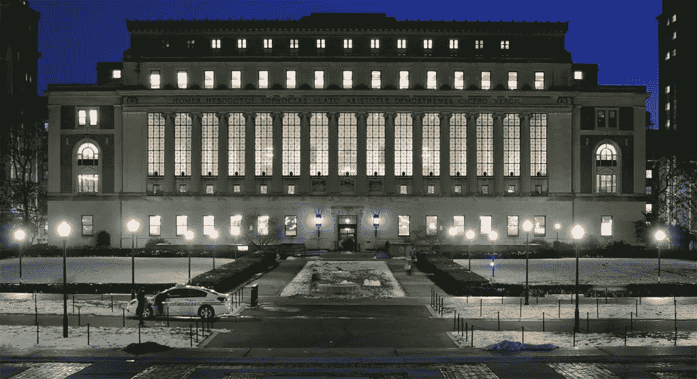
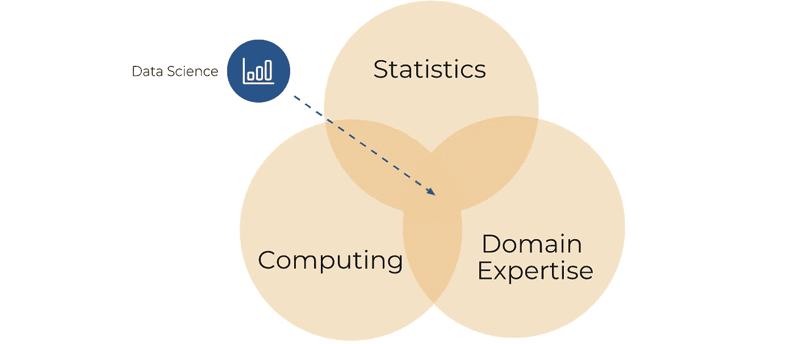

# 喜欢数据科学但不喜欢统计学？参加这个免费的在线课程

> 原文：<https://pub.towardsai.net/like-data-science-but-not-statistics-take-this-free-online-course-de26e9de156d?source=collection_archive---------4----------------------->

## [教育](https://towardsai.net/p/category/education)

## 来自数据科学的先驱。

[InSapphoWeTrust](https://www.flickr.com/photos/56619626@N05)的【哥大管家图书馆】在 [CC BY-SA 2.0](https://creativecommons.org/licenses/by-sa/2.0/?ref=ccsearch&atype=rich) 下授权

# 背景

2001 年，William S. Cleveland 写了一本书*“数据科学:扩展统计领域技术领域的行动计划”*，创造了现在无处不在的术语“数据科学”。

## 数据科学是统计学 2.0

很容易忘记，数据科学描述的是一个多学科的领域，它实际上是统计学的演变。虽然统计学听起来可能不像机器学习或神经网络那样令人兴奋，但统计学是这些技术的基础，所以它是一个重要的研究领域。

哥伦比亚大学是数据科学的另一个先驱，它于 2003 年 1 月开始出版《数据科学杂志》，这使它成为学习数据科学统计学的一个很好的资源。

哥伦比亚大学通过 edX 提供免费的在线课程，名为“数据科学和分析的统计思维”幸运的是，该课程是免费的，没有证书选项，您将获得一个经过验证的 ColumbiaX 证书，价格为 99 美元。

虽然你不需要知道统计学来做数据科学，但显然像[这样的无代码人工智能工具。如果你想在这个行业获得一个技术职位，了解基本概念是很重要的。](http://obviously.ai)

# 为什么是哥伦比亚？

哥伦比亚大学是一所著名的常春藤盟校，成立于 18 世纪，是美国最古老的高等教育机构之一。

根据 edX 页面，您将接受许多著名的哥伦比亚大学讲师的指导，包括:

*   Andrew Gelman，统计学和政治学教授
*   大卫·马迪根，执行副总裁兼文理学院院长
*   劳伦·汉娜，统计系助理教授
*   伊娃·阿斯卡尔扎，哥伦比亚商学院市场营销学助理教授
*   心理学助理教授詹姆斯·柯利
*   田正，系列创作人

这种质量的教育在网上免费提供给所有人，这让我感到很惊讶！

# 课程是关于什么的？

本实践课程涵盖多个领域，包括:

*   数据收集、分析和推断
*   数据分类以识别关键特征和客户
*   条件概率
*   贝叶斯建模
*   线性回归
*   数据可视化

为期 5 周的课程预计每周 7-10 小时(或相当于一周的全日制学习)。

许多在线数据和人工智能课程面临的一个共同挑战是缺乏合格的讲师。这在这里不成问题，因为你将会被无数常春藤联盟的教授教授。

# 先决条件

学生应该对高中数学和编程有基本的了解。

这意味着你不需要成为这些领域的专家，但是如果你不是每天都在使用这些技能，那么每个领域的短期进修课程将会很有用。

# 证书选项

如前所述，该课程附带“认证证书”选项，价格为 99 美元。

证书*可以*作为简历的助推器和在专业社交媒体网络上分享的东西，但它们真的没有必要。

也许选择证书选项的一个更好的理由是，您可以“置身其中”支付 99 美元，你会更有动力去完成这门课程——而许多学生并没有这样做。

# 结论

数据科学现在是我们生活中不可或缺的一部分，即使你没有注意到它。我们在日常生活中产生了大量的数据，这些数据被用来在我们使用的产品和服务中做出数据驱动的决策。

随着从初创公司到财富 500 强的企业都在使用数据科学，数据科学正迅速成为一项必备技能。这个免费的网上常青藤联盟课程是提高统计学基础技能的好方法。