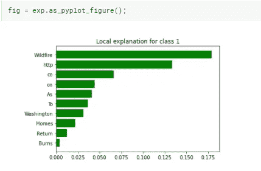
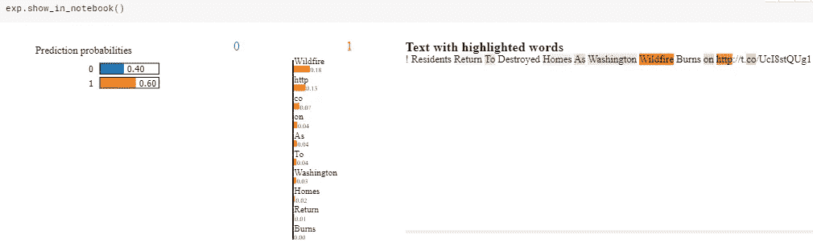

# 解释任何机器学习预测

> 原文：<https://pub.towardsai.net/lime-explaining-any-machine-learning-prediction-d663c457a740?source=collection_archive---------0----------------------->

## [机器学习](https://towardsai.net/p/category/machine-learning)，[数据科学](https://towardsai.net/p/category/data-mining)

## 用石灰向可解释的人工智能迈出第一步


来源: [Unsplash](https://unsplash.com/photos/X9nMwOdYTR4)

# 什么是石灰

LIME 包的主要目标是解释任何黑盒机器学习模型。它用于分类和回归问题。

> LIME —本地可解释的模型不可知解释

# 为什么我们需要石灰

让我们试着理解为什么我们需要解释机器学习预测。假设你正在为一个住房金融或银行客户工作。你的任务是建立一个机器学习模型来预测贷款违约。因此，您构建了模型并成功地在生产中实现了它。现在，相关部门正在使用该模型，他们刚刚为一个客户进行了尝试，模型预测结果为“默认”。到目前为止一切顺利。这个预测可能是 100%正确的，但是你如何解释哪些特性导致这个预测是“默认的”。这就是 LIME 的答案，即它解释了任何机器学习模型预测。

# 装置

```
!pip install lime
```

# 例子

LIME 可用于文本分类(二值分类、多值分类)、回归、图像分类等。在本文中，我们将介绍如何使用 LIME 进行二进制文本分类。一旦你了解如何使用石灰，参考官方教程[这里](https://github.com/marcotcr/lime#tutorials-and-api)的图像分类和回归任务。

## 二元文本分类器

我们将与[合作，“真实与否？本例中的 NLP 与 Kaggle 的灾难 Tweets"](https://www.kaggle.com/c/nlp-getting-started) 数据集。该数据集的目标是预测哪些推文是关于真实灾难的，哪些不是。

下面是相当直截了当。导入所需的库和数据集。然后，训练数据集一分为二—一个用于训练，一个用于验证。由于主要重点是解释模型预测，我们将不使用测试数据集。在应用 TF-IDF 和随机森林分类器后，我们得到了 67.8%的 f1 值。

```
import lime
import os
import numpy as np
import pandas as pd
import matplotlib.pyplot as plt
from sklearn.ensemble import RandomForestClassifier
from sklearn.metrics import f1_score
from sklearn.feature_extraction.text import TfidfVectorizertrain = pd.read_csv('/kaggle/input/nlp-getting-started/train.csv')
test = pd.read_csv('/kaggle/input/nlp-getting-started/test.csv')train.drop(['id','keyword','location'], axis=1, inplace=True)
test.drop(['id','keyword','location'], axis=1, inplace=True)from sklearn.model_selection import train_test_split
X_train, X_cv, y_train, y_cv = train_test_split(train['text'], train['target'], test_size=0.25, random_state=42)vectorizer = TfidfVectorizer(lowercase=False)
train_vectors = vectorizer.fit_transform(X_train)
valid_vectors = vectorizer.transform(X_cv)rf = RandomForestClassifier(n_estimators=250, random_state=42)
rf.fit(train_vectors, y_train)pred = rf.predict(valid_vectors)
print("F1-Score", f1_score(y_cv, pred))
>> F1-Score: 0.6780162842339009
```

现在，让我们看看石灰的作用。首先，从 LIME 导入所需的模块，并使用 TF-IDF 和 fitted 随机森林分类器制作流水线。

```
from lime import lime_text
from lime.lime_text import LimeTextExplainer
from sklearn.pipeline import make_pipelineclf = make_pipeline(vectorizer, rf)
```

对于下面来自验证集的例子，有 60%的可能性给定的推文是关于一场真正的灾难。我们也可以通过查看下面的推文来证实这一点，因为推文谈到了野火和家园的破坏。我们将使用这条推文来找出哪些特征有助于预测“真正的灾难”推文(正面类)。

```
print(X_cv.iloc[26])
>> '! Residents Return To Destroyed Homes As Washington Wildfire Burns on [http://t.co/UcI8stQUg1'](http://t.co/UcI8stQUg1')print(clf.predict_proba([X_cv.iloc[26]]))
>> [[0.4 0.6]]
```

接下来，通过向 LimeTextExplainer 传递一个类名列表来创建一个`LimeTextExplainer`的对象`explainer`。通过在`explainer`上使用`explain_instance`方法，预测的解释被生成，然后被可视化，如下所示。

```
class_names = [0, 1]
explainer = LimeTextExplainer(class_names=class_names, random_state=42)idx = 26
exp = explainer.explain_instance(X_cv.iloc[idx], clf.predict_proba, num_features=10)
```

因为我们已经使用了`num_features=10`，`explain_instance` 返回了前 10 个特性。



作者图片

从下图中我们可以清楚的看到`Wildfire`、`Home`、`Burns`等字样。有助于预测给定的推文是真正的灾难推文。这与真正的灾难推文的原始推文是一致的。有一些词是没有意义的(比如 http，co 等。)但是进入前 10 名。我们可以进一步改进模型，并在数据清理后为预测生成更好的解释。



作者图片

# 结论

你刚刚解释了一个使用 Lime 进行二进制文本分类的黑盒机器学习模型。现在，通过参考官方教程[这里](https://github.com/marcotcr/lime#tutorials-and-api)一个人可以尝试图像分类，回归任务等。

# 完全码

# 参考

[](https://github.com/marcotcr/lime) [## 市场营销/市场营销

### 这个项目是关于解释机器学习分类器(或模型)在做什么。目前，我们支持…

github.com](https://github.com/marcotcr/lime) 

*阅读更多关于 Python 和数据科学的此类有趣文章，* [***订阅***](https://pythonsimplified.com/) *到我的博客*[***www.pythonsimplified.com***](http://www.pythonsimplified.com)***。*** 你也可以通过 [**LinkedIn**](https://www.linkedin.com/in/chetanambi/) 联系我。