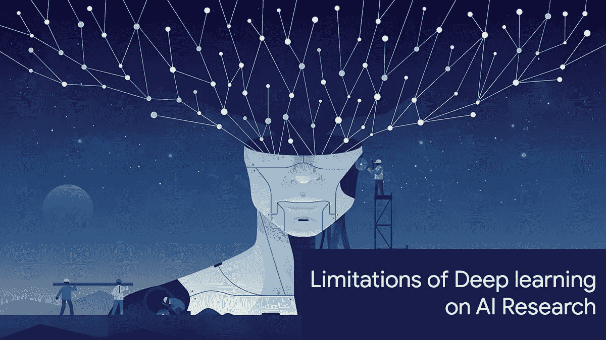
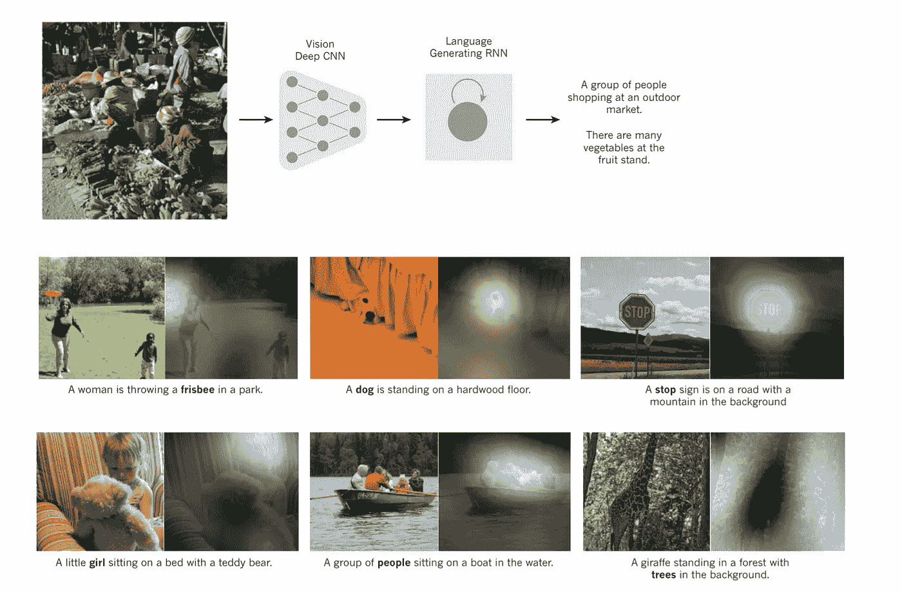
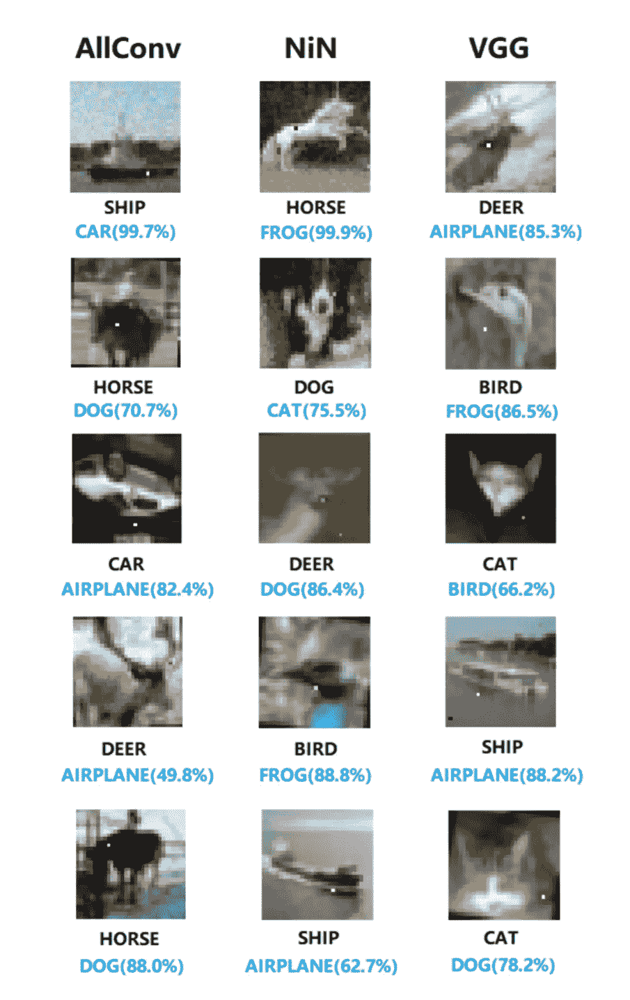
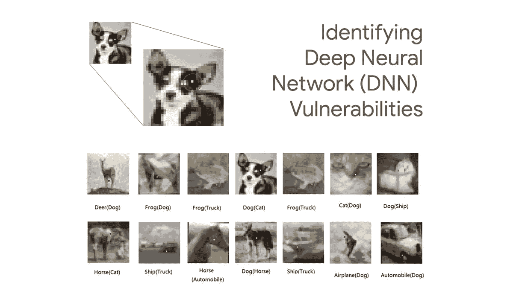

# 深度学习的局限性

> 原文：<https://pub.towardsai.net/limitations-of-deep-learning-in-ai-research-5eed166a4205?source=collection_archive---------0----------------------->

## [深度学习](https://towardsai.net/p/category/machine-learning/deep-learning)

## 由于深度学习，人工智能已经取得了令人难以置信的成就，然而，它仍然低于人类的能力。

2019 年 2 月 12 日，作者[罗伯托·伊里翁多](https://www.robertoiriondo.com) —最近更新:2019 年 4 月 7 日

> 这篇文章已经过时了，请对其内容持怀疑态度。

图片来源:[机器学习回忆录](https://mlmemoirs.xyz)|【11】

深度学习是[机器学习](https://mld.ai/mldcmu)的一个子集，在过去十年里已经在各种实际应用中提供了超人的准确性。从革命性的客户体验，机器翻译，语言识别，自动驾驶汽车，计算机视觉，文本生成，语音理解，以及众多其他人工智能应用[2]。

与人工智能代理基于机器学习算法从数据中学习的机器学习相反，深度学习基于一种神经网络架构，其行为类似于人脑，允许人工智能代理分析输入的数据-在结构上类似于人类。深度学习模型不需要算法来指定如何处理数据，这一点之所以成为可能，要归功于我们作为人类收集和消费的海量数据——这些数据反过来又被输入到深度学习模型中[3]。

“传统”类型的深度学习结合了前馈模块(通常是卷积神经网络)和递归神经网络(偶尔带有记忆单元，如 LSTM [4]或 [MemNN](https://github.com/facebook/MemNN) [5】)的不同组合。这些深度学习模型在“推理”能力方面受到限制，例如，进行长链推理，或简化方法以找到答案。计算步骤的数量受到前馈网络的层数的限制，并且受到时间跨度的限制，递归神经网络将回忆事物。

在这一点上，有一个模糊的问题。当深度学习模型被训练后，并不总是清楚它如何做出决策[6]。在许多情况下，这是不可接受的，不管它是否找到了正确的解决方案；也就是说，假设一家银行利用人工智能评估你的信用价值，然后拒绝你的贷款，在许多州都有法律规定银行需要澄清原因——如果银行在贷款决策中使用深度学习模型，他们的贷款部门(可能)将无法给出贷款被拒绝的明确解释。

**图 1** |由递归神经网络(RNN)生成的字幕，在这种情况下，RNN 被训练为将高级图像呈现识别到字幕中。[1]

最重要的是缺乏常识。深度学习模型可能最擅长感知模式。然而，他们无法理解这些模式意味着什么，更不用说对它们进行推理了。为了让深度学习模型能够推理，我们必须改变它们的结构，以便它们不会产生单一输出(即，图像的可解释性，段落的翻译等。)，但要提供一整套可供选择的输出(即一个句子可以翻译成不同的方式)。这就是能源基础模型的目的:给你要解释的变量的每一个可能的配置打分。

逐渐地，这些弱点在广大公众中引发了对人工智能的担忧，特别是自动驾驶汽车，它们利用类似的深度学习策略来导航道路[7]，与挫折和死亡相关联[8]。公众已经开始说，也许人工智能有问题——在一个期待完美的世界里；即使自动驾驶汽车的深度学习已经证明，它比人类司机造成的伤亡少得多，人类本身也不会完全信任自动驾驶汽车，直到没有伤亡为止。

此外，深度学习在其当前形式下是绝对受限制的，理由是几乎所有对它的卓有成效的使用[19][20][21][22][23][24][25][26][27][28][29][30][31][32]，都利用了带有人类评论注释的监督机器学习，这已被指出是一个重大弱点——这种依赖性阻止了深度神经网络应用于输入数据稀缺的问题。为了捕捉真实世界的规律，迫切需要发现从“原始的”非评论数据准备广泛的神经网络的方法。其中将深度学习与对抗性机器学习技术[17] [18]相结合，可能会找到我们正在寻找的答案。

就一般人群而言——不幸的是，公众对深度学习并没有一个公平的理解。如果深度学习领域的工作仅限于人工智能研究实验室，那是一回事。然而，深度学习技术现在正被用于每一个可能的应用中。科技高管和营销人员对深度学习技术的信心水平令人担忧。虽然深度学习是一项令人难以置信的壮举，但重要的是不仅要探索它的优势，还要关注并意识到它的弱点，以便制定行动计划。

Mrinmaya Sachan 关于“走向有文化的人工智能”的研究提出了一个有趣的案例，探讨了尽管我们已经看到了人工智能领域因深度学习而取得的显著发展，但今天的人工智能系统仍然缺乏人类智能的内在本质。然后，他深入思考，在人类开始构建拥有人类能力(推理、理解、常识)的人工智能系统之前，我们如何评估人工智能系统的这种任务？—为了彻底理解和开发真正的智能系统。他的研究建议通过使用两个框架来进一步开发人工智能系统，从而在人工智能系统上使用标准化测试(类似于学生在正规教育系统中进行的测试)，其显著优势可以以社会公益和教育的形式应用。

## 关于深度学习和决策，我们对神经网络有真正的理论理解吗？

试图模仿大脑架构的人工神经网络拥有大量人工神经元(节点)的连接，网络本身不是一种算法，而是一种框架，各种机器学习算法可以在其上运行以实现所需的任务。神经网络工程的基础几乎完全基于启发式，很少强调网络体系结构的选择，不幸的是，没有明确的理论告诉我们如何为某个模型决定正确的神经元数量。然而，有关于神经元数量和模型总容量的理论工作[12] [13] [14]，然而，这些很少实际应用。

斯坦福大学教授， [Sanjeev Arora](https://www.cs.princeton.edu/~arora/) ，对深度神经网络的泛化理论采取了生动的方法【15】，其中他提到了深度学习的泛化奥秘，关于**为什么经过训练的深度神经网络在以前看不到的数据上表现良好？**也就是让我们说，你用 ImageNet 训练一个深度学习模型，在随机标签的图像上训练，结果会是高精度。然而，使用正常的正则化策略来推断更高的泛化能力并没有多大帮助[16]。无论如何，经过训练的神经网络仍然无法预测看不见的图像的随机标记，这反过来意味着神经网络不会泛化。

**图 2** |成功骗过在 CIFAR-10 数据集上训练的三类深度神经网络的单像素攻击。[9] [10] |原始标签是黑色的，而攻击的输出标签是蓝色的，具有相应的置信区间[9]。

最近，研究人员能够通过在大型图像数据集上添加微小的细微差别来改变(高概率地)神经网络的模型输出，从而暴露深层神经网络架构的漏洞[9]。在这项研究之前，其他几名研究人员基于输入的细微差别，显示了类似水平的脆性与输出不符。这些类型的结果不会激发信心，即在自动驾驶车辆中，环境容易具有各种细微差别(雨、雪、雾、阴影、误报等)。)—现在想象一个视觉系统被它的视觉输入上的一个小变化打乱了。我确信特斯拉、优步和其他一些公司已经发现了这些问题，并正在制定解决方案，然而，让公众意识到这些问题也很重要。

**图 3** |一个像素成功攻击深度神经网络(DNNs)。首先是原始标签，然后是括号中的攻击输出[9]

如今，我们被科技所包围。从我们家里的智能设备、口袋里的智能手机、桌子上的电脑到连接互联网的路由器等等。在这些技术中的每一种中，基础架构都能够正常运行，这要归功于它们所基于的坚实的工程原理、深奥的数学、物理、电子、计算机和软件工程等。最重要的是这些领域——数年，如果不是数十年的话，统计测试和质量保证。

重要的是要记住，深度学习模型需要大量的数据来训练初始模型(为了获得高精度的结果并且不产生过度拟合，请记住子顺序任务可以从迁移学习中学习)，并且最终如果没有对“深度神经架构”内部真正发生的事情的深刻理解，建立长期可持续的技术解决方案在实践上和理论上都是不明智的。

## 致谢:

作者要感谢卡耐基梅隆大学助理教授 [**马特·戈姆雷**](http://www.cs.cmu.edu/~mgormley/) 和首席演讲架构师 [AIDL.io](http://aidl.io/) 策展人兼深度学习专家 [**亚瑟·陈**](https://www.linkedin.com/in/arthchan2003/) 。

**免责声明:**本文表达的观点仅代表作者个人观点，不代表卡内基梅隆大学或其他(直接或间接)与作者相关的公司的观点。这些文章并不是最终产品，而是当前思想的反映，同时也是讨论和改进的催化剂。

你可以在[我的网站](https://www.robertoiriondo.com)、[媒体](https://medium.com/@robiriondo)、 [Instagram](https://www.instagram.com/robiriondo) 、[推特](https://twitter.com/robiriondo)、[脸书](https://www.facebook.com/robiriondo)、 [LinkedIn](https://www.linkedin.com/in/robiriondo) 或者通过我的[网页设计公司](https://www.daibuilds.com)找到我。

## 推荐故事:

 [## 一个简单的人工智能术语表

### 与人工智能领域和子领域相关的术语、缩写和概念的简单词汇表…

towardsai.net](https://medium.com/towards-artificial-intelligence/a-simple-yet-technical-glossary-of-terminology-in-ai-2367b9c3f0e5)  [## 人工智能和机器学习的区别及其重要性

### 不幸的是，一些技术组织正在欺骗客户，宣称在他们的技术上使用人工智能，而不是…

datadriveninvestor.com](https://medium.com/datadriveninvestor/differences-between-ai-and-machine-learning-and-why-it-matters-1255b182fc6)  [## 机器学习的 50 个最佳公共数据集

### 有哪些机器学习的开放数据集？经过几个小时又几个小时的废弃网络，我们创造了一个…

datadriveninvestor.com。](https://medium.com/datadriveninvestor/the-50-best-public-datasets-for-machine-learning-d80e9f030279) 

## 参考资料:

[1]深度学习评论| Yann LeCun，Yoshua Bengio，Geoffrey hint on |[http://pages . cs . wisc . edu/~ dyer/cs 540/讲义/Deep-Learning-nature 2015 . pdf](http://pages.cs.wisc.edu/~dyer/cs540/handouts/deep-learning-nature2015.pdf)

[2]深度学习的 30 个惊人应用| Yaron Hadad |[http://www . Yaron Hadad . com/Deep-Learning-most-Amazing-Applications/](http://www.yaronhadad.com/deep-learning-most-amazing-applications/)

[3]深度学习入门|比丘拉杰|卡耐基梅隆大学|[http://deeplearning.cs.cmu.edu/](http://deeplearning.cs.cmu.edu/)

[4]http://colah.github.io/posts/2015-08-Understanding-LSTMs/了解 LSTM 关系网|克里斯多夫·奥拉

[5]记忆增强神经网络| https://github.com/facebook/MemNN 脸书人工智能研究| T0

[6]人工智能核心的黑暗秘密|麻省理工科技评论|[https://www . Technology Review . com/s/604087/The-Dark-Secret-at-The-Heart-of-ai/](https://www.technologyreview.com/s/604087/the-dark-secret-at-the-heart-of-ai/)

[麻省理工学院 6。S094:自动驾驶汽车的深度学习](https://selfdrivingcars.mit.edu/) |麻省理工学院|[https://selfdrivingcars.mit.edu/](https://selfdrivingcars.mit.edu/)

[8]自动驾驶汽车死亡事故列表|维基百科|[https://en . Wikipedia . org/wiki/List _ of _ Self-Driving _ Car _ deadlines](https://en.wikipedia.org/wiki/List_of_self-driving_car_fatalities)

[9]愚弄深度神经网络的一个像素攻击|苏佳玮，达尼洛·瓦斯康塞洛斯·巴尔加斯，樱井幸一|[https://arxiv.org/pdf/1710.08864.pdf](https://arxiv.org/pdf/1710.08864.pdf)

[10]加拿大高级研究所数据集| CIFAR-10 数据集|[https://www.cs.toronto.edu/~kriz/cifar.html](https://www.cs.toronto.edu/~kriz/cifar.html)

[11]图片，由机器学习回忆录提供|[https://ml memories . XYZ](https://mlmemoirs.xyz)

[12]深度神经网络能力|奥森王、、徐、| Arxiv | [、](https://arxiv.org/abs/1708.05029)

[13]关于使用代数拓扑来表征神经网络的能力| William H. Guss，Ruslan Salakhutdinov |卡耐基梅隆大学计算机科学学院机器学习部|[https://arxiv.org/pdf/1802.04443.pdf](https://arxiv.org/pdf/1802.04443.pdf)

[14]信息论、复杂性和神经网络|亚塞尔·s·阿布-穆斯塔法|加州理工学院|[http://work.caltech.edu/pub/Abu-Mostafa1989nnet.pdf](http://work.caltech.edu/pub/Abu-Mostafa1989nnet.pdf)

[15]一般化理论和深网，导论| Sanjeev Arora |斯坦福大学|[http://www.offconvex.org/2017/12/08/generalization1/](http://www.offconvex.org/2017/12/08/generalization1/)

[16]理解深度学习需要重新思考概括|张、萨米·本吉奥、莫里茨·哈特、本杰明·雷希特、奥里奥尔·维尼亚尔斯| [、](https://arxiv.org/pdf/1611.03530.pdf)

[17]对抗环境下深度学习的局限性| Nicolas Papernot，Patrick McDaniel，Somesh Jha，Matt 弗雷德里克松，Z. Berkay 切利克，Ananthram Swami |第一届 IEEE 欧洲安全和隐私研讨会论文集，IEEE 2016。德国萨尔布鲁肯|【http://patrickmcdaniel.org/pubs/esp16.pdf 

[18]敌对环境中的机器学习|帕特里克·麦克丹尼尔、尼古拉斯·帕伯诺和 z·伯凯·切利克|宾夕法尼亚州立大学|【http://patrickmcdaniel.org/pubs/ieeespmag16.pdf 

19 亚历克斯·克里热夫斯基、伊利亚·苏茨基弗和杰弗里·e·辛顿。基于深度卷积神经网络的图像网分类。神经信息处理系统进展，2012 年。

[20]亚尼夫·泰格曼、杨明、马克·奥雷利奥·兰扎托和利奥·沃尔夫。Deepface:缩小人脸验证中与人类水平性能的差距。IEEE 计算机视觉和模式识别会议论文集，第 1701–1708 页，2014 年。

21 卡伦·西蒙扬和安德鲁·齐塞曼。用于大规模图像识别的非常深的卷积网络。神经信息处理系统进展，2015。

[22]克里斯蒂安·塞格迪，，，贾，皮埃尔·塞尔马内，斯科特·里德，德拉戈米尔·安盖洛夫，杜米特鲁·埃汉，文森特·万霍克，安德鲁·拉宾诺维奇等.深入研究卷积.IEEE 计算机视觉和模式识别会议(CVPR)论文集，2015 年。

[23]，何，，，任，。深入研究整流器:在 imagenet 分类上超越人类水平的性能。IEEE 计算机视觉国际会议论文集，第 1026–1034 页，2015 年。

[24]，何，，，任，。用于图像识别的深度残差学习。《IEEE 计算机视觉和模式识别会议论文集》(CVPR)，第 770–778 页，2016 年。

[25] Geoffrey Hinton，，Dong Yu，George E Dahl，Abdel-rahman Mohamed，Navdeep Jaitly，Andrew Senior，Vincent Vanhoucke，Patrick Nguyen，Tara N Sainath，等.用于语音识别中声学建模的深度神经网络:四个研究组的共同观点。IEEE 信号处理杂志，29(6):82–97，2012。

[26] Awni Hannun，Carl Case，Jared Casper，Bryan Catanzaro，Greg Diamos，Erich Elsen，Ryan Prenger，Sanjeev Satheesh，Shubho Sengupta，Adam Coates 等.深度语音:扩大端到端语音识别.arXiv 预印本 arXiv:1412.5567，2014。

[27] Wayne Xiong、Jasha Droppo、Huang、Frank Seide、Mike Seltzer、Andreas Stolcke、Dong Yu 和 Geoffrey Zweig。在会话语音识别中实现人类对等。arXiv 预印本 arXiv:1610.05256，2016。

[28] Chung-Cheng Chiu，Tara N Sainath，Wu Yong hui，Rohit Prabhavalkar，Patrick Nguyen，，Anjuli Kannan，Ron J Weiss，Kanishka Rao，Katya Gonina，等.采用序列到序列模型的最新语音识别技术.arXiv 预印本 arXiv:1712.01769，2017。

[29] Dzmitry Bahdanau、Kyunghyun Cho 和 Yoshua Bengio。通过联合学习对齐和翻译的神经机器翻译。在 2015 年国际学习代表大会上。

[30] Ilya Sutskever，Oriol Vinyals 和 Quoc V Le。用神经网络进行序列间学习。《神经信息处理系统进展》,第 3104–3112 页，2014 年。

[31]吴永辉，迈克·舒斯特，，郭维乐，穆罕默德·诺鲁齐，沃尔夫冈·马切里，马克西姆·克里昆，，秦高，克劳斯·马切里，等.谷歌的神经机器翻译系统:弥合人类与机器翻译之间的鸿沟.arXiv 预印本 arXiv:1609.08144，2016。

[32] Hany Hassan，Anthony Aue，，Vishal Chowdhary，Jonathan Clark，Christian Federmann，Huang，Marcin Junczys-Dowmunt，，等.在自动汉英新闻翻译中实现人与人对等.arXiv 预印本 arXiv:1803.05567，2018。

[33] Mrinmaya Sachan，迈向有文化的人工智能，卡内基梅隆大学机器学习系，[https://pdfs . semantic scholar . org/25 C5/6f 52 c 528112 da 99 d0ae 7 e 559500 ef 7532 d3a . pdf](https://pdfs.semanticscholar.org/25c5/6f52c528112da99d0ae7e559500ef7532d3a.pdf)