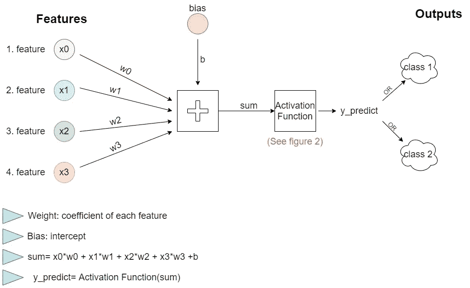
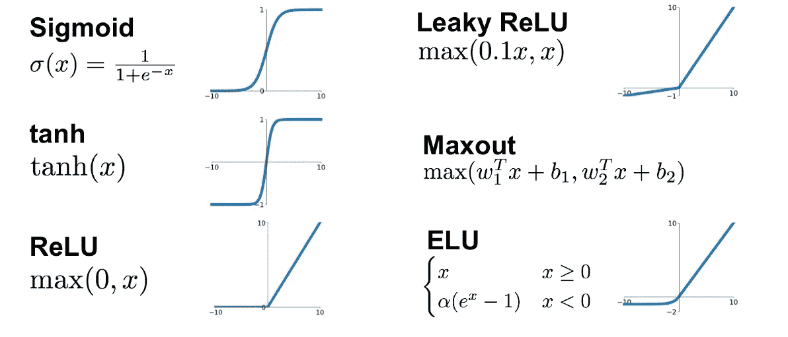

# 分类的线性模型，逻辑回归，有和没有 sklearn 库

> 原文：<https://pub.towardsai.net/linear-models-for-classification-logistic-regression-with-without-sklearn-library-6ec9a5556023?source=collection_archive---------1----------------------->

## [机器学习](https://towardsai.net/p/category/machine-learning)

本文推导性地分解了逻辑回归的主题，逻辑回归是用于分类的线性模型。它解释了逻辑回归算法在数学上是如何工作的，它是如何用 sklearn 库实现的，最后它是如何在 python 中用数学方程而不用 sklearn 库实现的。此外，解释了线性模型的多类分类。

```
Table of Contents (TOC)
---- Introduction
---- Linear Models for Classification without Sklearn
---- Linear Models for Classification with Sklearn
-----Linear Models for Multiclass Classification
```


由[罗伯特·索林](https://unsplash.com/@roberto_sorin?utm_source=medium&utm_medium=referral)在 [Unsplash](https://unsplash.com?utm_source=medium&utm_medium=referral) 上拍摄的照片

# 介绍

线性模型用于分类和回归。其中之一，*逻辑回归*，与其名称相反，用于二元分类。二元分类意味着数据集包括 2 个输出(类)。此外，逻辑回归是神经网络的基础部分。它通过更新用户设置的初始值来最小化每次迭代中的误差(成本)。图 1 显示了如何使用逻辑回归对具有 4 个特征和 2 个类的数据集进行分类的流程图。



图一。作者的逻辑回归图像流程图

1.  在逻辑回归的训练部分，为每个特征分配 1 个权重，并向系统添加 1 个偏差值。
2.  这些权重和偏差值由用户选择的值初始化。
3.  每个权重乘以自己的特征值，并通过添加偏差值来相加。
4.  用户选择的激活功能(图 2)应用于和值。
5.  当我们假设它是一个 sigmoid 函数时，激活函数(sum)将在 0–1 之间，误差由该值计算。
6.  根据计算出的误差值，以学习率的速率用梯度下降法(点击[此处](https://medium.com/geekculture/linear-regression-gradient-descent-model-regularization-fba0e2c1e4a7))更新权重和偏差值。
7.  这个过程重复迭代的次数。现在，让我们用代码在乳腺癌数据集上实现上述过程。



图二。激活功能，[来源](https://www.linkedin.com/pulse/activation-functions-neural-networks-leonardo-calderon-j-/)

# 无 Sklearn 库的线性分类模型

导入数据集，用 MinMaxScaler 归一化特征值，用 train_test_split 分离数据。

```
IN[1]
import numpy as np
import pandas as pd
import matplotlib.pyplot as plt
from sklearn.datasets import load_breast_cancer
data = load_breast_cancer()
x=data.data
y=data.target
print("shape of data:",x.shape)
from sklearn.preprocessing import MinMaxScaler
scaler=MinMaxScaler()
x_new=scaler.fit_transform(x)
**OUT[1]
shape of data: (569, 30)**IN[2]
from sklearn.model_selection import train_test_split
x_train, x_test, y_train, y_test = train_test_split(x_new,y,test_size = 0.15,random_state=2021)
x_train = x_train.T
x_test = x_test.T
y_train = y_train.T
y_test = y_test.T
```

初始值设定为权重为 0.1，初始偏移为 1。应用 sigmoid 函数的方程。

```
IN[3]
def weights_bias(shape):
    weights = np.full((shape,1),0.1)
    bias = 1
    return weights,bias
IN[4]
def sigmoid(z):  
    y_predict = 1/(1+ np.exp(-z))
    return y_predict
```

正向传播和反向传播设计如下。

```
IN[5]
def forward_backward(w,b,x_train,y_train):
    z = np.dot(w.T,x_train) + b
    y_predict = sigmoid(z)
    derivative_weight = (np.dot(x_train,((y_predict-y_train).T)))/x_train.shape[1]
    derivative_bias = np.sum(y_predict-y_train)/x_train.shape[1]                 
    gradients = {"derivative_weight": derivative_weight, "derivative_bias": derivative_bias}
    return gradients
```

初始值更新了学习率和迭代次数。

```
IN[6]
def update_parameters(w, b, x_train, y_train, learning_rate,iterations):
    index = []
    for i in range(iterations):
        gradients = forward_backward(w,b,x_train,y_train)
        w = w - learning_rate * gradients["derivative_weight"]
        b = b - learning_rate * gradients["derivative_bias"]
    parameters = {"weight": w,"bias": b}
    return parameters, gradients
```

该架构的最后一步是预测电流输入，如果 sigmoid 函数(sum)≤0.5，则属于 0 类，如果 sigmoid 函数(sum)>0.5，则属于 1 类。

```
IN[7]
def predict(w,b,x_test):
    z = sigmoid(np.dot(w.T,x_test)+b)
    y_prediction = np.zeros((1,x_test.shape[1]))
    for i in range(z.shape[1]):
        if z[0,i]<= 0.5:
            y_prediction[0,i] = 0
        else:
            y_prediction[0,i] = 1
    return y_prediction
```

现在，让我们将它们结合起来，用 Learning_rate=0.1 和迭代次数=100 进行测试:

```
IN[8]
def logistic_regression(x_train, y_train, x_test, y_test, learning_rate ,  iterations):
    shape =  x_train.shape[0]
    w,b = weights_bias(shape)
    parameters, gradients = update_parameters(w, b, x_train, y_train, learning_rate,iterations)
    y_prediction_test = predict(parameters["weight"],parameters["bias"],x_test)
    print("test accuracy: {}% ".format(100 - np.mean(np.abs(y_prediction_test - y_test)) * 100))

logistic_regression(x_train, y_train, x_test, y_test,learning_rate = 0.1, iterations = 100)
**OUT[8]
test accuracy: 91.86046511627907%**
```

> 初始值、学习率、迭代次数是项目的超参数。可以尝试其他配置，并且可以获得更高的精度。

# 使用 Sklearn 库进行分类的线性模型

现在让我们使用 sklearn 库来处理同一个数据集。当我们改变超参数 C 值时，可以看到它对模型精度的影响。

```
IN[9]
from sklearn.linear_model import LogisticRegression
c_list=[0.001,0.01,0.1,1,10]
for i in c_list:
    lrc = LogisticRegression(C=i).fit(x_train.T,y_train.T)
    lrc_test=lrc.score(x_test.T,y_test.T)
    lrc_test=round(lrc_test*100,2)
    print("C=",i,"test acc: ", lrc_test,"%")
**OUT[9]
C= 0.001 test acc:  63.95 %
C= 0.01 test acc:  77.91 %
C= 0.1 test acc:  93.02 %
C= 1 test acc:  95.35 %
C= 10 test acc:  98.84 %**
```

如图所示，当控制 C 值增加时，测试精度也增加。Sklearn 中有许多用于逻辑回归的超参数，点击此[链接](https://scikit-learn.org/stable/modules/generated/sklearn.linear_model.LogisticRegression.html)即可访问所有超参数。

# 多类分类

提到了逻辑回归用于二元分类。那么超过 2 类的话怎么用 logistic 回归呢？在这里，我们遇到了基于一对其余原则的多类分类。对于每个类别，系数和偏差是通过将所有其他类别与它相对比而产生的。在预测阶段，它被放在最合适的类中。有了 Sklearn 库，我们可以很容易地实现它，如下所示。

```
IN[10]
from sklearn.datasets import load_digits
digits = load_digits()
x_digit=digits.data
y_digit=digits.target
print("shape of data:",x_digit.shape)from sklearn.preprocessing import MinMaxScaler
scaler=MinMaxScaler()
x_digit_new=scaler.fit_transform(x_digit)from sklearn.model_selection import train_test_split
x_digit_train, x_digit_test, y_digit_train, y_digit_test = train_test_split(x_digit_new,y_digit,test_size = 0.20,random_state=2021)
**OUT[10]
shape of data: (1797, 64)**IN[11]
from sklearn.linear_model import LogisticRegression
multiclass = LogisticRegression(multi_class='multinomial')
multiclass.fit(x_digit_train,y_digit_train)
multiclass_test=multiclass.score(x_digit_test,y_digit_test)
multiclass_test=round(multiclass_test*100,2)
print("test acc: ", multiclass_test,"%")
**OUT[11]
test acc:  95.28 %**
```

## 回到指引点击[这里](https://ibrahimkovan.medium.com/machine-learning-guideline-959da5c6f73d)。

[](https://ibrahimkovan.medium.com/machine-learning-guideline-959da5c6f73d) [## 机器学习指南

### 本文旨在准备一个机器学习数据库，以便在一个视图中显示所有的机器学习标题。这个…

ibrahimkovan.medium.com](https://ibrahimkovan.medium.com/machine-learning-guideline-959da5c6f73d)