# 线性回归数学直觉

> 原文：<https://pub.towardsai.net/linear-regression-59d13f00ca53?source=collection_archive---------1----------------------->

线性回归是机器学习中最简单的模型，其原始版本描述了两个变量之间的关系。理解线性回归概念的基础仍然很重要，因为它是理解许多其他机器学习模型和神经网络的基础。

在我们深入线性回归工作流程之前，让我们描述一下该模型的关键组件或功能及其推论，如下所示:

*   均方误差
*   预言；预测；预告
*   梯度下降

## **均方误差(MSE)**

在这里，我们将对 MSE 进行扣除，MSE 将在该模型中用作衡量整体模型平均误差的指标。所以，让我们来看看下面的插图:

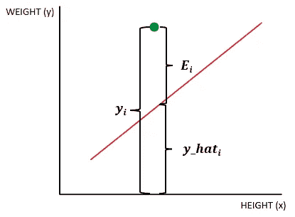

**线性回归模型组件**

这里我们有 ***伊*** 这是答案， ***y_hat*** 这是预测，最后还有 ***Ei*** 这是关于模型的误差，也称为*ε*。

从上图我们可以推断出，误差是由答案*易*和预测 *y_hat* 之差定义的，可以表示为:

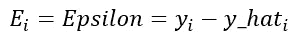

**基础误差公式**

您可能已经注意到，这种差异并不总是正的，因为图中的寄存器或点有时会位于模型函数的下方。为了解决这个问题，我们简单地平方表达式:

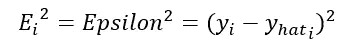

**二次误差公式**

一旦我们得到这些，我们就有了确定数据集中单点误差的表达式，我们可以扩展它，将整个数据集的误差表示为以下表达式，它们是相同的:

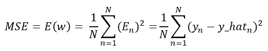

**均方差公式**

上面的公式是 MSE 本身，但它也可以用矩阵形式表示，如下图所示:

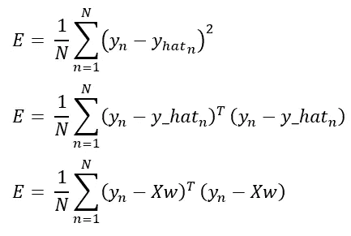

**最小平方误差的矩阵形式**

请记住这种表达 MSE 的不同形式，因为我们将使用任何这种符号进行进一步的解释。

## **预测**

我们的预测是一个建立模型的函数，在这种情况下是线性回归。在此模型中，我们将模型函数定义为向量参数与数据集的乘积:

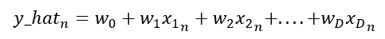

**单个寄存器的预测公式**

这里，n 表示数据集中寄存器的总数，D 是数据集特征的总大小，也称为维度大小。如您所见，我们的参数将是一个具有数据集维度大小的向量，我们知道数据集通常是一个矩阵，因此该表达式可以简化如下:

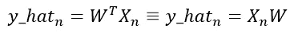

**线性回归预测公式**

上图中的两个表达式完全相同。

## **梯度下降**

为了优化参数，我们使用梯度下降，对于这个特定的模型，我们也可以使用直接方法，我们将在稍后解释，现在让我们专注于梯度下降。

梯度下降使用实际误差的梯度，该梯度是实际误差的导数，该导数与我们需要进行的一些运算一起表示如下，以获得梯度:

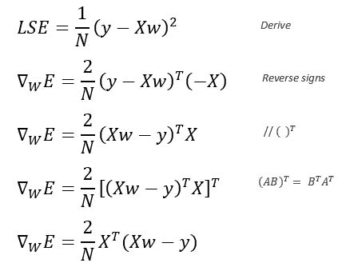

**最小二乘误差的梯度**

这里，你可以看到我们的最终结果是误差相对于 w 的梯度，w 代表参数。

现在我们有了梯度，让我们看看下面表示的梯度下降:

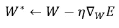

**梯度下降公式**

上面的公式是原始的梯度下降其中 eta 是学习率，误差的梯度是我们之前刚刚推导的。然后，如果我们用刚刚推导出的表达式替换误差的梯度，我们会得到以下结果:

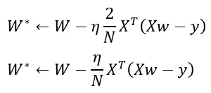

**线性回归的梯度下降**

## **直接法**

线性回归模型中梯度下降的另一种方法是直接法，该方法简单地将误差表达式的梯度等于 0。下图显示了此方法的扣除额:

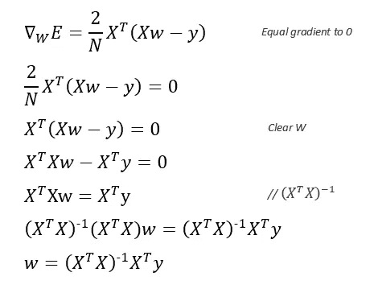

**参数优化的直接方法**

## 线性回归实现

现在我们知道了线性回归的关键方法，让我们用下图来解释它的工作流程:

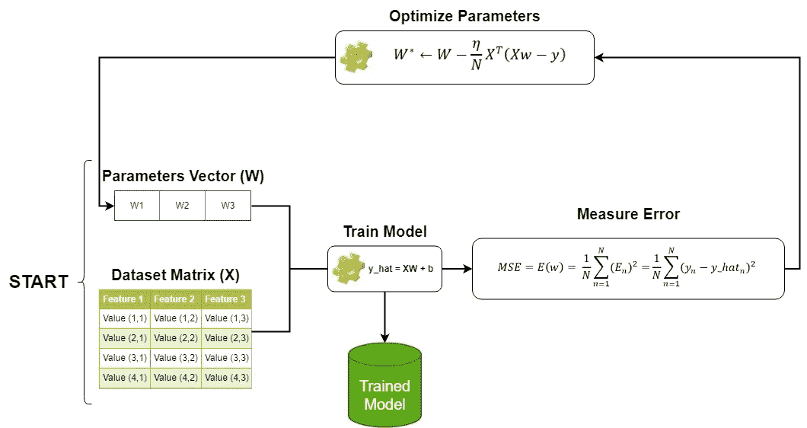

**线性回归实现**

如您所见，我们开始随机设置参数，并将其与数据一起输入线性回归模型，然后测量误差，并基于此使用梯度下降优化参数。我们继续进行这个过程，直到误差稳定在最小值，然后我们用调整参数的训练模型退出这个循环。请注意，参数充当模型的张量。

在使用直接方法而不是梯度下降的情况下，参数的调整将仅发生一次，这意味着我们不需要像梯度下降那样的循环。

**注意事项**

1.  您需要记住的一点是，线性回归模型只是预测，梯度下降和误差函数是实现该模型的完整机制，也用于其他模型，但模型本身是定义预测的公式。
2.  第二件要考虑的事情是，在这个解释中，我们使用均方误差作为评估模型误差的指标，但如果您希望对其进行更多的研究，您会发现最大似然法最终与评估误差的方法相同。

希望这对你有帮助。