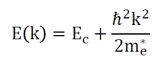
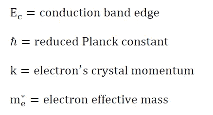
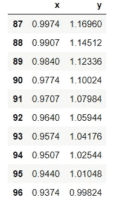

# 材料科学中的线性回归分析

> 原文：<https://pub.towardsai.net/linear-regression-analysis-in-materials-sciences-a45caac70d70?source=collection_archive---------1----------------------->

## **用 Pylab |** [**对二硫化钼晶体的能带结构进行分析**](https://towardsai.net)

## **利用 Pylab 分析二硫化钼晶体的能带结构**


**mos 2 晶体导带的抛物线拟合。**

此代码对 MoS2 晶体的模拟能带结构数据执行线性回归。MoS2 的能带结构在上一篇文章中计算过: [**利用量子浓缩**](https://medium.com/modern-physics/tutorial-setting-up-and-running-a-dft-calculation-using-quantum-espresso-d7a2428495bd) 的密度泛函理论教程。


**图 1:采用密度泛函理论的 MoS2 晶体能带结构**。

线性回归分析可以用来对 **K** 点附近的导带和价带数据拟合一条抛物线(度数= 2)，如图 1 所示。这种分析将产生关于电子和空穴有效质量的重要信息，电子和空穴有效质量是任何半导体材料的关键输运性质。为简单起见，我们将只关注导带。

对于电子有效质量计算，我们对导带数据使用二次(抛物线)拟合(**度= 2** ):



在哪里



这是一个例子，其中导带最小值附近(在图 1 中的 **K 点**处)的色散关系的行为的知识引导我们选择二次拟合。即使更高次的多项式拟合，例如次数= 4 产生更好的精度(更高的 R 平方值)，它也会导致模型的过度拟合，即没有物理解释的模型。

本文的数据集和代码可以从这个资源库下载:[https://github.com/bot13956/regression_band_structure](https://github.com/bot13956/regression_band_structure)。

# 利用 Pylab 进行能带结构分析

**导入必要的库**

```
import pylab
import pandas as pd
```

**导入导带数据**

```
**#import conduction band data: x = crystal momentum; y = energy**data=pd.read_csv('c_band.csv')data.head(n=10)
```



表 1:导带数据集。

**选择导带最小值附近的 x 值**

```
data=data[(data.x >0.82) & (data.x<1.0)]
```

**使用 Pylab** 执行多项式拟合

```
Xvals=data.xYvals=data.ydegree = 2model=pylab.polyfit(Xvals,Yvals,degree)estY=pylab.polyval(model,Xvals)
```

**计算 R 平方值**

```
R2 = 1 - ((Yvals-estY)**2).sum()/((Yvals-Yvals.mean())**2).sum()
```

**观察和建模数据的可视化**

```
pylab.figure(figsize=(10,7))pylab.scatter(Xvals,Yvals, c='b', label='observed')pylab.plot(Xvals,estY, c='r', label='predicted:' + ' R2' '='+ ' ' + str(round(R2,4)))pylab.xlabel('k (2pi/a)')pylab.ylabel('E (eV)')pylab.xticks(pylab.arange(0.8, 1.05, 0.05))pylab.legend(loc=10)pylab.show()
```


**图 MoS2 晶体导带的抛物线拟合。**

总之，我们已经讨论了如何在材料科学中使用线性回归来分析计算研究产生的数据。我们已经看到，确定与任何给定数据的良好拟合的主要因素是所拟合的函数形式的有效性。当然，只要有可能，关于物理问题的理论或分析信息都应该整合到模型中。在本例中，基于我们对接近导带最小值的近自由电子色散关系的理解，使用二次模型来拟合数据。这确保了偏差-方差权衡的问题被考虑在内。

本文的数据集和代码可以从这个存储库下载:[https://github.com/bot13956/regression_band_structure](https://github.com/bot13956/regression_band_structure)。