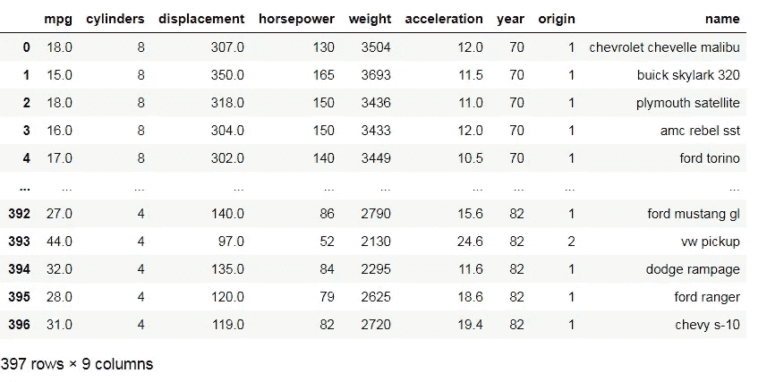
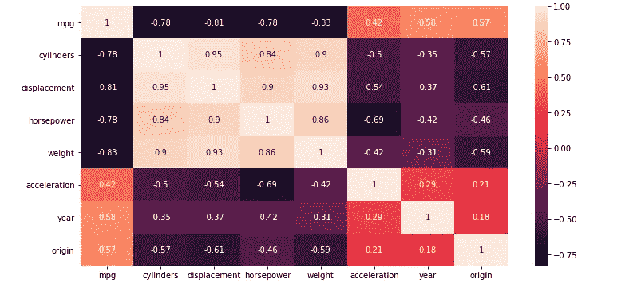
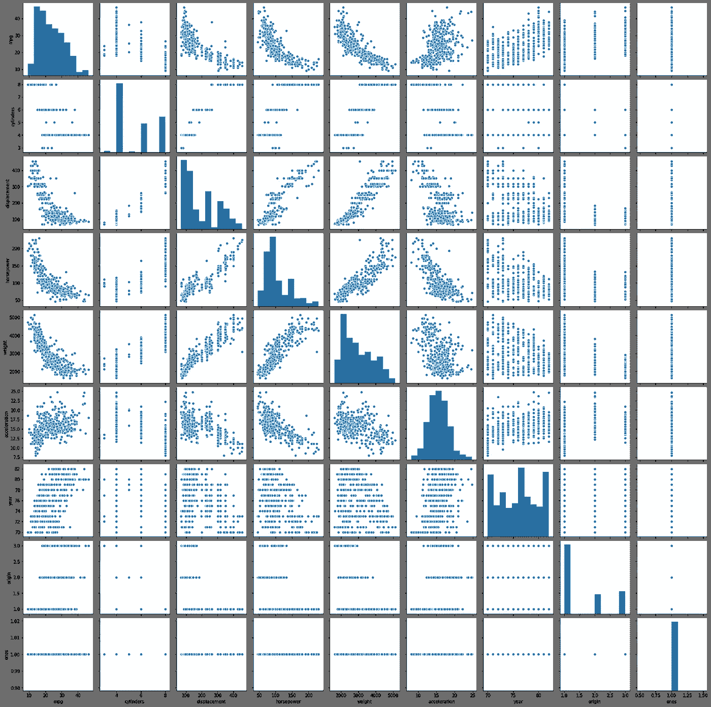
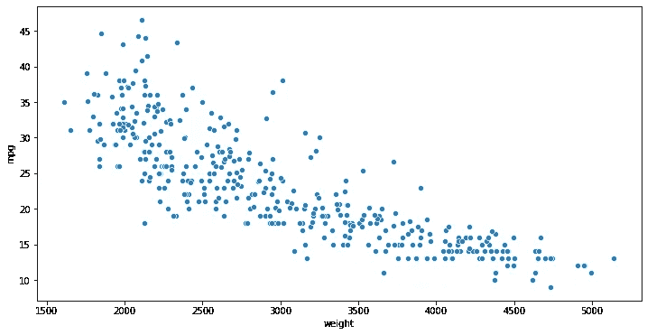
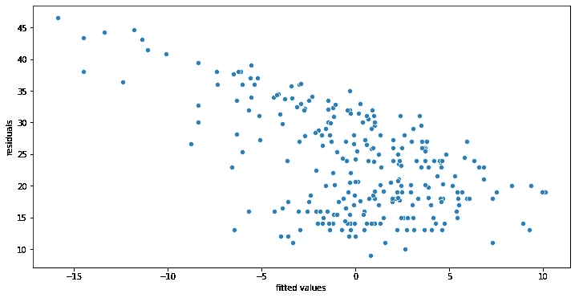
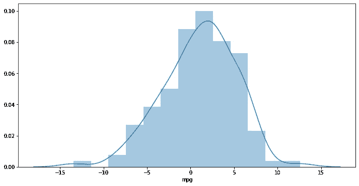
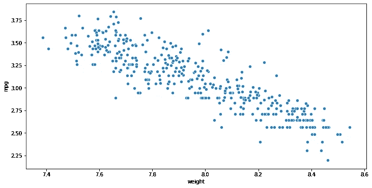
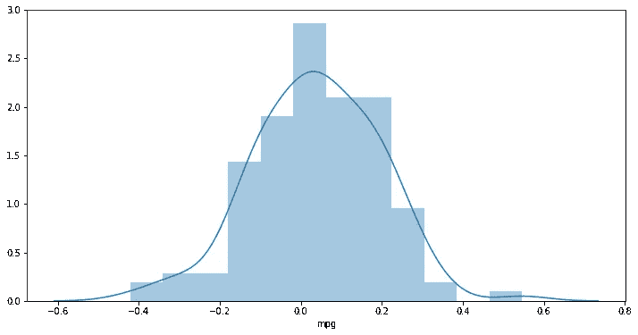
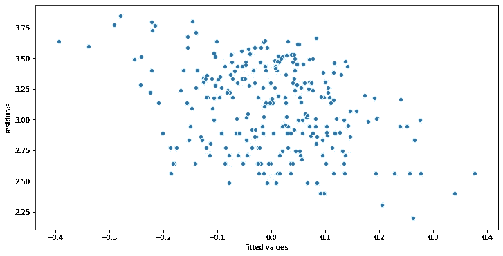
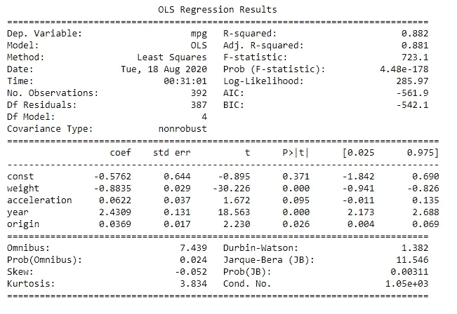

# 汽车数据集的线性回归分析

> 原文：<https://pub.towardsai.net/linear-regression-analysis-on-the-auto-dataset-3464654abde8?source=collection_archive---------1----------------------->

## [机器学习](https://towardsai.net/p/category/machine-learning)

## *对《统计学习导论》一书中自动数据集的深入分析*


照片由 [chuttersnap](https://unsplash.com/@chuttersnap?utm_source=medium&utm_medium=referral) 在 [Unsplash](https://unsplash.com?utm_source=medium&utm_medium=referral) 上拍摄

Auto Dataset 是一个非常受欢迎的数据集，它在试图了解机器学习算法的初学者中非常流行。
它包含几个变量，如几辆汽车的马力、重量和加速度等，是我开始机器学习之旅的第一批数据集之一
对于本文，我将实现一个线性回归模型来预测几个独立变量的“每加仑英里数”变量。所以让我们开始吧。

# **将数据集导入 Jupyter 笔记本:**

```
data = pd.read_csv('Auto (1).csv')
data
```



自动数据集

乍一看，我看到几个变量是典型汽车的属性，如每加仑英里数、气缸数、排量、马力、重量和加速度。

# **分析数据集**

让我们创建一个热图，看看这些变量是如何相互关联的。

```
plt.figure(figsize = (12,6))
sns.heatmap(data.corr(),annot = True)
```



数据集的热图

从热图来看，我发现每加仑**英里数**与重量、排量、气缸和马力高度相关。

这确实有道理，因为气缸越多，燃烧的燃料就越多，因此里程就越少，重量越大，燃烧的燃料就越多。

马力和排量也可以做同样的类比。

但是有一件事我们必须考虑，那就是多重共线性。

这四个自变量即使与 mpg 高度相关，也彼此高度相关。这怎么会是个问题呢？

多重共线性会给我们带来不可靠的系数和错误的 P 值，从而导致对模型的错误解释。

更多细节请点击

让我们看看结对图:



数据集的配对图

存在定量和定性变量的混合。

# **选择自变量**

我如何选择独立变量？由于变量之间存在大量多重共线性，我可以使用**正向选择**

从相关性最高的变量开始，一直到相关性最低的变量。

与 **MPG** 相关性最高的变量是**体重**。

我将 X 和 y 定义为:

```
X = data['weight']
y = data['mpg']
```

创建散点图:

```
sns.scatterplot(X,y)
```



mpg 和重量散点图

散点图中似乎存在一些非线性，**违反了**线性回归的第一个假设**线性。**

我可以应用非线性变换，比如对数变换，来降低非线性度，不过我们以后再做吧。

现在，让我们继续处理上面的变量。

我将变量分成测试和训练数据集

```
X_train, X_test, y_train, y_test = train_test_split(X, y, test_size=0.33, random_state=42)
```

从 scikit 学习库中导入线性回归模块，并使其适合训练数据。

```
from sklearn.linear_model import LinearRegression
LR = LinearRegression()
LR.fit(X_train,y_train)
```

使用训练好的模型进行预测

```
pred = LR.predict(X_test)
```

做出预测后，我想检查我的模型的性能指标，如 R2 分数和均方根误差

```
print(r2_score(pred,y_test))
print(np.sqrt(mean_squared_error(pred,y_test))) 
```

我的 RMSE 得分为 4.29，R2 得分为 0.59，这并不令人印象深刻。让我们看看我们的残差，看看是否满足**同方差**和**正态性**的条件？

```
sns.scatterplot(pred1-y_train,y_train)
plt.xlabel('fitted values')
plt.ylabel('residuals')
```



残差图

残差显示了**非恒定方差**，这表明**同方差**在我们的模型中不存在。

让我们看看距离图，看看我们的残差是否有正态分布。



我们残差的距离图

残差确实显示了一个向右稍微倾斜的正态分布。但我们不能否认的是，该模型未能满足两个线性回归假设(**同质性和一个线性度**)，因此，该模型对于做出预测是不可靠的。

# **我如何改进模型？**

有几种方法可以解决缺乏同性恋安全感的问题。

最常见的方法是对因变量进行对数变换。例如:我可以尝试预测“英里每加仑”变量，而不是尝试预测“英里每加仑”的对数变换，只要残差符合**同质性的条件。**

**非线性**可以用同样的方式处理。对独立变量进行对数变换可以使变量之间的关系更加线性。

因此，让我们尝试一下日志转换

```
X = np.log(data[['weight']]) 
X = X.join(data['ones'])
y = np.log(data['mpg'])
```

再次创建散点图给我们:



对数转换变量的散点图

这种关系现在看起来更加线性。我将线性回归模型拟合到新拟合的对数转换变量，并检查性能指标。

```
print(r2_score(pred,y_test))
print(np.sqrt(mean_squared_error(pred,y_test)))
```

r2 分数从 0.59 提高到 0.72，这是一个好现象。

让我们检查残差图，看看**非恒定方差**是否已经减少。


残差与 y _ 测试图

方差变得更加稳定，看起来比之前的散点图好得多。让我们检查残差的距离图。



对数变换残差的距离图

distplot 中不存在偏斜。

对数转换确实改进了模型，并且比以前的模型更好地满足了线性回归假设。
但是我只使用了一个变量，即权重变量，让我们继续使用**前向选择**技术，但是添加了其余的变量，看看得到了什么结果。

# **多元线性回归**

```
X = np.log(data[['weight','acceleration','year','origin']]) 
X = X.join(data['ones'])
y = np.log(data['mpg'])
```

将线性回归模型拟合到数据集

```
from sklearn.linear_model import LinearRegression
LR = LinearRegression()
LR.fit(X_train,y_train)
pred = LR.predict(X_test)
```

创建残差图:



残差图多元线性回归

计算性能指标

```
print(r2_score(pred,y_test))
print(np.sqrt(mean_squared_error(pred,y_test)))
```

我得到了 0.874 的 R2 分数，比之前 0.72 的模型分数好得多。
现在，可能会有添加相关变量(排量、马力、气缸)的诱惑。
虽然添加变量可以增加 R2 得分，但如果变量之间存在严重的多重共线性，它们会给出错误的系数值。
但是我怎么知道现在的变量有可靠的系数？让我们检查一下。使用 scipy 库中的 OLS 方法，我得到了以下结果。



OLS 回归综述

我得到了 0.874 的 R2 分数，比之前的模型好得多。
严重多重共线性的一个标志是系数的符号是错误的，但这里不是这种情况。
热图和 OLS 回归的系数符号相同。

但是一些变量具有高 P 值，这意味着它们与因变量没有显著的关系。
这是因为多重共线性吗？P 值可靠吗？

通过计算可变通货膨胀系数，我可以挖掘得更深。
但是如果我必须做出选择，我会选择这个模型，因为除了对多重共线性条件有一点怀疑之外，所有条件都已满足。

# **结论**

综上所述，我得出的结论是，对数变换在处理非线性和异方差方面非常有效，变量越多，R2 得分越高，但我们必须小心多重共线性。

[1]:加雷斯·詹姆斯..*统计学习概论* [http://faculty.marshall.usc.edu/gareth-james/ISL/](http://faculty.marshall.usc.edu/gareth-james/ISL/)