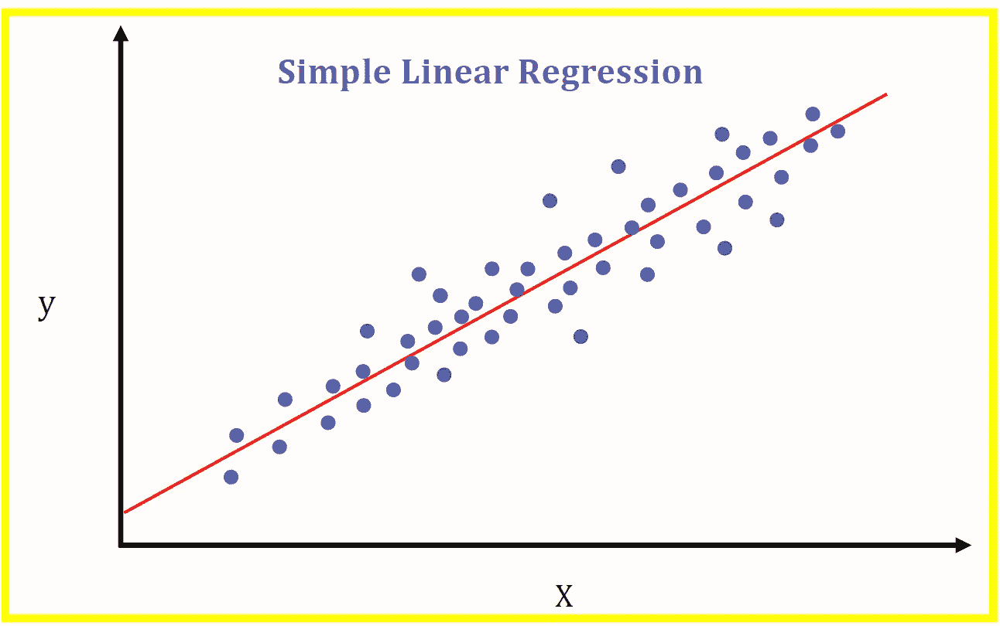
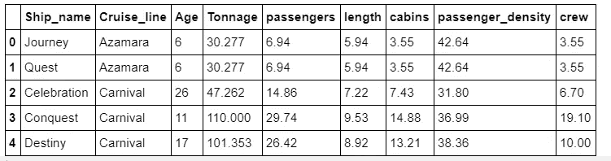
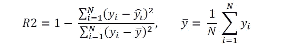
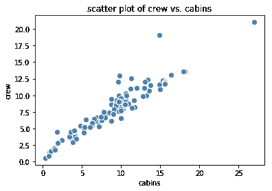
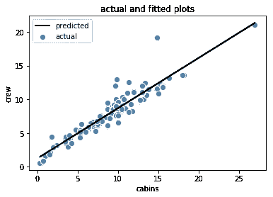
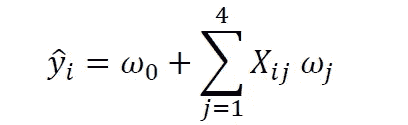
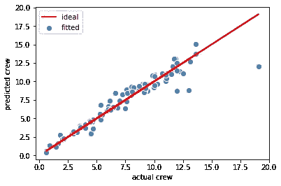

# 绝对初学者的线性回归基础

> 原文：<https://pub.towardsai.net/linear-regression-basics-for-absolute-beginners-68ed9ff980ae?source=collection_archive---------0----------------------->



Benjamin O. Tayo 的图片

## 数据科学

## 使用 NumPy、Pylab 和 Scikit 进行简单和多元回归分析的教程-学习

# 1.介绍

回归模型是最流行的机器学习模型。回归模型用于连续预测目标变量。回归模型在几乎每个研究领域都有应用，因此，它是使用最广泛的机器学习模型之一。本文将讨论线性回归的基础知识，面向数据科学领域的初学者。

使用游轮数据集[**cruise _ ship _ info . CSV**](https://github.com/bot13956/ML_Model_for_Predicting_Ships_Crew_Size)，我们将使用 NumPy、Pylab 和 Scikit-learn 演示简单和多重回归分析。因为这只是一个介绍性的教程，所以不需要区分内部值和外部值(外部值可以使用更健壮的方法来处理，比如 RANSAC 回归)。

# 2.数据分析

## 2.1 导入必要的库

```
import numpy as npimport pandas as pdimport pylabimport matplotlib.pyplot as pltimport seaborn as snsimport matplotlib.pyplot as pltfrom sklearn.metrics import r2_scorefrom sklearn.model_selection import train_test_splitfrom sklearn.preprocessing import StandardScalerfrom sklearn.linear_model import LinearRegressionfrom sklearn.pipeline import Pipelinepipe_lr = Pipeline([('scl', StandardScaler()),
                    ('lr', LinearRegression())])
```

## 2.2 读取数据集并显示列

```
df = pd.read_csv("cruise_ship_info.csv")df.head()
```



**表 1** :显示数据集的前 5 行。

## 2.3 计算协方差矩阵

```
cols = ['Age', 'Tonnage', 'passengers', 'length', 
                      'cabins','passenger_density','crew']

stdsc = StandardScaler()X_std = stdsc.fit_transform(df[cols].iloc[:,range(0,7)].valuescov_mat = np.cov(X_std.T)
```

## 2.4 生成用于可视化协方差矩阵的热图

```
plt.figure(figsize=(10,10))sns.set(font_scale=1.5)hm = sns.heatmap(cov_mat,
                 cbar=**True**,
                 annot=**True**,
                 square=**True**,
                 fmt='.2f',
                 annot_kws={'size': 12},
                 yticklabels=cols,
                 xticklabels=cols)
plt.title('Covariance matrix showing correlation coefficients')
plt.tight_layout()
plt.show()
```


**图一**。协方差矩阵图。

# 3.简单线性回归

在简单线性回归中，只有一个预测变量。由于我们的目标是预测乘务人员变量，我们从图 1**中看到**客舱变量与乘务人员变量相关性最大。因此，我们的简单回归模型可以表示为以下形式:


其中 m 是斜率或回归系数，c 是截距。该模型将使用 R2 评分标准进行评估，其计算方法如下:



R2 分数取 0 到 1 之间的值。当 R2 接近 1 时，意味着预测值与实际值非常接近。如果 R2 接近于零，则意味着模型的预测能力非常差。

现在让我们定义并绘制自变量和因变量:

```
X = df['cabins']y = df['crew']plt.scatter(X,y,c='steelblue', edgecolor='white', s=70)plt.xlabel('cabins')plt.ylabel('crew')plt.title('scatter plot of crew vs. cabins')plt.show()
```



**图二**。船员与客舱的散点图。

## 3.1 使用 numpy 的简单线性回归

```
z = np.polyfit(X,y,1)p = np.poly1d(z)print(p)
```

**输出** : 0.745 x + 1.216

这表明拟合的斜率是 m = 0.745，截距是 c = 1.216。

```
y_pred_numpy = p(X)R2_numpy = 1 - ((y-y_pred_numpy)**2).sum()/((y-y.mean())**2).sum()print(R2_numpy)
```

**输出**:R2 _ numpy = 0.90068686686

```
print(r2_score(y, y_pred_numpy))
```

**输出**:0.9000000000001

现在让我们绘制实际值和预测值:

```
plt.figure(figsize=(10,7))plt.scatter(X,y,c='steelblue', edgecolor='white', s=70, 
             label='actual')plt.plot(X,y_pred_numpy, color='black', lw=2, label='predicted')plt.xlabel('cabins')plt.ylabel('crew')plt.title('actual and fitted plots')plt.legend()plt.show()
```



**图 3** 。船员与客舱的实际和拟合图。

## 3.2 使用 Pylab 的简单线性回归

```
degree = 1model= pylab.polyfit(X,y,degree)print(model)
```

**输出**:数组([0.7449974，1.21585013])。我们再次看到斜率是 m = 0.745，截距是 c = 1.216。

```
y_pred_pylab = pylab.polyval(model,X)R2_pylab = 1 - ((y-y_pred_pylab)**2).sum()/((y-y.mean())**2).sum()print(R2_pylab)
```

输出值:R2 _ 皮拉布= 0.904686868667

```
print(r2_score(y, y_pred_pylab))
```

**输出**:0.90363863863686

## 3.3 使用 scikit-learn 的简单线性回归

```
lr = LinearRegression()lr.fit(X.values.reshape(-1,1),y)print(lr.coef_)print(lr.intercept_)
```

**输出**:【0.7449974】，1.2158501299368671。我们再次看到斜率是 m = 0.745，截距是 c = 1.216。

```
y_pred_sklearn = lr.predict(X.values.reshape(-1,1))R2_sklearn = 1 - ((y-y_pred_sklearn)**2).sum()/((y-y.mean())**2).sum()print(R2_sklearn)
```

**输出**:R2 _ sklean = 0.90686866666

```
print(r2_score(y, y_pred_sklearn))
```

**输出**:0.9036868686686

我们观察到基本线性回归的所有 3 种方法(NumPy、Pylab 和 Scikit-learn)给出了一致的结果。

# 4.使用 Scikit-Learn 进行多元线性回归

从上面的协方差矩阵图(**图 1** )中，我们看到“船员”变量与 4 个预测变量“吨位”、“乘客”、“长度”和“客舱”高度相关(相关系数≥ 0.6)。因此，我们可以建立以下形式的多元回归模型:



其中 X 是特征矩阵，w0 是截距，w1、w2、w3 和 w4 是回归系数。

## 4.1 定义特征矩阵和目标变量

```
cols_selected = ['Tonnage', 'passengers', 'length', 'cabins','crew']df[cols_selected].head()X = df[cols_selected].iloc[:,0:4].values    # features matrix y = df[cols_selected]['crew'].values        # target variable
```


**表 2** 。前 5 行重要特征和预测变量。

## 4.2 模型建立和评估

```
X_train, X_test, y_train, y_test = train_test_split( X, y, test_size=0.3, random_state=0)sc_y = StandardScaler()y_train_std = sc_y.fit_transform(y_train[:,np.newaxis]).flatten()pipe_lr.fit(X_train, y_train_std)y_train_pred = sc_y.inverse_transform(pipe_lr.predict(X_train))y_test_pred = sc_y.inverse_transform(pipe_lr.predict(X_test))r2_score_train = r2_score(y_train, y_train_pred)r2_score_test = r2_score(y_test, y_test_pred)print('R2 train for lr: %.3f' % r2_score_train)print('R2 test for lr:  %.3f ' % r2_score_test)
```

**输出:**

R2 列车为 0.912
R2 列车为 0.958

## 4.3 绘制输出

```
plt.scatter(y_train, y_train_pred, c='steelblue', edgecolor='white', s=70, label='fitted')plt.plot(y_train, y_train, c = 'red', lw = 2,label='ideal')plt.xlabel('actual crew')plt.ylabel('predicted crew')plt.legend()plt.show()
```



**图 4** 。使用多元回归分析的机组变量的理想图和拟合图。

# 5.摘要

总之，我们介绍了一个使用不同库(如 NumPy、Pylab 和 Scikit-learn)的简单和多元回归分析教程。线性回归是最流行的机器学习算法。对线性回归的透彻理解将为理解其他机器学习算法(如逻辑回归、K-最近邻和支持向量机)打下良好的基础。

# 其他数据科学/机器学习资源

[数据科学最低要求:开始从事数据科学工作需要知道的 10 项基本技能](https://towardsdatascience.com/data-science-minimum-10-essential-skills-you-need-to-know-to-start-doing-data-science-e5a5a9be5991)

[数据科学课程](https://medium.com/towards-artificial-intelligence/data-science-curriculum-bf3bb6805576)

[机器学习的基本数学技能](https://medium.com/towards-artificial-intelligence/4-math-skills-for-machine-learning-12bfbc959c92)

[3 个最佳数据科学 MOOC 专业](https://medium.com/towards-artificial-intelligence/3-best-data-science-mooc-specializations-d58da382f628)

[进入数据科学的 5 个最佳学位](https://towardsdatascience.com/5-best-degrees-for-getting-into-data-science-c3eb067883b1)

[2020 年开始数据科学之旅的 5 个理由](https://towardsdatascience.com/5-reasons-why-you-should-begin-your-data-science-journey-in-2020-2b4a0a5e4239)

[数据科学的理论基础——我应该关心还是仅仅关注实践技能？](https://towardsdatascience.com/theoretical-foundations-of-data-science-should-i-care-or-simply-focus-on-hands-on-skills-c53fb0caba66)

[机器学习项目规划](https://towardsdatascience.com/machine-learning-project-planning-71bdb3a44349)

[如何组织你的数据科学项目](https://towardsdatascience.com/how-to-organize-your-data-science-project-dd6599cf000a)

[大型数据科学项目的生产力工具](https://medium.com/towards-artificial-intelligence/productivity-tools-for-large-scale-data-science-projects-64810dfbb971)

[数据科学作品集比简历更有价值](https://towardsdatascience.com/a-data-science-portfolio-is-more-valuable-than-a-resume-2d031d6ce518)

[数据科学 101 —包含 R 和 Python 代码的中型平台短期课程](https://medium.com/towards-artificial-intelligence/data-science-101-a-short-course-on-medium-platform-with-r-and-python-code-included-3cdc9d489c6d)

***如有疑问，请发邮件给我***:benjaminobi@gmail.com