# 线性回归完全推导和数学解释！

> 原文：<https://pub.towardsai.net/linear-regression-complete-derivation-406f2859a09a?source=collection_archive---------0----------------------->

## 机器学习

## 线性回归中的 3/5 部分

第一部分:[从零开始线性回归](https://medium.com/@shuklapratik22/linear-regression-from-scratch-a3d21eff4e7c)。

第二部分:[通过暴力破解直线回归线](https://medium.com/@shuklapratik22/linear-regression-line-through-brute-force-1bb6d8514712)。

第三部分:[线性回归完全推导](https://medium.com/@shuklapratik22/linear-regression-complete-derivation-406f2859a09a)。

第四部分:[从零开始简单线性回归实现](https://medium.com/@shuklapratik22/simple-linear-regression-implementation-from-scratch-cb4a478c42bc)。

第 5 部分:[使用 Scikit-Learn](https://medium.com/@shuklapratik22/simple-linear-regression-implementation-2fa88cd03e67) 实现简单的线性回归。

在上一篇文章中，我们看到了如何使用暴力找到回归线。但对于我们通常以百万计的数据来说，这并不是很有成效。所以为了处理这样的数据集，我们使用 python 库，但是这样的库是建立在一些逻辑理论之上的，对吗？因此，让我们找出一些令人毛骨悚然的公式背后的逻辑。相信我，背后的数学更性感！

在我们开始之前，以下主题的知识可能会有所帮助！

*   偏导数
*   总和

## 找到最适合的线，你兴奋吗？

让我们从定义一些东西开始

1)给定 n 个输入和输出。

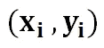

2)我们将最佳拟合线定义为:

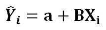

3)现在我们需要最小化我们命名为 S 的误差函数

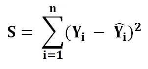

4)将等式 2 的值代入等式 3。

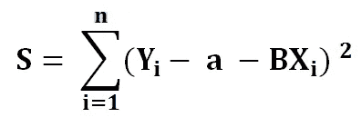

为了最小化我们的误差函数 S，我们必须找到 S 的一阶导数在哪里等于 0，关于 a 和 b，a 和 b 越接近 0，每个点的总误差越小。让我们先求出 a 的偏导数。

# 查找 a:

1)求 S 关于 a 的导数。

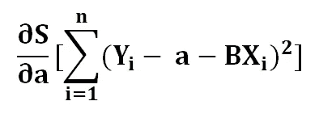

2)使用链式法则，比方说

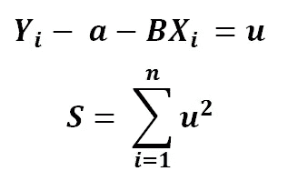

3)使用偏导数

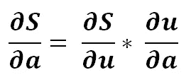

4)扩展

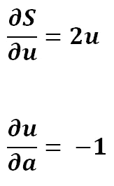

5)简化

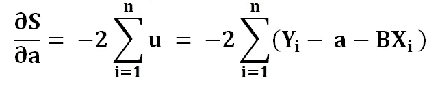

6)为了找到极值，我们把它置为零

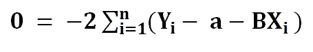

7)用-2 除左边

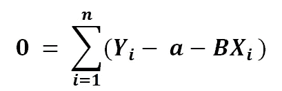

8)现在让我们将总和分成 3 部分

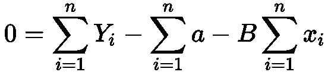

9)现在 a 的总和是

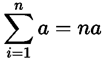

10)将其代入等式

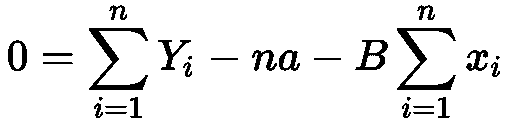

11)现在我们需要求解一个

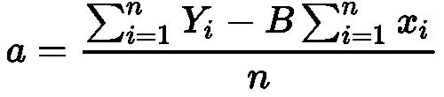

12)Y 和 x 的总和除以 n，就是它的平均值

我们已经最小化了关于 x 的成本函数，现在让我们找到关于 b 的最后一部分。

# 调查结果 B:

1)与我们对 a 所做的相同

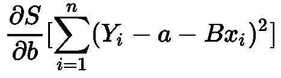

2)求偏导数

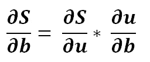

3)稍微扩展一下

4)将它放回等式中

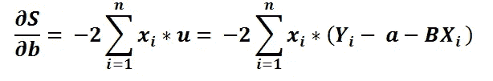

5)让我们将两边除以-2

6)为了便于查看，让我们分布 x

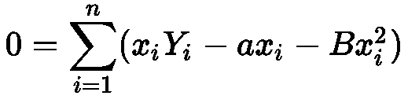

现在让我们做些有趣的事情吧！记住，我们在本文前面已经找到了。我们为什么不用它来代替呢？好吧，让我们看看会发生什么。

7)代入 a 的值

8)让我们分配负号和 x

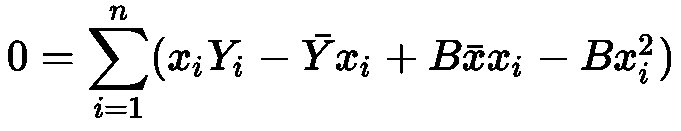

你不喜欢吗？让我们把总数分成两笔

9)分割总和

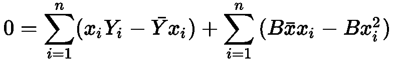

10)简化

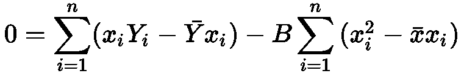

11)从中找出 B

太好了。我们做到了。我们以 x 和 y 的形式分离出了 a 和 b，这并不难，对吧？

我还有一些精力，想去探索一下！

12)简化公式

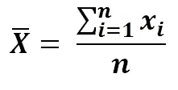

13)将等式 11 中的分子和分母乘以 n

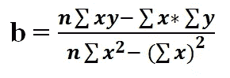

14)现在，如果我们使用等式 13 简化 a 的值，我们得到

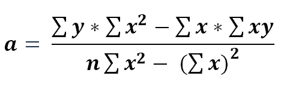

## 摘要:)

如果你有一个有一个独立变量的数据集，那么你可以通过计算 b 找到最适合的线。

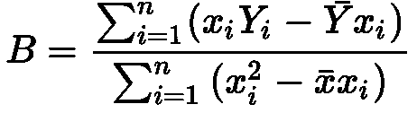

然后将 B 代入 a

最后将 B 和 a 代入最佳拟合线

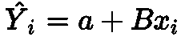

# 向前看，

在下一篇文章中，我们将看到如何用 Python 从头开始实现简单的线性回归(没有 sklearn)。

请让我知道你是否喜欢这篇文章！我打赌你喜欢它。

要找到更多这样的详细解释，请访问我的博客:[**【patrickstar0110.blogspot.com】**](http://patrickstar0110.blogspot.com)

**(1)** [**简单线性回归用其导数**](https://youtu.be/1M2-Fq6wl4M) **解释。**

**(2)** [**如何从零开始计算线性回归中模型的精度**](https://youtu.be/bM3KmaghclY) **。**

**(3)** [**简单线性回归使用 Sklearn**](https://youtu.be/_VGjHF1X9oU) **。** 你可以在 [Google Drive](https://drive.google.com/open?id=1_stSoY4JaKjiSZqDdVyW8VupATdcVr67) 上下载推导的代码和一些手写笔记。

如果您有任何其他问题，请随时联系我:[shuklapratik22@gmail.com](mailto:shuklapratik22@gmail.com)。

