# 线性回归解释

> 原文：<https://pub.towardsai.net/linear-regression-explained-f5cc85ae2c5c?source=collection_archive---------3----------------------->

## 尽可能简单地解释线性回归。

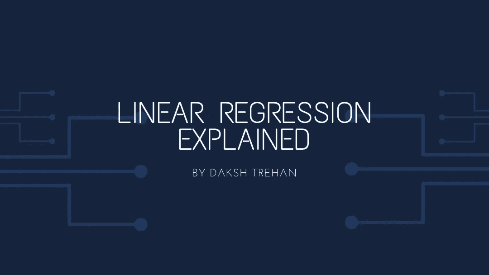

由达克什·特里汉在 canva.com 设计

由于其基本性质，它通常是第一个被教授的机器学习算法。这是监督学习的一部分，意味着所需的数据将被标记。回归是指预测连续值。顾名思义，是线性模型；也就是说，它只能拟合线性数据点。有两种类型的线性回归:-简单和多重。

# 简单线性回归

简单线性回归对于寻找两个连续变量之间的关系很有用。一个变量是因变量或可预测变量，另一个是自变量。

提供给模型的输入将是一个或多个特征，并且预测输出将是实数。

核心思想是获得最适合数据的线。最佳拟合线是总预测误差(所有数据点)尽可能小的线。误差是点到回归线之间的距离，或者简单地说，是预测值和理论值之间的差异。

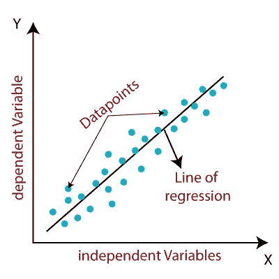

由达克什·特里汉在 canva.com 设计

线性回归最基本的例子是预测房价，作为输入，我们提供了不同的特征，如房间数量、面积。房子的面积，地区类型，便利性，等等，我们预计将根据输入的特征预测房子的价格。线性模型首先提醒我们的是一条直线，直线的方程式是

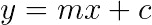

> 在哪里
> 
> c =常数，m =斜率
> 
> x =独立特征，y=从属特征

线性回归的整个概念是基于直线的方程。线性回归中直线的方程被认为是:

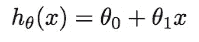

该算法的目标是学习θ0、θ1 和 h(x)。

该算法的步骤如下

1.  *随机初始化θ0&θ1。*
2.  *衡量 theta 有多好，因为它是监督学习，所以我们将获得标记数据；因此，我们可以容易地得到使用均方误差 J(θ)的算法所呈现的误差。*

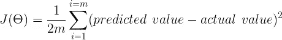

> 我们用的是均方差，而不是模误差，因为它是不可微的；为了方便起见，整个误差除以 2。

3.*更新 theta，使 J(theta)减小，我们得到最佳直线。*
为了得到最好的直线，我们将使用梯度下降算法。
一旦我们得到满意的结果，也就是说，我们注意到误差被最小化了。我们将用相同的超参数更新θ0 和θ1。

# 成本函数 J(θ)

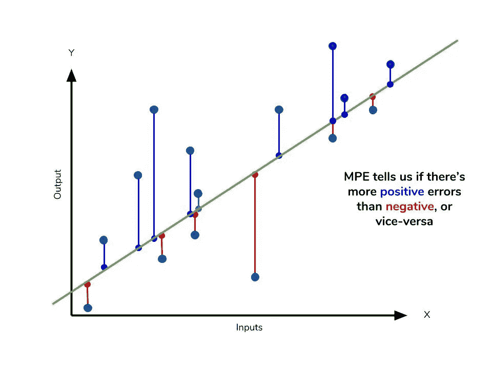

由达克什·特里汉在 canva.com 设计

线性回归的成本函数为:-

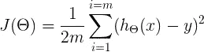

为了更清楚，可以写成:-

这里的 *m* 表示数据集中的样本总数。在我们的示例中， *m* 将是我们数据集中房屋的总数。

现在我们的目标是降低我们的成本函数。这是尽可能精确拟合的损失。为此，我们将使用[梯度下降算法](https://www.youtube.com/watch?v=IHZwWFHWa-w)。

# 梯度下降

这是机器学习以及深度学习中迄今为止最关键的算法。它用于通过用我们的成本函数对重量的偏导数减去损失来减少损失。

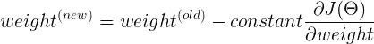

让我们想象梯度下降如何帮助我们最小化损失函数。

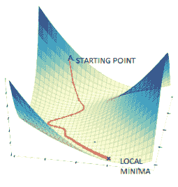

来源:https://tinyurl.com/ycnh9o47

我们的目标是达到局部最小值以减少损失。

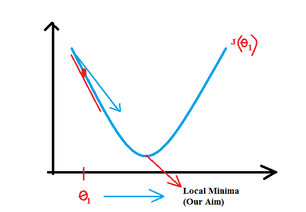

来源:https://tinyurl.com/y9wwrmpd

目前，我们的位置是红点，我们的目标是达到局部最小值。为了实现这一点，我们必须采取一些措施，这些措施由用户决定，并被描述为学习率(alpha)。

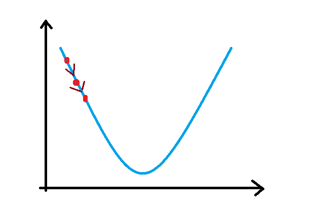

来源:[https://tinyurl.com/y9wwrmpd](https://tinyurl.com/y9wwrmpd)

一旦我们开始训练，我们可以想象损失，以确认我们正在朝着正确的方向采取措施，并且我们正在获得想要的结果。一旦确认，我们将重复这些步骤，直到满意为止。

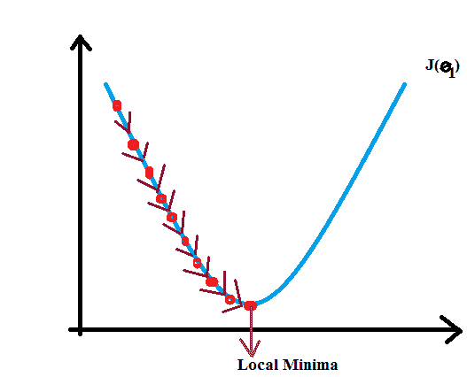

来源:[https://tinyurl.com/y9wwrmpd](https://tinyurl.com/y9wwrmpd)

一旦我们到达局部极小值，这意味着我们已经完成了我们的目标，损失现在是衰减的。我们可以期待我们的模型有更好的准确性。

# 最终模型

一旦我们的成本函数被定义，我们执行梯度下降算法以最小化损失，并且我们继续重复直到我们到达局部最小值。

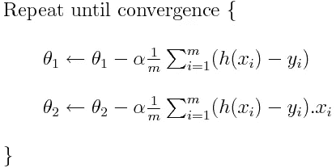

其中 n(α)是学习速率，即在减少损失时要采取的步长。
现在，我们算法的输出将是房屋的价格，这取决于θ0(常数)和θ1。现在把它和现实生活联系起来，所以简而言之

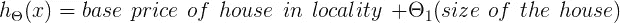

## 多元线性回归

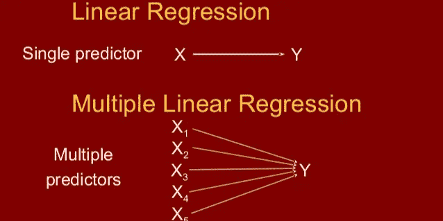

由达克什·特里汉在 canva.com 设计

当我们希望根据两个或更多变量来预测变量的值时，可以使用多元线性回归。

假设如果房子的价格也取决于房间的数量以及房子的大小，那么我们将实现多元线性回归，这与普通的线性回归没有太大的不同。

## 实现与我们的模型完美契合的方法

实施线性回归时要记住的另一件重要事情是仔细决定超参数，即 n(学习率)。

> 如果 n 很小，步数越多，训练越慢。
> 
> 如果 n 大，步数少，训练快。
> 
> 如果 n 非常大，它会振荡，不会有输出。

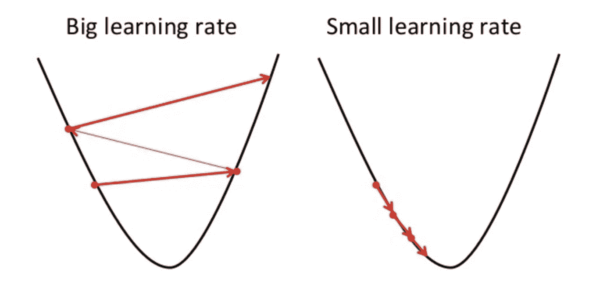

来源:https://algorithmia.com/blog/introduction-to-optimizers

我们可以通过使模型复杂化来避免过度拟合，也就是说，给我们的模型增加更多的特征。例如，如果我们的模型的方程是 y =θ0+θ1(x)，使它成为 y =θ0+θ1(x)+θ2(x)+θ3(x)…

关于选择超参数的更详细的解释如下:[确定最适合你的 ML 模型。](https://medium.com/datadriveninvestor/determining-perfect-fit-for-your-ml-model-339459eef670)

线性回归的一些关键特征:-

1.  目标是一个区间变量。
2.  预测值是目标变量的平均值。

## 使用 Sci-kit 学习线性回归的代码。

当使用框架作为 sci-kit learn 时，我们不需要太关注要初始化的错误或其他值。框架已经选择了它们，但是了解算法背后的数学部分是很好的。

对于从头开始线性回归代码，请遵循:-

 [## dakshtrehan/机器学习-在线-2018

### permalink dissolve GitHub 是 4000 多万开发人员的家园，他们一起工作来托管和审查代码，管理…

github.com](https://github.com/dakshtrehan/machine-learning-online-2018/blob/master/3.%20Linear%20Regression/Linear%20Regression/02_Linear_Regression.ipynb) 

# 结论

希望这篇文章不仅增加了你对线性回归的理解，还让你意识到机器学习并不难，并且已经在你的日常生活中发生了。

一如既往，非常感谢您的阅读，如果您觉得这篇文章有用，请分享！:)

查看我的其他文章:-

[利用深度学习检测新冠肺炎。](https://towardsdatascience.com/detecting-covid-19-using-deep-learning-262956b6f981)

[确定最适合您的 ML 模型。](https://medium.com/datadriveninvestor/determining-perfect-fit-for-your-ml-model-339459eef670)

[为菜鸟服务数据科学。](https://medium.com/towards-artificial-intelligence/serving-data-science-to-a-rookie-b03af9ea99a2)

[将机器学习技术与现实生活联系起来。](https://levelup.gitconnected.com/relating-machine-learning-techniques-to-real-life-4dafd626fdff)

请随意连接:

> 作品集~[dakshtrehan.com](http://dakshtrehan.com)
> 
> *LinkedIN ~*[*https://www.linkedin.com/in/dakshtrehan/*](https://www.linkedin.com/in/dakshtrehan/)
> 
> *insta gram ~*[*https://www.instagram.com/_daksh_trehan_/*](https://www.instagram.com/_daksh_trehan_/)
> 
> *Github ~*[https://github.com/dakshtrehan](https://github.com/dakshtrehan)

关注更多机器学习/深度学习博客。

> *干杯。*