# 更懂线性回归！！

> 原文：<https://pub.towardsai.net/linear-regression-fffa6c970075?source=collection_archive---------1----------------------->

## [统计数据](https://towardsai.net/p/category/statistics)

## OLS 和梯度下降

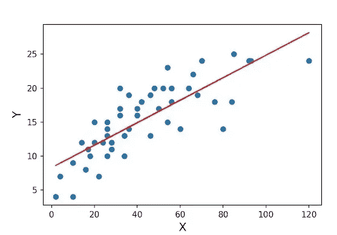

[来源](https://i1.wp.com/cmdlinetips.com/wp-content/uploads/2020/03/Linear_Regression_fit_with_Matrix_Multiplication.jpg?w=594&ssl=1)

## 回归简介

回归是监督学习模型的一种算法。当输出或从属特征是连续的并被标记时，我们应用回归算法。回归用于找出自变量和输出变量之间的关系或方程。例如，给定如下，我们有变量 x₁，x₂，…,xₙ，其对变量 y 的输出有贡献。我们必须找到 x 变量和因变量 y 之间的关系。因此该方程定义如下，例如-

y = F( x₁，x₂，…,xₙ)

y = 5 x₁+8x₂+….+12xₙ

为了更好地找到独立特征和从属特征之间的关系，我们将简化独立特征以找到用于理解目的的等式。

## 线性回归

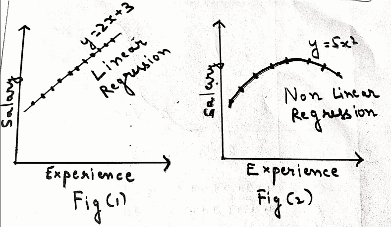

作者图片

假设我们要根据输入变量 Experience 计算工资。因此，薪水成为我们的**独立特征 x、**，经验成为我们的**非独立特征 y、**

考虑上图中的图(1)，其中 y 值随着 x 值的增加而线性增加。可以得出结论，相关性是线性比例的。所以得到的图是一条直线，x 和 y 的关系给定为 y=2x+4。

考虑上图中的图(2 ),其中 y 的值与 x 的增加值不成比例。从图(2)中可以看出，y 的值相对于 y 是不规则的。因此这种类型的回归称为非线性回归。

通过以上讨论，我们必须明白生活不会总是一帆风顺的。考虑下图中的图(1 ),图中的点分布在整个平面上。有可能找到最佳拟合线和通过平面上所有点的方程吗？是的，实际上，这是可能的，从下图的图(2)中可以看出。但是可行吗？不，从图(2)中可以清楚地看到，我们过度拟合了数据，这将损害模型在准确性方面的性能。

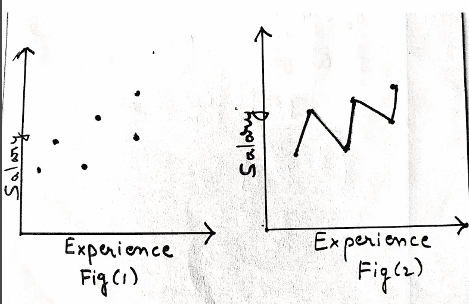

作者图片

如何避免过拟合，同时又能找到一条穿过所有点的线？我们选择通过所有点的最佳拟合线，使得所有给定点到该线的距离最小，并且我们可以通过最小化误差来找到输出和输入要素之间的关系。

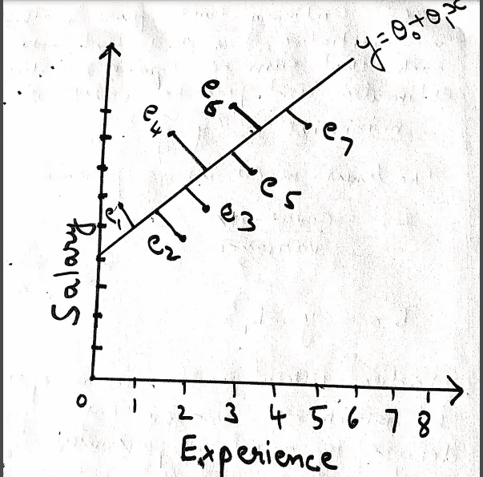

作者图片

我们绘制了所有的点(x1，y1)，(x2，y2)，…..,(xₙ,yₙ)并计算已被选择以获得最佳拟合线的各条线之间的误差。例如，在下图中，我们有一个点(x₁,y₁)，它使用公式(y₁-ῡ)计算与直线(1)的距离。类似地，我们使用公式(y2-ῡ)计算第二个点(x₂,y₂)到线(1)的距离。这样，我们从(1)中获得每个点的实际结果和预测结果的误差差，然后对误差(1)求和。类似地，我们计算来自线(2)、线(3)的所有点的误差值的总和，因为我们的主要目标是最小化误差，所以我们集中于选择最佳拟合线，其具有位于最小距离的点。

一旦得到这条线，我们就有了与这条线相关的方程，记为 **Y = θ₀ + θ₁*X**

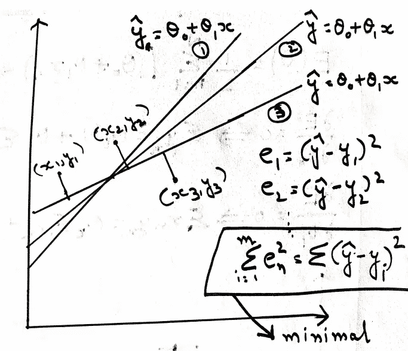

作者图片

从上图中我们可以看出，主要目标是最小化因变量的实际值和预测值之间的误差总和。这个方程被称为损失函数。该过程将依次优化 **θ₀** 和**θ₁**的值，这将导致定义与空间中所有给定点具有最小距离的最佳拟合线。

## OLS 方法

应用 OLS(普通最小二乘法)来寻找线性回归模型的参数值。我们已经推导出上面的等式 **Y = θ₀ + θ₁*X.**

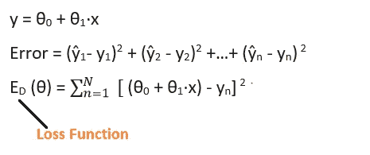

作者图片

## 最大值和最小值的修正

在我们继续之前，让我们了解一下最大值和最小值的工程数学概念。点 1、2 和 3 指示坡度改变方向的位置，向上或向下。如果你观察，从下图可以看出，如果我们在点 1、2 和 3 处画一条切线，它看起来平行于 X 轴。所以这些点的斜率是 0。斜率变为零的这些点称为驻点。此外，下图中斜率值突然开始增加的点 1 称为全局最小值，反之亦然，点 2 称为全局最大值。

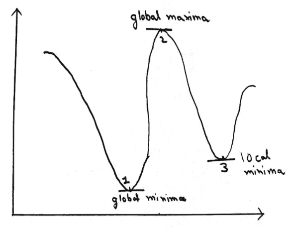

作者图片

从上面的概念，我们可以得出结论，我们可以找到任何给定方程的驻点，使其导数等于零，即在该点的斜率等于零。通过求解一阶导数，我们找到了方程的驻点。但是我们需要确定驻点是全局最大值还是全局最小值。

在求二阶导数时，如果值大于零，则代表全局最小值，如果值小于零，则代表全局最大值。这样，我们就能算出全局最大值和最小值。

我们以下面的例子来理解上面关于最大值和最小值的规则。

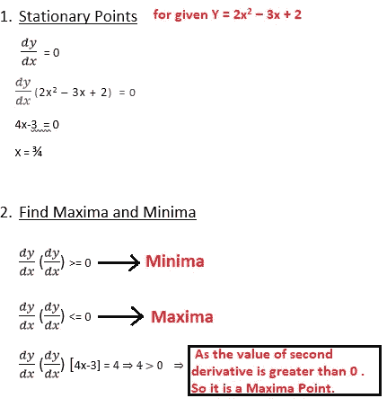

作者图片

从以上所有讨论中，我们可以观察到，当图达到凸曲线时，它达到最小值。因此，我们可以得出结论，我们讨论的重点必须是达到损失函数的凸性。

## 优化 **θ₀和θ₁**

因此，我们手中有一个问题陈述，优化θ₀和θ₁的值，使得损失函数达到凸性(最小值)。正如我们从最大值和最小值概念中学到的，我们集中于获得给定损失函数的驻点，如下所示。使用它，我们得到两个等式，如下图所示。查看这两个方程，我们知道∑x ₙ，∑ yₙ，∑xₙyₙ和∑xₙ可以从给定的数据中获得，这些数据将有一个自变量薪金(x)和因变量(y)。

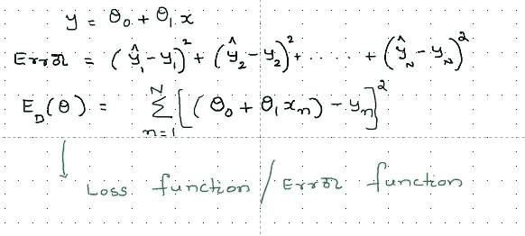

作者图片

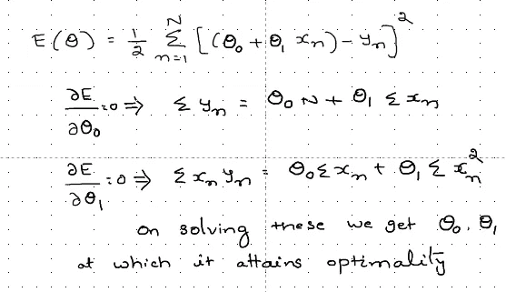

作者图片

为了更进一步，我们可以对θ₀和θ₁进行二阶导数，形成下图所示的海森矩阵。

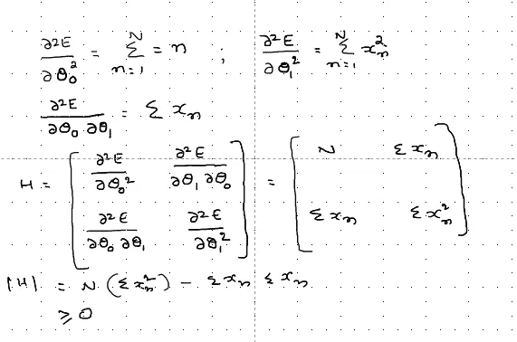

作者图片

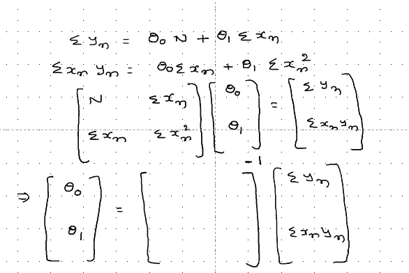

作者图片

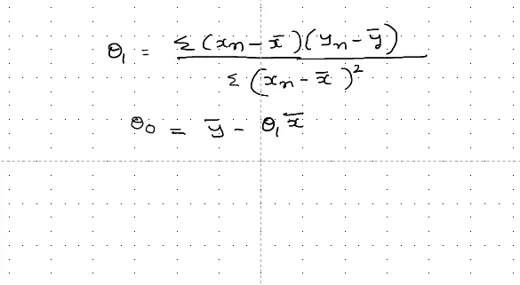

作者图片

## 利用矩阵求凸性的方法

虽然我们找到了θ₀和θ₁在平稳点的值，我们现在需要确认平稳点是凸的还是凹的。为了确认矩阵的凸性，我们有下面给出的方法:

**领先主辅修**

如果对应于一个主子式的矩阵是较大矩阵的**二次左上部分的行列式(即，它由从 1 到 k 的行和列中的矩阵元素组成)，则该主子式被称为**前导主子式**(k 阶)。**

第 k 阶前导主子式是通过删除最后 n k 行和列形成的第 k 阶主子式的行列式。

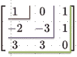

作者图片

A 的主前导子矩阵是由 A 的前 r 行和 r 列形成的子矩阵，其中 r=1，2，…..，n。

这些子矩阵是

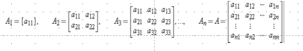

作者图片

**定理:**

***对称矩阵 A 是正定的当且仅当每个主副行列式都是正的。***

**举例理解主次**

给定下面的矩阵 A，我们从中形成主要的子矩阵。一旦完成，我们取行列式的值。

如果所有主子式的行列式值都大于零，则称为正定(如 2，3，1)。

如果所有主子式的行列式值都大于或等于零，则称之为半正定(如 2，0，1)。

如果所有主子式的行列式值都小于零，则称之为负定(如-2，-3，-1)。

如果所有主子式的行列式值都小于或等于零，则称之为负半定(如-2，0，-1)。

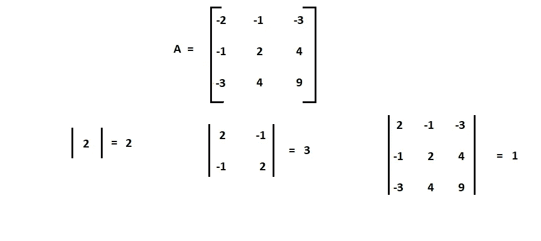

作者图片

从上图可以看出，主副行列式的值大于零，所以它是正的。

**函数的凸性**

对于给定的矩阵 A，

a 是凸⇔，a 是半正定的。

a 是凹⇔ A 是负半定的。

a 是严格凸⇔ A 是正定的。

a 是严格凹⇔ A 是负定的。

## OLS 的局限性

*   如果我们观察 OLS 方法，那么有很高的机会获得假阳性凸点，即，在同一个方程中可能有两个极小值。其中一个可能是局部最小值，而另一个是全局最小值。
*   此外，没有任何微调参数可用于控制模型的性能。我们无法控制模型的准确性。因为我们的目标是建立一个优化的系统，所以我们必须专注于控制模型效率。

## 梯度下降法

为了克服 OLS 方法的局限性，我们引入了一种新的模型来优化 **θ₀** 和**θ₁**的值，称为梯度下降法。这里，我们将θ₀ 和θ₁**的值初始化为一些随机值，并计算模型输出的总误差。如果误差不在允许范围内，我们使用学习参数 **α减少 **θ₀** 和 **θ₁** 。****

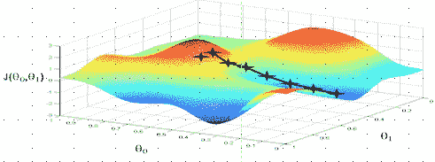

作者图片

如果与前一次迭代相比，我们在当前迭代中得到的模型输出的误差值更高，那么我们可能已经在前一次迭代中实现了收敛。或者我们有另一个选项来更新值 **α** 并验证输出误差。这里我们对误差函数 j(**θ₀,θ₁**)w . r . t**θ₀**和 **θ₁** 求导，并在下一次迭代中使用这些值来获得 **θ₀** 和 **θ₁** 的新值。

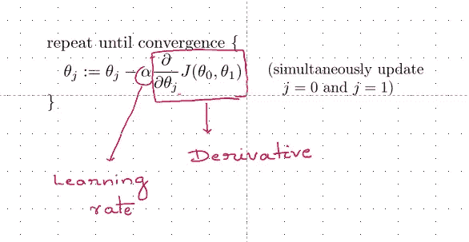

作者图片

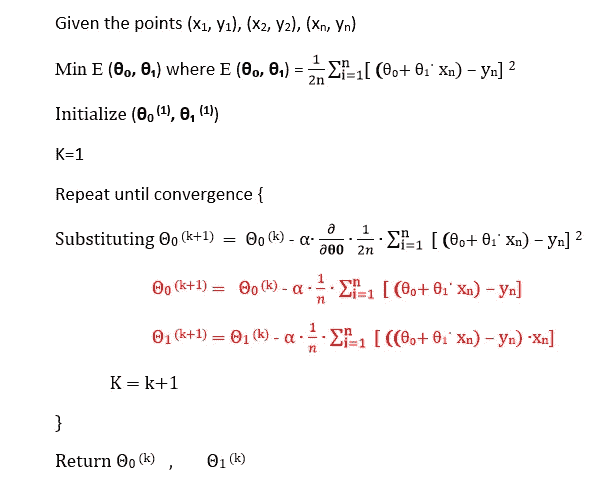

作者图片

这都是关于线性回归背后的数学直觉，这有助于我们更好地了解这个概念。人们可以很容易地从 Python 包中获得执行线性回归时要使用的方法。

感谢您阅读这篇文章！！

我希望这能帮助你更好地理解这个话题。