# 从头开始线性回归

> 原文：<https://pub.towardsai.net/linear-regression-from-scratch-d7cb0a22ddfb?source=collection_archive---------0----------------------->


威廉·戴尼奥在 [Unsplash](https://unsplash.com/s/photos/stairs-line?utm_source=unsplash&utm_medium=referral&utm_content=creditCopyText) 上拍摄的照片

## 如果你开始学习数据科学或机器学习，你也听说过线性回归，但它是什么，我们应该在什么时候使用它？

线性回归是一种统计模型，是一种监督算法；我们用它来预测线性值，这意味着我们试图用我们的数据拟合一条线，并从中预测自变量。为了更好地理解线性回归，让我们从它的方程开始。

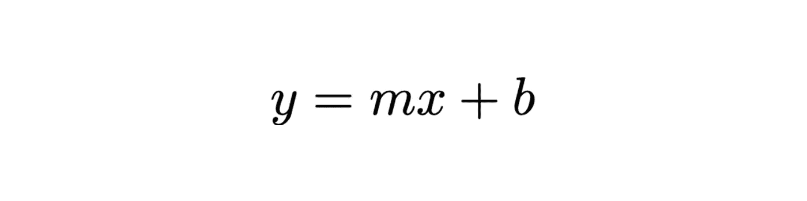

简单的线性回归方程

其中，y 是预测值，x 是独立变量，m 是斜率，b 是 y 截距，即直线与 y 轴的交点。斜率表示线的倾斜度，其中 0 表示水平线，但通常情况下，等式为:

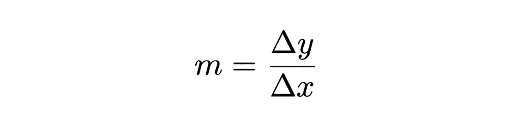

斜率方程

在这个简短的理论介绍之后，让我们解释一下如何训练和测试我们的第一个线性回归模型。我们将根据多年的经验，使用线性回归模型来预测工资。首先，我们必须确定我们试图预测的是一个线性值；了解线性回归模型是否适合我们的数据的一种方法是将它们可视化，让我们看一个样本数据集图:

```
salary = df["Salary"]
years_experience = df["YearsExperience"]#generating the scatter plot
plt.figure(figsize=(7, 5))
plt.scatter(years_experience, salary)
plt.xlabel("Years of Experience")
plt.ylabel("Salary")
```

上面代码的结果将类似如下:

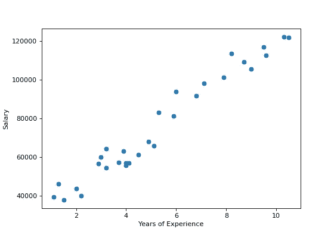

经验年限与薪水

如您所见，散点图中绘制的值描绘了一条直线。那么我们可以说，一个线性回归模型可以拟合这个数据。现在让我们用 Sklearn 训练一个线性回归模型:

```
#train test split
X_train, X_test, y_train, y_test = train_test_split(X, y, test_size=0.3, random_state=0)#training
lr = LinearRegression().fit(X_train,y_train)
```

恭喜你，你已经训练出了一个线性回归模型！现在，我们必须看看结果。让我们先看看直线的交点和斜率。

```
print("Intercept = ", lr.intercept_)
print("Slope = ", lr.coef_)#output
Intercept =  26777.391341197625
Slope =  [9360.26128619]
```

让我们测试我们的模型，从测试集中预测一些值。

```
y_pred = lr.predict(X_test)df = pd.DataFrame({"Actual": y_test, "Predicted": y_pred})
df
```

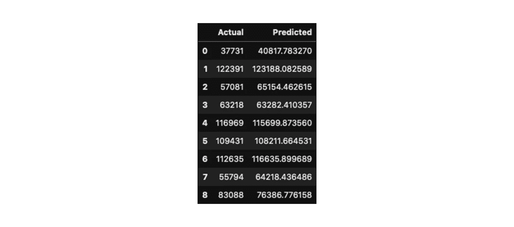

实际值与预测值。

从结果中可以看出，预测值接近实际值，但它们并不相同，这是因为直线并不完全符合每个值，让我们看一下直线本身。

```
#generating the scatter plot
plt.scatter(X_test, y_test)
plt.plot(X_test, y_pred, color="red", linewidth=2)
plt.xlabel("Years of Experience")
plt.ylabel("Salary")
```

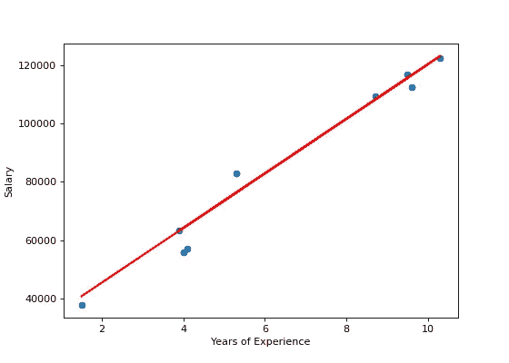

线性回归散点图。

蓝点表示测试集上的实际值，而红线是基于训练数据的预测。你可以看到，实际值和预测线之间有一个距离，这个距离叫做残差，我们可以计算出来:残差=实际值—预测值。

## 估价

有不同的指标来评估我们的回归模型:让我们看看三个最重要的:

*   均方差(MSE)是估计值和实际值之间的平均平方差。这是最受欢迎的指标，因为它侧重于较大的误差，因为平方项会使较大的误差与较小的误差相比呈指数增加。

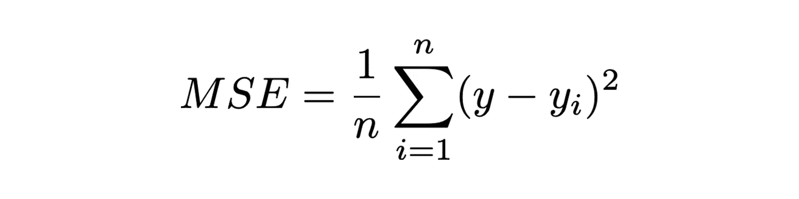

MSE 方程

*   平均绝对误差(MAE)是估计值和实际值之间的平均差值。这是最容易理解的指标，因为它只是一个平均误差。

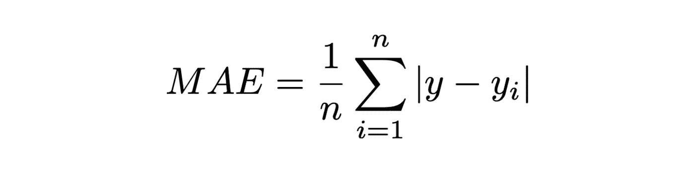

梅方程

*   均方根误差(RMSE)是估计值和实际值之间的平均差值的平方根；基本上就是均方误差的平方根。

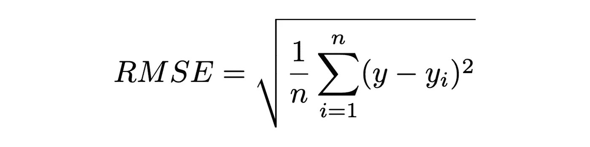

RMSE 方程

*   r 平方是一个流行的度量标准，而不是误差，它表示数据与拟合回归线的接近程度。分数越高，模型就越符合您的数据。最好的可能得分是 1.0，但是对于一个坏的模型也可能是负的。

在上面的公式中，n 表示预测的次数，y 表示实际值的向量，yi 表示预测值的向量。

我们刚刚训练的模型也称为简单线性回归，因为只有一个自变量。

# 多元线性回归

在多元线性回归中，我们有不止一个自变量，这意味着我们可以检查更多特征对因变量的影响。当您检查数据集时，多元线性回归非常有用，因为您可以比较不同的要素，并检查它们对因变量的影响有多大差异，以便您可以只选择最佳的要素。让我们看看它的公式:


多元线性回归方程

上式中，b 是 y 截距，m 是每个特征的系数，x 代表每个特征；我们将通过一个示例数据集来更好地理解这一点。

我们将用来更好地解释多元线性回归的数据集是油耗数据集，我们将创建一个多元线性回归模型来查看多个特征(发动机尺寸、气缸和油耗)对因变量(二氧化碳排放量)的影响。让我们来看第一个散点图，它代表了发动机尺寸和二氧化碳排放量之间的关系。

```
#generating the scatter plot
plt.figure(figsize=(7, 5))
plt.scatter(df.ENGINESIZE, df.CO2EMISSIONS,  color='blue')
plt.xlabel("Engine size")
plt.ylabel("CO2 Emissions")
```

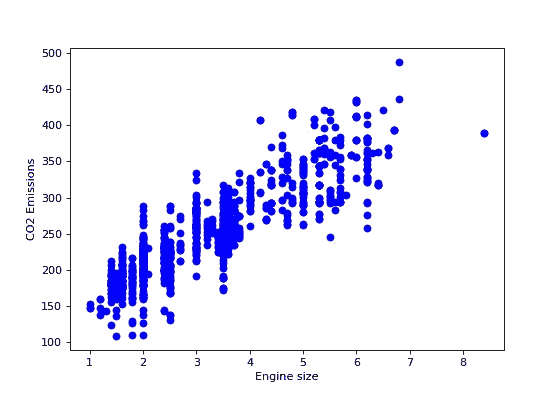

发动机尺寸与二氧化碳排放

另外两个代表我们正在研究的另外两个特征与二氧化碳排放的关系，与第一个特征相比，这两个特征有很大的不同，并且没有第一个特征那么线性:

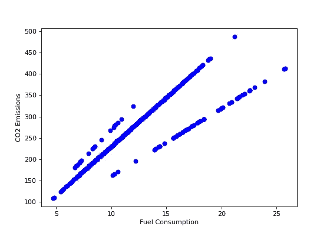

燃料消耗与二氧化碳排放

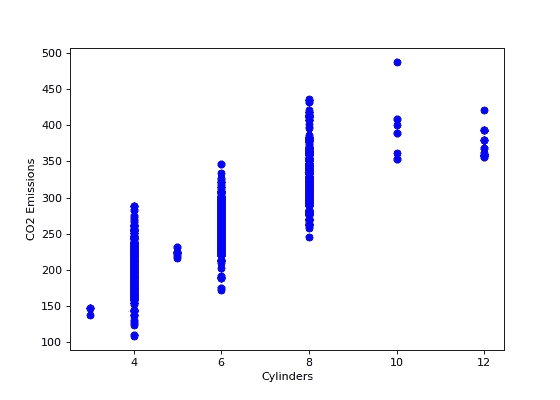

气缸与二氧化碳排放

让我们用这三个特征训练一个多元回归模型:

```
#train test split randomly with numpy
msk = np.random.rand(len(df)) < 0.8
train = df[msk]
test = df[~msk]
X_train = np.asanyarray(train[['ENGINESIZE','CYLINDERS','FUELCONSUMPTION_COMB']])
y_train = np.asanyarray(train[['CO2EMISSIONS']])#training
lr.fit (X_train, y_train)
```

正如我们从公式中看到的，有 y 截距，有多个系数，每个特征一个。

```
print ("Intercept: ", lr.intercept_)
print ("Coefficients: ", lr.coef_)#output
Intercept:  [67.3968258]
Coefficients:  [[10.23919289  7.99343458  9.31617168]]
```

既然我们训练了模型，让我们评估它，预测测试集中的一些值。

```
y_pred= lr.predict(test[['ENGINESIZE','CYLINDERS','FUELCONSUMPTION_COMB']])
X_test = np.asanyarray(test[['ENGINESIZE','CYLINDERS','FUELCONSUMPTION_COMB']])
y_test = np.asanyarray(test[['CO2EMISSIONS']])
```

现在，让我们从数字上看它的分数，计算 MSE、MAE、RMSE 和 R 平方分数。

```
print("Mean Squared Error:", metrics.mean_squared_error(y_test, y_pred)) 
print("Mean Absolute Error: ", metrics.mean_absolute_error(y_test, y_pred))
print("Root Mean Squared Error: ", np.sqrt(metrics.mean_squared_error(y_test, y_pred)))
print("R-Squared Score: ", metrics.r2_score(y_test, y_pred))#output
Mean Squared Error: 513.8862607223467
Mean Absolute Error:  16.718115229014394
Root Mean Squared Error:  22.66905954649082
R-Squared Score:  0.8789478910480176
```

而且，我们完了！我们学习了线性回归是如何工作的，我们训练并评估了一个简单的线性回归模型和一个多元线性回归模型。如果你想了解更多关于线性回归的知识，你可以访问[我的 GitHub](https://github.com/nlogallo/datascience/tree/master/linear_regression_from_scratch) ，在那里你可以看到我关于它的笔记本。

感谢阅读。