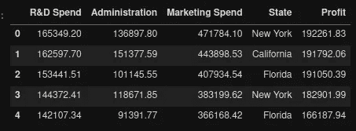
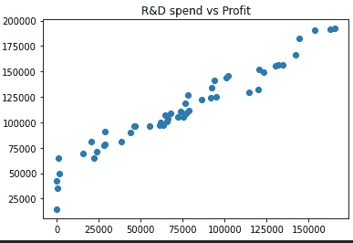
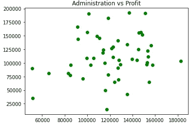
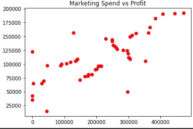
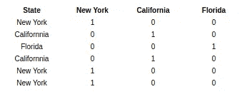
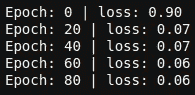
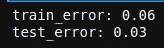
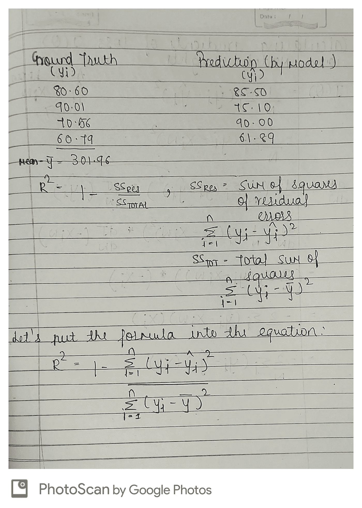
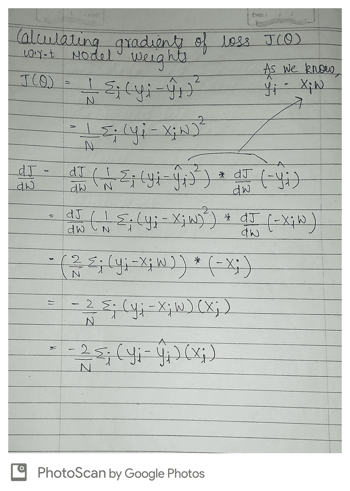
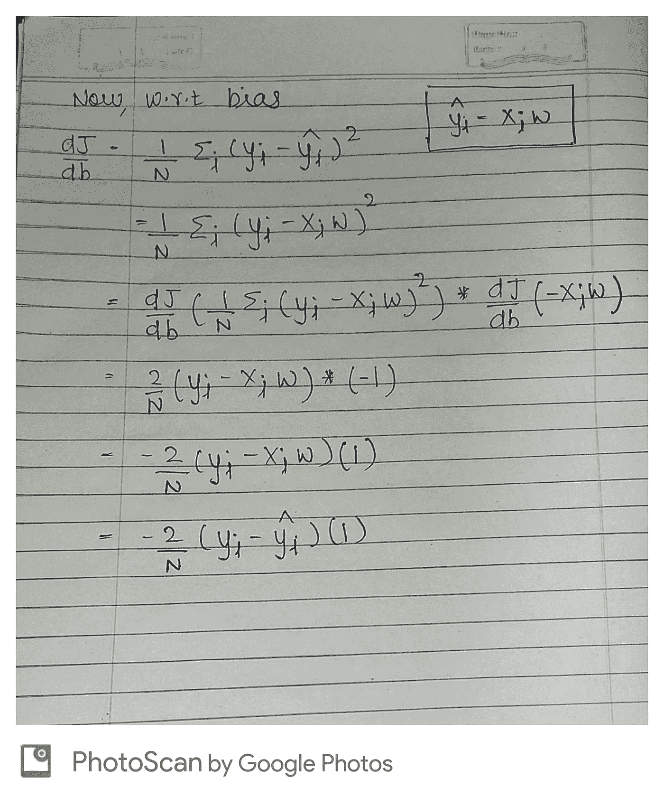

# 使用 PyTorch 进行线性回归

> 原文：<https://pub.towardsai.net/linear-regression-using-pytorch-5c016e69be7b?source=collection_archive---------0----------------------->

## [机器学习](https://towardsai.net/p/category/machine-learning)，[编程](https://towardsai.net/p/category/programming)


来源: [Pexels](https://www.pexels.com/photo/gray-industrial-machine-during-golden-hour-162568/)

我们知道，**‘数据是新的石油。’**意思是就像油一样。如果一个人知道数据的价值，我们就能学会提取和使用，它能解决许多问题。

现在，数据可以用两个东西来解释，模型和误差。

在本文中，我们将深入线性模型。我们的目标是使用数据，通过线性模型来预测输出。在这里，模型是一条线，它最大程度地缩小了预测值(从模型输出)和目标值之间的距离。

**L** et 的潜入:

我们想学习一个线性模型(yhat ),给定 x 来模拟 y。

我们可以把它写成，***yhat***=**XW+b .**

***yhat* =预测**

***X* =输入**

***W* =重量**

***b* =偏置**

# **数据集**

我们采用了一个小型创业数据集，其中包括 4 个输入特征(**营销支出、R & D 支出、管理和状态**)以及一个目标变量**利润。**

```
import pandas as pd
data = pd.read_csv('startup.csv')
data.head()
```



数据负责人

现在，让我们用散点图来找出变量之间的关系。

[https://matplotlib . org/3 . 3 . 2/API/_ as _ gen/matplotlib . py plot . scatter . html](https://matplotlib.org/3.3.2/api/_as_gen/matplotlib.pyplot.scatter.html)

```
import matplotlib.pyplot as plt
plt.title('R&D vs Profit')
plt.scatter(x = data['R&D Spend'], y = data['Profit'])
plt.show()
```



```
plt.title('Administration vs Profit')
plt.scatter(x = data['Administration'], y = data['Profit'], c = 'green')
plt.show()
```



```
plt.title('Marketing Spend vs Profit')
plt.scatter(x = data['Marketing Spend'], y = data['Profit'], c = 'red')
plt.show()
```



现在，让我们选择我们的 X 和 y

```
# First, we are selecting our X which consists our input features, for that we are using drop method which takes the column which you want to drop and an axisX = data.drop(['Profit'], axis = 1)# This estimator allows different columns or column subsets of the input to be transformed separately and the features generated by each transformer will be concatenated to form a single feature space. This is useful for heterogeneous or columnar data, to combine several feature extraction mechanisms or transformations into a single transformer.
# [https://scikit-learn.org/stable/modules/generated/sklearn.compose.ColumnTransformer.html](https://scikit-learn.org/stable/modules/generated/sklearn.compose.ColumnTransformer.html)from sklearn.compose import ColumnTransformer
from sklearn.preprocessing import OneHotEncoder
ct = ColumnTransformer(transformers=[('encoder', OneHotEncoder(), [3])], remainder='passthrough')X = np.array(ct.fit_transform(X))# What we did here ?
# We used OneHotEncoder to transform the column(State, which is a categorical feature)
# After transforming the categorical feature we are combining it back to our X. # Now, defining our y
y = data[['Profit']].values
# Notice we used double bracket here as it will give the shape of(n, 1) and we will not the issue of 1-D array.
```



一个热编码

**拆分数据**

我们现在将数据随机分成 3 组:训练、验证和测试。

*   Train:用于训练我们的模型。
*   Val:用于在培训期间验证我们模型的性能。
*   测试:用于评估我们完全训练好的模型。

```
TRAIN_SIZE = 0.7
VAL_SIZE = 0.15
TEST_SIZE = 0.15
SHUFFLE = Truedef split(X, y, val_size, test_size, shuffle):
    X_train, X_test, y_train, y_test = train_test_split(X, y, test_size = test_size, shuffle = shuffle)
    X_train, X_val, y_train, y_val = train_test_split(X_train, y_train, test_size = val_size, shuffle = shuffle)
    return X_train, X_val, X_test, y_train, y_val, y_testX_train, X_val, X_test, y_train, y_val, y_test = split(X, y, VAL_SIZE, TEST_SIZE, SHUFFLE)
```

**标准化数据**

我们需要标准化我们的数据(零均值和单位方差)

**z(标准化值)**=*Xi*-*μ*/*σ*

*   *xi* =输入
*   *μ* =平均值
*   *σ* =标准差

```
from sklearn.preprocessing import StandardScaler
x_scaler = StandardScaler().fit(X_train)
y_scaler = StandardScaler().fit(y_train)
```

现在，我们将把拟合的数据应用于训练和测试数据

```
X_train = x_scaler.transform(X_train)
y_train = y_scaler.transform(y_train).reshape(-1, 1)
X_val = x_scaler.transform(X_val)
y_val = y_scaler.transform(y_val).reshape(-1, 1)
X_test = x_scaler.transform(X_test)
y_test = y_scaler.transform(y_test).reshape(-1, 1)
```

现在，我们将定义输入维度和输出维度

```
INPUT_DIM = X_train.shape[1] # size of input 
OUTPUT_DIM = y_train.shape[1] # size of output sample
```

现在，我们将使用 torch.nn。这是一个 PyTorch 类，包含了许多我们将要使用的有用方法。

```
from torch import nnclass LinearRegression(nn.Module):
    def __init__(self, input_dim, output_dim):
        super(LinearRegression, self).__init__()
        self.fc1 = nn.Linear(input_dim, output_dim)

    def forward(self, x_in):
        y_pred = self.fc1(x_in)
        return y_pred
```

在这里，我们创建了一个简单的线性回归类，它使用了一个神经网络模块
**。神经网络模块**——当我们想要创建一个定制模型时，我们使用它。这意味着我们正在以我们的方式定义我们的模型。它是用输入和输出维度初始化的，这是我们在上面定义的。
**nn。线性** -这将线性变换应用到我们的输入和输出样本。这是一个全连接层，有输入和输出。现在，它的输入会有一个权重。它的输出将是*【XW+b】，因为它完全是线性的，没有激活函数。*

*现在，我们将初始化模型。*

```
*model = LinearRegression(input_dim = INPUT_DIM, output_dim = OUTPUT_DIM)*
```

*现在，我们将定义我们的损失函数。我们将预测值(y_hat)与实际值(y)进行比较，以确定损失，线性回归的常见损失函数是 **MSE(均方损失)。这个**函数只是计算预测值和实际值之间的差值，并对其求平方。*

***为什么要平方误差？***

*将“你错过了多少”平方的原因是它迫使输出为正。*

***为什么只有阳性？***

*想象一下，如果您试图让模型正确预测 2 个点、2 个输入→目标预测对。如果第一个有 10 的误差，第二个有–10 的误差，那么平均误差将是零，当你每次错过 10 时，你将认为你预测完美。因此，您希望每个预测的误差总是正的，这样当您平均它们时，它们不会意外地相互抵消。*

```
*loss_fn = nn.MSELoss()*
```

***MSE =(1/N)* SUM((y _ train—y _ pred)* * 2)，其中 N = y _ train 的长度。***

*现在，我们将前进到我们的优化器。*

*当我们试图最小化或最大化某样东西时，那就叫做优化。优化器就像一种方法，通过改变我们使用的参数(权重和学习率)来帮助我们减少损失。*

*在这里，我们使用的是来自 **torch.optim** 包的 **Adam** 优化器，有很多优化器，但是我们将在这里使用 Adam。https://pytorch.org/docs/stable/optim.html。*

```
*optimizer = torch.optim.Adam(model.parameters(), lr=1e-1)*
```

*现在，我们需要将数据转换成张量。为此，我们使用**火炬。张量**。*

```
*X_train = torch.Tensor(X_train)
y_train = torch.Tensor(y_train)
X_val = torch.Tensor(X_val)
y_val = torch.Tensor(y_val)
X_test = torch.Tensor(X_test)
y_test = torch.Tensor(y_test)*
```

*现在，让我们训练我们的模型*

```
*NUM_EPOCHS = 100
for epoch in range(NUM_EPOCHS):
    # Forward pass
    y_pred = model(X_train) # Loss
    loss = loss_fn(y_pred, y_train) # zero all gradients
    optimizer.zero_grad() # backward pass
    loss.backward() # Update weights
    optimizer.step()

    if epoch%20==0: 
        print (f"Epoch: {epoch} | loss: {loss:.2f}")*
```

**

*每历元损失*

*现在，让我们来计算预测*

```
*tr_pred = model(X_train)
te_pred = model(X_test)*
```

*现在，让我们在训练和测试数据上检查我们的模型的性能*

```
*tr_error = loss_fn(tr_pred, y_train)
te_error = loss_fn(te_pred, y_test)
print(f'train_error: {tr_error:.2f}')
print(f'test_error: {te_error:.2f}')*
```

**

*错误*

*现在，我们正在使用度量标准(这将告诉我们线性模型的性能)。我们在这里使用 R2 分数，也称为决定系数。*

*r2_score = 1 —残差平方和/总误差平方和*

*让我们试着理解这个公式:*

*残差的平方和——这只是我们的误差，上面已经计算过了(yi-yi_hat)**2。这告诉我们，我们的实际值和预测值有多大的差异。*

*总误差的平方和—这是总误差(yi-yi 的平均值)**2*

**

```
*from sklearn.metrics import r2_score
# r2 = r2_score(y_test, pred_test)
# print(f'r2 square for the model is : {r2}')
# This gives the below error.
# Note : RuntimeError --> Can't call numpy() on Variable that requires grad. Use var.detach().numpy() instead.
y_test = y_test.detach().numpy()
pred_test = pred_test.detach().numpy()*
```

***R2 _ score 的解释***

*如果分数是 100%，则意味着根本没有方差(模型能够解释总方差)*

*如果我们得到一个低分，比如说 30%，那么这意味着我们的模型只能解释 30%的方差。*

*在我们的例子中，我们得到了 95.66%的分数，这意味着我们的模型可以解释 95.66%的方差。*

***渐变***

*梯度很重要，因为它帮助我们选择公式中的任何变量，并告诉我们它们是如何变化的，以及变化了多少，这就是为什么我想用一个例子来深入解释它。*

*让我们用一个场景来理解梯度，*

*假设有一位老人想穿过马路到马路的另一边，但是他不能，因为他是盲人，他不知道他应该走多少步，应该朝哪个方向走。你去那里帮助那位老人过马路。*

*这是梯度，老人是重量，因为梯度和重量有关。步数是我们的学习速度。*

*所以，梯度就像向量，它会指出我们可以将损失最小化的方向，而学习率是步骤，它会告诉我们在这个方向上应该走多少步。*

*使用步骤很重要。如果你不指定，那么就有可能达不到目标。想象一下，你从 A 站乘火车，你想到达 C 站，但是，你睡着了，到达了 d 站。*

***权重渐变***

**

*重量梯度*

***偏差梯度***

**

*梯度相对湿度偏差*

*我只是一个初学者，希望得到一些反馈，并希望不要对我严厉，如果有错误。谢谢大家！！*

*code-[https://github . com/prati kraut 1/Linear-Regression-with-py torch](https://github.com/pratikraut1/Linear-Regression-with-PyTorch)*

*免责声明-标题中没有链接的图片是作者的；否则，会提供一个链接。*