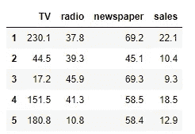
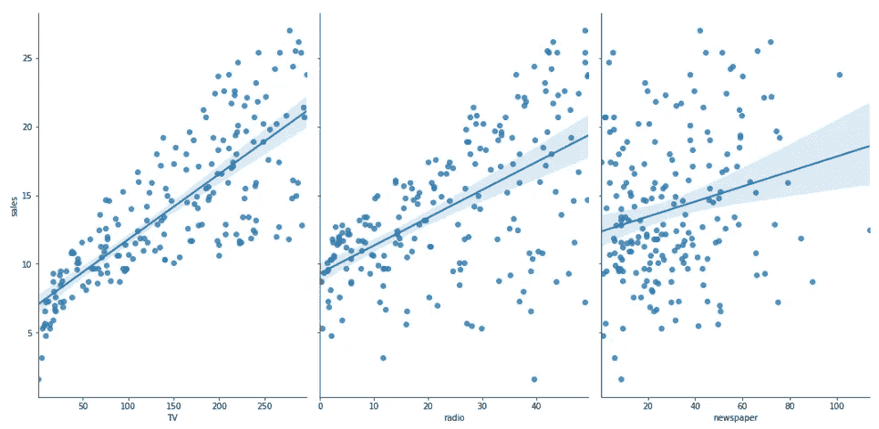
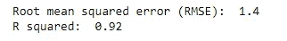

# 线性回归:为什么它很重要以及如何编写代码

> 原文：<https://pub.towardsai.net/linear-regression-why-it-matters-and-how-to-write-the-code-1028008b65c5?source=collection_archive---------2----------------------->

## [数据科学](https://towardsai.net/p/category/data-science)，[机器学习](https://towardsai.net/p/category/machine-learning)

## 构建线性回归模型的简单步骤


由[凯利·西克玛](https://unsplash.com/@kellysikkema?utm_source=medium&utm_medium=referral)在 [Unsplash](https://unsplash.com?utm_source=medium&utm_medium=referral) 上拍摄的照片

# **什么是线性回归？**

线性回归是一种统计程序，用于找出两个或多个变量之间的关系。我们知道，年龄和身高是两个相互关联的变量——也就是说，随着孩子年龄的增长，他们会长得更高。

机器学习采用这种统计概念，根据另一个变量(称为*独立变量或预测变量*)的已知量来预测未知量(称为*因变量*)。这意味着如果我们知道一个孩子的年龄，我们可以合理地预测他们的身高。找到这种关系的算法叫做**回归**。

如果只有一个变量被用作预测因子(上面例子中的年龄对身高)，那么它被称为**简单线性回归**。然而，有时预测需要不止一个预测因子——这被称为**多元回归**。多元回归的一个例子是根据树的年龄和高度预测树的体积。

# **申请**

我们知道，机器学习问题大致分为分类问题或回归问题。分类算法用于结果为非数字或分类的情况(例如，对鸢尾花的种类进行分类)。另一方面，如果结果是一个连续变量(如身高)，分类算法不起作用，这就是回归算法派上用场的地方。

在机器学习领域有许多回归的用例。一些例子包括:

*   根据品牌、型号、颜色、年份、车门等属性确定汽车的**价格。**
*   根据卧室数量、建造年份、面积、位置等属性预测房价。
*   根据客户属性，如年龄、驾驶记录、所拥有汽车的类型等，确定**保险费**。

# 用 Python 实现

下面我将展示用 Python 编程语言实现的多元回归。目标是根据不同媒体的广告支出来预测产品的销售。一般公式如下:

> 总销售额= f(电视、报纸、广播广告支出)

在本次演示中，我们将使用一个关于广告支出的[公开数据集](http://faculty.marshall.usc.edu/gareth-james/ISL/Advertising.csv)；这个数据集经常在机器学习的例子中使用。

**第一步:导入库**

```
# import pandas
import pandas as pd
# import numpy
import numpy as np
# import seaborn for visualization 
import seaborn as sns
# import model 
from sklearn.linear_model import LinearRegression
# import accuracy metrics
from sklearn import metrics
# splitting training data
from sklearn.model_selection import train_test_split
```

**第二步:导入数据**

```
# import data
data = pd.read_csv('[http://faculty.marshall.usc.edu/gareth-james/ISL/Advertising.csv'](http://faculty.marshall.usc.edu/gareth-james/ISL/Advertising.csv'), index_col=0)# take a peek into first few columns
data.head()
```



**第三步:可视化数据**

```
# visualize data with a fitted line
sns.pairplot(data, x_vars=['TV','radio','newspaper'], y_vars='sales', height=7,aspect=0.7, kind = 'reg')
```



**第四步:准备数据**

```
# make X (predictor) and y (dependent) variables 
X = data[['TV','radio','newspaper']]
y = data['sales']# split data
X_train,X_test,y_train,y_test = train_test_split(X,y,random_state=1)
```

**第五步:模型拟合**

```
# instantiate model
model = LinearRegression()# fit model
model.fit(X_train,y_train)
```

**第六步:做预测**

```
# make prediction on test set
y_pred = model.predict(X_test)
```

**步骤 7:模型评估**

```
# calculate RMSE
rmse = np.sqrt(metrics.mean_squared_error(y_test,y_pred))# calculate R^2 value
from sklearn.metrics import r2_score
r2score = r2_score(y_test, y_pred)print("Root mean squared error (RMSE): ", round(rmse, 2))
print("R squared: ", round(r2score, 2))
```



# **最后一句话**

本文的目的是介绍线性回归作为一种机器学习算法的一些基本概念，它的应用以及 Python 中的演示。虽然我在一个简单的 7 步过程中展示了所有的实现，但是实际的实现可能是一个冗长的、迭代的过程。对于建模者来说，光是将数据转换成正确的格式就要花很长时间。而且一旦实施，事情还没完呢！您可能需要准备在各种参数空间中实现它，以便根据您的精度指标(例如，最低的 RMSE 或最高的 R 平方值等)找到最佳模型。).最后，**模型漂移**是机器学习中的一个现实问题——一旦一个模型建立起来，它可能不会永远工作良好，随着时间的推移，它的性能可能会下降，你可能需要用新数据重新训练模型。

如果你喜欢这篇文章，欢迎在[媒体](https://medium.com/@mab.datasc)或[推特](https://twitter.com/DataEnthus)上关注我。