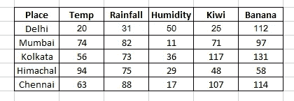

# 用 Python 中的 PyTorch 实现线性回归

> 原文：<https://pub.towardsai.net/linear-regression-with-pytorch-in-python-79c6b40730b8?source=collection_archive---------2----------------------->

## 机器学习应用的深度学习框架


Emile Perron 在 [Unsplash](https://unsplash.com?utm_source=medium&utm_medium=referral) 上的照片

在本文中，我们将借助 PyTorch 深度学习库创建一个线性回归模型。该项目旨在借助输入要素来确定苹果和橙子作物的产量。

首先，我们需要创建数据并将它们转换成 PyTorch 库的张量。

```
import numpy as np
import torch
```

现在，我们将为我们的模型生成输入和目标。

```
inputs = np.array([[20, 31, 48],
                  [74, 82, 11],
                  [56, 73, 36],
                  [94, 75, 29],
                  [63, 88, 17]], dtype = 'float32')targets = np.array([[25, 112],
                    [71, 97],
                    [117, 131],
                    [48, 58],
                    [107, 114]], dtype = 'float32')
```

为了将数据输入到我们的模型中，首先，我们需要将它们转换成 PyTorch 张量，如下所示。

```
inputs = torch.from_numpy(inputs)
targets = torch.from_numpy(targets)print(inputs)
print(targets)#output:
tensor([[20., 31., 48.],
        [74., 82., 11.],
        [56., 73., 36.],
        [94., 75., 29.],
        [63., 88., 17.]])
tensor([[ 25., 112.],
        [ 71.,  97.],
        [117., 131.],
        [ 48.,  58.],
        [107., 114.]])
```

原始数据如下所示。



特征的权重和偏差如下所示。

```
kiwi_yield = w11*temp + w12*rainfall + w13*humidity + b1
banana_yield = w21*temp + w22*rainfall + w23*humidity + b2
```

[](https://medium.com/pythoneers/machine-learning-explanation-of-simple-linear-regression-algorithm-dc5fd44d015d) [## 机器学习:简单线性回归算法的解释

### 人工智能的一个分支

medium.com](https://medium.com/pythoneers/machine-learning-explanation-of-simple-linear-regression-algorithm-dc5fd44d015d) 

在这些数据的帮助下，我们将生成矩阵形式的随机权重和偏差。

```
w = torch.randn(2, 3, requires_grad = True)
b = torch.randn(2, requires_grad = True)print(w)
print(b)#output:
tensor([[ 0.8107,  1.2951, -1.4349],
        [ 1.3329, -1.3815, -0.1888]], requires_grad=True)
tensor([-1.1700,  0.2881], requires_grad=True)
```

现在，我们的权重和偏差被初始化，现在我们将矩阵与下面给出的公式相乘。

```
y_hat = w*x + b
```

该公式将使用我们的数据、权重和偏差来构建模型。

```
def model(x):
    return x @ w.t() + bpreds = model(inputs)
print(preds)#output:
tensor([[-13.6817, -24.9436],
        [149.2377, -16.4334],
        [ 87.1170, -32.7139],
        [130.5577,  16.4958],
        [139.4815, -40.5173]], grad_fn=<AddBackward0>)
```

这里我们看到预测值与原始目标值相差甚远，因为我们从随机权重和偏差值开始。

让我们计算模型的损失，这是非常糟糕的，但我们仍然需要找到损失。

```
def mse(t1, t2):
    diff = t1 - t2
    return torch.sum(diff * diff) /diff.numel()loss = mse(preds, targets)
print(loss)#output:
tensor(10040.2354, grad_fn=<DivBackward0>)
```

价值是模型的损失，我们需要降低损失来改进模型。

现在，我们将使用梯度下降法通过更新权重和偏差值来降低模型中的误差。

```
with torch.no_grad():
    w -= w.grad * 1e-5
    b -= b.grad * 1e-5
    w.grad.zero_()
    b.grad.zero_()
```

是时候再次运行模型，以查看使用新权重和偏差值的损失结果了。

```
preds = model(inputs)
loss = mse(preds, targets)
print(loss)#output:
tensor(7475.9697, grad_fn=<DivBackward0>)
```

误差现在从 10040.2354 减少到 7475.9697。我们可以通过在训练中多次更新权重和偏差值来迭代模型，从而进一步减少损失。

```
for i in range(10):
    preds = model(inputs)
    loss = mse(preds, targets)
    loss.backward()with torch.no_grad():
    w -= w.grad * 1e-5
    b -= b.grad * 1e-5
    w.grad.zero_()
    b.grad.zero_()
```

该函数将用 10 个时期迭代模型，即该函数将更新权重和偏差 10 次，以提高模型精度并降低误差。

```
preds = model(inputs)
loss = mse(preds, targets)
print(loss)#output:
tensor(3413.1062, grad_fn=<DivBackward0>)
```

10 个周期后误差更减少到 3413，我们可以在 20 和 30 个周期上检查。

```
epochs          error
20 epochs  --> 2621.7429
200 epochs --> 737.8288
500 epochs --> 322.5351
```

**结论**

本文是 PyTorch 框架使用深度学习算法的基本介绍。我举这个小例子只是为了展示 PyTorch 的工作功能。

我希望你喜欢这篇文章。通过我的 [LinkedIn](https://www.linkedin.com/in/data-scientist-95040a1ab/) 和 [Twitter](https://twitter.com/amitprius) 联系我。

# 推荐文章

1.[8 Python 的主动学习见解收集模块](/8-active-learning-insights-of-python-collection-module-6c9e0cc16f6b)
2。 [NumPy:图像上的线性代数](/numpy-linear-algebra-on-images-ed3180978cdb?source=friends_link&sk=d9afa4a1206971f9b1f64862f6291ac0)3。[Python 中的异常处理概念](/exception-handling-concepts-in-python-4d5116decac3?source=friends_link&sk=a0ed49d9fdeaa67925eac34ecb55ea30)
4。[熊猫:处理分类数据](/pandas-dealing-with-categorical-data-7547305582ff?source=friends_link&sk=11c6809f6623dd4f6dd74d43727297cf)
5。[超参数:机器学习中的 RandomSeachCV 和 GridSearchCV](/hyper-parameters-randomseachcv-and-gridsearchcv-in-machine-learning-b7d091cf56f4?source=friends_link&sk=cab337083fb09601114a6e466ec59689)
6。[用 Python](https://medium.com/towards-artificial-intelligence/fully-explained-linear-regression-with-python-fe2b313f32f3?source=friends_link&sk=53c91a2a51347ec2d93f8222c0e06402)
7 全面讲解了线性回归。[用 Python](https://medium.com/towards-artificial-intelligence/fully-explained-logistic-regression-with-python-f4a16413ddcd?source=friends_link&sk=528181f15a44e48ea38fdd9579241a78)
充分解释了 Logistic 回归 8。[数据分发使用 Numpy 与 Python](/data-distribution-using-numpy-with-python-3b64aae6f9d6?source=friends_link&sk=809e75802cbd25ddceb5f0f6496c9803)
9。[机器学习中的决策树 vs 随机森林](/decision-trees-vs-random-forests-in-machine-learning-be56c093b0f?source=friends_link&sk=91377248a43b62fe7aeb89a69e590860)
10。[用 Python 实现数据预处理的标准化](/standardization-in-data-preprocessing-with-python-96ae89d2f658?source=friends_link&sk=f348435582e8fbb47407e9b359787e41)