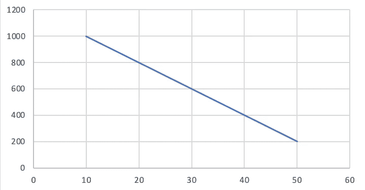
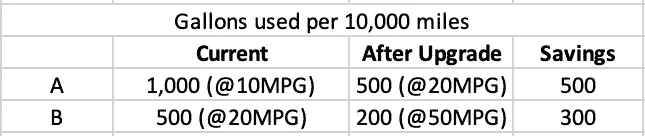
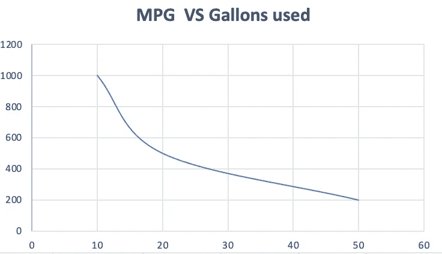
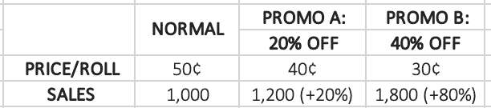
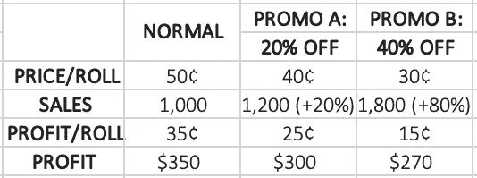

# 线性偏差

> 原文：<https://pub.towardsai.net/linearity-bias-412ec142f25d?source=collection_archive---------3----------------------->

## [数据科学](https://towardsai.net/p/category/data-science)

## 什么是线性偏差，为什么它在我们的日常生活中如此突出？

照片由[查德·蒙塔诺](https://unsplash.com/@briewilly?utm_source=medium&utm_medium=referral)在 [Unsplash](https://unsplash.com?utm_source=medium&utm_medium=referral) 上拍摄

考虑一下，你非常饿，打算点比萨饼，你面前有两个选择:一个 18 英寸的比萨饼或两个 12 英寸的比萨饼，你宁愿点哪个来获得更多的数量？如果你拿了两个 12 英寸的披萨，而不是 18 英寸的披萨，那你就大错特错了，我的朋友..！！

*想想看，一个 18 英寸的比萨饼的面积是 254 英寸，两个 12 英寸的比萨饼的面积是 226 英寸。看得甚至不近，那么我们为什么倾向于这样想呢？—答案是* ***线性偏置*** *。*

# **什么是线性偏差？**

每天，人类、组织和政府都在有意无意地试图理解这个世界。我们试图找出事件发生的方式和原因，以及它们如何受到我们所做决定的影响。我们倾向于这样做的方式是以线性的方式思考，我们通过遵循某些可预测性和一致性的模式来接近它。

人脑具有欺骗性，主要是因为我们的大脑会产生不同的偏见，几十年的研究也表明，人类的大脑很难理解非线性关系。我们的思维总是倾向于直线思考，显然在许多情况下，这是有道理的:如果一杯饮料的价格是 5 美元，你可以用 25 美元买 5 杯，50 美元买 10 杯，75 美元买 15 杯。

*但是大多数时候我们没有考虑到这样的情况:*

假设你拥有两辆汽车；a 给你每加仑 10 英里，B 给你 20 英里。您决定用更省油的选项替换其中一个。你有两个选择:

汤米·克兰巴赫在 [Unsplash](https://unsplash.com?utm_source=medium&utm_medium=referral) 拍摄的照片

A) 10 英里/加仑，20 英里/加仑

B) 20 英里/加仑，50 英里/加仑

直觉上，选项 B 似乎是一个更好的选择，因为每加仑 30 英里的增幅比每加仑 10 英里的增幅要大得多，我们假设两者之间的关系如下:

但是它看起来像这样，选项 A 正在杀死它..！！！

事实上，令人震惊的是，将燃油效率从 20 英里/加仑提升到 100 英里/加仑，仍然比不上从 10 英里/加仑提升到 20 英里/加仑。

# 业务问题:

在我们生活的世界里，重要的商业决策与非线性关系交织在一起，我们需要在它们发生作用时加以考虑。有很多情况下，消费者和公司都成了线性偏差的受害者，因为线性是一种便利的假设，而且它看起来很熟悉。即使是意识到非线性的专家，也未能凭借直觉考虑到这一点。

利润是商业目标中常见的问题之一，影响利润的主要因素有三个:成本、数量和价格。当一个因素改变时，其他因素也需要改变以保持利润。

想象你正在经营一个品牌的纸巾。通常，它们的售价是 50 美分一卷，生产成本是 15 美分。现在，您决定了两种类型的价格促销，结果如下:

哇！！促销 B 给我们带来了 80%的销售增长，而价格只下降了 40%，但是正如你现在可能已经猜到的，如果我们深入研究，我们就会明白 B 不是最有利可图的策略。

我们可以看到，通过降价 40%,利润减少了 25%,因此要保持 350 美元的利润，我们需要销售 2300 多张纸巾(增长 133%)。

# 消费者:

有许多例子表明，公司利用了消费者的倾向，认为属性和利益之间的关系是线性的。根据哈佛商学院的研究表明，互联网连接的价格是线性的，而下载速度和下载时间之间的关系是非线性的。从 5mbps 升级到 25mbps 每 GB 可节省 21 分钟，而从 25 Mbps 升级到 100mbps 只需 4 分钟。我打赌你现在正在考虑改变你的数据计划😉。

在那里！现在你知道我们是如何成为线性偏差的牺牲品的，我们需要明白，关注结果而不是指标是很重要的，这样才能避免陷阱，做出明智的决定。近年来，数据驱动的决策呈爆炸式增长，我们可以看到这是为什么。

感谢您抽出时间阅读这篇文章。请分享你对此的想法！！下次见，再见。

和平✌️

## 参考资料:

《非线性世界中的线性思维》。2020 年 12 月 16 日，hbr.org/2017/05/linear-thinking-in-a-nonlinear-world.*《哈佛商业评论》*

好极了，威尔。"简单、吸引人、错误:线性偏差介绍."*老年研究*，2020 年 11 月 11 日[www . Elder Research . com/blog/simple-attractive-and-error-an-introduction-to-linearity-bias/。](http://www.elderresearch.com/blog/simple-attractive-and-wrong-an-introduction-to-linearity-bias/.)

《大图景:非线性世界中的线性思维》 *RSS* ，[www . corporatewellness magazine . com/article/big-picture-view-linear-thinking-nonlinear-world。](http://www.corporatewellnessmagazine.com/article/big-picture-view-linear-thinking-nonlinear-world.)

梅斯特，孙铁麟。"解释统计偏差类型(举例)——第一部分."2020 年 7 月 22 日，data36.com/statistical-bias-types-explained/.