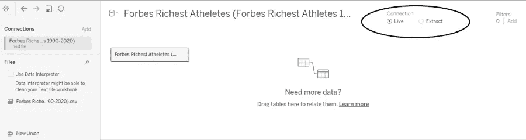
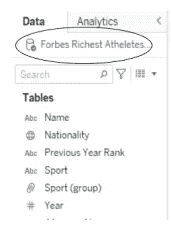
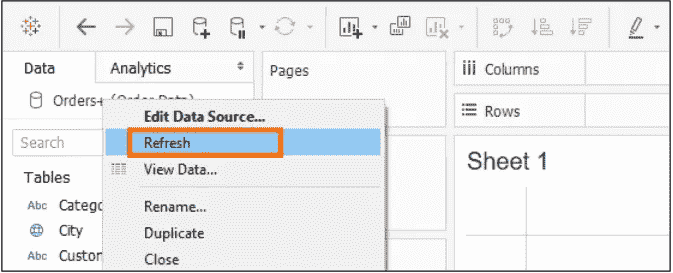
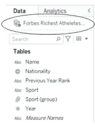
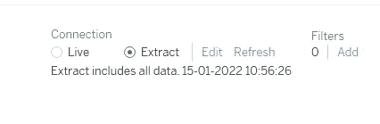
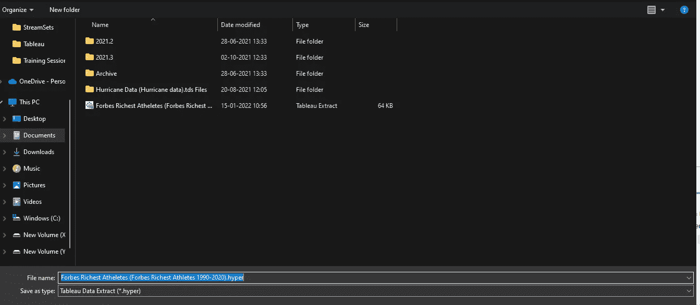
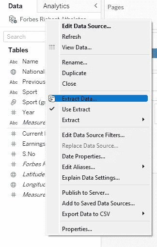
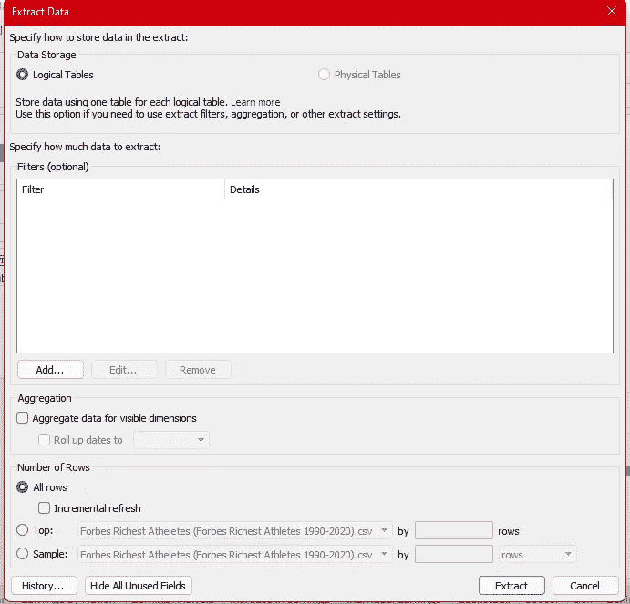
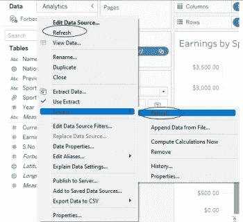
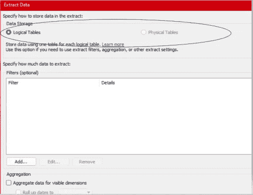

# 现场与提取连接:Tableau 桌面专家认证之路

> 原文：<https://pub.towardsai.net/live-vs-extract-connection-a-road-to-tableau-desktop-specialist-certification-8206a18213ec?source=collection_archive---------1----------------------->

## 第 4 章:Tableau 中活动和提取数据连接、逻辑表和物理表的广泛指南

欢迎来到第四章，在这一章中，我们将学习 Tableau 中的数据连接，以及您应该选择哪一种。

> 如果你想浏览其他章节，请访问: [Tableau](https://medium.com/u/fcbe60d0bf8b?source=post_page-----8206a18213ec--------------------------------) **:这是什么？为什么它是最好的？；Tableau 桌面专家认证之路。**

> 如果你想直接上 Tableau 桌面专家笔记，请在这里访问→[https://dakshtrehan . comment . site/Tableau-Notes-c 13 fceda 97 b 94 BDA 940 edbf 6751 cf 30](https://dakshtrehan.notion.site/Tableau-Notes-c13fceda97b94bda940edbf6751cf303)
> 
> 使用链接访问免费 Tableau 认证转储(有效期至 2022 年 7 月 6 日):
> 
> [https://www . udemy . com/course/tableau-desktop-specialist-certification-dumps-2022/？coupon code = e3f 08189 fa 4 bafae 72 BC](https://www.udemy.com/course/tableau-desktop-specialist-certification-dumps-2022/?couponCode=E3F08189FA4BAFAE72BC)

当我们连接我们的数据时，Tableau 让我们定义两种类型的连接:Live 和 Extract。

# 目录

*   **带电连接**
*   **提取连接**
*   **为您的数据选择更好的连接类型**
*   **本题的样题**

# 实时连接

顾名思义，当我们希望数据在动态数据库的 Tableau 数据源中保持流动时，就建立了实时连接。

当我们需要实时更新和即时洞察时，这提供了灵活性。

**源数据库中的实时数据处理查询。**

**默认情况下，当我们创建连接时，它是一个活动连接。**

**单缸代表带电连接→**

使用 Live connection，每次我们重新打开工作表或手动刷新数据时，工作表中的数据都会更新。

要刷新实时数据→

# 提取连接

“摘录”是 Tableau 最被低估的特征之一。

**一个摘录文件有。超级扩展(以前称为。tde)**

通过 tde 建立提取连接。Tableau 数据提取*(。TDE/也称为 hyper file)* 是本地存储并加载到内存中的实时数据的压缩快照。为了缓解我们的连接并最小化复杂数据带来的负载，我们可以对我们的数据应用过滤器，将其保存为. hyper 文件，然后在提取连接时使用它们。这往往比实时连接快得多，因此在用于复杂的可视化时具有优势。

**一个 extract 使用 Tableau 数据引擎处理查询，因为一个 hyper 文件是如此优化和高效，以至于 Tableau 内存数据引擎可以轻松处理查询。**

**摘录只是特定工作簿的摘录，当它与他人共享时，它将作为实时数据。**

**双缸代表提取连接→**

摘录不能自动更新，只能手动或定期刷新。

## 提取 Tableau 中的数据

***方法 1***

步骤 1 →选择“提取”连接

Step2 →当我们选择“提取”数据时，Tableau 会询问的位置。超级文件。

***方法二***

步骤 1 →转到数据窗格，右键单击数据连接，然后单击“提取数据”

步骤 2 →添加过滤器，并根据您的需要修改提取。

## 刷新 Tableau 中的摘录

一旦摘录完成并加载到我们的工作簿中，有两种方法可以刷新我们的数据:

第一个选项将刷新连接，但是因为连接是静态的，所以不会在您的数据中反映任何更改。此选项也存在于实时连接中，更具体地说，是在我们处理实时数据时使用的。

第二个选项将创建数据的新快照，即新提取，因此我们工作簿中的数据将被更新。

为了定期自动刷新数据，我们可以将数据发布到 Tableau 服务器，并可以选择刷新的时间间隔。

Tableau 提供了两种方式来刷新数据，我们可以选择完全刷新，替换提取中的所有内容，也可以使用增量刷新，只添加新行。

## (逻辑)单表与多表(物理)提取

**默认提取逻辑表。**

当提取操作使用相等连接构成多个表并且满足以下条件时，仅使用物理表:

*   没有 RAWSQL。
*   没有增量刷新。
*   不采样。
*   没有提取过滤器。
*   用于关系/联接的列的数据类型是相同的。
*   物理表之间的所有连接都是相等连接。

只有当我们的提取大小大于预期时，才应该使用物理表，而当我们希望使用过滤器或聚合来限制提取中的数据量时，必须使用逻辑表。

# 为您的数据选择更好的连接类型

## 实时连接的优势

*   允许处理实时数据并提供即时见解。
*   如果您正在使用 rapid 数据库，建议使用此连接。

## 提取连接的好处

*   如果您想要一个可移植的数据集，可以使用这种方法。
*   它帮助我们限制我们需要的数据量。
*   它提高了性能和效率。
*   这些创建和工作起来都很快。
*   这些支持额外的功能，如 COUNTD 函数。

## 提取连接的缺点

*   在处理敏感数据时，不建议使用这种连接，因为摘录保存在本地，因此可以与任何人共享。
*   这需要手动刷新。

# 本主题的试题示例

我们可以自动刷新提取的数据吗？

1.  真实的
2.  错误的

**解**:真

**为什么我们不应该使用提取数据？**

1.  他们很慢。
2.  他们可能会暴露机密数据。
3.  它们很难使用。
4.  它们不能被刷新。

解决方案:他们可能会泄露机密数据。

**提取数据的扩展是什么？**

1.  。高度紧张的
2.  。twb
3.  。总溶解固体（Total dissolved solids 的缩写）
4.  。战术弹道导弹（Tactical Ballistic Missile 的缩写）

**解决方案**:。高度紧张的

**默认情况下，Tableau 启动 ____ 连接。**

1.  活着
2.  提取

**解决方案**:直播

**对于实时数据，我们应该使用哪种连接？**

1.  活着
2.  提取

**解决方案**:直播

> 使用链接访问免费 Tableau 认证转储(有效期至 2022 年 7 月 6 日):
> 
> [https://www . udemy . com/course/tableau-desktop-specialist-certification-dumps-2022/？coupon code = e3f 08189 fa 4 bafae 72 BC](https://www.udemy.com/course/tableau-desktop-specialist-certification-dumps-2022/?couponCode=E3F08189FA4BAFAE72BC)

# 参考资料:

[1] [Tableau 帮助| Tableau 软件](https://www.tableau.com/support/help)

[2] [个人笔记](https://dakshtrehan.notion.site/Tableau-Notes-c13fceda97b94bda940edbf6751cf303)

[3] [Tableau 桌面专家考试(新花样— 2021) — Apisero](https://apisero.com/tableau-desktop-specialist-exam-new-pattern-2021/)

# 感谢阅读！

请随意鼓掌，这样我就知道这篇文章对你有多有帮助，并在你的社交网络上分享它，这对我会很有帮助。

如果你喜欢这篇文章，想了解更多关于**机器学习，数据科学，Python，BI。**请考虑订阅我的简讯:

> [达克什·特雷汉的简讯](https://mailchi.mp/b535943b5fff/daksh-trehan-weekly-newsletter)。

在网上找到我:[www.dakshtrehan.com](http://www.dakshtrehan.com/)

在 LinkedIn 联系我:【www.linkedin.com/in/dakshtrehan 

阅读我的科技博客:【www.dakshtrehan.medium.com 

在 Instagram 和我联系:[www.instagram.com/_daksh_trehan_](http://www.instagram.com/_daksh_trehan_)

# 想了解更多？

[YouTube 是如何利用 AI 推荐视频的？](/how-is-youtube-using-ai-to-recommend-videos-38a142c2d06d)
[利用深度学习检测新冠肺炎](https://towardsdatascience.com/detecting-covid-19-using-deep-learning-262956b6f981)
[逃不掉的 AI 算法:抖音](https://towardsdatascience.com/the-inescapable-ai-algorithm-tiktok-ad4c6fd981b8)
[GPT-3 向一个 5 岁的孩子解释。](/gpt-3-explained-to-a-5-year-old-1f3cb9fa030b)
[Tinder+AI:一场完美的牵线搭桥？](https://medium.com/towards-artificial-intelligence/tinder-ai-a-perfect-matchmaking-b0a7b916e271)
[一个内部人士的使用机器学习卡通化指南](https://medium.com/towards-artificial-intelligence/an-insiders-guide-to-cartoonization-using-machine-learning-ce3648adfe8)
[谷歌是如何做出“哼哼来搜索的？”](/how-google-made-hum-to-search-865f224b70d0)
[一行神奇的代码执行 EDA！](/one-line-magical-code-to-perform-eda-f83a731fbc35)
[给我 5 分钟，我给你深度假！](/give-me-5-minutes-ill-give-you-a-deepfake-ce83a645b0f9)

> *欢呼*