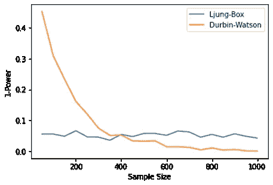

# 永盒和杜宾·沃森——哪种测试更有效

> 原文：<https://pub.towardsai.net/ljung-box-or-durbin-watson-which-test-is-more-powerful-a1ba247f30db?source=collection_archive---------4----------------------->

## [统计数据](https://towardsai.net/p/category/statistics)


来源:Pixabay

德宾·沃森更强大，但有一个问题。请继续阅读，了解更多信息。

说到统计检验，我们寻找的最重要的因素之一是检验的功效，它可以简单地定义如下:

**检验的功效:**当替代假设为真时，检验拒绝原假设的概率。

简而言之，检测出真正阳性的概率越高，其功效就越高。这将在本文中变得更加清晰。我们将检查两个统计测试: [Ljung-Box](https://en.wikipedia.org/wiki/Ljung%E2%80%93Box_test) 和 [Durbin Watson](https://en.wikipedia.org/wiki/Durbin%E2%80%93Watson_statistic) 的功效，并得出使用哪一个以及何时使用的结论。

Ljung-Box 和 Durbin Watson 大致用于相同的目的，即检查数据序列中的自相关性。虽然 Ljung-Box 可用于任何滞后值，但 Durbin Watson 仅可用于滞后 1。两种测试的无效假设和替代假设是相同的:

**H0:** 数据中没有自相关。

**H1:** 存在显著的自相关。

我们将使用 python 库来进行实验，实验的过程如下:

1.  创建一个随机数据集(无相关性情况)
2.  对其进行 Ljung-Box 和 Durbin Watson 测试，并记录输出。
3.  多次(1000 次)重复步骤 2，检查测试拒绝零假设的概率。给出假阳性的概率。
4.  计算测试的功效:1-在步骤 3 中获得的值。

我们首先需要加载所有需要的库:

```
from statsmodels.stats.api import acorr_ljungboxfrom statsmodels.stats.stattools import durbin_watsonimport numpy as npimport matplotlib.pyplot as plt
```

我们将首先使用 Numpy 的 random.normal()函数创建一个随机数据集，这将创建一个从标准正态分布中选取的随机数。

```
sample_size = 150
random_data = [np.random.normal() for i in range(sample_size)]
```

从 statsmodels 库导入的两个测试可直接用于计算测试统计和 p 值。在这里，谨慎的做法是明确在 Durbin Watson 检验的情况下，如果检验统计量约为 2，我们不能拒绝零假设，否则拒绝零假设。在 Ljung-Box 测试的情况下，可以通过使用测试抛出的 p 值来做出决定。

整个逻辑可以被赋予如下所示的函数形状:

```
def run_test(sample_size): random_data = [np.random.normal() for i in range(sample_size)]                       #create random data with given sample size dw = durbin_watson(random_data) if(dw > 1.8 and dw < 2.2): 
#A tolerance of 0.2 is kept to decide in case of DW dw = 0 else: dw = 1 ljung = float(acorr_ljungbox(random_data, lags = 1)[1]) #The acorr_ljung_box() returns both test-statistic and p-value,       index of 1 is used to access the p-val. if(ljung > 0.05): #Significance level of 5% is considered ljung = 0 else: ljung = 1 return dw, ljung
```

如果零假设没有被拒绝，这两个测试都返回 0，否则返回 1。理想情况下，上面定义的函数应该总是返回 0，因为我们测试的是随机性质的数据序列。该函数返回的值 1 将是假阳性，并将用于判断这两个测试的功效。

现在我们已经有了 run_test()函数，我们可以反复调用它来计算这些测试的功效，但是我们将不仅针对单个样本大小，而且针对多个样本大小来进行计算，以了解功效与数据大小的关系。

```
sample_sizes = [50, 100, 150, 200, 250, 300, 350, 400, 450, 500, 550, 600, 650, 700, 750, 800, 850, 900, 950, 1000]
```

上面 python 列表中定义的样本大小将用于执行这个实验，我们将对每个样本大小运行 run_test()函数 1000 次。

下面几行代码将为我们完成这项工作:

```
sample_sizes = [50, 100, 150, 200, 250, 300, 350, 400, 450, 500, 550, 600, 650, 700, 750, 800, 850, 900, 950, 1000]number_of_runs = 1000#Creating empty lists to contain the results later for durbin watson(dw) and ljung-box (lb)dw_data = []lb_data = []for sample_size in sample_sizes: x = [run_test(sample_size) for i in range(number_of_runs)]   #runtest() is called 1000 times for each sample size dw = [i[0] for i in x] lb = [i[1] for i in x] dw_per = np.sum(dw)/number_of_runs 
#calculatng fraction of times the null hypothesis was rejected lb_per = np.sum(lb)/number_of_runs#Populating the empty lists to contain the results dw_data.extend([dw_per]) lb_data.extend([lb_per])
```

我们现在已经有了结果，我们现在正处于检查这两个测试的功效与数据样本大小的关系的阶段。我们将使用 matplotlib 库来绘制结果，以获得见解和推论:

```
plt.plot(sample_sizes, lb_data, label = ‘Ljung-Box’)plt.plot(sample_sizes, dw_data, label = ‘Durbin-Watson’)plt.xlabel(‘Sample Size’); plt.ylabel(‘1-Power’)plt.legend()plt.show()
```



代码输出。来源:Self

上图清楚地表明，对于小样本量，使用 Durbin-Watson 测试是一个坏主意，因为它的功效较低，但对于大样本量，它的表现优于 ljung-box。在 Ljung-Box 的情况下，无论样本大小如何，功率都是一致的。所以用哪一个取决于你手头的样本量。

这篇文章也发表在[茶统计](https://teastatistic.com/index.php/2022/01/16/durbin-watson-or-ljung-box-which-test-is-more-powerful/)上