# 在 Colab 中加载 Kaggle 数据集的最简单方法

> 原文：<https://pub.towardsai.net/load-kaggle-dataset-in-colab-6eabc84ce1bf?source=collection_archive---------5----------------------->

## [编程](https://towardsai.net/p/category/programming)，[意见](https://towardsai.net/p/category/opinion)

## 只需 3 行代码就可以将 Kaggle 数据下载到 colab。

资料来源:ka ggle-colab

虽然 Kaggle 提供了一种简单的方式来处理数据集，但 google colab 提供了一种更简单的方式来编写和发布代码，而无需安装数据科学中使用的大多数高级库，并且具有更强的计算能力。但是，如果我们可以整合 Kaggle 和 Colab，以充分利用这两个平台，那会怎么样呢？如果我们可以下载 Kaggle 数据集在 colab 环境中工作会怎么样。有许多解决方案可以完成这项任务，但在大多数可用的解决方案中，人们可能会多次面临命令行错误或某种形式的错误。在本文中，我们将使用一个开箱即用的可用包，以最少的努力完成任务，没有任何麻烦。我们将用三行代码遵循三个步骤。

*   **步骤 1:** 下载 Kaggle API 令牌。
*   **第二步:**上传 Kaggle API 令牌到 Colab。
*   第三步:只写 3 行代码。

# 第一步。下载 Kaggle API 令牌

*   首先，登录你的 [**Kaggle**](https://www.kaggle.com/) 账户，点击个人资料，前往**账户**，向下滚动到 **API** 部分。在 API 部分，点击**“创建新的 API 令牌”**。

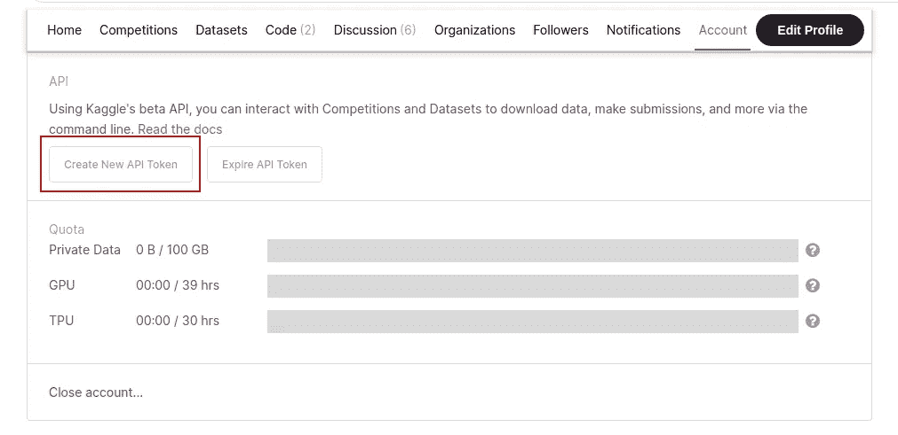

来源:图片由作者提供。

*   一旦点击，它会下载一个 **kaggle.json** 文件并显示通知。

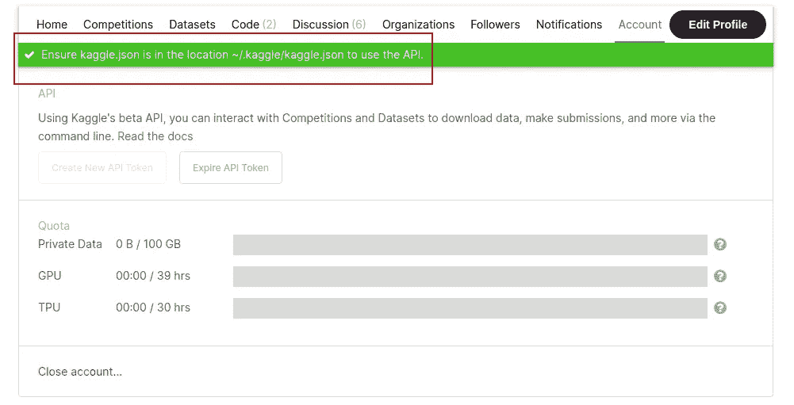

来源:图片由作者提供。

# 第二步。将 Kaggle API 令牌上传到 Colab

*   第二步，打开 [**谷歌协作笔记本**](https://colab.research.google.com/) 并切换左侧面板，然后右键单击并选择**上传**。

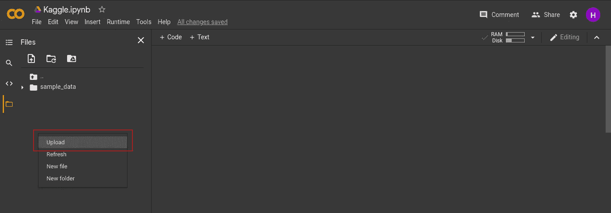

来源:图片由作者提供。

*   选择下载的 **kaggle.json** 文件并上传。上传后，可以在左侧面板中看到文件。

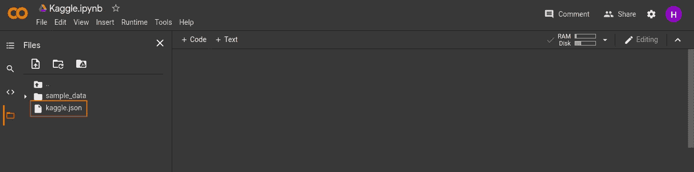

来源:图片由作者提供。

# 第三步。只写 3 行代码

*   第三步，我们将只编写 3 行代码来完成任务。首先，使用 pip 命令安装一个包**‘kaggleDownloader’**。

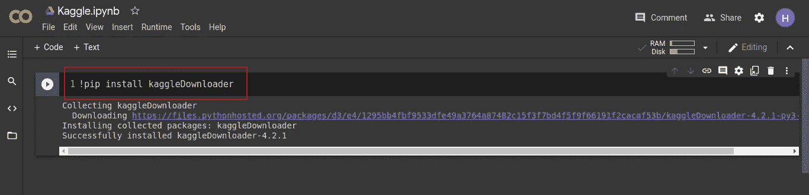

来源:图片由作者提供。

*   一旦这个包作为第二行代码被安装，从 **kaggleDownloader** 包中导入 **get_dataset** 模块。

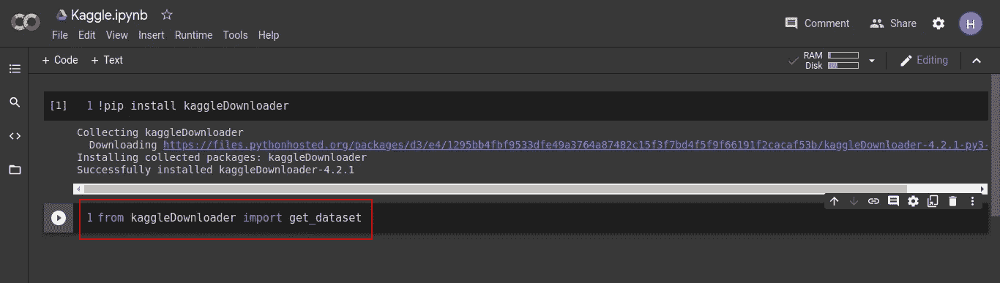

来源:图片由作者提供。

*   第三行代码，调用模块 **get_dataset** 即可。这将要求您输入想要下载的数据集的 Kaggle API 命令。

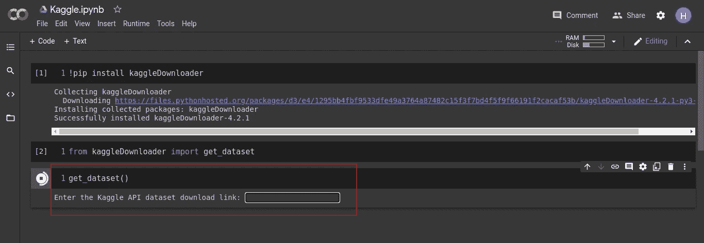

来源:图片由作者提供。

*   现在前往 **Kaggle** 并搜索你想要处理的数据集。点击右上角的**三个点**，选择**‘复制 API 命令’**。

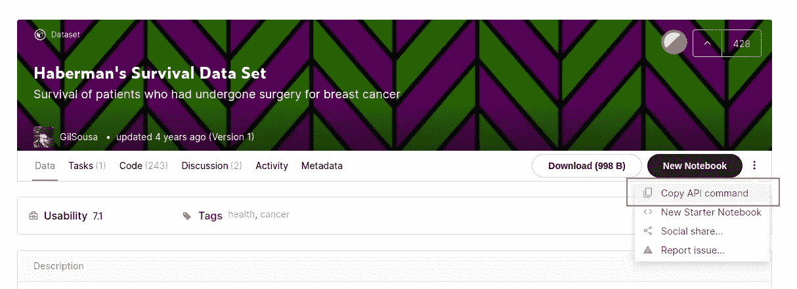

来源:图片由作者提供。

*   这将复制所选数据集的 API 命令。

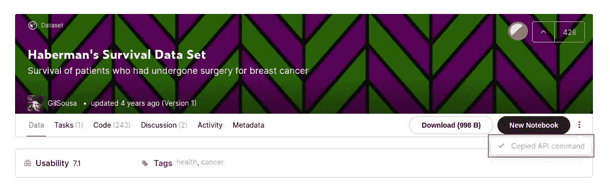

来源:图片由作者提供。

*   切换回 colab notebook，将复制的 API 命令粘贴到文本框中，然后按 enter 键。

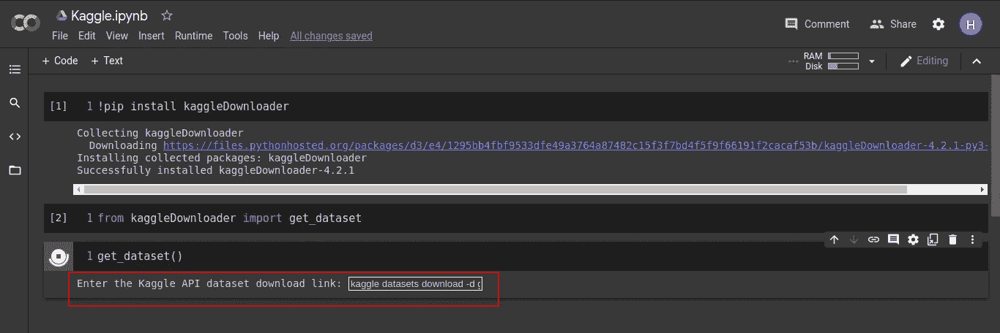

来源:图片由作者提供。

*   这将下载整个选择的数据集作为一个压缩文件，并将自动解压缩。一旦下载完成，它会问你是否要删除压缩文件。在文本框中写下**‘是’**，并点击回车。

来源:图片由作者提供。

*   一旦 zip 文件被删除，它将只显示下载的解压缩文件。

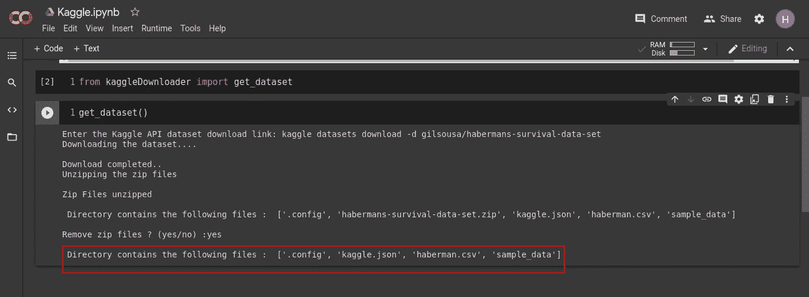

来源:图片由作者提供。

*   在左侧面板上点击**刷新**。这将在左侧面板显示所有下载的文件。现在，您可以直接在下载的数据集上工作。

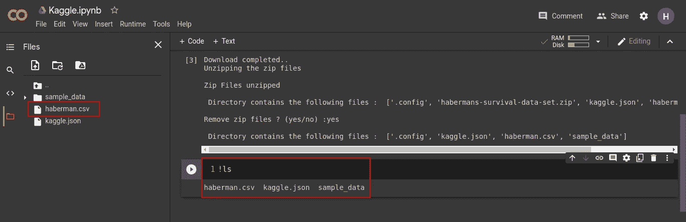

来源:图片由作者提供。

瞧啊。你只用了 3 行代码就下载了整个 Kaggle 数据集。